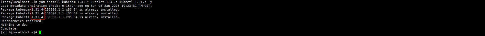

## kubeadm 高可用部署

### ※ 软硬件要求

| Rocky8.10    | `https://download.rockylinux.org/pub/rocky/8/isos/x86_64/Rocky-8.10-x86_64-dvd1.iso` |      |
| ------------ | ------------------------------------------------------------ | ---- |
| K8S-Master01 | 192.168.0.105                                                |      |
| K8S-Master02 | 192.168.0.106                                                |      |
| K8S-Master03 | 192.168.0.107                                                |      |
| K8S-Work01   | 192.168.0.115                                                |      |
| K8S-Work02   | 192.168.0.116                                                |      |
| kubeadm      | vsersion--1.31.4                                             |      |
| kubelet      | vsersion--1.31.4                                             |      |
| kubectl      | vsersion--1.31.4                                             |      |
| VIP          | 192.168.0.40                                                 |      |

### 一、😶‍🌫️基础环境配置

#### 1.1）hosts 

```bash
hostnamectl set-hostname k8s-master01
hostnamectl set-hostname k8s-work01


cat >> /etc/hosts <<EOF

192.168.0.105 k8s-master01
192.168.0.106 k8s-master02
192.168.0.107 k8s-master03
192.168.0.115 k8s-work01
192.168.0.116 k8s-work02
EOF
```

#### 1.2）sshd

```bash
ssh-keygen -t rsa
for i in K8S-Master01 K8S-Master02 K8S-Master03 K8S-Work01 K8S-Work02; do ssh-copy-id -i .ssh/id_rsa.pub $i;done

# master01 配置完成后 将文件copy一份给到其他master机器
scp ~/.ssh/id_rsa root@K8S-Master02:~/.ssh/
scp ~/.ssh/id_rsa root@K8S-Master03:~/.ssh/

#优化 sshd 服务配置
sed -i 's@#UseDNS yes@UseDNS no@g' /etc/ssh/sshd_config
sed -i 's@^GSSAPIAuthentication yes@GSSAPIAuthentication no@g' /etc/ssh/sshd_config
#- UseDNS选项:
#打开状态下，当客户端试图登录SSH服务器时，服务器端先根据客户端的IP地址进行DNS PTR反向查询出客户端的主机名，然后根据查询出的客户端主机名进行DNS正向A记录查询，验证与其原始IP地址是否一致，这是防止客户端欺骗的一种措施，但一般我们的是动态IP不会有PTR记录，打开这个选项不过是在白白浪费时间而已，不如将其关闭。
#- GSSAPIAuthentication:
#当这个参数开启（ GSSAPIAuthentication  yes ）的时候，通过SSH登陆服务器时候会有些会很慢！这是由于服务器端启用了GSSAPI。登陆的时候客户端需要对服务器端的IP地址进行反解析，如果服务器的IP地址没有配置PTR记录，那么就容易在这里卡住了。
```

#### 1.3）basicCfg

```bash
#bash colour
cat <<EOF >>  ~/.bashrc 
PS1='[\[\e[34;1m\]\u@\[\e[0m\]\[\e[32;1m\]\H\[\e[0m\]\[\e[31;1m\] \W\[\e[0m\]]# '
EOF
source ~/.bashrc

systemctl disable --now firewalld dnsmasq

setenforce 0
sed -i 's#SELINUX=enforcing#SELINUX=disabled#g' /etc/sysconfig/selinux
sed -i 's#SELINUX=enforcing#SELINUX=disabled#g' /etc/selinux/config

swapoff -a && sysctl -w vm.swappiness=0
sed -ri '/^[^#]*swap/s@^@#@' /etc/fstab

sed -e 's|^mirrorlist=|#mirrorlist=|g' \
    -e 's|^#baseurl=http://dl.rockylinux.org/$contentdir|baseurl=https://mirrors.aliyun.com/rockylinux|g' \
    -i.bak \
    /etc/yum.repos.d/Rocky-*.repo
dnf makecache

# -e 's|^mirrorlist=|#mirrorlist=|g'：注释掉所有 mirrorlist 行。
# -e 's|^#baseurl=http://dl.rockylinux.org/$contentdir|baseurl=https://mirrors.aliyun.com/rockylinux|g'：取消注释并替换 baseurl 地址为阿里云镜像源地址。
# -i.bak：对文件进行原地修改，同时备份 .bak 文件。

yum install wget jq psmisc vim net-tools telnet yum-utils device-mapper-persistent-data lvm2 git -y

#chrony
dnf install epel-release -y
sudo dnf install -y chrony
cp /etc/chrony.conf{,`date +%F`}
sudo sed -i 's/^pool.*/server ntp.aliyun.com iburst\nserver ntp1.aliyun.com iburst\nserver ntp2.aliyun.com iburst/' /etc/chrony.conf
sudo systemctl enable --now chronyd
sudo chronyc -a makestep
# 验证：  chronyc sources -v


# config limit
ulimit -SHn 65535
cat >> /etc/security/limits.conf <<EOF
* soft nofile 65536
* hard nofile 131072
* soft nproc 65535
* hard nproc 655350
* soft memlock unlimited
* hard memlock unlimited
EOF

yum update -y
```

#### 1.4）kernel

```bash
#所有节点安装ipvsadm：
yum install ipvsadm ipset sysstat conntrack libseccomp -y


#所有节点配置ipvs模块：
modprobe -- ip_vs
modprobe -- ip_vs_rr
modprobe -- ip_vs_wrr
modprobe -- ip_vs_sh
modprobe -- nf_conntrack
#所有节点创建ipvs.conf，并配置开机自动加载：加入以下内容
cat >> /etc/modules-load.d/ipvs.conf <<EOF

ip_vs
ip_vs_lc
ip_vs_wlc
ip_vs_rr
ip_vs_wrr
ip_vs_lblc
ip_vs_lblcr
ip_vs_dh
ip_vs_sh
ip_vs_fo
ip_vs_nq
ip_vs_sed
ip_vs_ftp
ip_vs_sh
nf_conntrack
ip_tables
ip_set
xt_set
ipt_set
ipt_rpfilter
ipt_REJECT
ipip
EOF
systemctl enable --now systemd-modules-load.service


cat <<EOF > /etc/sysctl.d/k8s.conf
net.ipv4.ip_forward = 1
net.bridge.bridge-nf-call-iptables = 1
net.bridge.bridge-nf-call-ip6tables = 1
fs.may_detach_mounts = 1
net.ipv4.conf.all.route_localnet = 1
vm.overcommit_memory=1
vm.panic_on_oom=0
fs.inotify.max_user_watches=89100
fs.file-max=52706963
fs.nr_open=52706963
net.netfilter.nf_conntrack_max=2310720

net.ipv4.tcp_keepalive_time = 600
net.ipv4.tcp_keepalive_probes = 3
net.ipv4.tcp_keepalive_intvl =15
net.ipv4.tcp_max_tw_buckets = 36000
net.ipv4.tcp_tw_reuse = 1
net.ipv4.tcp_max_orphans = 327680
net.ipv4.tcp_orphan_retries = 3
net.ipv4.tcp_syncookies = 1
net.ipv4.tcp_max_syn_backlog = 16384
net.ipv4.ip_conntrack_max = 65536
net.ipv4.tcp_max_syn_backlog = 16384
net.ipv4.tcp_timestamps = 0
net.core.somaxconn = 16384
EOF

sysctl --system


# 导入 ELRepo GPG 密钥
sudo rpm --import https://www.elrepo.org/RPM-GPG-KEY-elrepo.org

# 安装 ELRepo 仓库
sudo dnf install -y https://www.elrepo.org/elrepo-release-8.el8.elrepo.noarch.rpm

# 替换 ELRepo 镜像源为阿里云
sudo sed -i 's/mirrors.elrepo.org/mirrors.aliyun.com\/elrepo/g' /etc/yum.repos.d/elrepo.repo

# 清理缓存并重建
#sudo dnf clean all
sudo dnf makecache

# 获取内核列表
sudo dnf --disablerepo=* --enablerepo=elrepo-kernel list available
# 安装 5.4 LTS 内核（生产环境推荐）
sudo dnf --enablerepo=elrepo-kernel install kernel-lt -y
```

  所有节点配置完内核后，重启机器，之后查看内核模块是否已自动加载：

```bash
reboot
lsmod | grep --color=auto -e ip_vs -e nf_conntrack
```

### 二、🚀高可用组件安装(master)

#### 2.1）keepalived & haproxy install

```bash
yum install keepalived haproxy -y
cp /etc/haproxy/haproxy.cfg{,`date +%F`}

#所有节点的配置文件内容相同
cat > /etc/haproxy/haproxy.cfg <<'EOF'
global
  maxconn  2000
  ulimit-n  16384
  log  127.0.0.1 local0 err
  stats timeout 30s

defaults
  log global
  mode  http
  option  httplog
  timeout connect 5000
  timeout client  50000
  timeout server  50000
  timeout http-request 15s
  timeout http-keep-alive 15s

frontend monitor-haproxy
  bind *:33305
  mode http
  option httplog
  monitor-uri /ayouok

frontend k8s
  bind 0.0.0.0:16443
  bind 127.0.0.1:16443
  mode tcp
  option tcplog
  tcp-request inspect-delay 5s
  default_backend k8s

backend k8s
  mode tcp
  option tcplog
  option tcp-check
  balance roundrobin
  default-server inter 10s downinter 5s rise 2 fall 2 slowstart 60s maxconn 250 maxqueue 256 weight 100
  server master01   192.168.0.105:6443  check
  server master02   192.168.0.106:6443  check
  server master03   192.168.0.107:6443  check
EOF
```

#### 2.2）keepalived cfg

```bash
cp /etc/keepalived/keepalived.conf{,`date +%F`}

#105 cfg
cat > /etc/keepalived/keepalived.conf <<'EOF'
global_defs {
    router_id LVS_DEVEL
script_user root
    enable_script_security
}
vrrp_script chk_apiserver {
    script "/etc/keepalived/check_apiserver.sh"
    interval 5
    weight -5
    fall 2  
rise 1
}
vrrp_instance VI_1 {
    state MASTER
    interface ens160
    mcast_src_ip 192.168.0.105
    virtual_router_id 51
    priority 101
    advert_int 2
    authentication {
        auth_type PASS
        auth_pass K8SHA_KA_AUTH
    }
    virtual_ipaddress {
        192.168.0.40
    }
    track_script {
       chk_apiserver
    }
}	
EOF


#106 cfg
cat > /etc/keepalived/keepalived.conf <<'EOF'
global_defs {
    router_id LVS_DEVEL
script_user root
    enable_script_security
}
vrrp_script chk_apiserver {
    script "/etc/keepalived/check_apiserver.sh"
   interval 5
    weight -5
    fall 2  
rise 1
}
vrrp_instance VI_1 {
    state BACKUP
    interface ens160
    mcast_src_ip 192.168.0.106
    virtual_router_id 51
    priority 100
    advert_int 2
    authentication {
        auth_type PASS
        auth_pass K8SHA_KA_AUTH
    }
    virtual_ipaddress {
        192.168.0.40
    }
    track_script {
       chk_apiserver
    }
}
EOF


#107 cfg
cat > /etc/keepalived/keepalived.conf <<'EOF'
global_defs {
    router_id LVS_DEVEL
script_user root
    enable_script_security
}
vrrp_script chk_apiserver {
    script "/etc/keepalived/check_apiserver.sh"
 interval 5
    weight -5
    fall 2  
rise 1
}
vrrp_instance VI_1 {
    state BACKUP
    interface ens160
    mcast_src_ip 192.168.0.107
    virtual_router_id 51
    priority 100
    advert_int 2
    authentication {
        auth_type PASS
        auth_pass K8SHA_KA_AUTH
    }
    virtual_ipaddress {
        192.168.0.40
    }
    track_script {
       chk_apiserver
    }
}
EOF


# 105、106、107
cat >/etc/keepalived/check_apiserver.sh <<'EOF'
#!/bin/bash

err=0
for k in $(seq 1 3)
do
    check_code=$(pgrep haproxy)
    if [[ $check_code == "" ]]; then
        err=$(expr $err + 1)
        sleep 1
        continue
    else
        err=0
        break
    fi
done

if [[ $err != "0" ]]; then
    echo "systemctl stop keepalived"
    /usr/bin/systemctl stop keepalived
    exit 1
else
    exit 0
fi
EOF
chmod +x /etc/keepalived/check_apiserver.sh
systemctl daemon-reload 
systemctl enable --now haproxy keepalived
```

### 三、Runtime 😒(all node install)

```bash
yum-config-manager --add-repo https://mirrors.aliyun.com/docker-ce/linux/centos/docker-ce.repo
yum install containerd.io -y
cat > /etc/modules-load.d/containerd.conf <<EOF
overlay
br_netfilter
EOF

sudo modprobe overlay
sudo modprobe br_netfilter

cat > /etc/sysctl.d/99-kubernetes-cri.conf <<EOF
net.bridge.bridge-nf-call-iptables = 1
net.ipv4.ip_forward = 1
net.bridge.bridge-nf-call-ip6tables = 1
EOF
sudo sysctl --system

sudo mkdir -p /etc/containerd
containerd config default | sudo cat > /etc/containerd/config.toml

sed -i 's#SystemdCgroup = false#SystemdCgroup =true#g' /etc/containerd/config.toml
sed -i 's#k8s.gcr.io/pause#registry.cn-hangzhou.aliyuncs.com/google_containers/pause#g' /etc/containerd/config.toml
sed -i 's#registry.gcr.io/pause#registry.cn-hangzhou.aliyuncs.com/google_containers/pause#g' /etc/containerd/config.toml
sed -i 's#registry.k8s.io/pause#registry.cn-hangzhou.aliyuncs.com/google_containers/pause#g' /etc/containerd/config.toml

# 启动Containerd
systemctl daemon-reload
systemctl enable --now containerd
```

### 四、💩kubeadm

#### 4.1 安装kubeadm

```bash
#注意版本号的更换，需要安装什么版本的k8s，按照实际情况进行修改即可
cat > /etc/yum.repos.d/kubernetes.repo <<EOF
[kubernetes]
name=Kubernetes
baseurl=https://mirrors.aliyun.com/kubernetes-new/core/stable/v1.32/rpm/
enabled=1
gpgcheck=1
gpgkey=https://mirrors.aliyun.com/kubernetes-new/core/stable/v1.32/rpm/repodata/repomd.xml.key
EOF


# 首先在Master01节点查看最新的Kubernetes版本是多少：
yum list kubeadm.x86_64 --showduplicates | sort -r

yum install kubeadm-1.32.* kubelet-1.32.* kubectl-1.32.* -y
systemctl enable --now kubelet

# 下载镜像
kubeadm config images pull --image-repository registry.cn-hangzhou.aliyuncs.com/google_containers --kubernetes-version 1.32.3

[root@K8S-Master01 ~]# kubeadm config images pull --image-repository registry.cn-hangzhou.aliyuncs.com/google_containers --kubernetes-version 1.32.3
[config/images] Pulled registry.cn-hangzhou.aliyuncs.com/google_containers/kube-apiserver:v1.32.3
[config/images] Pulled registry.cn-hangzhou.aliyuncs.com/google_containers/kube-controller-manager:v1.32.3
[config/images] Pulled registry.cn-hangzhou.aliyuncs.com/google_containers/kube-scheduler:v1.32.3
[config/images] Pulled registry.cn-hangzhou.aliyuncs.com/google_containers/kube-proxy:v1.32.3
[config/images] Pulled registry.cn-hangzhou.aliyuncs.com/google_containers/coredns:v1.11.3
[config/images] Pulled registry.cn-hangzhou.aliyuncs.com/google_containers/pause:3.10
[config/images] Pulled registry.cn-hangzhou.aliyuncs.com/google_containers/etcd:3.5.16-0
```



#### 4.2 Master01节点初始化

```bash
kubeadm init \
  --apiserver-advertise-address 192.168.0.105 \
  --image-repository registry.cn-hangzhou.aliyuncs.com/google_containers \
  --cri-socket unix:///var/run/containerd/containerd.sock \
  --kubernetes-version v1.32.3 \
  --control-plane-endpoint 192.168.0.40:16443 \
  --pod-network-cidr 172.16.0.0/16 \
  --service-cidr 10.96.0.0/16 \
  --upload-certs \
  --apiserver-cert-extra-sans 192.168.0.105,192.168.0.106,192.168.0.107,192.168.0.40


#配置kubectl
mkdir -p $HOME/.kube
sudo cp -i /etc/kubernetes/admin.conf $HOME/.kube/config
sudo chown $(id -u):$(id -g) $HOME/.kube/config

# 版本需要替换为实际版本号
#--apiserver-advertise-address 192.168.0.105: 当前节点的IP（Master01）
#--image-repository registry.cn-hangzhou.aliyuncs.com/google_containers: 指定容器镜像仓库。
#--cri-socket unix:///var/run/containerd/containerd.sock: 指定CRI套接字。
#--kubernetes-version v1.31.4: 指定Kubernetes版本。
#--control-plane-endpoint 192.168.0.40:6443: 指定控制平面的VIP地址和端口。
#--pod-network-cidr 172.16.0.0/16: 指定Pod网络的CIDR范围。
#--service-cidr 10.96.0.0/16: 指定Service网段的CIDR范围。  
#--upload-certs:  自动上传证书供其他Master节点使用
#--apiserver-cert-extra-sans 192.168.0.105,192.168.0.106,192.168.0.107,192.168.0.40: 所有Master节点IP和VIP
Your Kubernetes control-plane has initialized successfully!

To start using your cluster, you need to run the following as a regular user:

  mkdir -p $HOME/.kube
  sudo cp -i /etc/kubernetes/admin.conf $HOME/.kube/config
  sudo chown $(id -u):$(id -g) $HOME/.kube/config

Alternatively, if you are the root user, you can run:

  export KUBECONFIG=/etc/kubernetes/admin.conf

You should now deploy a pod network to the cluster.
Run "kubectl apply -f [podnetwork].yaml" with one of the options listed at:
  https://kubernetes.io/docs/concepts/cluster-administration/addons/

You can now join any number of control-plane nodes running the following command on each as root:

  kubeadm join 192.168.0.40:16443 --token yblol0.nkogzj5dm2w7s4s8 \
	--discovery-token-ca-cert-hash sha256:4b805f3ad2231e3ed2655ad5f2912b6bf1df9ae1f4e7c7aadde5ffcb2d0b618b \
	--control-plane --certificate-key b4dc0b3ee0ed28b8fdd659ee664c4da66da6b989c61b14e29b76373207e5d8a9

Please note that the certificate-key gives access to cluster sensitive data, keep it secret!
As a safeguard, uploaded-certs will be deleted in two hours; If necessary, you can use
"kubeadm init phase upload-certs --upload-certs" to reload certs afterward.

Then you can join any number of worker nodes by running the following on each as root:

kubeadm join 192.168.0.40:16443 --token yblol0.nkogzj5dm2w7s4s8 \
	--discovery-token-ca-cert-hash sha256:4b805f3ad2231e3ed2655ad5f2912b6bf1df9ae1f4e7c7aadde5ffcb2d0b618b 
```

> [!NOTE]
>
> **在加入到集群的时候会自动同步证书和配置文件，work节点仅同步证书，不需要手工同步**

#### 4.3 Master节点加入集群

```bash
kubeadm join 192.168.0.40:16443 --token yblol0.nkogzj5dm2w7s4s8 \
	--discovery-token-ca-cert-hash sha256:4b805f3ad2231e3ed2655ad5f2912b6bf1df9ae1f4e7c7aadde5ffcb2d0b618b \
	--control-plane --certificate-key b4dc0b3ee0ed28b8fdd659ee664c4da66da6b989c61b14e29b76373207e5d8a9
```

#### 4.4 Work节点加入集群

```bash
kubeadm join 192.168.0.40:16443 --token yblol0.nkogzj5dm2w7s4s8 \
	--discovery-token-ca-cert-hash sha256:4b805f3ad2231e3ed2655ad5f2912b6bf1df9ae1f4e7c7aadde5ffcb2d0b618b
```

#### 4.5 安装Addons 安装

所有节点禁止NetworkManager管理Calico的网络接口，防止有冲突或干扰：

```bash
cat >>/etc/NetworkManager/conf.d/calico.conf<<EOF
[keyfile]
unmanaged-devices=interface-name:cali*;interface-name:tunl*;interface-name:vxlan.calico;interface-name:vxlan-v6.calico;interface-name:wireguard.cali;interface-name:wg-v6.cali
EOF
systemctl daemon-reload
systemctl restart NetworkManager
```

Master01

```bash
git clone https://gitee.com/dukuan/k8s-ha-install.git && git checkout manual-installation-v1.32.x && cd calico/

POD_SUBNET=`cat /etc/kubernetes/manifests/kube-controller-manager.yaml | grep cluster-cidr= | awk -F= '{print $NF}'`

sed -i "s#POD_CIDR#${POD_SUBNET}#g" calico.yaml
kubectl apply -f calico.yaml
```

metrics安装

```bash
for i in  K8S-Work01 K8S-Work02;do  scp /etc/kubernetes/pki/front-proxy-ca.crt $i:/etc/kubernetes/pki/ ;done
cd /root/k8s-ha-install/kubeadm-metrics-server
kubectl  create -f comp.yaml 


[root@K8S-Master01 kubeadm-metrics-server]# kubectl top node
NAME           CPU(cores)   CPU(%)   MEMORY(bytes)   MEMORY(%)   
k8s-master01   668m         16%      1674Mi          44%         
k8s-master02   333m         16%      1234Mi          32%         
k8s-master03   451m         22%      1553Mi          40%         
k8s-work01     230m         11%      1114Mi          29%         
k8s-work02     317m         15%      1208Mi          31% 
```

#### 4.6 查看集群

```bash
[root@K8S-Master01 calico]# kubectl get node -owide
NAME           STATUS   ROLES           AGE   VERSION   INTERNAL-IP     EXTERNAL-IP   OS-IMAGE                            KERNEL-VERSION                CONTAINER-RUNTIME
k8s-master01   Ready    control-plane   12m   v1.32.3   192.168.0.105   <none>        Rocky Linux 8.10 (Green Obsidian)   5.4.291-1.el8.elrepo.x86_64   containerd://1.6.32
k8s-master02   Ready    control-plane   11m   v1.32.3   192.168.0.106   <none>        Rocky Linux 8.10 (Green Obsidian)   5.4.291-1.el8.elrepo.x86_64   containerd://1.6.32
k8s-master03   Ready    control-plane   10m   v1.32.3   192.168.0.107   <none>        Rocky Linux 8.10 (Green Obsidian)   5.4.291-1.el8.elrepo.x86_64   containerd://1.6.32
k8s-work01     Ready    <none>          10m   v1.32.3   192.168.0.115   <none>        Rocky Linux 8.10 (Green Obsidian)   5.4.291-1.el8.elrepo.x86_64   containerd://1.6.32
k8s-work02     Ready    <none>          10m   v1.32.3   192.168.0.116   <none>        Rocky Linux 8.10 (Green Obsidian)   5.4.291-1.el8.elrepo.x86_64   containerd://1.6.32
```

## 【🐼】注意事项

**将Kube-proxy改为ipvs模式，因为在初始化集群的时候注释了ipvs配置，所以需要自行修改一下：**

在master01节点执行：

```bash
kubectl edit cm kube-proxy -n kube-system

mode: ipvs
```

更新Kube-Proxy的Pod：

```bash
kubectl patch daemonset kube-proxy -p "{\"spec\":{\"template\":{\"metadata\":{\"annotations\":{\"date\":\"`date +'%s'`\"}}}}}" -n kube-system
```

验证Kube-Proxy模式

```bash
[root@k8s-master01]# curl 127.0.0.1:10249/proxyMode

ipvs
```


> [!CAUTION]   
>
> kubeadm安装的集群，证书有效期默认是一年。master节点的kube-apiserver、kube-scheduler、kube-controller-manager、etcd都是以容器运行的。可以通过kubectl get po -n kube-system查看。

**启动和二进制不同的是:**

- kubelet的配置文件在/etc/sysconfig/kubelet和/var/lib/kubelet/config.yaml，修改后需要重启kubelet进程
- 其他组件的配置文件在/etc/kubernetes/manifests目录下，比如kube-apiserver.yaml，该yaml文件更改后，kubelet会自动刷新配置，也就是会重启pod。不能再次创建该文件

kube-proxy的配置在kube-system命名空间下的configmap中，可以通过 `kubectl edit cm kube-proxy -n kube-system` 进行更改，更改完成后，可以通过patch重启kube-proxy

```bash
kubectl patch daemonset kube-proxy -p "{\"spec\":{\"template\":{\"metadata\":{\"annotations\":{\"date\":\"`date +'%s'`\"}}}}}" -n kube-system 
```

**master节点自带污点：**

Kubeadm安装后，master节点默认不允许部署pod，可以通过以下方式删除Taint，即可部署Pod：

```bash
查看节点污点
[root@K8S-Master01 ~]# kubectl describe node |grep "Taints:"
Taints:             node-role.kubernetes.io/control-plane:NoSchedule
Taints:             node-role.kubernetes.io/control-plane:NoSchedule
Taints:             node-role.kubernetes.io/control-plane:NoSchedule
Taints:             <none>
Taints:             <none>

#移除污点命令格式
kubectl taint nodes <node-name> <taint-key>:<taint-value>-

# 移除k8s-master02 、k8s-master03的污点
kubectl taint nodes k8s-master02 node-role.kubernetes.io/control-plane:NoSchedule-
kubectl taint nodes k8s-master03 node-role.kubernetes.io/control-plane:NoSchedule-
# 验证
[root@K8S-Master01 ~]# kubectl describe node |grep "Taints:"
Taints:             node-role.kubernetes.io/control-plane:NoSchedule
Taints:             <none>
Taints:             <none>
Taints:             <none>
Taints:             <none>

#批量删除所有带有 node-role.kubernetes.io/control-plane 标签的节点上的污点
kubectl taint node -l node-role.kubernetes.io/control-plane node-role.kubernetes.io/control-plane:NoSchedule-
```


