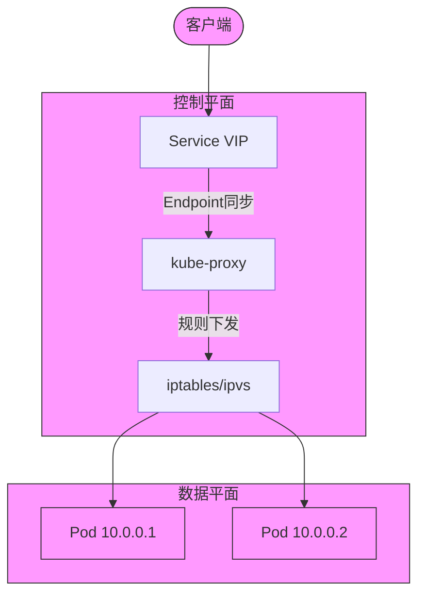
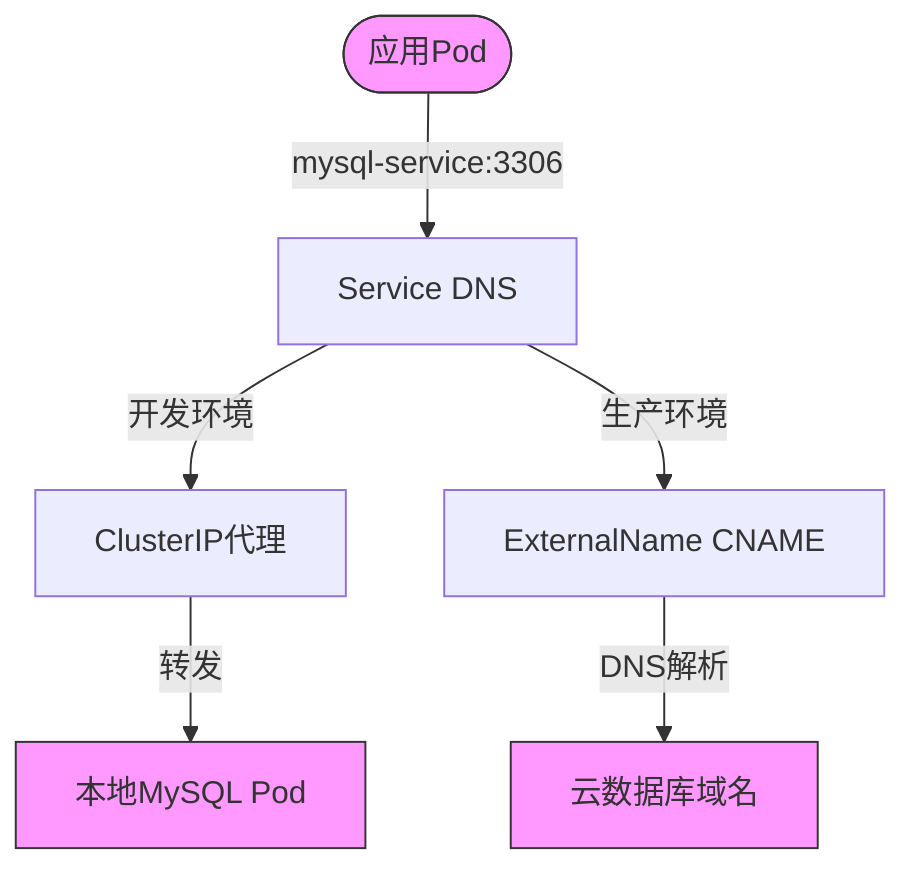
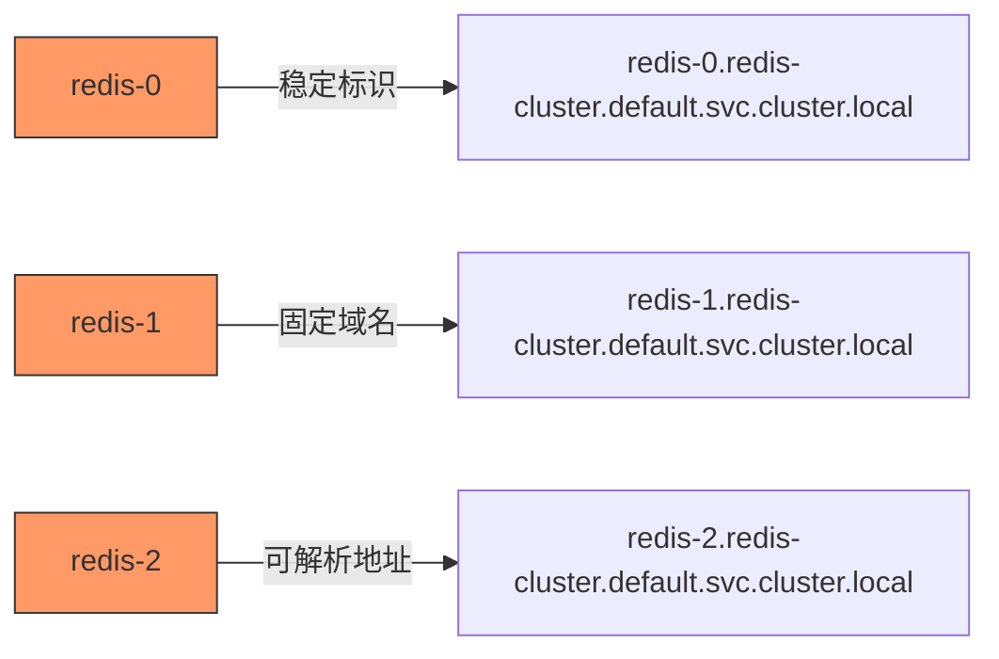

# Kubernetes Service

## 一、Service 核心功能

### 1.1 核心功能
Service 是 Kubernetes 服务发现的核心组件，解决以下问题：

**稳定访问入口**  

- 通过虚拟 IP（ClusterIP）或 DNS 名称屏蔽后端 Pod 的动态 IP 变化  
- 支持 ExternalName 类型，通过 DNS CNAME 映射外部服务域名，解决外部服务 IP 变更问题  

**智能流量分发**  

- 基于 kube-proxy 的 iptables/IPVS 规则实现流量负载均衡  
- 支持轮询（Round Robin）、会话保持（Session Affinity）等策略  

**动态端点管理**  

- 通过 Label Selector 自动关联 Pod，实时更新 Endpoints 列表  
- 自动过滤非 Running 状态或健康检查失败的 Pod  

**环境一致性**  
- 统一集群内外服务访问方式（如 ExternalName 代理云数据库）  
- 支持多端口定义与命名端口映射  

### 1.2 四层抽象模型  




## 二、Service 类型详解（5 种）

### 2.1 类型全景图

| 类型         | 访问范围    | 典型场景                   | 网络层级 |
| ------------ | ----------- | -------------------------- | -------- |
| ClusterIP    | 集群内部    | 微服务间通信               | L4       |
| NodePort     | 节点IP+端口 | 开发环境临时访问           | L4       |
| LoadBalancer | 公网        | 云环境生产暴露             | L4       |
| ExternalName | 集群内部    | 代理外部服务（如云数据库） | L7       |
| Headless     | 集群内部    | 有状态服务（StatefulSet）  | L4       |

### 2.2 ClusterIP（默认类型）

#### 完整资源绑定示例

```Yaml
# 关联的 Deployment 定义
apiVersion: apps/v1
kind: Deployment
metadata:
  name: web-deployment
spec:
  replicas: 2
  selector:
    matchLabels:
      app: web           # 必须与 Service selector 完全匹配
      tier: frontend     # 多标签组合增加精确性
  template:
    metadata:
      labels:
        app: web         # 主标签
        tier: frontend   # 辅助标签
        env: prod        # 非匹配标签（仅用于监控）
    spec:
      containers:
      - name: nginx
        image: m.daocloud.io/docker.io/library/nginx:alpine
        ports:
        - name: http     # 命名端口（重要！）
          containerPort: 80

---
# Service 定义
apiVersion: v1
kind: Service
metadata:
  name: web-service
spec:
  selector:
    app: web           # 单标签匹配
    tier: frontend     # AND 逻辑组合匹配
  ports:
  - name: http
    port: 80           # 服务暴露端口
    targetPort: http   # 使用命名端口（避免硬编码）
    protocol: TCP
```

#### 标签匹配验证方法

**标签匹配逻辑**：Service 通过 `spec.selector` 直接关联 Pod 的 `metadata.labels`，与 Deployment 的 `spec.selector` 无强制关联

```Bash
# 检查 Endpoints 是否生成
kubectl get endpoints web-service -o wide

# 查看 Pod 标签匹配情况
kubectl get pods -l app=web,tier=frontend
```

#### 生产级优化建议

1. **标签治理规范**

   - 采用分层标签体系：`app.kubernetes.io/name`, `app.kubernetes.io/instance`
   - 禁止使用 `version`, `build` 等可变标签进行匹配

2. **端口管理策略**

   - 强制使用命名端口（如示例中的 `http`）
   - 多端口服务必须声明端口名称

   ```Yaml
   ports:
   - name: http
     port: 80
     targetPort: web-http
   - name: metrics
     port: 9090
     targetPort: web-metrics
   ```

### 2.2 NodePort（节点端口暴露）

#### 完整部署拓扑

```Yaml
# Deployment 定义（带健康检查）
apiVersion: apps/v1
kind: Deployment
metadata:
  name: api-server
spec:
  strategy:
    rollingUpdate:
      maxSurge: 1
      maxUnavailable: 0
  selector:
    matchLabels:
      app: api
  template:
    metadata:
      labels:
        app: api
    spec:
      containers:
      - name: api
        image: my-api:v2.1
        livenessProbe:
          httpGet:
            path: /healthz
            port: 3000
        readinessProbe:
          httpGet:
            path: /ready
            port: 3000
        ports:
        - containerPort: 3000

---
# Service 定义（带安全策略）
apiVersion: v1
kind: Service
metadata:
  name: api-service
spec:
  type: NodePort
  externalTrafficPolicy: Local  # 保留客户端IP
  healthCheckNodePort: 31001    # 健康检查专用端口
  selector:
    app: api
  ports:
  - port: 80
    targetPort: 3000
    nodePort: 31000
```

#### 流量路径分析

```Mermaid
flowchart LR
    User([外部用户]) -->|NodeIP:31000| NodePort
    NodePort --> ServiceVIP
    ServiceVIP -->|负载均衡| Pod1[Pod:3000]
    ServiceVIP --> Pod2[Pod:3000]
```

#### 关键注意事项

1. 避免使用 NodePort 直接暴露生产服务
2. 必须配置 `externalTrafficPolicy: Local` 以避免二次网络跳转
3. 节点防火墙需开放 NodePort 范围（默认 30000-32767）

### 2.3 LoadBalancer（云厂商集成）

#### 多云适配模板

```Yaml
apiVersion: v1
kind: Service
metadata:
  name: global-frontend
  annotations:
    # AWS 特定配置
    service.beta.kubernetes.io/aws-load-balancer-type: "nlb"
    service.beta.kubernetes.io/aws-load-balancer-internal: "true"
    # GCP 特定配置
    networking.gke.io/load-balancer-type: "Internal"
    # 通用配置
    service.beta.kubernetes.io/load-balancer-source-ranges: "192.168.0.0/24"
spec:
  type: LoadBalancer
  selector:
    app: frontend
  ports:
  - name: https
    port: 443
    targetPort: 8443
  externalTrafficPolicy: Local
```

#### 生命周期管理

```Mermaid
sequenceDiagram
    User->>CloudLB: 创建请求
    CloudLB->>K8s: 分配IP
    K8s->>CloudLB: 同步规则
    CloudLB->>Pod: 流量转发
```

### 2.4 ExternalName（外部服务集成）

#### **注意事项**

- **DNS 解析依赖**：确保集群 DNS（如 CoreDNS）正常，外部域名可解析。
- **端口映射**：ExternalName 的 `port` 仅定义客户端访问端口，与外部服务实际端口无关。
- **协议兼容性**：ExternalName 不支持定义协议类型（如 HTTPS），需在客户端显式指定。

#### 跨环境统一方案

```Yaml
# 开发环境（ClusterIP直连本地MySQL）
apiVersion: v1
kind: Service
metadata:
  name: mysql-service
  namespace: prod
spec:
  type: ClusterIP
  selector:
    app: mysql          # 匹配本地MySQL Pod标签
    environment: dev    # 环境区分标签
  ports:
  - name: mysql
    port: 3306          # 服务端口
    targetPort: 3306    # 容器端口
    protocol: TCP

---
# 生产环境（ExternalName指向云数据库）
apiVersion: v1
kind: Service
metadata:
  name: mysql-service   # 保持服务名称一致
  namespace: prod
spec:
  type: ExternalName
  externalName: my-cluster.cluster-123456789.us-east-1.rds.amazonaws.com  # AWS RDS终端节点
  ports:
  - name: mysql
    port: 3306                # 服务暴露的端口
    targetPort: 13306           # 实际服务端口
    protocol: TCP
```

#### 流量路径分析




#### DNS 解析机制

```Bash
# 进入临时Pod测试解析
kubectl run -it --rm dns-test --image=busybox:1.28 --restart=Never
nslookup mysql-service.prod.svc.cluster.local

# 预期输出（生产环境）
Server:    10.96.0.10
Address 1: 10.96.0.10 kube-dns.kube-system.svc.cluster.local

Name:      mysql-service.prod.svc.cluster.local
Address 1: my-cluster.cluster-123456789.us-east-1.rds.amazonaws.com
```

端口映射原理：

- `port: 3306` 仅定义集群内访问端口

- 实际数据库端口在连接字符串中指定（如RDS默认3306）

- 支持端口解耦（如外部服务使用不同端口时）：

  ```Yaml
  ports:
  - name: mysql
    port: 3306        # 应用访问端口
    # 外部服务实际端口为 33060
  ```

### 2.5 Headless Service

作用：无 ClusterIP，直接返回 Pod IP 列表（DNS 记录）。  
适用场景：有状态服务（如数据库集群、StatefulSet）。

#### YAML 示例：
```yaml
# Headless Service定义
apiVersion: v1
kind: Service
metadata:
  name: redis-cluster
spec:
  clusterIP: None   # 关键标识
  selector:
    app: redis
    shard: "0"      # 分片标识
  ports:
  - name: redis
    port: 6379
    protocol: TCP

---
# StatefulSet定义
apiVersion: apps/v1
kind: StatefulSet
metadata:
  name: redis
spec:
  serviceName: redis-cluster  # 必须匹配Headless Service名称
  replicas: 3
  selector:
    matchLabels:
      app: redis
  template:
    metadata:
      labels:
        app: redis
        shard: "0"    # 匹配Service选择器
    spec:
      containers:
      - name: redis
        image: m.daocloud.io/docker.io/library/:redis:7.2
        ports:
        - containerPort: 6379
          name: redis
```

#### DNS记录生成规则：



#### 服务发现验证方法

```Bash
# 查看Endpoint记录（直接暴露Pod IP）
kubectl get endpoints redis-cluster

# 预期输出
NAME            ENDPOINTS                           AGE
redis-cluster   10.244.1.12:6379,10.244.1.13:6379   5m

# 进入Pod测试DNS解析
kubectl exec -it redis-0 -- sh
nslookup redis-cluster

# 预期输出（返回所有Pod IP）
Name:   redis-cluster
Address: 10.244.1.12
Name:   redis-cluster
Address: 10.244.1.13
Name:   redis-cluster
Address: 10.244.1.14
```

#### 生产注意事项

**1.拓扑约束**：

```Yaml
# Pod反亲和性配置（避免同一应用Pod部署到相同节点）
affinity:
  podAntiAffinity:
    # 硬性调度约束（必须满足）
    requiredDuringSchedulingIgnoredDuringExecution:
    - labelSelector:
        # 匹配需要避让的Pod标签
        matchExpressions:
        - key: app          # 标签键名
          operator: In      # 集合匹配操作符（包含在values中）
          values: [redis]   # 标签键值
      # 拓扑域定义（根据节点标签划分调度域）
      topologyKey: kubernetes.io/hostname  # 按主机名划分拓扑域,同一个拓扑域（即同一个节点）上不会调度多个匹配的 Pod。    
```

| 拓扑域标签                      | 作用                               |
| ------------------------------- | ---------------------------------- |
| `kubernetes.io/hostname`        | 按节点主机名划分（默认）           |
| `topology.kubernetes.io/zone`   | 按可用区划分（如 AWS 的 AZ）       |
| `topology.kubernetes.io/region` | 按地域划分（如 AWS 的 Region）     |
| `kubernetes.io/os`              | 按操作系统划分（如 Linux/Windows） |

**2.存储配置**：

```Yaml
# 持久卷声明模板（用于StatefulSet自动创建PVC）
volumeClaimTemplates:
- metadata:
    name: redis-data        # 卷声明名称（挂载时引用此名称）
  spec:
    # 访问模式配置
    accessModes: [ "ReadWriteOnce" ]  # 单节点读写模式（RWO）
    # 存储类配置（需与集群存储类匹配）
    storageClassName: "ssd"          # 使用SSD类型存储类
    resources:
      requests:
        storage: 50Gi      # 申请存储空间大小（二进制单位）
```

## 三、核心原理进阶解析

### 3.1 标签选择器工作原理

```Mermaid
graph TD
    Service-->|Selector匹配| PodLabel
    PodLabel-->|app=web| Match1
    PodLabel-->|tier=frontend| Match2
    Match1 & Match2-->Endpoints
```

**匹配策略类型**：

1. **精确匹配**：`matchLabels: {app: web}`

2. 表达式匹配：

   ```Yaml
   matchExpressions:
     - key: env
       operator: In
       values: [prod, staging]
   ```

### 3.2 Endpoint动态更新机制

1. **Controller协作流程**：

   - Endpoints Controller 监听 Service 和 Pod 变化
   - 实时维护与 Service 同名的 Endpoints 对象

   ```Bash
   kubectl get endpoints <service-name>
   ```

2. **异常处理场景**：

   - Pod 未就绪时自动从 Endpoints 移除
   - 无匹配 Pod 时 Endpoints 列表为空

## 四、核心原理与组件协作

### 4.1 kube-proxy 的三种模式

| 模式      | 原理                                                       | 适用场景                |
| --------- | ---------------------------------------------------------- | ----------------------- |
| iptables  | 通过 iptables 规则链匹配目标 IP 和端口，随机转发到 Pod IP  | 中小规模集群            |
| IPVS      | 基于内核级哈希表实现高效负载均衡，支持轮询、加权等复杂算法 | 大规模集群（>1000 Pod） |
| userspace | 用户空间代理，性能较低（已逐步淘汰）                       | 历史兼容场景            |

### 4.2 Endpoint 动态更新机制
- **Controller 协作**：Endpoint Controller 监听 Service 和 Pod 变化，生成同名 Endpoints 对象。
  
  ```bash
  kubectl get endpoints <service-name>  # 查看关联 Pod IP 列表
  ```

- **Headless Service 的特殊性**：Headless Service 的 Endpoints 由 StatefulSet 控制器直接管理，确保 Pod 有序性。

## 五、总结
Kubernetes Service 通过 5 种类型（ClusterIP、NodePort、LoadBalancer、ExternalName、Headless）满足不同场景需求。  
其中 ExternalName 是集成外部服务的核心方案，通过 DNS 映射实现环境一致性。  
生产环境中需结合网络策略（NetworkPolicy）和负载均衡器优化访问安全与性能。
