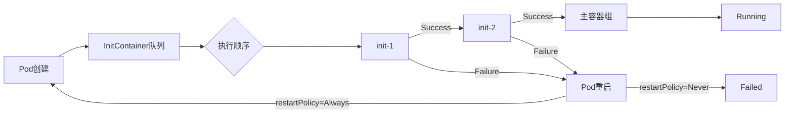
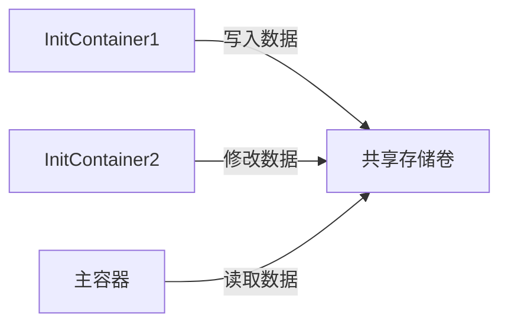
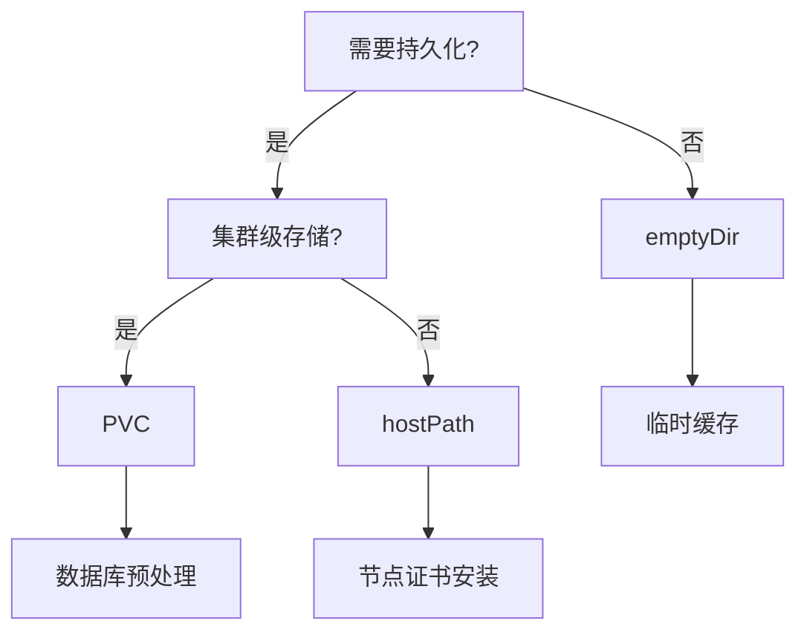

# Init Container 技术文档

## 1. 背景与作用

### 1.1 为什么需要 Init Container？

Kubernetes 中的 Init Container 可以用于多种初始化任务，如等待依赖服务启动、创建文件、root修改内核参数、设置环境变量等。与直接在主容器中执行初始化脚本相比，Init Container 能够实现更清晰的职责分离，使主容器镜像更加专注于业务逻辑，而不受初始化任务的干扰。

**初始化容器的用途**

- lnit 容器可以包含一些安装过程中应用容器中不存在的实用工具或个性化代码;
- Init 容器可以安全地运行这些工具，避免这些工具导致应用镜像的安全性降低;
- Init容器可以以root身份运行，执行一些高权限命令;
- Init容器相关操作执行完成以后即退出，不给业务容器带来安全隐患。

### 1.2 生命周期模型




## 2. 核心特性

### 2.1 与普通容器的关键差异

| **特性**     | **Init Container**                                | **普通容器** | **技术影响**                                                 |
| :----------- | :------------------------------------------------ | :----------- | :----------------------------------------------------------- |
| **执行顺序** | 严格串行执行，前序容器必须成功退出                | 并行启动     | 确保初始化任务的有序性，避免因任务执行顺序不当导致的初始化失败。 |
| **失败处理** | 导致 Pod 重启(restartPolicy=Always)               | 独立重启     | 初始化失败将阻止主容器启动，确保 Pod 在初始化任务完成前不会进入运行状态。 |
| **存储隔离** | 必须通过Volume显式声明共享                        | 默认隔离     | 数据传递必须通过 Volume 实现，确保数据在 Init Container 和主容器之间的正确传递。 |
| **探针支持** | ❌ 不支持                                          | ✅ 支持       | 初始化任务必须保证确定性执行结果，避免因探针支持的缺失导致的初始化失败。 |
| **资源分配** | 需单独定义requests/limits，影响Pod调度            | 独立配置     | 节点资源分配依据所有容器requests总和，必须设置防止资源耗尽；建议CPU: 100-500m，内存: 64-256Mi |
| **镜像策略** | 优先使用Alpine（5MB）、Busybox（1.4MB）等工具镜像 | 使用业务镜像 | 减小主容器攻击面，提升安全性，避免因不必要的工具链导致的安全风险。 |
| **生命周期** | 执行完成后立即终止，无法通过kubectl exec进入      | 长期运行     | 尽管 Init Container 的生命周期较短，但它们在执行过程中仍然需要资源分配，以确保初始化任务的顺利执行。 |

### 2.2 与PostStart区别

- **PostStart：** 依赖主应用的环境，而且并不一定先于 Command 运行
- **InitContainer：**不依赖主应用的环境，可以有更高的权限和更多的工具，一定会在主应用启动之前完成

## 3. 配置示例

### 3.1 基础配置：等待 MySQL 服务就绪

```yaml
apiVersion: v1  # Kubernetes API 版本
kind: Pod       # 资源类型为 Pod
metadata:
  name: app-server  # Pod 的名称
spec:
  initContainers:  # 定义 Init Container
    - name: check-mysql  # 初始化容器名称
      image: busybox:1.28  # 使用轻量级工具镜像（仅 1.4MB）
      command: ['sh', '-c', 'until nc -zv mysql-service 3306; do echo "等待 MySQL 启动..."; sleep 2; done']  # 执行的命令
  containers:  # 定义应用容器
    - name: app-container  # 应用容器的名称
      image: my-app:1.0  # 使用的镜像
      ports:
        - containerPort: 8080  # 容器端口
```

### 3.2 生产级配置：安全凭证下载 + 配置文件渲染

```yaml
apiVersion: v1  # Kubernetes API 版本
kind: Pod       # 资源类型为 Pod
metadata:
  name: production-app  # Pod 的名称
spec:
  serviceAccountName: init-sa  # 使用专用低权限账户
  initContainers:  # 定义 Init Container
    - name: download-secrets  # 从 Vault 下载加密凭证
      image: alpine/curl:7.83  # 包含 curl 工具链
      command: ['sh', '-c', 'curl -sS https://vault/prod-secrets -o /secrets/.env']  # 执行的命令
      securityContext:
        runAsUser: 1000  # 非 root 用户运行
        readOnlyRootFilesystem: true  # 只读根文件系统
      volumeMounts:
        - name: secret-volume  # 挂载卷名称
          mountPath: /secrets  # 挂载路径
    - name: render-config  # 渲染配置文件模板
      image: alpine:3.18  # 超小体积镜像（5MB）
      command: ['sh', '-c', 'envsubst < /templates/app.conf.tpl > /config/app.conf']  # 执行的命令
      volumeMounts:
        - name: config-volume  # 挂载卷名称
          mountPath: /config  # 挂载路径
        - name: template-volume  # 挂载卷名称
          mountPath: /templates  # 挂载路径
  containers:  # 定义应用容器
    - name: app  # 应用容器的名称
      image: my-prod-app:2.1  # 使用的镜像
      volumeMounts:
        - name: secret-volume  # 挂载卷名称
          mountPath: /etc/secrets  # 挂载路径
          readOnly: true  # 只读挂载
        - name: config-volume  # 挂载卷名称
          mountPath: /etc/app  # 挂载路径
  volumes:  # 定义卷
    - name: secret-volume  # 卷的名称
      emptyDir: {}  # 使用 emptyDir 作为存储
    - name: config-volume  # 卷的名称
      emptyDir: {}  # 使用 emptyDir 作为存储
    - name: template-volume  # 卷的名称
      configMap:
        name: app-templates  # 从 ConfigMap 加载模板
```

## 4.数据共享机制深度解析

### 4.1 Volume 类型选择策略

| **Volume 类型** | **适用场景**     | **Init Container 示例** | **注意事项**               |
| --------------- | ---------------- | ----------------------- | -------------------------- |
| emptyDir        | 临时数据交换     | 配置文件渲染结果传递    | 数据生命周期与 Pod 一致    |
| hostPath        | 节点级数据持久化 | 节点证书预置            | 需配合节点亲和性使用       |
| PVC             | 集群级持久化存储 | 大型数据集预处理        | 注意 StorageClass 访问模式 |
| ConfigMap       | 静态配置注入     | 模板文件提供            | 修改后需重启 Pod 生效      |





### 4.2 跨容器数据传递

```yaml
volumes:
- name: shared-data  # 卷的名称
  emptyDir: {}  # 内存临时卷（数据不持久化）

initContainers:
- name: data-prepare  # 初始化容器名称
  image: alpine  # 使用的镜像
  volumeMounts:
  - name: shared-data  # 挂载卷名称
    mountPath: /prepare-data  # 挂载路径

containers:
- name: app  # 应用容器的名称
  image: my-app  # 使用的镜像
  volumeMounts:
  - name: shared-data  # 挂载卷名称
    mountPath: /app/data  # 挂载路径
```

## 5. 排错指南

### 5.1 常用命令

```bash
# 查看 Init Container 日志
kubectl logs <pod-name> -c <init-container-name> --tail 50

# 检查初始化失败原因
kubectl describe pod <pod-name> | grep "Init Containers" -A 20

# 调试 Init Container（需临时修改 restartPolicy: Never）
kubectl debug -it <pod-name> --image=busybox --target=<init-container-name>
```

### 5.2 错误代码解析

| 状态                  | 含义                          | 处理方案               |
| :-------------------- | :---------------------------- | :--------------------- |
| Init:0/2              | 正在执行第一个 Init Container | 检查镜像拉取/命令语法  |
| Init:CrashLoopBackOff | Init 容器持续失败             | 查看日志定位初始化错误 |
| Init:Error            | 初始化脚本返回非 0 状态码     | 检查命令退出码逻辑     |
| Init:Completed        | 所有初始化完成                | 进入主容器启动阶段     |

## FAQ

### Q1: 如何确保主容器启动时数据已准备就绪？

- Init Container **顺序执行** 的特点保证所有初始化步骤完成。
- 共享存储卷（emptyDir）数据在 Pod 生命周期内持续存在。

### Q2: 为什么主容器镜像不需要包含 curl/wget 工具？

- **职责分离**：初始化工具链通过 Init Container 独立提供。
- **安全加固**：主容器移除不必要组件，减小攻击面。

### Q3: Init Container 失败后如何保留现场？

```yaml
spec:
  restartPolicy: Never  # 禁止自动重启（调试时临时设置）
```
