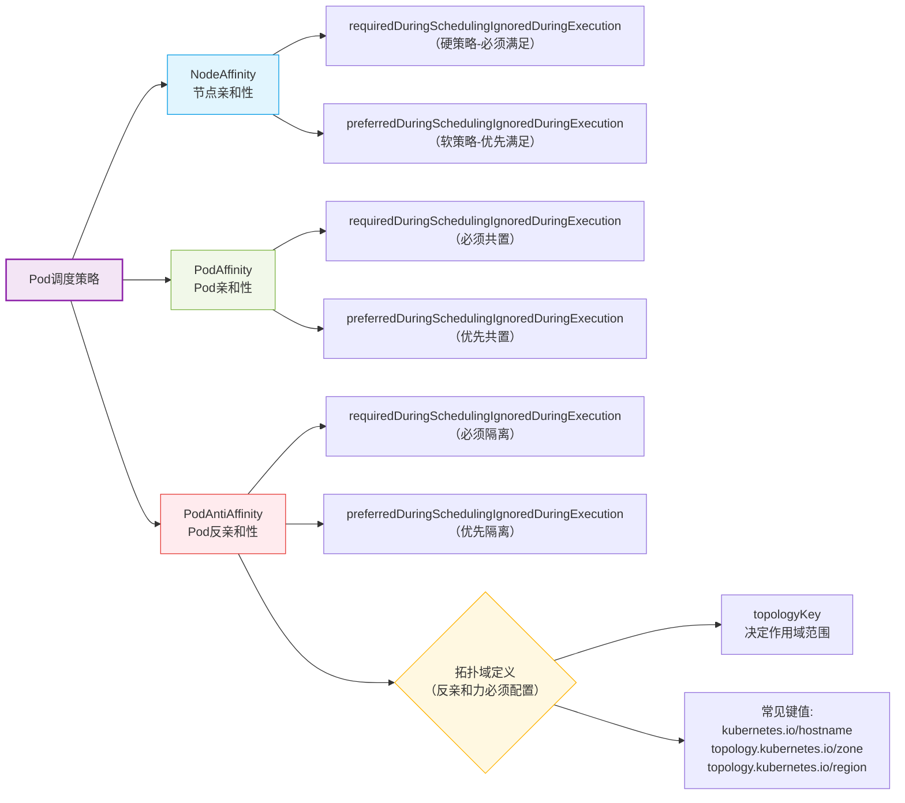

# Kubernetes 亲和力与反亲和力配置指南

## 一、概述

在 Kubernetes 中，**Affinity（亲和力）** 和 **AntiAffinity（反亲和力）** 是用于控制 Pod 调度的关键机制。它们允许用户根据节点或其他 Pod 的标签，灵活地选择将 Pod 调度到特定节点，或避免调度到某些节点。合理配置亲和力和反亲和力，可以显著提高集群资源利用率，并确保应用程序的高可用性和稳定性。

**能够解决的问题**

- **节点选择**：将某些 Pod 优先部署到具有特定标签（如 ssd=true）的节点上，若无符合条件的节点，则考虑部署到其他节点。

- **多条件部署**：某些 Pod 需要同时满足多个标签条件（如 ssd=true 和 type=physical），但优先级较低的条件可适当放宽。

- **副本分散**：同一应用的不同副本尽量或必须不部署在同一个节点或符合特定标签的一类节点上，以实现跨区域或跨机房的高可用性。

- **关联部署**：相互依赖的 Pod 尽量或必须部署在同一节点或同一域内，提高应用性能和可靠性。

  [TOC]

  

## 二、策略类型




------

## 三、节点亲和力配置详解

### 配置示例

```yaml
# 节点亲和力配置示例
apiVersion: v1  # API版本
kind: Pod  # 资源类型，这里是Pod
metadata:
  name: with-node-affinity  # Pod的名称
spec:
  affinity:  # 亲和力配置
    nodeAffinity:  # 节点亲和力
      requiredDuringSchedulingIgnoredDuringExecution:  # 硬亲和力配置，必须满足的条件
        nodeSelectorTerms:  # 节点选择器配置，可以配置多个matchExpressions（满足其一）
          - matchExpressions:  # 每个matchExpressions下可以配置多个key、value类型的选择器（都需要满足）
              - key: kubernetes.io/e2e-az-name  # 节点标签的key
                operator: In  # 匹配方式，相当于key = value的形式
                values:  # 节点标签的value
                  - e2e-az1
                  - az-2
      preferredDuringSchedulingIgnoredDuringExecution:  # 软亲和力配置，优先满足的条件
        - weight: 1  # 软亲和力的权重，权重越高优先级越大，范围1-100
          preference:  # 软亲和力配置项，和weight同级，可以配置多个
            matchExpressions:  # matchExpressions和硬亲和力一致
              - key: another-node-label-key  # 节点标签的key
                operator: In  # 匹配方式，相当于key = value的形式
                values:  # 节点标签的value
                  - another-node-label-value
  containers:
    - name: with-node-affinity  # 容器的名称
      image: nginx  # 容器镜像
```

### 配置项说明

- **requiredDuringSchedulingIgnoredDuringExecution**：硬亲和力配置，必须满足的条件。
  - **nodeSelectorTerms**：节点选择器配置，可配置多个 matchExpressions（满足其一），每个 matchExpressions 下可配置多个 key、value 类型的选择器（都需要满足），其中 values 可配置多个（满足其一）。
- **preferredDuringSchedulingIgnoredDuringExecution**：软亲和力配置，优先满足的条件。
  - **weight**：软亲和力的权重，权重越高优先级越大，范围 1-100。
  - **preference**：软亲和力配置项，和 weight 同级，可配置多个，matchExpressions 和硬亲和力一致。
- **operator**：标签匹配的方式。
  - **In**：相当于 key = value 的形式。
  - **NotIn**：相当于 key != value 的形式。
  - **Exists**：节点存在 label 的 key 为指定的值即可，不能配置 values 字段。
  - **DoesNotExist**：节点不存在 label 的 key 为指定的值即可，不能配置 values 字段。
  - **Gt**：大于 value 指定的值。
  - **Lt**：小于 value 指定的值。

## 四、Pod 亲和力与反亲和力详解

### 配置示例

```yaml
# Pod亲和力和反亲和力配置示例
apiVersion: v1  # API版本
kind: Pod  # 资源类型，这里是Pod
metadata:
  name: with-pod-affinity  # Pod的名称
spec:
  affinity:  # 亲和力配置
    podAffinity:  # Pod亲和力
      requiredDuringSchedulingIgnoredDuringExecution:  # 必须共置的条件
        - labelSelector:  # Pod选择器配置，可以配置多个
            matchExpressions:  # 和节点亲和力配置一致
              - key: security  # Pod标签的key
                operator: In  # 匹配方式，相当于key = value的形式
                values:  # Pod标签的value
                  - S1
            topologyKey: failure-domain.beta.kubernetes.io/zone  # 匹配的拓扑域的key
    podAntiAffinity:  # Pod反亲和力
      preferredDuringSchedulingIgnoredDuringExecution:  # 优先隔离的条件
        - weight: 100  # 软亲和力的权重，权重越高优先级越大，范围1-100
          podAffinityTerm:  # Pod亲和力配置项
            labelSelector:  # Pod选择器配置，可以配置多个
              matchExpressions:  # 和节点亲和力配置一致
                - key: security  # Pod标签的key
                  operator: In  # 匹配方式，相当于key = value的形式
                  values:  # Pod标签的value
                    - S2
              namespaces:  # 和哪个命名空间的Pod进行匹配，为空为当前命名空间
                - default
            topologyKey: failure-domain.beta.kubernetes.io/zone  # 匹配的拓扑域的key
  containers:
    - name: with-pod-affinity  # 容器的名称
      image: nginx  # 容器镜像
```

### 配置项说明

- **labelSelector**：Pod 选择器配置，可配置多个。
- **matchExpressions**：和节点亲和力配置一致。
- **operator**：配置和节点亲和力一致，但没有 Gt 和 Lt。
- **topologyKey**：匹配的拓扑域的 key，即节点上 label 的 key，key 和 value 相同的为同一个域，可用于标注不同的机房和地区。
- **namespaces**：和哪个命名空间的 Pod 进行匹配，为空为当前命名空间。

## 五、示例

### 示例 1：同一个应用部署在不同的宿主机

```yaml
# 同一个应用部署在不同的宿主机
apiVersion: apps/v1  # API版本
kind: Deployment  # 资源类型，这里是Deployment
metadata:
  labels:
    app: must-be-diff-nodes  # Deployment的标签
  name: must-be-diff-nodes  # Deployment的名称
  namespace: kube-public  # 命名空间
spec:
  replicas: 3  # 副本数量
  selector:
    matchLabels:  # 选择器，用于选择该Deployment管理的Pod
      app: must-be-diff-nodes
  template:
    metadata:
      labels:  # Pod的标签
        app: must-be-diff-nodes
    spec:
      affinity:  # 亲和力配置
        podAntiAffinity:
          requiredDuringSchedulingIgnoredDuringExecution:  # 必须隔离的条件
            - labelSelector:  # Pod选择器配置，可以配置多个
                matchExpressions:  # 和节点亲和力配置一致
                  - key: app  # Pod标签的key
                    operator: In  # 匹配方式，相当于key = value的形式
                    values:  # Pod标签的value
                      - must-be-diff-nodes
                topologyKey: kubernetes.io/hostname  # 匹配的拓扑域的key
      containers:
        - image: nginx  # 容器镜像
          imagePullPolicy: IfNotPresent  # 镜像拉取策略
          name: must-be-diff-nodes  # 容器的名称
```

### 示例 2：同一个应用不同副本固定节点

```yaml
# 同一个应用不同副本固定节点
apiVersion: apps/v1  # API版本
kind: Deployment  # 资源类型，这里是Deployment
metadata:
  name: redis-cache  # Deployment的名称
spec:
  selector:
    matchLabels:  # 选择器，用于选择该Deployment管理的Pod
      app: store
  replicas: 3  # 副本数量
  template:
    metadata:
      labels:  # Pod的标签
        app: store
    spec:
      nodeSelector:  # 节点选择器
        app: store
      affinity:  # 亲和力配置
        podAntiAffinity:
          requiredDuringSchedulingIgnoredDuringExecution:  # 必须隔离的条件
            - labelSelector:  # Pod选择器配置，可以配置多个
                matchExpressions:  # 和节点亲和力配置一致
                  - key: app  # Pod标签的key
                    operator: In  # 匹配方式，相当于key = value的形式
                    values:  # Pod标签的value
                      - store
                topologyKey: "kubernetes.io/hostname"  # 匹配的拓扑域的key
      containers:
        - name: redis-server  # 容器的名称
          image: redis:3.2-alpine  # 容器镜像
```

### 示例 3：应用和缓存尽量部署在同一个域内

```yaml
# 应用和缓存尽量部署在同一个域内
apiVersion: apps/v1  # API版本
kind: Deployment  # 资源类型，这里是Deployment
metadata:
  name: web-server  # Deployment的名称
spec:
  selector:
    matchLabels:  # 选择器，用于选择该Deployment管理的Pod
      app: web-store
  replicas: 3  # 副本数量
  template:
    metadata:
      labels:  # Pod的标签
        app: web-store
    spec:
      affinity:  # 亲和力配置
        podAntiAffinity:
          requiredDuringSchedulingIgnoredDuringExecution:  # 必须隔离的条件
            - labelSelector:  # Pod选择器配置，可以配置多个
                matchExpressions:  # 和节点亲和力配置一致
                  - key: app  # Pod标签的key
                    operator: In  # 匹配方式，相当于key = value的形式
                    values:  # Pod标签的value
                      - web-store
                topologyKey: "kubernetes.io/hostname"  # 匹配的拓扑域的key
        podAffinity:
          preferredDuringSchedulingIgnoredDuringExecution:  # 优先共置的条件
            - weight: 100  # 软亲和力的权重，权重越高优先级越大，范围1-100
              podAffinityTerm:  # Pod亲和力配置项
                labelSelector:  # Pod选择器配置，可以配置多个
                  matchExpressions:  # 和节点亲和力配置一致
                    - key: app  # Pod标签的key
                      operator: In  # 匹配方式，相当于key = value的形式
                      values:  # Pod标签的value
                        - store
                topologyKey: "kubernetes.io/hostname"  # 匹配的拓扑域的key
      containers:
        - name: web-app  # 容器的名称
          image: nginx:1.16-alpine  # 容器镜像
```

### 示例 4：尽量调度到高配置服务器

```yaml
# 尽量调度到高配置服务器
apiVersion: apps/v1  # API版本
kind: Deployment  # 资源类型，这里是Deployment
metadata:
  labels:
    app: prefer-ssd  # Deployment的标签
  name: prefer-ssd  # Deployment的名称
  namespace: kube-public  # 命名空间
spec:
  replicas: 3  # 副本数量
  selector:
    matchLabels:  # 选择器，用于选择该Deployment管理的Pod
      app: prefer-ssd
  template:
    metadata:
      creationTimestamp: null
      labels:  # Pod的标签
        app: prefer-ssd
    spec:
      affinity:  # 亲和力配置
        nodeAffinity:
          preferredDuringSchedulingIgnoredDuringExecution:  # 优先满足的条件
            - preference:
                matchExpressions:
                  - key: ssd  # 节点标签的key
                    operator: In  # 匹配方式，相当于key = value的形式
                    values:
                      - "true"
                  - key: master  # 节点标签的key
                    operator: NotIn  # 匹配方式，相当于key != value的形式
                    values:
                      - "true"
                weight: 100  # 软亲和力的权重，权重越高优先级越大，范围1-100
            - preference:
                matchExpressions:
                  - key: type  # 节点标签的key
                    operator: In  # 匹配方式，相当于key = value的形式
                    values:
                      - physical
                weight: 10  # 软亲和力的权重，权重越高优先级越大，范围1-100
      containers:
        - name: prefer-ssd  # 容器的名称
          image: nginx  # 容器镜像
```

## 六、拓扑域 TopologyKey 详解

**TopologyKey** 是用于定义拓扑域的键值，主要针对宿主机，通过 label 进行判断，不同的 key 和不同的 value 属于不同的拓扑域。

### 常见键值

- **kubernetes.io/hostname**：表示宿主机名。
- **topology.kubernetes.io/zone**：表示机房或可用区。
- **topology.kubernetes.io/region**：表示区域或城市。

### 示例：同一个应用多区域部署

```yaml
# 同一个应用多区域部署
apiVersion: apps/v1  # API版本
kind: Deployment  # 资源类型，这里是Deployment
metadata:
  labels:
    app: must-be-diff-zone  # Deployment的标签
  name: must-be-diff-zone  # Deployment的名称
  namespace: kube-public  # 命名空间
spec:
  replicas: 3  # 副本数量
  selector:
    matchLabels:  # 选择器，用于选择该Deployment管理的Pod
      app: must-be-diff-zone
  template:
    metadata:
      labels:  # Pod的标签
        app: must-be-diff-zone
    spec:
      affinity:  # 亲和力配置
        podAntiAffinity:
          requiredDuringSchedulingIgnoredDuringExecution:  # 必须隔离的条件
            - labelSelector:  # Pod选择器配置，可以配置多个
                matchExpressions:  # 和节点亲和力配置一致
                  - key: app  # Pod标签的key
                    operator: In  # 匹配方式，相当于key = value的形式
                    values:  # Pod标签的value
                      - must-be-diff-zone
                topologyKey: region  # 匹配的拓扑域的key
      containers:
        - image: nginx  # 容器镜像
          imagePullPolicy: IfNotPresent  # 镜像拉取策略
          name: must-be-diff-zone  # 容器的名称
```