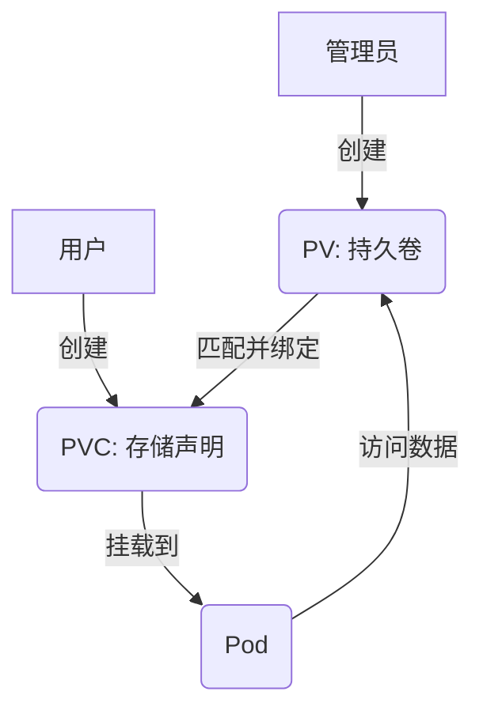

# PV 和 PVC

## 背景介绍

在 Kubernetes（简称 K8s）中，Pod 是最小的调度单位，而 Pod 内的容器通常是临时的，数据默认存储在容器的文件系统中。一旦 Pod 被销毁，数据也会随之丢失。为了解决数据的持久化需求，K8s 提供了 **Volume** 机制。然而，仅仅使用 Volume 并不能完全满足生产环境中复杂的需求，尤其是在以下场景中，Volume 的局限性会暴露出来：

### Volume 无法解决的问题

1. **数据卷卸载后的处理问题**  
   当某个数据卷不再被挂载使用时，里面的数据如何处理？Volume 本身并没有明确的回收机制，可能导致数据残留或资源浪费。

2. **只读挂载的需求**  
   如果需要将某个数据卷以只读方式挂载给多个 Pod，Volume 缺乏灵活的访问权限控制。

3. **限制单一 Pod 挂载**  
   如果希望某个数据卷只能被一个 Pod 挂载使用，Volume 的配置方式无法很好地实现这种限制。

4. **存储空间的分配限制**  
   如何确保某个 Pod 只能使用特定大小的空间（例如 10G）？Volume 没有原生的资源请求和分配机制。

这些问题在生产环境中非常常见，例如：

- 当某个数据卷不再被挂载使用时，里面的数据如何处理？
- 如果想要实现只读挂载如何处理？
- 如果想要只能一个 Pod 挂载如何处理？
- 如何只允许某个 Pod 使用 10G 的空间？

为了解决这些问题，Kubernetes 引入了 **Persistent Volume（PV）** 和 **Persistent Volume Claim（PVC）**，提供了更强大、更灵活的存储管理方式。

---

## 概念与原理

### Persistent Volume (PV) 介绍

PV 是 Kubernetes 中由管理员创建的存储资源，代表集群中的一块持久化存储。它独立于 Pod 的生命周期，定义了存储的容量、访问模式和回收策略等属性。PV 的核心作用是抽象底层存储的细节，提供统一的存储接口。

### Persistent Volume Claim (PVC) 介绍

PVC 是用户对存储资源的需求声明，类似于 Pod 对 CPU 和内存的资源请求。用户通过 PVC 指定所需的存储大小、访问模式等，Kubernetes 会自动将符合条件的 PV 绑定到 PVC 上。PVC 与 PV 的关系类似于“请求与供给”。

### PV 和 PVC 的调用关系

PV 和 PVC 的工作流程可以用以下步骤描述：

1. **管理员创建 PV**：定义存储的容量、访问模式、回收策略等。
2. **用户创建 PVC**：声明所需的存储需求（大小、访问模式等）。
3. **Kubernetes 绑定 PV 和 PVC**：根据 PVC 的需求，自动匹配并绑定一个符合条件的 PV。
4. **Pod 使用 PVC**：Pod 通过挂载 PVC 来访问底层的 PV 存储。

以下是一个简单的 Mermaid 图展示 PV 和 PVC 的调用关系：



---

## PV 和 PVC 的核心特性

### PV 回收策略

PV 的回收策略（`persistentVolumeReclaimPolicy`）决定了当 PVC 被删除后，PV 的处理方式：

- **Retain（保留）**  
  删除 PVC 后，PV 仍然存在，状态变为 `Released`，数据不会被自动清除。管理员需要手动回收资源，适合需要保留数据的场景。
- **Recycle（回收）**  
  删除 PVC 后，PV 会被清理（执行 `rm -rf`），然后重新变为 `Available`，可供新的 PVC 使用。目前仅 NFS 和 HostPath 支持此策略，但未来将被弃用。
- **Delete（删除）**  
  删除 PVC 时，PV 和底层存储资源会被同时删除。动态创建的 PV 默认使用此策略，支持的后端包括 AWS EBS、GCE PD、Azure Disk 等。

### PV 访问模式

PV 的访问模式（`accessModes`）定义了存储卷的挂载权限：

- **ReadWriteOnce (RWO)**  
  可被单个节点以读写模式挂载，适合独占使用的场景（如数据库）。
- **ReadOnlyMany (ROX)**  
  可被多个节点以只读模式挂载，适合共享只读数据的场景（如配置文件）。
- **ReadWriteMany (RWX)**  
  可被多个节点以读写模式挂载，适合需要多节点共享读写的场景（如分布式文件系统）。
- **ReadWriteOncePod**  
  只允许单个 Pod 以读写模式挂载，需要 K8s 1.22+ 版本及 CSI 驱动支持，适合更细粒度的控制。

### 存储分类

根据使用场景，PV 支持的存储类型可以分为以下三类：

1. **文件存储**  
   适合多节点共享数据，例如用户上传的文件。实现方式包括 NFS、NAS、CephFS 等。
2. **块存储**  
   适合单节点独占使用，例如数据库。实现方式包括 Ceph RBD、GlusterFS、云厂商的块存储。
3. **对象存储**  
   适合云原生无状态应用，通常通过 S3 协议实现，例如 AWS S3、Minio。

---

## PV 配置示例

以下是几种常见的 PV 配置示例，包含详细的参数解释。

### 示例 1：NFS 类型的 PV

```yaml
apiVersion: v1
kind: PersistentVolume
metadata:
  name: pv-nfs				 # PV 的名称
spec:
  capacity:
    storage: 5Gi             # 定义存储容量为 5Gi
  volumeMode: Filesystem     # 卷模式为文件系统（默认）
  accessModes:
    - ReadWriteOnce          # 访问模式为单节点读写
  persistentVolumeReclaimPolicy: Recycle  # 回收策略为回收
  storageClassName: nfs-slow  # 指定 StorageClass 名称
  mountOptions:
    - hard                   # NFS 挂载选项：硬挂载
    - nfsvers=4.1            # NFS 协议版本
  nfs:
    path: /data/k8s          # NFS 共享目录路径
    server: 10.103.236.205   # NFS 服务器 IP 地址
```

#### NFS 配置步骤

1. **NFS 服务端安装**  

   ```bash
   yum install nfs-utils rpcbind -y
   mkdir -p /data/k8s
   echo "/data/k8s *(rw,sync,no_subtree_check,no_root_squash)" > /etc/exports
   exportfs -r
   systemctl restart nfs rpcbind
   ```

2. **K8s 节点安装 NFS 客户端**  

   ```bash
   yum install nfs-utils -y
   ```

3. **挂载测试**  

   ```bash
   mount -t nfs 10.103.236.205:/data/k8s /mnt
   ```

### 示例 2：HostPath 类型的 PV

```yaml
apiVersion: v1
kind: PersistentVolume			# 资源类型为 PersistentVolume
metadata:
  name: task-pv-volume			  # PV 的名称
  labels:
    type: local					  # 标签，用于标识 PV 类型
spec:
  storageClassName: hostpath   # 指定 StorageClass 名称
  capacity:
    storage: 10Gi            # 定义存储容量为 10Gi
  accessModes:
    - ReadWriteOnce          # 访问模式为单节点读写
  hostPath:
    path: "/mnt/data"        # 宿主机上的数据目录
```

### 示例 3：Ceph RBD 类型的 PV

```yaml
apiVersion: v1
kind: PersistentVolume		 # 资源类型为 PersistentVolume
metadata:
  name: ceph-rbd-pv			  # PV 的名称
spec:
  capacity:
    storage: 1Gi             # 定义存储容量为 1Gi
  storageClassName: ceph-fast  # 指定 StorageClass 名称
  accessModes:
    - ReadWriteOnce          # 访问模式为单节点读写
  rbd:
    monitors:                # Ceph Monitor 节点地址
      - 192.168.1.123:6789
      - 192.168.1.124:6789
      - 192.168.1.125:6789
    pool: rbd                # Ceph 存储池名称
    image: ceph-rbd-pv-test  # Ceph RBD 映像名称
    user: admin              # Ceph 用户名
    secretRef:
      name: ceph-secret      # Ceph 认证密钥引用
    fsType: ext4             # 文件系统类型
    readOnly: false          # 是否只读挂载
```

---

## PVC 配置与挂载

### 创建 PVC

PVC 用于请求 PV 资源，以下是一个示例：

```yaml
apiVersion: v1
kind: PersistentVolumeClaim
metadata:
  name: task-pvc-claim		  # PVC 的名称
spec:
  storageClassName: nfs-slow   # 与 PV 的 StorageClass 一致
  accessModes:
    - ReadWriteOnce            # 访问模式与 PV 一致
  resources:
    requests:
      storage: 3Gi            # 请求 3Gi 存储空间
```

### 在 Pod 中挂载 PVC

以下是一个 Pod 使用 PVC 的示例：

```yaml
apiVersion: v1
kind: Pod
metadata:
  name: task-pv-pod
spec:
  volumes:
    - name: task-pv-storage    # 卷名称
      persistentVolumeClaim:
        claimName: task-pvc-claim  # 指定 PVC 名称
  containers:
    - name: task-pv-container
      image: nginx             # 容器镜像
      ports:
        - containerPort: 80    # 容器端口
          name: "http-server"  # 端口名称
      volumeMounts:
        - mountPath: "/usr/share/nginx/html"  # 挂载路径
          name: task-pv-storage  # 挂载的卷名称
```

### 在 Deployment 中挂载 PVC

以下是一个更实际的 Deployment 示例，用于运行 MySQL 并持久化数据：

```yaml
apiVersion: apps/v1  # Kubernetes API 版本
kind: Deployment  # 资源类型为 Deployment
metadata:
  name: mysql  # Deployment 名称
  namespace: default  # 命名空间
spec:
  replicas: 1  # 副本数量
  selector:
    matchLabels:
      app: mysql  # 选择器标签
  template:
    metadata:
      labels:
        app: mysql  # Pod 标签
    spec:
      containers:
        - name: mysql  # 容器名称
          image: mysql:5.7  # MySQL 镜像
          env:
            - name: MYSQL_ROOT_PASSWORD  # 环境变量名称
              value: "password"  # MySQL 根用户密码
          volumeMounts:
            - mountPath: "/var/lib/mysql"  # MySQL 数据挂载路径
              name: mysql-storage  # 挂载的卷名称
      volumes:
        - name: mysql-storage  # 卷名称
          persistentVolumeClaim:
            claimName: task-pvc-claim  # 指定 PVC 名称
```

---

## PV 的状态

PV 在其生命周期中会有以下状态：

- **Available**：空闲状态，未被 PVC 绑定。
- **Bound**：已绑定状态，已被某个 PVC 使用。
- **Released**：已释放状态，PVC 被删除但 PV 未被回收。
- **Failed**：回收失败状态，自动回收过程出错。

---

## 问题排查

### PVC 一直处于 Pending 状态的原因

1. **PVC 请求的存储大小超过 PV 提供的大小**  
   检查 PVC 的 `resources.requests.storage` 是否小于等于 PV 的 `capacity.storage`。
2. **StorageClassName 不匹配**  
   确保 PVC 和 PV 的 `storageClassName` 一致。
3. **访问模式不一致**  
   PVC 的 `accessModes` 必须与 PV 的 `accessModes` 兼容。

### Pod 挂载 PVC 失败的原因

1. **PVC 未创建成功或不存在**  
   使用 `kubectl get pvc` 检查 PVC 状态是否为 `Bound`。
2. **PVC 和 Pod 不在同一 Namespace**  
   确保 PVC 和 Pod 位于相同的命名空间。

---

## 总结

通过 PV 和 PVC，Kubernetes 提供了一种灵活的存储管理机制。PV 负责定义存储资源，PVC 负责请求存储，Pod 通过挂载 PVC 使用存储。新手可以通过上述示例逐步学习 PV 和 PVC 的配置，并根据实际需求选择合适的存储类型和策略。在生产环境中，建议结合 StorageClass 和动态 PV 创建进一步简化管理。