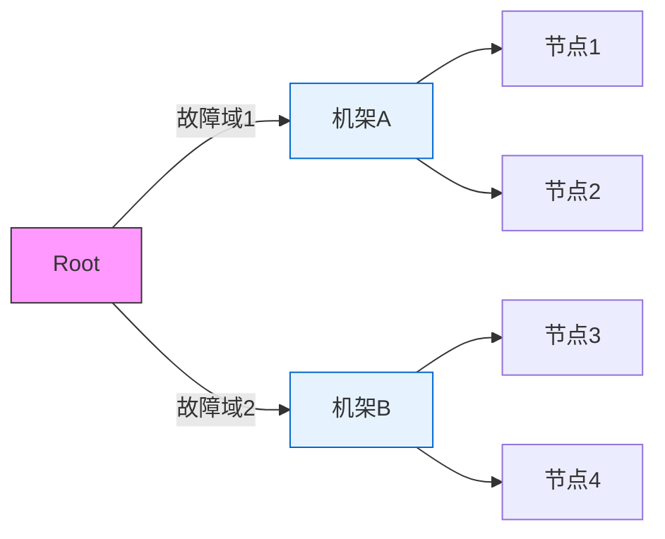

# 分布式存储技术演进与 Ceph 核心原理解析

------

## 一、存储技术演变历程

### 1. 直连式存储（DAS）

**技术特点：**

- **本地连接**：存储设备（硬盘、磁带）通过 IDE、SATA、SCSI 等接口直接连接到服务器。
- **高速度**：因直接连接，延迟低，带宽稳定（如 SCSI 传输速率达 320 MB/s）。
- **低成本**：无需网络设备，部署简单。

**局限性**：

- **扩展性差**：单服务器容量受物理接口数量限制。
- **无共享能力**：数据无法跨主机访问。
- **可靠性低**：依赖单机 RAID，无法跨设备容灾。

### 2. **网络附加存储（NAS）**

**技术特点：**

- **文件级共享**：通过 NFS（Unix）或 CIFS（Windows）协议实现文件共享。
- **网络架构**：存储设备通过以太网连接，支持多客户端并发访问。
- **简化管理**：集中存储，权限统一控制。

**局限性**：

- **性能瓶颈**：受限于网络带宽（千兆以太网仅 125 MB/s）。
- **协议开销**：文件传输需封装/解封装协议，额外消耗 CPU 资源。
- **扩展困难**：单 NAS 设备容量有限，横向扩展需复杂集群方案。

### 3. **存储区域网络（SAN）**

**技术特点：**

- **块级存储**：通过 FC（光纤通道）或 iSCSI（IP 网络）提供裸设备映射。
- **高性能**：FC SAN 带宽达 16 Gbps（约 1.6 GB/s），延迟微秒级。
- **高可靠性**：支持多路径冗余和跨阵列快照。

**局限性**：

- **成本高昂**：需专用光纤交换机和 HBA 卡。
- **复杂度高**：需专业团队维护 LUN 划分和 Zone 配置。
- **扩展限制**：单 SAN 集群规模受限于交换机端口数量。

### 4. **传统分布式存储（如 HDFS）**

**技术特点：**

- **横向扩展**：通过多节点集群存储海量数据（PB 级）。

- **元数据集中管理**：由 NameNode 统一管理文件元数据（如 Hadoop HDFS）。

- **数据冗余**：默认 3 副本机制，跨节点存储保证可靠性。

**局限性**：

- **元数据瓶颈**：NameNode 单点故障，内存容量限制元数据规模。
- **恢复时间长**：节点故障后需重新复制数据，耗时随数据量增长。
- **负载不均**：静态哈希算法易导致数据分布倾斜。

### 5. **Ceph 分布式存储**

**技术特点：**

- **去中心化架构**：无单点元数据服务器，通过 CRUSH 算法动态计算数据位置。
- **多协议支持**：统一存储池支持块（RBD）、文件（CephFS）、对象（RGW）存储。
- **自愈能力**：基于 CRUSH 规则自动绕过故障节点，秒级数据恢复。

------

## 二、存储技术分类

### 1. **硬件存储设备**

|  类型  |      技术方案       |         典型场景         |
| :----: | :-----------------: | :----------------------: |
|  DAS   | SATA/SCSI 硬盘阵列  |     单服务器本地存储     |
|  NAS   |   NetApp FAS 系列   |       企业文件共享       |
|  SAN   | EMC VMAX 全闪存阵列 | 数据库、虚拟化平台块存储 |
| 超融合 |     VMware vSAN     |   虚拟化平台分布式存储   |

### 2. **软件定义存储（SDS）**

|    类型    |     技术方案      |              核心特点              |
| :--------: | :---------------: | :--------------------------------: |
|  文件存储  |     NFS/CIFS      |       基于文件协议的共享存储       |
|  对象存储  |  Ceph RGW、MinIO  | RESTful API 接口，海量非结构化数据 |
|   块存储   |  Ceph RBD、iSCSI  |     低延迟、高吞吐的块设备映射     |
| 分布式文件 | CephFS、GlusterFS |     跨节点文件系统，支持高并发     |

------

## 三、传统分布式存储的局限性

### 1. 元数据节点瓶颈（以 HDFS 为例）

- **单点故障风险**：NameNode 宕机导致整个集群不可用。
- **内存容量限制**：1 亿文件需约 100 GB 内存存储元数据。
- **性能天花板**：单节点处理 10 万 QPS 后出现响应延迟。

### 2. 数据分布问题

- **静态哈希算法**：哈希环节点增减导致大规模数据迁移。
- **负载不均**：热点数据集中在部分节点，利用率差异超 30%。
- **恢复效率低**：1 TB 数据恢复需 30 分钟以上。

### 3.HDFS 分布式存储原理优化描述

​	在传统分布式存储架构中，数据存储采用分块化设计以提高可靠性和并行处理能力。以 Hadoop HDFS 为例，其核心工作机制围绕元数据集中管理展开：当客户端需要存储文件时，系统首先将文件切割为固定大小的数据块（默认 128MB），随后将数据块分布式存储在多个 DataNode 上。为确保客户端能准确访问数据碎片，系统依赖中心化的 NameNode 节点维护全局元数据，包括文件路径与数据块的映射关系、存储节点位置信息以及访问权限等关键元信息。这种设计虽能实现快速元数据检索（内存访问延迟仅微秒级），但也引入了显著瓶颈——所有元数据集中存储在 NameNode 内存中，使得单节点内存容量成为存储规模的硬性限制。例如，存储 1 亿个文件需要约 100GB 内存空间，这对物理硬件提出了极高要求。

​	为解决元数据持久化问题，HDFS 采用类数据库的 WAL（Write-Ahead Logging）机制。具体实现为 EditLog 操作日志和 FsImage 元数据镜像的双重保障：所有元数据变更操作会实时追加写入 EditLog 文件，同时系统定期（默认 1 小时）将内存中的元数据全量快照生成 FsImage 文件。这种设计在常规场景下能保证元数据安全，但节点故障恢复时需重新加载 FsImage 并逐条回放 EditLog 中的操作记录，当面对 PB 级存储系统时，日志回放过程可能耗时数十分钟，严重影响系统可用性。更严峻的是，NameNode 作为单点故障源，一旦发生硬件故障将导致整个存储集群不可用。为此，HDFS 引入高可用架构，通过部署备用 NameNode 和 JournalNodes 日志集群实现主备切换，备用节点通过实时同步 JournalNodes 中的 EditLog 保持元数据更新，在主节点故障时可在 30 秒内完成接管。然而这种方案仅缓解了单点故障风险，并未解决元数据规模与性能之间的根本矛盾。

------

## 四、Ceph 核心原理与优势

### 1.Ceph 分布式存储原理优化描述

Ceph 通过颠覆性的去中心化架构解决了传统分布式存储的元数据瓶颈问题。其核心创新在于完全摒弃中心化元数据管理，转而采用动态计算的数据定位机制。当文件写入 Ceph 集群时，系统首先将其拆解为多个标准化对象（默认 4MB），每个对象通过包含集群标识、对象编号等信息的全局唯一 OID 进行标识。与传统哈希环定位机制不同，Ceph 引入 CRUSH（Controlled Replication Under Scalable Hashing）算法实现智能数据分布，该算法通过三层映射机制动态计算存储位置：

首先，对象 OID 经过哈希运算映射到逻辑存储单元 PG（Placement Group），PG 作为数据分布的最小粒度单元，将海量对象归约为可控数量的管理单元（通常每 OSD 管理 100-200 个 PG）。其次，CRUSH 算法结合实时集群拓扑图（CRUSH Map），根据预设的数据分布策略（如跨机架、跨数据中心）计算 PG 应存储的物理 OSD（Object Storage Device）节点列表。此过程并非简单环状哈希，而是通过权重调节、故障域隔离等策略实现数据均衡分布。例如，在 3 副本策略下，算法会确保三个副本分别位于不同机架的 OSD 节点上。最后，客户端直接与目标 OSD 节点通信完成数据写入，整个过程无需任何中心节点参与元数据查询。

这种去中心化架构带来多重优势：其一，数据定位计算负载分散到各个客户端，彻底消除元数据服务器的性能瓶颈；其二，CRUSH 算法的拓扑感知能力使数据分布自动适应集群扩容、硬件故障等变化，例如新增存储节点时，算法会按磁盘容量权重比例自动迁移部分 PG，实现存储负载的动态平衡；其三，通过 PG 的批量管理机制，数据恢复效率比传统逐对象复制提升两个数量级，十 TB 级数据迁移可在分钟级完成。此外，Ceph 创新性地在存储层实现多协议统一支持，同一存储池可同时提供块设备（RBD）、文件系统（CephFS）、对象存储（RGW）三种访问接口，这种架构级整合大幅降低了混合负载场景下的运维复杂度。

### 2.ceph 存储类型

在存储系统中，主要有三种存储方式：文件存储（File Storage）、块存储（Block Storage）、对象存 储（Object Storage）。它们适用于不同的使用场景，各有优缺点

#### Ceph 支持的存储类型对比

**核心存储类型**

|   存储类型   |        Ceph 实现         |         访问方式         |        适用场景         |           优势           |           局限性           |
| :----------: | :----------------------: | :----------------------: | :---------------------: | :----------------------: | :------------------------: |
|  **块存储**  | RBD (RADOS Block Device) |  块设备映射 (iSCSI/KVM)  | 虚拟机磁盘、数据库存储  |      低延迟、高性能      |    不支持多节点并发写入    |
| **文件存储** |          CephFS          |  文件系统挂载 (NFS/SMB)  |   共享文档、开发环境    |  原生目录结构、权限管理  | 元数据性能受 MDS 集群限制  |
| **对象存储** |   RGW (RADOS Gateway)    | HTTP REST API (S3/Swift) | 图片/视频存储、日志归档 | 无限扩展、全球分布式访问 | 高延迟、不支持文件部分修改 |

------

**一句话选型指南**

- **块存储（RBD）**：需低延迟直接挂载的场景（如虚拟机磁盘）。
- **文件存储（CephFS）**：需目录共享的协作场景（如团队代码库）。
- **对象存储（RGW）**：海量非结构化数据存储（如 AI 训练集）。

### 3. CRUSH 算法

- **动态拓扑感知**：根据集群物理拓扑（机架、主机、磁盘）计算数据位置。
- **权重分配**：根据 OSD 容量自动分配数据比例（如 4 TB 盘权重为 4）。
- **故障域隔离**：强制副本分布在不同的故障域（如不同机架）。

#### 数据定位流程：

1. 客户端对对象 ID 哈希生成 PG（Placement Group）。
2. CRUSH 输入 PG ID + 集群拓扑图，输出目标 OSD 列表。
3. 数据写入 3 个 OSD（默认副本数），主 OSD 负责一致性协调。

### 4. 去中心化元数据管理

- **动态计算替代静态映射**：元数据由客户端实时计算，无需集中存储。
- **MDS 集群（仅 CephFS）**：多个 MDS 节点共享元数据，通过动态子树分区实现负载均衡。

### 5. 数据分布策略

|    策略    |      传统存储      |          Ceph          |
| :--------: | :----------------: | :--------------------: |
| 元数据存储 | 集中式（NameNode） | 去中心化（CRUSH 计算） |
|  数据恢复  | 分钟级（全量复制） |    秒级（增量修复）    |
|   扩展性   | 线性扩展（需停机） | 动态扩缩容（在线生效） |

### 6. 核心组件

|  组件   |               功能描述               |
| :-----: | :----------------------------------: |
| **MON** |  集群状态管理（节点拓扑、OSD 状态）  |
| **OSD** |  对象存储引擎（数据存储、副本同步）  |
| **MDS** | 文件系统元数据服务（仅 CephFS 需要） |
| **RGW** |  对象存储网关（兼容 S3/Swift 协议）  |

------

## 五、Ceph 生产部署规划

### 1. 硬件架构设计

#### 1.1 节点角色定义

|  节点类型   | 数量 |     CPU      | 内存  |           本地存储            |     网络需求      |
| :---------: | :--: | :----------: | :---: | :---------------------------: | :---------------: |
|   **MON**   | 3-5  |  8核/64线程  | 64GB  |     2×480GB SSD（RAID1）      | 管理网络+存储网络 |
|   **OSD**   |  N   | 16核/128线程 | 128GB | 12×8TB HDD 或 24×4TB NVMe SSD | 存储网络+业务网络 |
| **MDS/RGW** | 2-3  | 16核/64线程  | 128GB |     2×960GB SSD（RAID1）      | 业务网络+管理网络 |

#### 1.2  存储介质规划（单节点）

|  磁盘角色  |   类型   | 数量  |  容量   | 文件系统 |          配置要点          |
| :--------: | :------: | :---: | :-----: | :------: | :------------------------: |
|   系统盘   |   SSD    |   2   |  480GB  |   EXT4   | RAID1，存放 OS 和 MON 日志 |
| OSD 数据盘 | HDD/NVMe | 12/24 | 8TB/4TB |   XFS    |  裸盘直通，每盘对应 1 OSD  |
|   缓存盘   |  Optane  |   1   |  800GB  |    -     |  可选，用于 WAL 日志加速   |

### 2. 网络架构设计

#### 2.1 网络配置表

|   网络类型   |       用途        |  网卡类型  |    Bond模式     | MTU  |  VLAN 隔离   |
| :----------: | :---------------: | :--------: | :-------------: | :--: | :----------: |
| **带外管理** |   硬件监控/IPMI   | 千兆电口×2 |  Active-Backup  | 1500 |  专用 VLAN   |
| **存储网络** |   OSD 数据同步    | 万兆光口×2 | LACP（802.3ad） | 9000 | 独立物理网络 |
| **业务网络** |    客户端访问     | 25G光口×2  | LACP（802.3ad） | 9000 |  业务 VLAN   |
| **管理网络** | Ceph MON/MDS 通信 | 万兆光口×2 |   Balance-TCP   | 9000 |  管理 VLAN   |

#### 2.2 网络性能指标

|   流量类型   |    带宽需求     | 延迟要求 |      容错机制       |
| :----------: | :-------------: | :------: | :-----------------: |
| OSD 数据同步 |  单节点 10Gbps  |   <1ms   | 双上联交换机+多路径 |
|  客户端读写  | 每客户端 25Gbps |   <5ms   |    LACP 负载均衡    |
|   MON 心跳   |      1Gbps      |  <10ms   | 跨交换机多 MON 部署 |

### 3. 生产环境优化要点

#### 3.1 监控体系

| 监控维度 |          工具           |         关键指标         |
| :------: | :---------------------: | :----------------------: |
| 硬件状态 | Prometheus+IPMIExporter |    温度/电源/风扇转速    |
| 存储性能 |     Ceph Dashboard      |  OPS/延迟/带宽/PG 状态   |
| 网络质量 |      Grafana+SNMP       | 丢包率/错包率/端口利用率 |

#### 3.2 集群规模阈值

| 规模等级 | OSD 数量 |            管理策略            |
| :------: | :------: | :----------------------------: |
| 小型集群 |   <50    |     单 CRUSH 树，默认规则      |
| 中型集群 |  50-200  |  分多个 CRUSH 树，按业务隔离   |
| 超大规模 |   >200   | 分多个 Ceph 集群，全局负载均衡 |

单集群上限：

- OSD 数量 ≤ 1000（受 MON 同步性能限制）。
- 总数据量 ≤ 100 PB（受 CRUSH 计算复杂度限制）。

#### 3.3 故障域设计

