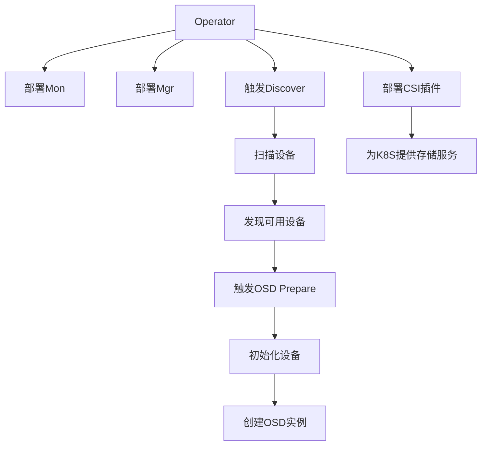

# Rook 

## 📖前言

​	 Rook是一个自我管理的分布式存储编排系统，它本身并不是存储系统，在存储和 k8s之前搭建了一个桥梁，使存储系统的搭建或者维护变得特别简单，Rook将分布式存储系 统转变为自我管理、自我扩展、自我修复的存储服务。它让一些存储的操作，比如部署、 配置、扩容、升级、迁移、灾难恢复、监视和资源管理变得自动化，无需人工处理。并且 Rook支持CSI，可以利用CSI做一些PVC的快照、扩容、克隆等操作。

**`我们不生产水，我们只是大自然的搬运工`**

------

[TOC]

## Rook 架构


### 组件介绍：

**核心Pod功能说明**

- **`rook-discover`**：Rook设备发现守护进程，**自动扫描节点上的存储设备**（如磁盘、SSD），并将信息上报给Operator。
- **`rook-ceph-mon`**：Ceph Monitor服务，**维护集群元数据**（如OSD映射、PG状态），**确保集群一致性**。
- **`rook-ceph-mgr`**：Ceph Manager服务，**提供管理接口和监控指标**（Dashboard、Prometheus指标）。
- **`rook-ceph-osd`**：Ceph OSD服务，**实际存储数据的守护进程**，每个OSD对应一个物理设备。
- **`rook-ceph-crashcollector`**：崩溃日志收集器，**自动收集OSD/Mon故障时的诊断信息**。
- **`rook-ceph-exporter`**：指标导出器，**将Ceph集群性能数据导出给Prometheus**。

**CSI相关组件说明**

- **`csi-rbdplugin`**：RBD块存储插件，**支持动态创建/挂载Ceph RBD卷**（适用于数据库等场景）。
- **`csi-cephfsplugin`**：CephFS文件存储插件，**支持动态创建/挂载CephFS卷**（适用于共享文件存储）。
- **`csi-*-provisioner`**：存储供应控制器，**处理存储卷的生命周期管理**（创建/扩容/删除）。

**运维工具类说明**

- **`rook-ceph-operator`**：集群管理核心，**协调所有资源部署和配置更新**。
- **`rook-ceph-tools`**：工具Pod（需手动创建），**提供`ceph`命令行工具**，用于集群调试。



### 基础环境

| name         | IP            | 磁盘             | ceph             |
| ------------ | ------------- | ---------------- | ---------------- |
| k8s-master01 | 192.168.0.105 | nvme0n1          |                  |
| k8s-master02 | 192.168.0.106 | nvme0n1          |                  |
| k8s-master03 | 192.168.0.107 | nvme0n1、nvme0n2 | ceph安装所在节点 |
| k8s-work01   | 192.168.0.115 | nvme0n1、nvme0n2 | ceph安装所在节点 |
| k8s-work02   | 192.168.0.116 | nvme0n1、nvme0n2 | ceph安装所在节点 |

## Rook 部署

集群运行后，应用程序可以**使用块、对象或文件存储**。

#### 1）克隆 Rook 仓库

```bash
git clone --single-branch --branch v1.16.5 https://github.com/rook/rook.git
```

#### 2）下载镜像

按照利用阿里云下载国外镜像文档进行下载

```bash
ctr images pull registry.cn-hangzhou.aliyuncs.com/xusx/images:3.13.0
ctr images tag registry.cn-hangzhou.aliyuncs.com/xusx/images:3.13.0 quay.io/cephcsi/cephcsi:v3.13.0


ctr images pull registry.cn-hangzhou.aliyuncs.com/xusx/images:2.13.0
ctr images tag registry.cn-hangzhou.aliyuncs.com/xusx/images:2.13.0 registry.k8s.io/sig-storage/csi-node-driver-registrar:v2.13.0


ctr images pull registry.cn-hangzhou.aliyuncs.com/xusx/images:1.13.1
ctr images tag registry.cn-hangzhou.aliyuncs.com/xusx/images:1.13.1 registry.k8s.io/sig-storage/csi-resizer:v1.13.1


ctr images pull registry.cn-hangzhou.aliyuncs.com/xusx/images:5.1.0
ctr images tag registry.cn-hangzhou.aliyuncs.com/xusx/images:5.1.0 registry.k8s.io/sig-storage/csi-provisioner:v5.1.0


ctr images pull registry.cn-hangzhou.aliyuncs.com/xusx/images:8.2.0
ctr images tag registry.cn-hangzhou.aliyuncs.com/xusx/images:8.2.0 registry.k8s.io/sig-storage/csi-snapshotter:v8.2.0


ctr images pull registry.cn-hangzhou.aliyuncs.com/xusx/images:4.8.0
ctr images tag registry.cn-hangzhou.aliyuncs.com/xusx/images:4.8.0 registry.k8s.io/sig-storage/csi-attacher:v4.8.0


ctr images pull registry.cn-hangzhou.aliyuncs.com/xusx/images:1.16.5
ctr images tag registry.cn-hangzhou.aliyuncs.com/xusx/images:1.16.5 docker.io/rook/ceph:v1.16.5

ctr images pull registry.cn-hangzhou.aliyuncs.com/xusx/images:2.13.0
ctr images tag registry.cn-hangzhou.aliyuncs.com/xusx/images:2.13.0 registry.k8s.io/sig-storage/csi-node-driver-registrar:v2.13.0
```

#### 3）修改配置文件

修改 Rook CSI 镜像地址，原本的地址可能是 k8s.io 的镜像，但是 无法被国内访问，所以需要同步gcr的镜像到阿里云镜像仓库

operator 文 件 ， 新 版 本 rook 默 认 关 闭 了 自 动 发 现 容 器 的 部 署 ， 可 以 找 到ROOK_ENABLE_DISCOVERY_DAEMON 改成 true 

```bash
sed -i -E 's/(ROOK_ENABLE_DISCOVERY_DAEMON:\s*)"false"/\1"true"/g' operator.yaml
#	-E：启用扩展正则表达式（支持 \s* 匹配任意数量空格） 
#	\s*：匹配键值之间的任意数量空格。
#	\1：保留原键名和冒号后的格式，仅替换值部分 

cd rook/deploy/examples
kubectl create namespace rook-ceph
kubectl create -f crds.yaml -f common.yaml -f operator.yaml

[root@K8S-Master01 examples]# kubectl -n rook-ceph get pod
NAME                                  READY   STATUS    RESTARTS   AGE
rook-ceph-operator-67944bdfcc-b7r79   1/1     Running   0          35s
rook-discover-l4cw8                   1/1     Running   0          33s
rook-discover-qf5z8                   1/1     Running   0          33s
[root@K8S-Master01 examples]# kubectl get crd  |grep rook
cephblockpoolradosnamespaces.ceph.rook.io             2025-03-17T09:03:29Z
cephblockpools.ceph.rook.io                           2025-03-17T09:03:29Z
cephbucketnotifications.ceph.rook.io                  2025-03-17T09:03:29Z
cephbuckettopics.ceph.rook.io                         2025-03-17T09:03:29Z
cephclients.ceph.rook.io                              2025-03-17T09:03:29Z
cephclusters.ceph.rook.io                             2025-03-17T09:03:29Z
cephcosidrivers.ceph.rook.io                          2025-03-17T09:03:29Z
cephfilesystemmirrors.ceph.rook.io                    2025-03-17T09:03:29Z
cephfilesystems.ceph.rook.io                          2025-03-17T09:03:29Z
cephfilesystemsubvolumegroups.ceph.rook.io            2025-03-17T09:03:29Z
cephnfses.ceph.rook.io                                2025-03-17T09:03:30Z
cephobjectrealms.ceph.rook.io                         2025-03-17T09:03:30Z
cephobjectstores.ceph.rook.io                         2025-03-17T09:03:30Z
cephobjectstoreusers.ceph.rook.io                     2025-03-17T09:03:30Z
cephobjectzonegroups.ceph.rook.io                     2025-03-17T09:03:30Z
cephobjectzones.ceph.rook.io                          2025-03-17T09:03:30Z
cephrbdmirrors.ceph.rook.io                           2025-03-17T09:03:30Z
```


## ceph 部署集群

注意：新版必须采用裸盘，即未格式化的磁盘。其中 k8s-master03 k8s-node01 node02 有新加
的一个磁盘，可以通过 `lsblk -f `查看新添加的磁盘名称。**建议最少三个节点，否则后面的试验可**
**能会出现问题**

```bash
[root@K8S-Master03 ~]# lsblk
NAME        MAJ:MIN RM  SIZE RO TYPE MOUNTPOINT
sr0          11:0    1 1024M  0 rom  
nvme0n1     259:0    0  100G  0 disk 
├─nvme0n1p1 259:1    0    1G  0 part /boot
└─nvme0n1p2 259:2    0   99G  0 part 
  └─rl-root 253:0    0   99G  0 lvm  /
nvme0n2     259:3    0   10G  0 disk 					#新加磁盘，用作ceph OSD
```

#### 1）创建Ceph集群


```bash
# 修改上述配置
vim rook/deploy/examples/cluster.yaml

# 按照使用阿里云下载外网镜像方法下载：quay.io/ceph/ceph:v19.2.1
ctr images pull registry.cn-hangzhou.aliyuncs.com/xusx/images:19.2.1
ctr images tag registry.cn-hangzhou.aliyuncs.com/xusx/images:19.2.1 quay.io/ceph/ceph:v19.2.1

kubectl create  -f cluster.yaml
kubectl -n rook-ceph get pod
# 查看集群健康
kubectl -n rook-ceph get cephcluster
```


**如果第一次没有创建成功OSD，可清理重新尝试**

```bash
# 停止当前集群的OSD服务（避免干扰）
kubectl -n rook-ceph delete --all pods -l app=rook-ceph-osd
#删除之前创建的crd
kubectl get crds | grep "ceph.rook.io" | awk '{print $1}' | xargs kubectl delete crd
kubectl get clusterroles | grep "rook" | awk '{print $1}' | xargs kubectl delete clusterrole
kubectl get clusterrolebindings | grep "rook" | awk '{print $1}' | xargs kubectl delete clusterrolebinding
kubectl get roles -n rook-ceph | awk '{print $1}' | xargs kubectl delete role -n rook-ceph
kubectl get rolebindings -n rook-ceph | awk '{print $1}' | xargs kubectl delete rolebinding -n rook-ceph
kubectl get serviceaccounts -n rook-ceph | awk '{print $1}' | xargs kubectl delete serviceaccount -n rook-ceph

# 在每个节点执行以下命令
sudo rm -rf /var/lib/rook/*
sudo wipefs -a /dev/nvme0n2
sudo dd if=/dev/zero of=/dev/nvme0n2 bs=1M count=1000

sudo reboot  # 可选：重启确保设备状态刷新
```

> [!NOTE]
>
> 需要注意的是，**osd-x 的容器必须是存在的**，且是正常的。如果上述 Pod 均正常，则认为集群安装成功。
> **更多配置：https://rook.io/docs/rook/v1.6/ceph-cluster-crd.html**


####  2）安装 ceph snapshot 控制器 

snapshot 控制器的部署在集群安装时的 k8s-ha-install 项目中，需要切换到 1.20.x 分支：

```bash
cd /root/k8s-ha-install/
git checkout manual-installation-v1.20.x 
```

创建 snapshot controller：

```bash
kubectl create -f /root/k8s-ha-install/snapshotter/ -n kube-system
kubectl get po -n kube-system -l app=snapshot-controller


[root@K8S-Master01 examples]# kubectl get po -n kube-system -l app=snapshot-controller
NAME                    READY   STATUS    RESTARTS   AGE
snapshot-controller-0   1/1     Running   0          6m16s
```

#### 3）安装 ceph 客户端工具

```bash
cd /root/rook/deploy/examples/
kubectl  create -f /root/rook/deploy/examples/toolbox.yaml -n rook-ceph 
kubectl get po -n rook-ceph -l app=rook-ceph-tools


[root@K8S-Master01 examples]# kubectl get po -n rook-ceph -l app=rook-ceph-tools
NAME                               READY   STATUS    RESTARTS   AGE
rook-ceph-tools-7b75b967db-ls9t4   1/1     Running   0          6m51s
```

容器启动后，即可进入容器内部执行服务命令

```bash
[root@k8s-master01 examples]# kubectl -n rook-ceph exec deploy/rook-ceph-tools -- ceph osd stat
3 osds: 3 up (since 7m), 3 in (since 7m); epoch: e16
[root@k8s-master01 examples]# kubectl -n rook-ceph exec deploy/rook-ceph-tools -- ceph -s
  cluster:
    id:     dd96e25d-c610-4fc2-a0aa-41bf4cd9d750
    health: HEALTH_OK
 
  services:
    mon: 3 daemons, quorum a,b,c (age 5m)
    mgr: b(active, since 6m), standbys: a
    osd: 3 osds: 3 up (since 7m), 3 in (since 7m)
 
  data:
    pools:   1 pools, 1 pgs
    objects: 2 objects, 449 KiB
    usage:   82 MiB used, 30 GiB / 30 GiB avail
    pgs:     1 active+clean

如果觉得执行命令过长,可以设置别名
```

具体文档：https://rook.io/docs/rook/v1.6/ceph-csi-snapshot.html


#### 4）安装Ceph dashboard

默认情况下，ceph dashboard是打开的，可以创建一个nodePort类型的Service暴露服务 （新版本该文件默认存在可以直接创建）：

**有存在以下四个类型的 SVC 文件**，如果dashboard 之前设置的是ssl: true 那么根据实际情况去进行创建

```bash
[root@k8s-master01 examples]# ls dashboard-*
dashboard-external-https.yaml  dashboard-external-http.yaml  dashboard-ingress-https.yaml  dashboard-loadbalancer.yaml
```

创建

```bash
kubectl create -f dashboard-external-http.yaml

[root@k8s-master01 examples]#  kubectl get svc  -n rook-ceph rook-ceph-mgr-dashboard-external-https 
NAME                                     TYPE       CLUSTER-IP      EXTERNAL-IP   PORT(S)          AGE
rook-ceph-mgr-dashboard-external-https   NodePort   10.96.211.249   <none>        8443:31983/TCP   80s


#获取登陆密码
kubectl -n rook-ceph get secret rook-ceph-dashboard-password -o jsonpath="{['data']['password']}" | base64 --decode && echo

[root@k8s-master01 examples]# kubectl -n rook-ceph get secret rook-ceph-dashboard-password -o jsonpath="{['data']['password']}" | base64 --decode && echo
?e(Rt^HC}0$(=?;TII8R
```

WEB 访问


## ceph 块存储的使用

块存储一般用于一个 Pod 挂载一块存储使用，相当于一个服务器新挂了一个盘，只给一个应用使用。
参考文档：https://rook.io/docs/rook/v1.6/ceph-block.html

#### 1）创建 StorageClass 和 ceph 的存储池

```bash
cd /root/rook/deploy/examples
kubectl create -f csi/rbd/storageclass.yaml -n rook-ceph


[root@k8s-master01 examples]# kubectl get cephblockpool -n rook-ceph
NAME          PHASE   TYPE         FAILUREDOMAIN   AGE
replicapool   Ready   Replicated   host            2m7s
[root@k8s-master01 examples]# kubectl get sc
NAME              PROVISIONER                  RECLAIMPOLICY   VOLUMEBINDINGMODE   ALLOWVOLUMEEXPANSION   AGE
rook-ceph-block   rook-ceph.rbd.csi.ceph.com   Delete          Immediate           true                   2m15s

# 查看ceph提供的存储驱动
kubectl get csidriver
```


Yaml 配置文件解释

```yaml
apiVersion: ceph.rook.io/v1
kind: CephBlockPool
metadata:
  name: replicapool          # 存储池名称
  namespace: rook-ceph       # 所属命名空间（必须与CephCluster一致）
spec:
  failureDomain: host        # 数据副本分布策略（故障域级别）其他可选值：osd（不同OSD磁盘）、rack（不同机架）。
  replicated:
    size: 3                  # 数据副本数量,每个数据块保存 3个副本（即同一份数据在集群中有3份拷贝）。
    requireSafeReplicaSize: true  # 强制副本数必须满足最小安全要求
---
apiVersion: storage.k8s.io/v1
kind: StorageClass
metadata:
  name: rook-ceph-block      # 存储类名称（创建PVC时需指定）
provisioner: rook-ceph.rbd.csi.ceph.com  # CSI驱动名称
parameters:
  clusterID: rook-ceph       # Ceph集群ID（必须与CephCluster名称一致）
  pool: replicapool          # 使用的Ceph存储池（即上述定义的replicapool）
  imageFormat: "2"           # RBD镜像格式版本,使用 第2版RBD格式（支持更多功能如动态调整大小）。
  imageFeatures: layering    # RBD镜像支持的特性,支持 分层克隆（用于快照和克隆功能）。
  csi.storage.k8s.io/provisioner-secret-name: rook-csi-rbd-provisioner  # 供应者密钥名称
  csi.storage.k8s.io/provisioner-secret-namespace: rook-ceph  # 密钥所在命名空间
  csi.storage.k8s.io/controller-expand-secret-name: rook-csi-rbd-provisioner  # 扩容存储卷时使用的认证信息名称
  csi.storage.k8s.io/controller-expand-secret-namespace: rook-ceph  # 密钥命名空间
  csi.storage.k8s.io/node-stage-secret-name: rook-csi-rbd-node  # 节点挂载密钥名称
  csi.storage.k8s.io/node-stage-secret-namespace: rook-ceph  # 密钥命名空间
  csi.storage.k8s.io/fstype: ext4  # 文件系统类型,存储卷格式化时使用 ext4文件系统（可选：xfs、ext3等）。
allowVolumeExpansion: true   # 允许通过Kubernetes动态扩展存储卷大小。
reclaimPolicy: Delete        # 回收策略,删除PVC时自动删除底层RBD镜像（可选：Retain 保留数据） 
```

从Dashboard上可以看到刚刚所创建的Pool，并且副本数量是我们设置的 size: 2


#### 2）挂载测试

创建一个 MySQL 服务

```bash
cd /root/rook/deploy/examples
kubectl create -f mysql.yaml 

kubectl get pvc,pv,po
```


**Yaml 配置文件解释**

> [!NOTE]   
>
> Volume 通过主要配置参数：claimName：mysql-pv-claim 指定PVC
>
> PVC 通过主要配置参数：storageClassName: rook-ceph-block 指定SC

```yaml
apiVersion: v1
kind: Service
metadata:
  name: wordpress-mysql      # 服务名称
  labels:
    app: wordpress           # 服务标签（用于关联应用）
spec:
  ports:
    - port: 3306             # 暴露的端口号（MySQL默认端口）
  selector:
    app: wordpress           # 选择器：匹配Pod的标签
    tier: mysql
  clusterIP: None            # 使用Headless Service（无集群IP）
  
---
apiVersion: v1
kind: PersistentVolumeClaim
metadata:
  name: mysql-pv-claim        # PVC名称
  labels:
    app: wordpress
spec:
  storageClassName: rook-ceph-block  # 指定使用的存储类（需提前创建）
  accessModes:
    - ReadWriteOnce           # 访问模式：单节点读写
  resources:
    requests:
      storage: 5Gi           # 请求5Gi存储空间
---
apiVersion: apps/v1
kind: Deployment
metadata:
  name: wordpress-mysql        # 部署名称
  labels:
    app: wordpress
    tier: mysql
spec:
  selector:
    matchLabels:              # 选择器：匹配Pod标签
      app: wordpress
      tier: mysql
  strategy:
    type: Recreate           # 更新策略：先终止旧Pod再创建新Pod（防止数据冲突）
  template:
    metadata:
      labels:
        app: wordpress
        tier: mysql
    spec:
      containers:
        - image: mysql:5.6    # 使用MySQL 5.6镜像
          name: mysql
          env:
            - name: MYSQL_ROOT_PASSWORD  # 设置MySQL root密码
              value: changeme            # 实际环境应使用Secret管理
          ports:
            - containerPort: 3306        # 容器暴露端口
              name: mysql
          volumeMounts:
            - name: mysql-persistent-storage
              mountPath: /var/lib/mysql  # MySQL数据存储路径
      volumes:
        - name: mysql-persistent-storage
          persistentVolumeClaim:
            claimName: mysql-pv-claim    # 绑定到上述PVC
```

pvc 会连接刚才创建的 `storageClass`，动态的创建 `pv` ，然后连接到 ceph 创建对应的存储之后创建。 `pvc` 只需要指定 `storageClassName` 为刚才创建的 `StorageClass` 名称即可连接到 rook 的ceph。如果是 statefulset，只需要将 `volumeTemplateClaim` 里面的 `Claim` 名称改为 `StorageClass` 名称即可动态创建 Pod

**完整流程说明**

**1.存储分配**：

- 当PVC `mysql-pv-claim` 被创建时，Rook-Ceph会根据 `rook-ceph-block` 存储类动态创建PV（RBD镜像）。
- PVC与PV绑定后，MySQL Pod才能挂载存储卷。

**2.服务访问**：

- 其他Pod（如WordPress）可通过DNS名称 `wordpress-mysql` 访问MySQL服务。
- Headless Service的DNS记录直接指向MySQL Pod IP，适用于需要直接访问Pod的场景。

**3.数据持久化**：

- MySQL数据保存在 `/var/lib/mysql` 目录，底层由Ceph RBD提供高可用存储。
- 即使Pod重启或迁移，数据不会丢失。

卸载pv

```bash
[root@k8s-master01 examples]# kubectl delete -f mysql.yaml
service "wordpress-mysql" deleted
persistentvolumeclaim "mysql-pv-claim" deleted
deployment.apps "wordpress-mysql" deleted


[root@k8s-master01 examples]# kubectl get pvc,pv,po
No resources found
```

#### 3）StatefulSet 动态存储

普通情况 PVC通过 StorageClass 一次只能创一个PV，但是 StatefulSet 有状态的服务不适用于共享存储数据，否则可能会导致服务异常，所以每个po需要一个pv。可以通过volumeClaimTemplates：来实现

```bash
#部署
vim sts-sc.yaml
kubectl create -f sts-sc.yaml

kubectl get pvc,pv,po


#卸载
kubectl delete -f sts-sc.yaml
kubectl delete pvc www-web-0,www-web-1,www-web-2
```


```yaml
# 定义一个 Service 资源
apiVersion: v1
kind: Service
metadata:
  name: nginx                 # 服务名称
  labels:
    app: nginx                # 服务标签（用于关联应用）
spec:
  ports:
  - port: 80                  # 服务暴露端口
    name: web                 # 端口名称标识
  clusterIP: None             # 使用Headless Service（无集群IP）
  selector:
    app: nginx                # 选择器：匹配Pod的标签

---
# 定义一个 StatefulSet 资源
apiVersion: apps/v1
kind: StatefulSet
metadata:
  name: web                   # StatefulSet名称
spec:
  selector:
    matchLabels:
      app: nginx              # 必须与Pod模板中的标签一致
  serviceName: "nginx"        # 关联的Headless Service名称
  replicas: 3                 # 副本数量（创建3个Pod：web-0, web-1, web-2）
  minReadySeconds: 10         # 新Pod就绪后等待10秒才视为可用
  template:
    metadata:
      labels:
        app: nginx            # Pod标签（必须与selector.matchLabels一致）
    spec:
      terminationGracePeriodSeconds: 10  # 删除Pod时的优雅终止等待时间
      containers:
      - name: nginx
        image: m.daocloud.io/docker.io/library/nginx:latest  # 使用Nginx镜像
        ports:
        - containerPort: 80   # 容器监听端口
          name: web           # 端口名称标识
        volumeMounts:
        - name: www           # 挂载的卷名称（与volumeClaimTemplates匹配）
          mountPath: /usr/share/nginx/html  # 挂载路径（Nginx默认静态文件目录）
  volumeClaimTemplates:       # 动态创建PVC的模板（每个Pod自动生成独立PVC）
  - metadata:
      name: www               # PVC名称模板（最终名称：www-web-0, www-web-1等）
    spec:
      accessModes: [ "ReadWriteOnce" ]  # 访问模式：单节点读写
      storageClassName: "rook-ceph-block"  # 使用的存储类（需提前创建）
      resources:
        requests:
          storage: 1Gi        # 每个PVC请求1Gi存储空间
```


## 共享文件系统的使用

共享文件系统一般用于多个 Pod 共享一个存储
官方文档：https://rook.io/docs/rook/v1.6/ceph-filesystem.html

#### 1）创建共享类型的文件系统和 StorageClass

> [!NOTE]
>
> 文件存储会有创建MDS 用来存放元数据，多个 MDS 节点共享元数据，通过动态子树分区实现负载均衡

```bash
cd /root/rook/deploy/examples
kubectl create -f filesystem.yaml
kubectl -n rook-ceph get pod -l app=rook-ceph-mds


kubectl create -f csi/cephfs/storageclass.yaml

[root@k8s-master01 examples]# kubectl get sc
NAME              PROVISIONER                     RECLAIMPOLICY   VOLUMEBINDINGMODE   ALLOWVOLUMEEXPANSION   AGE
rook-ceph-block   rook-ceph.rbd.csi.ceph.com      Delete          Immediate           true                   24h
rook-cephfs       rook-ceph.cephfs.csi.ceph.com   Delete          Immediate           true                   5s
```


#### 2）nginx 挂载测试

```bash
kubectl create -f nginx.yaml
kubectl get po -l app=nginx

kubectl get pvc,pv,po

vim nginx.yaml
```

```yaml
apiVersion: v1
kind: Service
metadata:
  name: nginx                 # 服务名称
  labels:
    app: nginx                # 服务标签（用于关联应用）
spec:
  ports:
  - port: 80                  # 服务暴露端口
    name: web                 # 端口名称标识
  selector:
    app: nginx                # 选择器：匹配Pod的标签,将流量路由到标签为 app: nginx 的Pod。
  type: ClusterIP             # 服务类型（默认ClusterIP，仅集群内访问）
---
kind: PersistentVolumeClaim
apiVersion: v1
metadata:
  name: nginx-share-pvc       # PVC名称
spec:
  storageClassName: rook-cephfs  # 使用的存储类（需提前创建CephFS存储类）
  accessModes:
  - ReadWriteMany            # 访问模式：多节点读写,允许多个Pod同时读写同一个存储卷（适合共享存储场景）
  resources:
    requests:
      storage: 1Gi           # 请求1Gi存储空间
---
apiVersion: apps/v1
kind: Deployment 
metadata:
  name: web                   # 部署名称
spec:
  selector:
    matchLabels:
      app: nginx              # 选择器：匹配Pod标签
  replicas: 3                 # 副本数量（部署3个Pod）
  template:
    metadata:
      labels:
        app: nginx            # Pod标签（必须与selector.matchLabels一致）
    spec:
      containers:
      - name: nginx
        image: m.daocloud.io/docker.io/library/nginx:latest          # 使用Nginx镜像
        imagePullPolicy: IfNotPresent  # 镜像拉取策略（本地存在则不拉取）
        ports:
        - containerPort: 80   # 容器监听端口
          name: web
        volumeMounts:
        - name: www           # 挂载的卷名称
          mountPath: /usr/share/nginx/html  # Nginx静态文件目录
      volumes:
      - name: www             # 卷名称（与volumeMounts匹配）
        persistentVolumeClaim:
          claimName: nginx-share-pvc  # 绑定到上述PVC
```


#### 3）验证效果


## PVC 扩容

> [!CAUTION]                  
>
> 文件共享类型的 PVC 扩容需要 k8s 1.15+
> 块存储类型的 PVC 扩容需要 k8s 1.16+
>
> 
>
> **在 Kubernetes 中，PVC 的缩容功能是受限制的。大多数存储提供商不支持 PVC 的缩容操作。即使某些存储提供商支持缩容，也需要手动干预，并且可能会导致数据丢失。因此，Kubernetes 默认不允许 PVC 的缩容操作。**


#### 1）扩容文件共享型 PVC 

**前置条件：需确保SC 开启了参数 allowVolumeExpansion: true**

```bash
[root@k8s-master01 examples]# awk '/allowVolumeExpansion/' csi/cephfs/storageclass.yaml
allowVolumeExpansion: true
```

修改扩容

```bash
kubectl get pvc,pvc
kubectl edit pvc cephfs-pvc -n kube-system


# 查看修改过后的容量大小
kubectl get pvc,pvc
```


#### 2）扩容块存储

与文件系统扩容一样，先确认sc有没有开启允许动态扩容,然后直接 edit pv进行容量修改

```bash
kubectl get pvc,pv,po
kubectl edit pvc mysql-pv-claim
```


## PVC 快照

#### 1）创建 snapshotClass

```bash
kubectl create -f csi/rbd/snapshotclass.yaml

[root@k8s-master01 examples]# cat csi/rbd/snapshotclass.yaml
---
apiVersion: snapshot.storage.k8s.io/v1
kind: VolumeSnapshotClass
metadata:
  name: csi-rbdplugin-snapclass
driver: rook-ceph.rbd.csi.ceph.com # csi-provisioner-name
parameters:
  # Specify a string that identifies your cluster. Ceph CSI supports any
  # unique string. When Ceph CSI is deployed by Rook use the Rook namespace,
  # for example "rook-ceph".
  clusterID: rook-ceph # namespace:cluster
  csi.storage.k8s.io/snapshotter-secret-name: rook-csi-rbd-provisioner
  csi.storage.k8s.io/snapshotter-secret-namespace: rook-ceph # namespace:cluster
deletionPolicy: Delete
```

#### 2）创建快照

创建一些数据模拟环境

```bash
kubectl exec -it  wordpress-mysql-cc5fd5cd9-7qd7c -- mkdir /var/lib/mysql/demo{1..3}
kubectl get po,pvc,volumeSnapshotClass


[root@k8s-master01 examples]# vim snapshot.yaml
---
apiVersion: snapshot.storage.k8s.io/v1
kind: VolumeSnapshot
metadata:
  name: rbd-pvc-snapshot
spec:
  volumeSnapshotClassName: csi-rbdplugin-snapclass
  source:
    persistentVolumeClaimName: rbd-pvc
    
    
kubectl create -f  snapshot.yaml    
```


**查看快照**

```bash
[root@k8s-master01 examples]# kubectl get -f  snapshot.yaml
NAME               READYTOUSE   SOURCEPVC        SOURCESNAPSHOTCONTENT   RESTORESIZE   SNAPSHOTCLASS             SNAPSHOTCONTENT                                    CREATIONTIME   AGE
rbd-pvc-snapshot   true         mysql-pv-claim                           4Gi           csi-rbdplugin-snapclass   snapcontent-0f82a7cd-e84c-409e-80e0-6c54cf047379   4m7s           4m9s
```

#### 3）通过快照创建 PVC

如果想要创建一个具有某个数据的 PVC，可以从某个快照恢复

```yaml
cat pvc-restore.yaml
apiVersion: v1  # API版本声明（Kubernetes核心API）
kind: PersistentVolumeClaim  # 资源类型为持久卷声明（PVC）
metadata:
  name: rbd-pvc-restore  # PVC名称（用于标识该存储声明）
spec:
  storageClassName: rook-ceph-block  # 存储类名称（指向预先创建的rook-ceph-block存储类）
  dataSource:
    name: rbd-pvc-snapshot  # 引用的VolumeSnapshot名称（需预先存在）
    kind: VolumeSnapshot  # 资源类型为存储快照
    apiGroup: snapshot.storage.k8s.io  # 快照资源所属的API组
  accessModes:
    - ReadWriteOnce  # 访问模式配置：单节点读写挂载模式
  resources:
    requests:
      storage: 4Gi  # 存储空间请求量（必须 >= 原始PVC容量）
      
 kubectl create -f pvc-restore.yam     
```


#### 4）数据校验

创建pod绑定pvc验证校验数据

```yaml
vim restore-check-snapshot-rbd.yaml
---
apiVersion: apps/v1  # API版本声明（适用于Deployment资源）
kind: Deployment  # 资源类型为Deployment
metadata:
  name: check-snapshot-restore  # Deployment的名称
spec:
  selector:
    matchLabels:
      app: check  # 匹配Pod的标签，用于关联Deployment和Pod
  strategy:
    type: Recreate  # 部署策略：先删除旧Pod，再创建新Pod
  template:         # pod 的模板
    metadata:
      labels:
        app: check  # Pod的标签，与selector中的标签匹配
    spec:
      containers:
        - image: m.daocloud.io/docker.io/library/nginx:latest  # 使用的容器镜像
          name: check  # 容器的名称
          command:
            - sh
            - -c
            - sleep 36000  # 容器启动后执行的命令：休眠36000秒（10小时）
          volumeMounts:
            - name: check-mysql-persistent-storage  # 挂载的卷名称
              mountPath: /mnt  # 卷挂载到容器内的路径
      volumes:
        - name: check-mysql-persistent-storage  # 卷的名称
          persistentVolumeClaim:
            claimName: rbd-pvc-restore  # 使用的PVC名称（从快照恢复的PVC）
            
 kubectl  create -f restore-check-snapshot-rbd.yaml
 kubectl get -f restore-check-snapshot-rbd.yaml
```


#### 5）文件共享类型快照 

操作步骤和块存储类型无区别，可以参考：
https://rook.io/docs/rook/v1.6/ceph-csi-snapshot.html#cephfs-snapshots


## PVC 克隆

需要注意的是 pvc-clone.yaml 的 dataSource 的 name 是被克隆的 pvc 名称，在此是 mysql-pvclaim，storageClassName 为新建 pvc 的 storageClass 名称，storage 不能小于之前 pvc 的大小。

```yaml
vim pvc-clone.yaml 
---
apiVersion: v1  # API版本声明（Kubernetes核心API）
kind: PersistentVolumeClaim  # 资源类型为持久卷声明（PVC）
metadata:
  name: rbd-pvc-clone  # PVC的名称（用于标识该克隆PVC）
spec:
  storageClassName: rook-ceph-block  # 存储类名称（指向预先创建的rook-ceph-block存储类）
  dataSource:
    name: mysql-pv-claim  # 数据源名称（引用的原始PVC名称）
    kind: PersistentVolumeClaim  # 数据源类型为PVC（表示从现有PVC克隆）
  accessModes:
    - ReadWriteOnce  # 访问模式配置：单节点读写挂载模式
  resources:
    requests:
      storage: 3Gi  # 存储空间请求量（必须 >= 原始PVC容量）
      
kubectl create -f pvc-clone.yaml       
```


## 🚀测试数据清理

参考链接：https://rook.io/docs/rook/v1.6/ceph-teardown.html

如果 Rook 要继续使用，可以只清理创建的 `deploy、pod、pvc` 即可。

**清理步骤:**

#### 1.清理挂载了 PVC 的 Pod 和 Deployment

- 删除所有挂载了 PVC 的 Pod、Deployment 或其他高级资源。

  ```Bash
  kubectl delete pod <pod-name>
  kubectl delete deployment <deployment-name>
  
  [root@k8s-master01 examples]# kubectl get deploy
  NAME                     READY   UP-TO-DATE   AVAILABLE   AGE
  check-snapshot-restore   1/1     1            1           92m
  wordpress-mysql          1/1     1            1           95m
  [root@k8s-master01 examples]# kubectl delete deploy check-snapshot-restore wordpress-mysql
  deployment.apps "check-snapshot-restore" deleted
  deployment.apps "wordpress-mysql" deleted
  [root@k8s-master01 examples]# kubectl get po
  NAME                                     READY   STATUS        RESTARTS   AGE
  check-snapshot-restore-78f558698-4rqrp   1/1     Terminating   0          89m
  [root@k8s-master01 examples]# kubectl delete po check-snapshot-restore-78f558698-4rqrp
  ```

#### 2.清理 PVC

- 删除所有通过 Ceph StorageClass 创建的 PVC。

- 检查 PV 是否被自动清理。

  ```Bash
  Bashkubectl delete pvc <pvc-name>
  kubectl get pv  # 确认 PV 是否已清理
  
  
  
  [root@k8s-master01 examples]# kubectl get pvc
  NAME              STATUS   VOLUME                                     CAPACITY   ACCESS MODES   STORAGECLASS      VOLUMEATTRIBUTESCLASS   AGE
  mysql-pv-claim    Bound    pvc-dbea43d6-3991-4434-86f7-28707b55f2cb   4Gi        RWO            rook-ceph-block   <unset>                 96m
  rbd-pvc-restore   Bound    pvc-b1ec2323-e0db-486c-95ea-7ad0c3746f1e   4Gi        RWO            rook-ceph-block   <unset>                 100m
  [root@k8s-master01 examples]# kubectl delete pvc mysql-pv-claim rbd-pvc-restore
  persistentvolumeclaim "mysql-pv-claim" deleted
  persistentvolumeclaim "rbd-pvc-restore" deleted
  [root@k8s-master01 examples]# kubectl get pv
  No resources found
  ```

#### 3.清理快照

- 删除所有 VolumeSnapshot 资源。

  ```Bash
  kubectl delete volumesnapshot <snapshot-name>
  
  
  [root@k8s-master01 examples]# kubectl get volumesnapshot
  NAME               READYTOUSE   SOURCEPVC        SOURCESNAPSHOTCONTENT   RESTORESIZE   SNAPSHOTCLASS             SNAPSHOTCONTENT                                    CREATIONTIME   AGE
  rbd-pvc-snapshot   true         mysql-pv-claim                           4Gi           csi-rbdplugin-snapclass   snapcontent-0f82a7cd-e84c-409e-80e0-6c54cf047379   131m           131m
  [root@k8s-master01 examples]# kubectl delete volumesnapshot rbd-pvc-snapshot
  volumesnapshot.snapshot.storage.k8s.io "rbd-pvc-snapshot" deleted
  
  # 删除快照控制器
  kubectl delete -f /root/k8s-ha-install/snapshotter/ -n kube-system
  ```

#### 4.清理存储池

- 删除块存储池和文件存储池。

  ```Bash
  #  查看所有存储池
  kubectl -n rook-ceph exec deploy/rook-ceph-tools -- ceph osd pool ls
  
  
  kubectl delete -n rook-ceph cephblockpool replicapool
  kubectl delete -n rook-ceph cephfilesystem myfs
  ```

#### 5.清理 StorageClass

- 删除 Rook 创建的 StorageClass。

  ```Bash
  kubectl delete sc rook-ceph-block rook-cephfs
  
  [root@k8s-master01 examples]# kubectl get sc
  NAME              PROVISIONER                     RECLAIMPOLICY   VOLUMEBINDINGMODE   ALLOWVOLUMEEXPANSION   AGE
  rook-ceph-block   rook-ceph.rbd.csi.ceph.com      Delete          Immediate           true                   38h
  rook-cephfs       rook-ceph.cephfs.csi.ceph.com   Delete          Immediate           true                   14h
  [root@k8s-master01 examples]# kubectl delete sc rook-ceph-block rook-cephfs
  storageclass.storage.k8s.io "rook-ceph-block" deleted
  storageclass.storage.k8s.io "rook-cephfs" deleted
  ```

#### 6.清理 Ceph 集群

- 删除 CephCluster 资源。

  ```Bash
  kubectl delete -f cluster.yaml
  ```

#### 7.删除 Rook 资源

- 删除 Rook 的 Operator、Common 和 CRD 资源。

  ```Bash
  kubectl delete -f operator.yaml
  kubectl delete -f common.yaml
  kubectl delete -f crds.yaml
  ```

#### 8.处理卡住资源（如有）

- 若资源删除卡住，参考 Rook 官方文档进行故障排除。如果由于某些原因操作员无法移除终结器（例如，操作员不再运行），您可以使用以下命令手动删除终结器：

  ```Bash
  for CRD in $(kubectl get crd -n rook-ceph | awk '/ceph.rook.io/ {print $1}'); do
      kubectl get -n rook-ceph "$CRD" -o name | \
      xargs -I {} kubectl patch {} --type merge -p '{"metadata":{"finalizers": [null]}}'
  done
  ```

几秒钟内，你应该能看到集群 CRD 已被删除，将不再阻止其他清理操作，例如删除 `rook-ceph` 命名空间。

如果命名空间仍然处于终止状态，您可以检查哪些资源正在阻止删除，并移除最终 izers 并删除这些资源，

```bash
kubectl api-resources --verbs=list --namespaced -o name \
  | xargs -n 1 kubectl get --show-kind --ignore-not-found -n rook-ceph
```

如果删除失败，终端一直卡在删除中那么应该是配置有 Finalizers 阻塞删除，Finalizer 是 Kubernetes 中一种机制，用于在资源删除前执行清理逻辑。如果 finalizer 未被释放，资源会处于删除挂起状态。可以通过 `kubectl get configmap rook-ceph-mon-endpoints -n rook-ceph -o yaml | grep finalizers` 确认了该 ConfigMap 存在 `finalizers`


```bash
[root@k8s-master01 examples]# kubectl get cephfilesystemsubvolumegroup.ceph.rook.io myfs-csi -n rook-ceph -o yaml | grep finalizers
  finalizers:


kubectl edit cephfilesystemsubvolumegroup.ceph.rook.io myfs-csi -n rook-ceph
```


#### 9.清理数据目录和磁盘

```bash
rm -rf /var/lib/rook/*
```

#### 10.清理OSD 所使用磁盘

```bash
#!/usr/bin/env bash
DISK="/dev/sdb"

# Zap the disk to a fresh, usable state (zap-all is important, b/c MBR has to be clean)

# You will have to run this step for all disks.
sgdisk --zap-all $DISK

# Clean hdds with dd
dd if=/dev/zero of="$DISK" bs=1M count=100 oflag=direct,dsync

# Clean disks such as ssd with blkdiscard instead of dd
blkdiscard $DISK

# These steps only have to be run once on each node
# If rook sets up osds using ceph-volume, teardown leaves some devices mapped that lock the disks.
ls /dev/mapper/ceph-* | xargs -I% -- dmsetup remove %

# ceph-volume setup can leave ceph-<UUID> directories in /dev and /dev/mapper (unnecessary clutter)
rm -rf /dev/ceph-*
rm -rf /dev/mapper/ceph--*

# Inform the OS of partition table changes
partprobe $DISK
```

参考链接：https://rook.io/docs/rook/v1.6/ceph-teardown.html#delete-the-dataon-hosts
