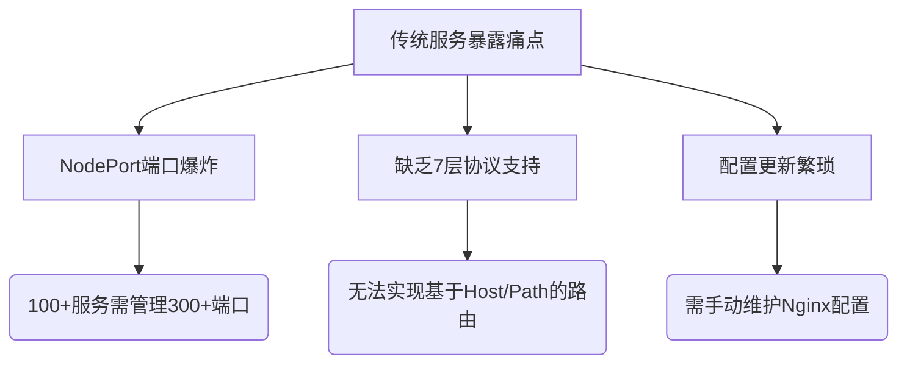
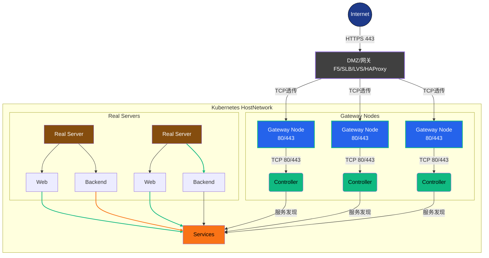

# Ingress 

## 一、Ingress 概念

### 1.1 Ingress 诞生背景

在 Kubernetes 中，传统的 Service 暴露方式（如 NodePort）存在以下局限：

- **协议支持有限**：Service 的实现方式（如 `use_space`、`iptables`、`ipvs`）仅支持 4 层协议通信，无法满足 7 层协议（如 HTTPS）的代理需求，限制了复杂应用的部署。
- **端口管理复杂**：NodePort 需要在每个节点上暴露服务端口，随着服务数量的增加，端口管理变得极其复杂且难以维护。
- **配置更新繁琐**：需手动维护反向代理（如 Nginx）的配置，效率低下。

为解决这些问题，Ingress 应运而生，提供了一种更灵活、高效的方式，用于管理外部对集群内部服务的访问。




### 1.2 Ingress 和 Ingress Controller 的区别

#### 1.2.1 Ingress 对象

Ingress 是 Kubernetes 中的一个 API 对象，通过 YAML 文件定义请求如何转发到 Service 的规则。其功能包括：

- **外部访问**：通过 HTTP 或 HTTPS 暴露 Service，为服务提供外部 URL。
- **负载均衡**：对进入的流量进行负载均衡，提高服务的可用性和性能。
- **SSL/TLS 支持**：提供加密能力，保障数据传输安全。
- **反向代理**：基于 Host 或 Path 的规则，灵活转发请求到不同的 Service。

Ingress 的配置文件包含 apiVersion、kind、metadata、spec 等关键字段。其中，spec 字段用于定义转发规则，如 tls 用于 HTTPS 配置，rule 用于指定请求的路由规则。此外，metadata.annotations 字段在 Ingress 配置中占据重要地位，不同的 Ingress Controller 可以根据 annotations 中的参数进行自定义配置。

#### 1.2.2 Ingress Controller

Ingress Controller 是具体实现反向代理和负载均衡的程序，负责解析 Ingress 定义的规则，并根据这些规则实现请求的转发。常见的 Ingress Controller 实现有：

- **GCE**：Google 云的 Ingress Controller。
- **Ingress-Nginx**：基于 Nginx 的实现，功能强大，使用广泛。
- **HAProxy**：知名的高性能反向代理软件。
- **Envoy**：功能丰富的边缘代理，支持复杂的流量管理。
- **Traefik**：高度可扩展和自动化的反向代理。

**Ingress Controller 的工作原理包括：**

1. **监控 API Server**：以 Pod 的形式运行，内部包含 Daemon 程序和反向代理程序（如 Nginx）。
2. **动态生成配置**：根据 Ingress 对象的配置生成反向代理配置文件。
3. **更新配置**：当配置变化时，重新加载程序以应用新配置。

#### 1.2.3 小结

Ingress 和 Ingress Controller 的关系类似于路由器与路由表。Ingress 对象定义了请求的转发规则，而 Ingress Controller 执行这些规则，接收外部请求并将其转发到相应的 Service。Ingress Controller 是实现流量转发的核心组件，而 Ingress 对象则是指导其操作的配置指南。

### 1.3 Ingress 介绍

Kubernetes 提供了三种暴露服务的方式：LoadBalancer Service、NodePort Service 和 Ingress。Ingress 的优势在于：

- **解决 Pod 漂移问题**：Service 提供稳定的 IP，确保外部访问的稳定性。
- **简化端口管理**：通过负载均衡器（如 Nginx）监听单一端口，根据域名或路径规则转发请求。
- **动态更新配置**：通过 Ingress 对象和 Controller 实现动态配置更新，无需手动干预。

### 1.4 Ingress Controller

Ingress Controller 的部署和配置需要考虑其运行方式和暴露方式，以确保高效和可靠。

#### 1.4.1 部署方式

1. **Deployment + LoadBalancer 模式**：适用于公有云环境，使用 LoadBalancer Service 暴露，并绑定公网地址。
2. **Deployment + NodePort 模式**：适用于固定节点的环境，使用 NodePort 暴露服务。
3. **DaemonSet + HostNetwork 模式**：在每个节点部署 Ingress Controller，优化网络性能，适合生产环境。

#### 1.4.2 工作原理

Ingress Controller 监控 Kubernetes API Server，感知 Ingress、Service、Endpoint、Secret 等资源的变化，动态生成反向代理配置并应用更新。

## 二、原理

### 2.1 Ingress Controller 工作原理

Ingress Controller 通过监视 API Server 获取相关资源的变化，动态更新反向代理配置文件，并通过 reload 应用新配置。其工作流程包括：

1. 监控 Kubernetes API Server 的 Ingress、Service、Endpoint 等资源。
2. 根据资源变化生成新的配置文件。
3. 写入反向代理服务器（如 Nginx）的配置文件。 
4. *reload* 代理服务器，使新配置生效。

### 2.2 Nginx 反向代理原理

Nginx-Ingress 根据 Ingress 规则生成配置文件，实现基于域名或路径的请求转发。其工作流程包括：

1. 监听传入请求，解析域名和路径。
2. 根据配置文件匹配规则，将请求转发到对应的 Service。
3. 动态更新配置文件以应对服务变化。

## 三、部署



流量生命周期：
1. 外部请求通过HTTPS 443进入DMZ
2. F5/SLB进行TCP层透传
3. Gateway Node完成TLS终结
4. Controller同步Ingress配置
5. Services根据路由规则进行负载均衡
6. 最终流量分发到具体Pod实例

### 3.1 部署helm

#### 3.1.1 下载 helm二进制包

```bash
wget https://get.helm.sh/helm-v3.16.3-linux-amd64.tar.gz
tar -zxvf helm-v3.16.3-linux-amd64.tar.gz
mv linux-amd64/heml /usr/local/bin/helm
```

#### 3.1.2 helm拉取ingress-nginx镜像

```bash
# 添加官方仓库
helm repo add ingress-nginx https://kubernetes.github.io/ingress-nginx

# 查询仓库列表
helm repo list

# 更新所有仓库
helm repo update

# 搜索 ingress-nginx 仓库信息
helm search repo ingress-nginx
[root@k8s-master01 ~]# helm search repo ingress-nginx
NAME                       	CHART VERSION	APP VERSION	DESCRIPTION                                       
ingress-nginx/ingress-nginx	4.12.0       	1.12.0     	Ingress controller for Kubernetes using NGINX a...

# 拉取镜像
helm pull ingress-nginx/ingress-nginx --version 4.12.0
# 解压
tar -zxvf ingress-nginx-4.12.0.tgz
```

### 3.2 部署Ingress-nginx

#### 3.2.1 修改Ingress-nginx 的集群配置文件

##### a) 下载镜像

提前下载配置文件中的国外官方镜像，或者修改名称为国内地址的镜像

```bash
vim values.yaml
#完整镜像名称拼接，共有三个镜像
image: registry.k8s.io/ingress-nginx/controller:v1.12.0
image: registry.k8s.io/ingress-nginx/kube-webhook-certgen:v1.5.0
image: registry.k8s.io/defaultbackend-amd64:1.5
---------------------------------------------------------------------------------------------------------------------
# 使用阿里云下载镜像
ctr -n k8s.io images pull registry.cn-hangzhou.aliyuncs.com/xusx/images:v1.12.0
ctr -n k8s.io images tag registry.cn-hangzhou.aliyuncs.com/xusx/images:v1.12.0 registry.k8s.io/ingress-nginx/controller:v1.12.0


ctr -n k8s.io images pull registry.cn-hangzhou.aliyuncs.com/xusx/images:v1.5.0
ctr -n k8s.io images tag registry.cn-hangzhou.aliyuncs.com/xusx/images:v1.5.0 registry.k8s.io/ingress-nginx/kube-webhook-certgen:v1.5.0


ctr -n k8s.io images pull registry.cn-hangzhou.aliyuncs.com/xusx/images:1.5
ctr -n k8s.io images tag registry.cn-hangzhou.aliyuncs.com/xusx/images:1.5 registry.k8s.io/defaultbackend-amd64:1.5
```


##### b) 镜像的 digest 值注释

```bash
sed -i 's/^\s*digest/#&/' values.yaml


[root@k8s-master01 ingress-nginx]# cat values.yaml |grep digest
#    digest: sha256:e6b8de175acda6ca913891f0f727bca4527e797d52688cbe9fec9040d6f6b6fa
#    digestChroot: sha256:87c88e1c38a6c8d4483c8f70b69e2cca49853bb3ec3124b9b1be648edf139af3
  #     digest: ""
#        digest: sha256:aaafd456bda110628b2d4ca6296f38731a3aaf0bf7581efae824a41c770a8fc4
```


**原因**：digest 值用于指定镜像的唯一哈希值，但在某些情况下，可能不需要使用 digest 值，而是直接使用标签来拉取镜像。如果使用内网镜像仓库且镜像版本与课程中不一致，可能需要注释掉 digest 值，以便正确拉取镜像。

##### c) hostNetwork 设置为 true

```bash
# 查看HostNetwork策略
grep -Ev '^\s*(#|$)' values.yaml |grep hostNetwork
  hostNetwork: false

更改为 true

sed -i 's/hostNetwork: false/hostNetwork: true/g' values.yaml
```

**原因**：

- **性能优化**：跳过 Kubernetes 的虚拟网络层，减少 NAT 转换，降低延迟。
- **端口占用**：直接绑定宿主机的 `80/443` 端口，方便外部流量直达。
- **适用场景**：适用于生产环境的高性能需求，但需确保宿主机端口未被占用。

##### d) dnsPolicy 设置为 ClusterFirstWithHostNet

```bash
controller:
  dnsPolicy: ClusterFirstWithHostNet  # 兼容 hostNetwork 的 DNS 策略
  
# 更改dnsPolicy
sed -i 's/dnsPolicy: ClusterFirst/dnsPolicy: ClusterFirstWithHostNet/g' values.yaml
```

**原因**：

- **DNS 解析兼容性**：当使用 `hostNetwork` 时，Pod 默认使用宿主机的 DNS 配置（如 `/etc/resolv.conf`），但此设置允许同时使用 Kubernetes 集群的 DNS（如 CoreDNS），解决服务发现问题。

##### e) NodeSelector 添加 ingress: "true"部署至指定节点,有三个 nodeSelector

```bash
controller:
  nodeSelector:
    ingress: "true"  # 仅部署到带此标签的节点，是字符串并非布尔值，所以需要添加双引号	
```


**原因**：

- **资源隔离**：将 Ingress Controller 固定到专用节点，避免与其他服务竞争资源。

- 部署控制：通过标签选择节点，例如：

  ```Bash
  kubectl label node <node-name> ingress=true
  ```

##### f) 类型更改为 kind: DaemonSet

```yaml
controller:
  kind: DaemonSet  # 替代默认的 Deployment
```


**原因**：

- **高可用性**：结合NodeSelector 完成符合标签的每个节点部署一个实例，避免单点故障。
- **流量均衡**：配合 `hostNetwork`，每个节点直接接收流量，无需额外负载均衡器。
- **资源消耗**：需权衡节点数量和资源占用，适合大规模集群。

##### g) 将 ingress nginx 设置为默认的 ingressClass

```Yaml
controller:
  ingressClassResource:
    name: nginx
    default: true  # 设为默认 IngressClass
```


**原因**：

- **简化配置**：创建 Ingress 资源时无需显式指定 `ingressClassName`。
- **统一入口**：确保所有未指定 Class 的 Ingress 规则由该 Controller 处理。

##### h)部署 ingress，给需要部署 ingress 的节点上打标签

```bash
# node2 节点打上标签
kubectl label node k8s-master01 ingress=true
# node2 节点删除标签(非必要)
# kubectl label node k8s-master01 ingress-
# 显示所有节点的标签
kubectl get nodes --show-labels

#去除污点
kubectl taint nodes k8s-master01 node-role.kubernetes.io/control-plane:NoSchedule-
```


#### 3.2.2 使用helm安装 Ingress-ngixn

```bash
# 创建命名空间
kubectl create ns ingress-nginx

# 安装
helm install ingress-nginx -n ingress-nginx .
# 卸载
helm uninstall ingress-nginx -n ingress-nginx
# 查看安装信息
kubectl get po -n ingress-nginx -o wide

[root@k8s-master01 ~]# kubectl get po -n ingress-nginx -o wide
NAME                             READY   STATUS    RESTARTS   AGE   IP              NODE           NOMINATED NODE   READINESS GATES
ingress-nginx-controller-v2n88   1/1     Running   0          25s   192.168.0.105   k8s-master01   <none>           <none>
```


## 四、Ingress-Nginx使用

### 4.1.Ingress-nginx 入门使用

#### 4.1.1 创建模拟环境

创建一个用于学习 Ingress 的 Namespace，之后所有的操作都在此 Namespace 进行：

```bash
kubectl create ns study-ingress
```

创建一个nginx模拟服务,并用svc进行暴露端口

```bash
kubectl create deploy nginx --image=m.daocloud.io/docker.io/library/nginx:latest -n study-ingress

# 将名为 nginx 的 Deployment 暴露为一个 Kubernetes Service，监听端口 80。
kubectl expose deploy nginx --port 80 -n study-ingress
```

创建 Ingress 指向上面创建的 Service

```yaml
vim web-ingress.yaml 
apiVersion: networking.k8s.io/v1     # 指定使用的 Kubernetes API 版本（networking.k8s.io/v1）。
kind: Ingress                       # 定义这是一个 Ingress 资源。
metadata:
  name: nginx-ingress                # Ingress 的名称。
  namespace: study-ingress            # Ingress 所在的命名空间。
spec:
  rules:
  - host: nginx.test.com              # 匹配的域名，所有请求将路由到该域名指定的后端服务。
    http:
      paths:
      - backend:                     # 定义后端服务的详细信息。
          service:                   # 指定后端服务的类型。
            name: nginx              # 后端服务的名称。
            port:                    # 后端服务的端口号。
              number: 80             # 指定后端服务的端口号为 80。
        path: /                       # 定义匹配的路径，/ 表示匹配所有请求路径。
        pathType: ImplementationSpecific # 定义路径匹配的类型，ImplementationSpecific 表示使用 Ingress Controller 的特定实现方式。
        
        
kubectl create -f  web-ingress.yaml     
```

pathType: 指定请求路径的匹配方式，决定Ingress如何将请求路由到后端服务

- **Exact**：表示只能精确匹配指定的路径。
- **Prefix**：表示匹配以指定路径开头的所有请求路径。
- **ImplementationSpecific**：表示路径匹配方式由 Ingress Controller 的具体实现决定。

#### 4.1.2 访问验证

**配置验证：**

进入ingress-nginx 容器内发现，已经自动对刚刚创建的 ingress添加了配置信息。

```bash
[root@k8s-master01 templates]# kubectl get po -n ingress-nginx
NAME                             READY   STATUS    RESTARTS       AGE
ingress-nginx-controller-v2n88   1/1     Running   8 (127m ago)   10h
[root@k8s-master01 templates]# kubectl get ingress -n study-ingress
NAME            CLASS   HOSTS            ADDRESS   PORTS   AGE
nginx-ingress   nginx   nginx.test.com             80      6m50s
[root@k8s-master01 templates]# kubectl exec -it ingress-nginx-controller-v2n88 -n ingress-nginx -- bash
k8s-master01:/etc/nginx$ grep "nginx.test.com" nginx.conf
	## start server nginx.test.com
		server_name nginx.test.com ;
	## end server nginx.test.com
```


**访问验证：**

我们的 Ingress 部署在 k8s-master-01 上面，用的是hostNetwork，所以我们本地做下hosts解析访问即可，或者使用curl 

```bash
curl -H "Host:nginx.test.com" 192.168.0.105
```


#### 4.1.3 日志查看

查看我们的前端服务日志

```bash
kubectl logs -f deploy/nginx -n study-ingress
```


------

### 4.2 域名重定向 Redirect 

在 Nginx 作为代理服务器时，Redirect 可用于域名的重定向，比如访问 old.com 被重定向到new.com。Ingress 可以更简单的实现 Redirect 功能，接下来用 nginx.redirect.com 作为旧域名，baidu.com 作为新域名进行演示：

在实际工作中也是比较常用的，比如公司某域名决定不再使用更换为新域名，但是旧域名仍然有用户访问，那么我们可以设置域名重定向，等到一段时间后，旧的域名彻底没有用户访问的时候，我们在完全抛弃。

**[官方详细介绍文档](https://kubernetes.github.io/ingress-nginx/user-guide/nginx-configuration/annotations/)**

```yaml
vim redirect.yaml 

apiVersion: networking.k8s.io/v1  # API版本
kind: Ingress  # 资源类型：Ingress
metadata:
  annotations:
    nginx.ingress.kubernetes.io/permanent-redirect: https://www.baidu.com  # 永久重定向到百度
    #nginx.ingress.kubernetes.io/permanent-redirect-code: '301'  # 可选：设置重定向状态码
  name: nginx-redirect  # 资源名称
  namespace: study-ingress  # 所在命名空间
spec:
  rules:  # 路由规则
    - host: nginx.old.com  # 匹配的域名
      http:
        paths:
          - backend:
              service:
                name: nginx  # 后端服务名称
                port:
                  number: 80  # 后端服务端口
            path: /  # 匹配所有路径
            pathType: ImplementationSpecific  # 路径匹配类型
```

**`nginx.ingress.kubernetes.io/permanent-redirect`**

- 这个注解指示 Nginx Ingress 控制器将所有匹配到的请求永久重定向到 `https://www.baidu.com`。如果你希望返回不同的状态码（比如 `302` 临时重定向），你可以使用 `nginx.ingress.kubernetes.io/permanent-redirect-code` 来设置状态码。

```bash
kubectl create -f redirect.yaml 

curl -I -H "Host:nginx.old.com" 192.168.0.105
```


### 4.3 前后端分离 Rewrite 

现代 Web 应用中，前端和后端通常会分别托管在不同的服务中，并且使用不同的路径来访问。前端应用通常通过域名根路径（`/`）进行访问，而后端服务则使用类似 `/api-a`、`/api-b` 或 `/api/payapi` 这样的路径来提供 API 服务。然而，实际开发过程中，前端和后端可能会共享相同的根路径 `/`，这时就需要通过代理和路径重写来区分它们。

例如，假设后端服务没有单独的路径规则，而是默认使用 `/` 路径提供服务。在这种情况下，当前端和后端都使用相同的路径（如 `/`）时，我们就需要通过路径重写将请求重定向到不同的服务。Nginx Ingress 控制器提供了很好的路径重写功能，可以通过配置将访问 `/api-a` 的请求转发到后端的根路径 `/` 上，从而完成请求的正确转发。


这个在ingress-nginx中是很好实现的效果，通过Rewrite 重写地址，将用户要访问的/api-a 转发到后端的 / 路径上即可完成服务的访问

#### 4.3.1 创建模拟环境

创建一个应用模拟后端服务并暴露服务端口

```bash
kubectl create deploy backend-api --image=registry.cn-beijing.aliyuncs.com/dotbalo/nginx:backend-api -n study-ingress

kubectl expose deploy backend-api --port 80 -n study-ingress
```

查看svc的IP，访问测试

```bash
kubectl get svc,deploy -n study-ingress
curl 10.96.126.118/api-a
```


通过 Ingress Nginx 的 Rewrite 功能，将/api-a 重写为“/”，配置示例如下：
```yaml
vim rewrite.yaml

apiVersion: networking.k8s.io/v1  # 指定 Kubernetes 网络资源 API 版本
kind: Ingress  # 定义资源类型为 Ingress
metadata:
  annotations:
    nginx.ingress.kubernetes.io/rewrite-target: /$2  # Nginx 路径重写规则，将/api-a替换为/
  name: backend-api  # Ingress 名称
  namespace: study-ingress  # 所属命名空间
spec:
  rules:
    - host: nginx.test.com  # 请求主机名为 nginx.test.com
      http:
        paths:
          - backend:  # 请求转发到后端服务
              service:
                name: backend-api  # 后端服务名称
                port:
                  number: 80  # 后端服务端口
            path: /api-a(/|$)(.*)  # 匹配所有 `/api-a` 或 `/api-a/` 后的请求路径，交给annotations进行重写
            pathType: ImplementationSpecific  # 使用 Ingress 控制器特定的路径匹配
```

- `nginx.ingress.kubernetes.io/rewrite-target: /\$2`：重写规则，将 `/api-a` 转发为 `/`，并保留 `/api-a` 后的路径部分（通过 `\$2` 捕获组）。
- `path: /api-a(/|$)(.*)`：匹配所有 `/api-a` 或 `/api-a/` 后的请求路径。

#### 4.3.2 访问验证

```bash
[root@k8s-master01 templates]# kubectl create -f rewrite.yaml 
ingress.networking.k8s.io/backend-api created
```

 再次访问 nginx.test.com/api-a 即可访问到后端服务：

访问成功到后面页面，那么这样就完成了前端页面和后端页面的分离


### 4.4 错误代码重定向 

#### 4.4.1 通过 Helm 进行更改

修改 values.yaml ，更新 ConfigMap：


```yaml
  config: 
    apiVersion: v1
    client_max_body_size: 20m
    custom-http-errors: "404,415,503"
```


更新 Release, 更新后 Pod 会自动重启，并且会创建一个 defaultbackend：

```bash
helm upgrade ingress-nginx -n ingress-nginx .

[root@k8s-master01 ingress-nginx]# kubectl get po -n ingress-nginx
NAME                                           READY   STATUS    RESTARTS   AGE
ingress-nginx-controller-lzn4w                 1/1     Running   0          14m
ingress-nginx-defaultbackend-98848f6d7-jljqt   1/1     Running   0          14m
```

#### 4.4.2 访问验证

更新完成以后访问一个不存在的页面，比如之前定义的 nginx.test.com。访问一个不存在的页面 123，就会跳转到 Error Server 中的页面：


### 4.5 匹配请求头 

#### 4.5.1 创建模拟环境

部署移动端应用：

```bash
kubectl create deploy phone --image=registry.cn-beijing.aliyuncs.com/dotbalo/nginx:phone -n study-ingress

kubectl expose deploy phone --port 80 -n study-ingress

kubectl create ingress phone --rule=m.test.com/*=phone:80 -n study-ingress
```

部署电脑端应用：

```bash
kubectl create deploy laptop --image=registry.cnbeijing.aliyuncs.com/dotbalo/nginx:laptop -n study-ingress

kubectl expose deploy laptop --port 80 -n study-ingress

kubectl get po -n study-ingress -l app=laptop
```

创建电脑端的 Ingress，注意 Ingress annotations 的 nginx.ingress.kubernetes.io/serversnippet 配置。Snippet 配置是专门用于一些复杂的 Nginx 配置，和 Nginx 配置通用。匹配移动端
实例如下：

```yaml
# vim laptop-ingress.yaml
apiVersion: networking.k8s.io/v1  # 指定Kubernetes API版本
kind: Ingress                     # 资源类型为Ingress
metadata:
  annotations:                    # 注解配置区域
    nginx.ingress.kubernetes.io/server-snippet: |  # 注入自定义Nginx配置片段
      set $agentflag 0;          # 定义变量用于设备检测
      if ($http_user_agent ~* "(Android|iPhone|Windows Phone|UC|Kindle)" ){  # 正则匹配移动设备UA
        set $agentflag 1;        # 检测到移动设备时设置标记
      }
      if ( $agentflag = 1 ) {    # 判断设备标记
        return 301 http://m.test.com;  # 执行301重定向到移动端域名
      }
  name: laptop                   # Ingress资源名称
  namespace: study-ingress      # 所属命名空间
spec:
  ingressClassName: nginx		 # 指定使用nginx类型的Ingress控制器 
  rules:                         # 路由规则定义
  - host: test.com               # 匹配的域名
    http:
      paths:
      - backend:                 # 后端服务配置
          service:
            name: laptop         # 关联的Service名称
            port:
              number: 80         # Service暴露的端口
        path: /                  # 匹配根路径
        pathType: ImplementationSpecific  # 路径匹配方式（由Ingress控制器实现决定）
```

**主要功能说明：**

1. 设备检测重定向：通过 Nginx 的`$http_user_agent`检测移动端设备，自动跳转到移动端域名
2. 基础路由配置：将所有`test.com`域名的请求路由到`laptop`服务的 80 端口
3. 使用`ImplementationSpecific`路径类型，由 Ingress 控制器决定具体匹配逻辑

#### 4.5.2 访问验证

验证方法：

```bash
# 桌面端访问测试
curl -H "Host: test.com" http://192.168.0.105/

# 移动端模拟访问
curl -A "iPhone" -H "Host: test.com" http://192.168.0.105/ -I
# 应返回301重定向到m.test.com
```


以下是基于你提供的参考内容，为你的 Ingress 文档新增的“4.6 金丝雀发布和灰度发布”部分。我已将其整理为与现有文档风格一致的格式，并确保内容清晰、逻辑连贯。如果需要进一步调整，请告诉我！

---

### 4.6 金丝雀发布和灰度发布

#### 🦜金丝雀发布（Canary Release）介绍

金丝雀发布的名字来源于矿井中的“金丝雀预警”：矿工们会带一只金丝雀下矿井，如果有毒气，金丝雀会先死掉，从而警告矿工们撤离。在软件开发中，金丝雀发布是一种逐步部署新版本的策略，目的是在小范围内测试新功能或更新，降低风险。

- **怎么做**：新版本的代码或功能先部署到一小部分用户或服务器上（比如1%的用户或几台服务器），而其他用户仍然使用旧版本。
- **目的**：通过监控这部分“小白鼠”的使用情况（如错误率、性能指标等），来判断新版本是否稳定。
- **如果成功**：逐步扩大部署范围，最终覆盖所有用户。
- **如果失败**：快速回滚到旧版本，避免影响大多数用户。

**例子**：假设你开发了一个网站，新版本加了个功能。你先让1%的用户看到新版本，观察24小时。如果没问题，就推广到10%、50%，最后100%。

#### 📖灰度发布（Grayscale Release）介绍

灰度发布和金丝雀发布有相似之处，但侧重点稍有不同。灰度发布更强调“用户分层”或“逐步放量”，是一种更广义的控制性发布方式。

- **怎么做**：将新版本逐步推送给特定用户群体（比如按地区、设备类型、用户ID等），而不是一次性推送给所有人。
- **目的**：通过控制变量，观察新版本在不同人群中的表现，同时减少潜在问题的影响范围。
- **特点**：通常会结合A/B测试，比较新旧版本的效果（比如转化率、用户体验等）。
- **灵活性**：可以根据需求调整推送比例，比如先给10%用户，再给30%，最后100%。

**例子**：一个手机App更新了界面设计，先推送给安卓用户测试，确认没问题后再推给iOS用户，或者先推给某个城市的用户。

**两者的区别**

- **范围**：金丝雀发布更像是灰度发布的一种具体实现方式，通常规模更小、更早期。
- **目标**：金丝雀发布更关注“稳定性测试”，灰度发布可能还包括“效果验证”（如用户满意度）。
- **术语使用**：在实际中，这两个词有时会被混用，但核心都是“逐步部署、降低风险”。


金丝雀发布（Canary Release）和灰度发布（Grayscale Release）是现代软件部署中常用的策略，用于在不影响所有用户的情况下逐步验证新版本的稳定性。Nginx Ingress 控制器通过其灵活的配置（如 `canary` 注解）支持这种发布方式。本节将通过创建 v1 和 v2 版本的服务，演示如何使用 Ingress-Nginx 实现金丝雀发布，并将部分流量切入新版本进行测试。

---

#### 4.6.1 创建 v1 版本（生产环境）

首先创建一个模拟生产环境的 Namespace 和服务，用于部署 v1 版本的应用。

```bash
# 创建生产环境的 Namespace
kubectl create ns production

# 创建 v1 版本的 Deployment
kubectl create deploy canary-v1 --image=registry.cn-beijing.aliyuncs.com/dotbalo/canary:v1 -n production

# 暴露 v1 版本的服务端口
kubectl expose deploy canary-v1 --port 8080 -n production
```

创建 Ingress 资源，将流量路由到 v1 版本的服务：

```yaml
vim canary-v1.yaml

apiVersion: networking.k8s.io/v1  # 指定 Kubernetes API 版本，这里是 Ingress 的 v1 版本
kind: Ingress                     # 资源类型，这里是 Ingress，用于管理外部访问流量
metadata:
  name: canary-v1                 # Ingress 资源的名称
  namespace: production           # 资源所在的命名空间，这里是 production
spec:                             # 定义 Ingress 的具体配置
  rules:                          # 路由规则列表
  - host: canary.test.com         # 指定域名，只有访问这个域名时才会应用下面的规则
    http:                         # HTTP 协议的配置
      paths:                      # 路径规则列表
      - backend:                  # 定义后端服务
          service:                # 指定目标服务
            name: canary-v1       # 后端服务的名称，这里是 canary-v1
            port:                 # 服务端口配置
              number: 8080        # 服务监听的端口号，这里是 8080
        path: /                   # 匹配的路径，这里是根路径
        pathType: ImplementationSpecific  # 路径匹配类型，ImplementationSpecific 表示由具体实现（如 Ingress Controller）决定匹配方式

kubectl create -f canary-v1.yaml
```

**访问验证：**

通过配置本地 hosts 文件或使用 curl 访问 `canary.test.com`，即可看到 v1 版本的页面。例如：

```bash
curl -H "Host:canary.test.com" <k8s-master-ip>
```

返回内容应为 `<h1>Canary v1</h1>`。

#### 4.6.2 创建 v2 版本（金丝雀环境）

接下来创建一个 v2 版本，模拟金丝雀环境，用于测试新版本。

```bash
# 创建金丝雀环境的 Namespace
kubectl create ns canary

# 创建 v2 版本的 Deployment
kubectl create deploy canary-v2 --image=registry.cn-beijing.aliyuncs.com/dotbalo/canary:v2 -n canary

# 暴露 v2 版本的服务端口
kubectl expose deploy canary-v2 --port 8080 -n canary
```

**访问验证：**

检查 v2 版本的 Service 是否正常运行：

```bash
kubectl get svc -n canary
# 示例输出：
# NAME       TYPE        CLUSTER-IP       EXTERNAL-IP   PORT(S)    AGE
# canary-v2  ClusterIP   192.168.181.120  <none>        8080/TCP   2m

curl 192.168.181.120:8080
```

返回内容应为 `<h1>Canary v2</h1>`。

#### 4.6.3 配置金丝雀发布（流量切分）

为了将部分流量切入 v2 版本，我们需要为 v2 创建一个带有金丝雀配置的 Ingress 资源。Nginx Ingress 提供了 `nginx.ingress.kubernetes.io/canary` 和 `nginx.ingress.kubernetes.io/canary-weight` 注解，用于指定金丝雀环境和流量权重。

```yaml
vim canary-v2.yaml

apiVersion: networking.k8s.io/v1
kind: Ingress
metadata:
  annotations:
    nginx.ingress.kubernetes.io/canary: "true"         # 标记为金丝雀环境
    nginx.ingress.kubernetes.io/canary-weight: "10"    # 分配 10% 流量到 v2
  name: canary-v2
  namespace: canary
spec:
  rules:
  - host: canary.test.com
    http:
      paths:
      - backend:
          service:
            name: canary-v2
            port:
              number: 8080
        path: /
        pathType: ImplementationSpecific

kubectl create -f canary-v2.yaml
```

- **`nginx.ingress.kubernetes.io/canary: "true"`**：标记该 Ingress 为金丝雀环境。
- **`nginx.ingress.kubernetes.io/canary-weight: "10"`**：将 10% 的流量分配给 v2 版本，剩余 90% 继续路由到 v1 版本（即 v1:v2 = 9:1）。

#### 4.6.4 测试金丝雀发布

为了验证流量分配是否符合预期，可以使用脚本模拟多次请求并统计 v1 和 v2 的访问比例。以下是一个简单的 Ruby 脚本示例：

```ruby
# vim test-canary.rb

counts = Hash.new(0)
100.times do
  output = `curl -s -H "Host:canary.test.com" <k8s-master-ip> | grep 'Canary' | awk '{print $2}' | awk -F"<" '{print $1}'`
  counts[output.strip.split.last] += 1
end
puts counts
```

**运行测试：**

1. 安装 Ruby（如果未安装）：
   ```bash
   yum install ruby -y
   ```

2. 执行脚本并观察结果：
   ```bash
   ruby test-canary.rb
   ```

   示例输出：
   ```
   {"v1"=>90, "v2"=>10}
   {"v1"=>92, "v2"=>8}
   {"v1"=>91, "v2"=>9}
   ```

结果显示流量大致按 9:1 的比例分配，符合 `canary-weight: "10"` 的配置。

#### 4.6.5 注意事项

- **调整流量权重**：通过修改 `nginx.ingress.kubernetes.io/canary-weight` 的值（如从 "10" 调整为 "50"），可以逐步增加 v2 版本的流量，最终实现完全切换。
- **回滚**：如果 v2 版本出现问题，只需删除 `canary-v2.yaml` 的 Ingress 资源，所有流量将自动回滚到 v1。
- **其他金丝雀策略**：除了基于权重的流量分配，Nginx Ingress 还支持基于请求头、Cookie 等条件的金丝雀发布，具体可参考[官方文档](https://kubernetes.github.io/ingress-nginx/user-guide/nginx-configuration/annotations/)。

---


## 五、环境清理

测试无误后，可以清理之前的学习数据：
```bash
kubectl delete deploy,svc,ingress -n production --all

kubectl delete deploy,svc,ingress -n canary --all

kubectl delete deploy,svc,ingress -n study-ingress --all

kubectl delete ns study-ingress production canary
```


