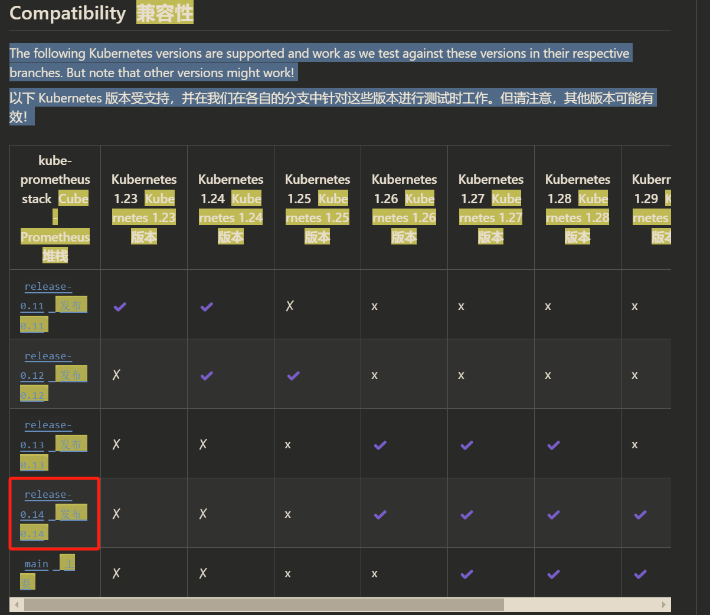
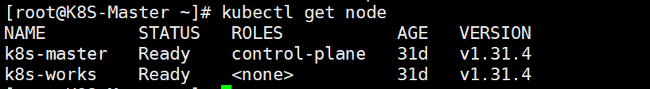
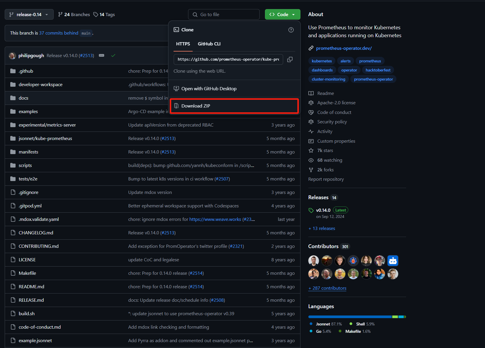

# Prometheus stack安装

1.打开


Kube-Prometheus 项目地址： `https://github.com/prometheus-operator/kube-prometheus/`



首先需要通过该项目地址，找到和自己 Kubernetes 版本对应的 Kube Prometheus Stack 的版本：`https://github.com/prometheus-operator/kube-prometheus.git`



```bash
git clone -b release-0.14 https://github.com/prometheus-operator/kubeprometheus.git
cd kube-prometheus/manifests
```

如果服务器无法下载，可以手工上传离线包



### 安装普罗米修斯技术栈

解压压缩包

```bash
unzip kube-prometheus-release-0.14.zip
cd kube-prometheus-release-0.14
```

#### 修改镜像

查看当前yaml中默认镜像

```bash
cd kube-prometheus-release-0.14/manifests/
grep -H "image:" * 
alertmanager-alertmanager.yaml:  image: quay.io/prometheus/alertmanager:v0.27.0
blackboxExporter-deployment.yaml:        image: quay.io/prometheus/blackbox-exporter:v0.25.0
blackboxExporter-deployment.yaml:        image: ghcr.io/jimmidyson/configmap-reload:v0.13.1
blackboxExporter-deployment.yaml:        image: quay.io/brancz/kube-rbac-proxy:v0.18.1
grafana-deployment.yaml:        image: grafana/grafana:11.2.0
kubeStateMetrics-deployment.yaml:        image: registry.k8s.io/kube-state-metrics/kube-state-metrics:v2.13.0
kubeStateMetrics-deployment.yaml:        image: quay.io/brancz/kube-rbac-proxy:v0.18.1
kubeStateMetrics-deployment.yaml:        image: quay.io/brancz/kube-rbac-proxy:v0.18.1
nodeExporter-daemonset.yaml:        image: quay.io/prometheus/node-exporter:v1.8.2
nodeExporter-daemonset.yaml:        image: quay.io/brancz/kube-rbac-proxy:v0.18.1
prometheusAdapter-deployment.yaml:        image: registry.k8s.io/prometheus-adapter/prometheus-adapter:v0.12.0
prometheusOperator-deployment.yaml:        image: quay.io/prometheus-operator/prometheus-operator:v0.76.2
prometheusOperator-deployment.yaml:        image: quay.io/brancz/kube-rbac-proxy:v0.18.1
prometheus-prometheus.yaml:  image: quay.io/prometheus/prometheus:v2.54.1
grep: setup: Is a directory
```

镜像域名前添加m.daocloud.io/ 无域名添加m.daocloud.io/docker.io/

```bash
sed -i 's|image: \([^ ]*\)|image: m.daocloud.io/\1|' *.yaml

[root@K8S-Master manifests]# grep -H "image:" *
alertmanager-alertmanager.yaml:  image: m.daocloud.io/quay.io/prometheus/alertmanager:v0.27.0
blackboxExporter-deployment.yaml:        image: m.daocloud.io/quay.io/prometheus/blackbox-exporter:v0.25.0
blackboxExporter-deployment.yaml:        image: m.daocloud.io/ghcr.io/jimmidyson/configmap-reload:v0.13.1
blackboxExporter-deployment.yaml:        image: m.daocloud.io/quay.io/brancz/kube-rbac-proxy:v0.18.1
grafana-deployment.yaml:        image: m.daocloud.io/docker.io/grafana/grafana:11.2.0    # 修改为m.daocloud.io/docker.io/
kubeStateMetrics-deployment.yaml:        image: m.daocloud.io/registry.k8s.io/kube-state-metrics/kube-state-metrics:v2.13.0
kubeStateMetrics-deployment.yaml:        image: m.daocloud.io/quay.io/brancz/kube-rbac-proxy:v0.18.1
kubeStateMetrics-deployment.yaml:        image: m.daocloud.io/quay.io/brancz/kube-rbac-proxy:v0.18.1
nodeExporter-daemonset.yaml:        image: m.daocloud.io/quay.io/prometheus/node-exporter:v1.8.2
nodeExporter-daemonset.yaml:        image: m.daocloud.io/quay.io/brancz/kube-rbac-proxy:v0.18.1
prometheusAdapter-deployment.yaml:        image: m.daocloud.io/registry.k8s.io/prometheus-adapter/prometheus-adapter:v0.12.0
prometheusOperator-deployment.yaml:        image: m.daocloud.io/quay.io/prometheus-operator/prometheus-operator:v0.76.2
prometheusOperator-deployment.yaml:        image: m.daocloud.io/quay.io/brancz/kube-rbac-proxy:v0.18.1
prometheus-prometheus.yaml:  image: m.daocloud.io/quay.io/prometheus/prometheus:v2.54.1
```

#### 修改配置参数

```bash
# 可以根据实际需求进行副本数更改
[root@K8S-Master manifests]# grep -H replicas: *.yaml 
alertmanager-alertmanager.yaml:  replicas: 3
blackboxExporter-deployment.yaml:  replicas: 1
grafana-deployment.yaml:  replicas: 1
kubeStateMetrics-deployment.yaml:  replicas: 1
prometheusAdapter-deployment.yaml:  replicas: 2
prometheusOperator-deployment.yaml:  replicas: 1
prometheus-prometheus.yaml:  replicas: 2
```

#### 安装 Prometheus Operator：  

```bash
kubectl apply --server-side -f manifests/setup

kubectl wait \
	--for condition=Established \
	--all CukustomResourceDefinition \
	--namespace=monitoring

kubectl apply -f manifests/
```

#### 卸载技术栈

```bash
kubectl delete --ignore-not-found=true -f manifests/ -f manifests/setup
```


