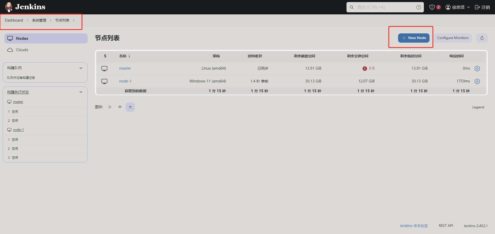
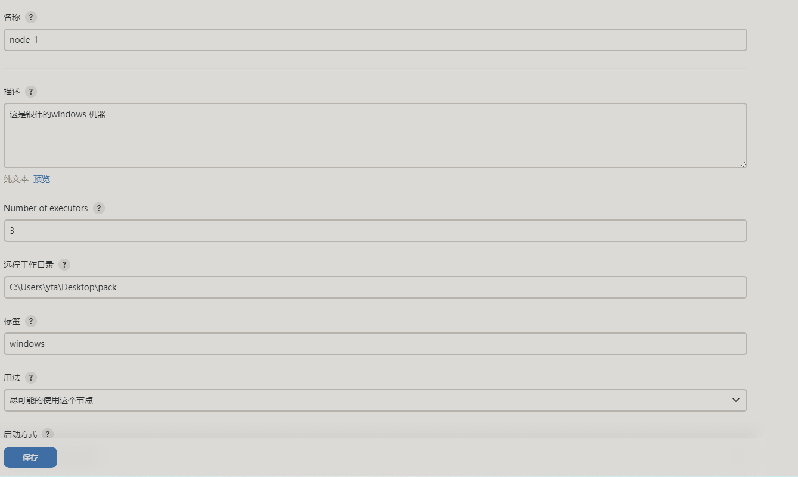
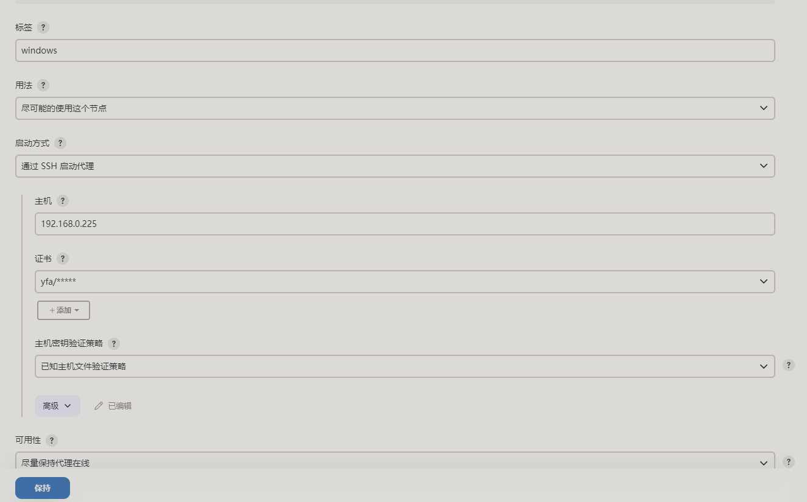
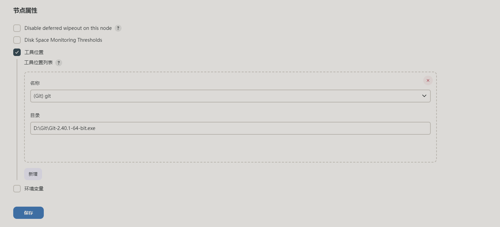
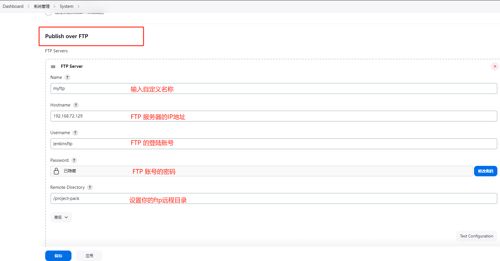
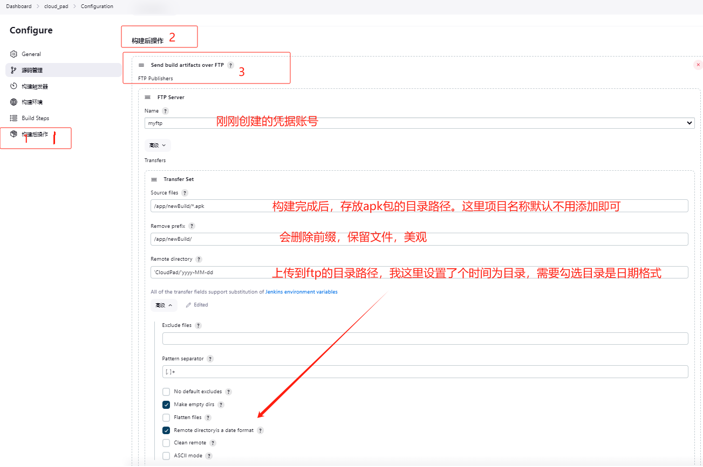

# Jenkins

## 部署

### 1.配置基础环境，安装docker

```shell
yum install -y yum-utils device-mapper-persistent-data lvm2
yum-config-manager --add-repo https://mirrors.aliyun.com/docker-ce/linux/centos/docker-ce.repo
sed -i 's+download.docker.com+mirrors.aliyun.com/docker-ce+' /etc/yum.repos.d/docker-ce.repo
yum makecache fast

selinuxdefcon 0
sed -i 's/SELINUX=enforcing/SELINUX=disabled/g' /etc/selinux/config
if egrep "7.[0-9]" /etc/redhat-release &>/dev/null; then
    systemctl stop firewalld
    systemctl disable firewalld
fi
yum install -y iptables-services vim lrzsz zip wget net-tools unzip wget
systemctl enable iptables --now

yum -y install docker-ce
systemctl start docker &&systemctl enable docker

mkdir -p /etc/docker
tee /etc/docker/daemon.json <<-'EOF'
{
  "registry-mirrors": ["https://zd29wsn0.mirror.aliyuncs.com"]
}
EOF
systemctl daemon-reload
systemctl restart 

if ! grep HISTTIMEFORMAT /etc/bashrc; then
    echo 'export HISTTIMEFORMAT="%F %T `whoami` "' >> /etc/bashrc
fi
if ! grep "* soft nofile 65535" /etc/security/limits.conf &>/dev/null; then
    cat >> /etc/security/limits.conf << EOF
    * soft nofile 65535
    * hard nofile 65535
EOF
fi
cat >> /etc/sysctl.conf << EOF
net.ipv4.tcp_syncookies = 1
net.ipv4.tcp_max_tw_buckets = 20480
net.ipv4.tcp_max_syn_backlog = 20480
net.core.netdev_max_backlog = 262144
net.ipv4.tcp_fin_timeout = 20
EOF
echo "0" > /proc/sys/vm/swappiness
sed -i '/SELINUX/{s/permissive/disabled/}' /etc/selinux/config
setenforce 0
```

### 2.安装docker-compose

```shell
curl -L "https://github.com/docker/compose/releases/download/1.29.2/docker-compose-$(uname -s)-$(uname -m)" -o /usr/local/bin/docker-compose
chmod +x /usr/local/bin/docker-compose
ln -s /usr/local/bin/docker-compose /usr/bin/docker-compose
docker-compose --version
```

### 3.编写jenkins的compose.yaml文件

```yaml
cat >jenkins-compose.yaml <<EOF
version: '3.8'
services:
  jenkins:
    # lts 表示长期支持版本。
    # image: jenkins
    image: jenkins/jenkins:lts
    # web 端口为8080,代理端口为50000
    ports:
      - "8080:8080"  # Jenkins web interface
      - "50000:50000"  # Jenkins agents
    container_name: jenkins
    volumes:
      - jenkins_data:/var/jenkins_home  # Jenkins data volume
      - jenkins_backup:/var/jenkins_backup  # Jenkins backup volume
      - tools_path:/opt/tools	# 后期存放一些插件环境
    # 设置重启规则，除非手工停止，否则一直保持启动状态
    restart: unless-stopped  # Auto-restart unless manually stopped

volumes:
  jenkins_data:
  jenkins_backup:
  tools_path:
EOF
```

#### 3.1）语法解释

```shell
# 声明 volumes 的好处 将数据卷的声明与服务的配置分开，使得文件结构更加清晰，方便阅读和维护。拥有可重用性

# 如果要查看有哪些 volume，可以适用这个命令
[root@hecs-131633 ~]# docker volume ls
DRIVER    VOLUME NAME
local     composes_jenkins_backup
local     composes_jenkins_data

# 查看 volume 详细信息
docker volume inspect composes_jenkins_data
[
    {
        "CreatedAt": "2024-04-17T15:30:44+08:00",
        "Driver": "local",
        "Labels": {
            "com.docker.compose.project": "composes",
            "com.docker.compose.version": "1.29.2",
            "com.docker.compose.volume": "jenkins_data"
        },
        "Mountpoint": "/var/lib/docker/volumes/composes_jenkins_data/_data",
        "Name": "composes_jenkins_data",
        "Options": null,
        "Scope": "local"
    }
]
```

### 4.启动和关闭  jenkins 操作

```shell
# 语法格式
docker-compose -f compose.yaml 【文件路径，比如 /opt/composes/jenkins-compose.yaml】 up -d【动作】
# 用于首次启动服务。如果服务的容器尚未创建，up 命令会创建并启动容器
docker-compose -f jenkins-compose.yaml up -d

# 用于启动已经存在但是被停止的容器。它不会重新创建容器，也不会应用配置的更新
docker-compose -f jenkins-compose.yaml start

# 用于停止容器
docker-compose -f jenkins-compose.yaml stop

# 查看 docker-compose 中管理容器的状态
docker-compose -f jenkins-compose.yaml ps
       Name                     Command               State                                       Ports                                    
--------------------------------------------------------------------------------------------------------------------------------
composes_jenkins_1   /usr/bin/tini -- /usr/loca ...   Up     			 		0.0.0.0:50000->50000/tcp,:::50000->50000/tcp                               
                                                            					0.0.0.0:8080->8080/tcp,:::8080->8080/tcp   
```

### 5.访问jenkins web

访问地址是

`http://ip:8080`

**首次访问jenkins web界面时，需要输入密码。获取密码的指令如下：**

```shell
docker exec -it jenkins cat /var/jenkins_home/secrets/initialAdminPassword
6cf1fcda25de433cbac895563b4aad0d
```

### 6.下载 Git 和 Maven 

使用自动化流水线工具需要再 jenkins 服务器上安装 这两个插件，以用来拉取代码和进行打包构建

```bash
yum install -y git maven
which git
which git
```

## 配置维护

### 1.设置 Jenkins 插件代理地址

#### 1.1）通过 Jenkins 界面设置

1. 登录到您的 Jenkins 界面。

2. 导航到 **Manage Jenkins** > **Manage Plugins** > **Advanced**。

3. 在 **Updates** 部分，找到 **Update Site** 输入框。

4. 替换现有的更新站点 URL 为国内镜像站点的 URL。例如：

   ```
   https://mirrors.tuna.tsinghua.edu.cn/jenkins/updates/update-center.json
   http://mirror.esuni.jp/jenkins/updates/update-center.json
   https://mirrors.aliyun.com/jenkins/updates/update-center.json
   ```

#### 1.2）通过 Linux 终端修改配置文件设置

1.查看容器存储卷，找到关联的目录位置

```bash
[root@localhost opt]# docker inspect jenkins|grep -A 15 Mounts 
        "Mounts": [
            {
                "Type": "volume",
                "Name": "compose_jenkins_backup",
                "Source": "/var/lib/docker/volumes/compose_jenkins_backup/_data",
                "Destination": "/var/jenkins_backup",
                "Driver": "local",
                "Mode": "rw",
                "RW": true,
                "Propagation": ""
            },
            {
                "Type": "volume",
                "Name": "compose_jenkins_data",
                "Source": "/var/lib/docker/volumes/compose_jenkins_data/_data",
                "Destination": "/var/jenkins_home",
```

2.修改配置 hudson.model.UpdateCenter.xml

```xml
vim /var/lib/docker/volumes/compose_jenkins_data/_data/hudson.model.UpdateCenter.xml
<?xml version='1.1' encoding='UTF-8'?>
<sites>
  <site>
    <id>default</id>
    <url>   https://mirrors.tuna.tsinghua.edu.cn/jenkins/updates/update-center.json</url>		#更换为清华源地址
  </site>
</sites>
```

3.保存文件并重启 Jenkins 服务来应用更改

```bash
# 通过compose.yaml文件停止 jenkins 容器
[root@localhost composes]# docker-compose -f jenkins-compose.yaml stop
Stopping jenkins ... done
[root@localhost composes]# docker-compose -f jenkins-compose.yaml start
Starting jenkins ... done
[root@localhost composes]# docker-compose -f jenkins-compose.yaml ps
 Name                Command               State                                           Ports                                         
-----------------------------------------------------------------------------------------------------------------------------------------
jenkins   /sbin/tini -- /usr/local/b ...   Up      0.0.0.0:50000->50000/tcp,:::50000->50000/tcp, 0.0.0.0:8080->8080/tcp,:::8080->8080/tcp
```

### 2.安装插件

```
Blue Ocean						 https://plugins.jenkins.io/blueocean
Git								https://plugins.jenkins.io/git/
Build Pipeline					 https://plugins.jenkins.io/build-pipeline-plugin
Rebuilder						 https://plugins.jenkins.io/rebuild
Maven							https://plugins.jenkins.io/maven-plugin
Gradle 							 
SSH Agent
SSH Plugin
```

#### 2.1)  Gradle 环境安装

1.下载 gradle 所需版本的文件

```shell
mkdir /opt/gradle
wget -P /opt/gradle https://services.gradle.org/distributions/gradle-7.2-bin.zip \
https://services.gradle.org/distributions/gradle-7.4.1-bin.zip \
https://services.gradle.org/distributions/gradle-7.5-bin.zip \
https://services.gradle.org/distributions/gradle-7.6-bin.zip
```

2查看 tools 数据卷的目录位置，将下载的 gradle文件 上传

```bash
[root@jenkins _data]# docker volume ls
DRIVER    VOLUME NAME
local     composes_tools_path
local     composes_jenkins_backup
local     composes_jenkins_data
[root@jenkins _data]# docker volume inspect composes_tools_path
[
    {
        "CreatedAt": "2024-04-21T22:56:50-04:00",
        "Driver": "local",
        "Labels": {
            "com.docker.compose.project": "composes",
            "com.docker.compose.version": "1.29.2",
[root@jenkins _data]# mv /opt/gradle/* /var/lib/docker/volumes/composes_tools_path/_data
[root@jenkins _data]# ll /var/lib/docker/volumes/composes_tools_path/_data
total 0
drwxr-xr-x. 5 root root 85 Feb  1  1980 gradle-7.2
drwxr-xr-x. 5 root root 85 Feb  1  1980 gradle-7.4.1
drwxr-xr-x. 5 root root 85 Feb  1  1980 gradle-7.5
drwxr-xr-x. 5 root root 85 Feb  1  1980 gradle-7.6

在 Jenkins web 界面上设置 gradle 的目录位置为 /opt/tools/gradle-7.2 即可
```

#### 2.2) SDK 环境安装

1.下载SDK软件包 `https://dl.google.com/android/repository/sdk-tools-linux-4333796.zip`

2.解压并映射到 jenkins 容器内

```shell
[root@jenkins tools]#  wget https://dl.google.com/android/repository/sdk-tools-linux-4333796.zip
[root@jenkins tools]# cp sdk-tools-linux-4333796.zip /var/lib/docker/volumes/composes_tools_path/_data
[root@jenkins _data]# unzip sdk-tools-linux-4333796.zip -d android-sdk
[root@jenkins android-sdk]# cd android-sdk
[root@jenkins android-sdk]# ls
 tools
[root@jenkins android-sdk]# cd tools/bin
[root@jenkins opt]# ./sdkmanager "build-tools;28.0.2" "platforms;android-27" "platform-tools" "ndk-bundle" "extras;android;m2repository" "extras;google;m2repository" "extras;m2repository;com;android;support;constraint;constraint-layout;1.0.2" "tools"

# 给jenkins 用户授权sdk
[root@jenkins bin]# docker exec -it -uroot jenkins bash
root@26cdd305980b:/# cd /opt/tools
root@26cdd305980b:/opt/tools# chown -R jenkins:jenkins /opt/tools
```

3.web视图中选择左边系统管理 点击系统配置，在全局属性中配置SDK

key:`ANDROID_HOME`

值:`/opt/tools/android-sdk`


## Jenkis 更新

在有些时候版本太旧，很多插件已经不支持的时候。我们需要通过更新来解决，以避免程序太老，存在程序漏洞，对生产有一定的危险

可以从官网下载新版本的jenkins 软件包，上传到服务器上，通过使用dockerfile 来对镜像进行修改。

[**官网升级地址**](https://www.jenkins.io/doc/book/installing/linux/#red-hat-centos ),有讲解操作步骤。

```dockerfile
vim  Dockerfile 
#使用 jenkins/jenkins:lts 镜像作为基础镜像
FROM jenkins/jenkins:lts

USER root
# 删除原有的 jenkins.war
RUN rm /usr/share/jenkins/jenkins.war

# 将宿主机的 jenkins.war 文件复制到镜像中的相应位置
COPY jenkins.war /usr/share/jenkins/jenkins.war

# 为了保证 jenkins.war 文件在容器中拥有正确的权限
RUN chown jenkins:jenkins /usr/share/jenkins/jenkins.war
USER jenkins

# 暴露 Jenkins Web 接口和代理端口
EXPOSE 8080 50000

# 当容器启动时运行 Jenkins
ENTRYPOINT ["/sbin/tini", "--", "/usr/local/bin/jenkins.sh"]
```

运行dockerfile，来修改镜像内容jenkins.war 包

```bash
[root@jenkins opt]# docker build -t jenkins:latest .
# -t jenkins:latest .   :这里 jenkis 是镜像的名称，latest是镜像的标签

[root@jenkins opt]# docker images
REPOSITORY        TAG       IMAGE ID       CREATED         SIZE
jenkins           latest    77cdae6f12fd   3 minutes ago   628MB
jenkins/jenkins   lts       2a4bbe50c40b   2 years ago     441MB
```

## jenkins添加代理

**1、控制台界面打开系统管理-->节点列表-->新增节点**



**2.进行配置**







### 注意：

如果使用windwos服务器作为从节点，需要确保从节点ssh端口是开放的。

```powershell
# 首先检查 OpenSSH 服务有没有安装
Get-WindowsCapability -Online | ? Name -like 'OpenSSH*'

# 如果没有安装，则进行安装 OpenSSH
Add-WindowsCapability -Online -Name OpenSSH.Server

# 启动OpenSSH的SSH服务器服务
Start-Service sshd
 
# 设置OpenSSH服务自动启动
Set-Service -Name sshd -StartupType 'Automatic'

# 手动添加主机到已知主机文件
ssh -o StrictHostKeyChecking=ask yfa@192.168.0.225
```


# VSFTP 安装

### 1.使用 yum 安装 vsftp 、ftp。

```bash
yum install -y vsftpd ftp
systemctl enable vsftpd --now
iptables -I INPUT -p tcp --dport 40000:50000 -j ACCEPT
service iptables save 
service iptables restart
```

### 2.配置优化

```bash
vim /etc/vsftpd/vsftpd.conf
systemctl restart vsftpd
```

```bash
# 启用或禁用匿名访问。出于安全考虑，通常建议设置为 NO
anonymous_enable=NO
# 允许本地系统用户登录
local_enable=YES
# 允许已登录用户上传文件（需要 local_enable=YES）
write_enable=YES
# 将用户限制在其主目录中，增加安全性。
chroot_local_user=YES
# 配合 chroot_local_user=YES 使用，允许用户写入其被限制的主目录。
allow_writeable_chroot=YES
# 允许/禁止匿名用户上传文件
anon_upload_enable=NO
# 允许/禁止匿名用户创建新目录
anon_mkdir_write_enable=NO
# 设置上传文件的默认权限。
file_open_mode=0666
# 设置本地用户上传文件时的 umask，进一步控制文件权限。
local_umask=022
# 当用户进入一个新目录时，将显示该目录中的 .message 文件的内容
dirmessage_enable=YES
# 启用上传和下载的日志记录功能，这将记录所有的文件传输信息。
xferlog_enable=YES
# 这将 FTP 数据连接的源端口设置为 20，这是 FTP 协议的标准数据端口。
connect_from_port_20=YES
# 被动模式配置
pasv_enable=YES
# 设置被动模式端口范围的最小值
pasv_min_port=40000
# 设置被动模式端口范围的最大值
pasv_max_port=50000
# 使用标准的 xferlog 日志文件格式。如果设置为 NO，vsftpd 将使用更详细的日志记录格式。
xferlog_std_format=YES
# 指定传输日志文件的位置
xferlog_file=/var/log/vsftpd.log
# 指定 PAM（可插拔认证模块）服务的名称，用于用户认证。这里指定 vsftpd 将使用 /etc/pam.d/vsftpd 文件中的设置。
pam_service_name=vsftpd
# 启用用户列表功能，这样 vsftpd 将检查 /etc/vsftpd/user_list 文件（或者通过 userlist_file 指定的文件），来决定是否允许用户登录。
userlist_enable=YES
# 启用 tcp_wrappers 支持，允许您使用主机访问控制文件（通常是 /etc/hosts.allow 和 /etc/hosts.deny）来允许或拒绝服务
tcp_wrappers=YES
############################--性能优化--#####################################
# 关闭独立模式。如果设置为 YES，vsftpd 将作为独立服务启动，而不是由 xinetd 控制
listen=YES
# 禁用 IPv6 监听
listen_ipv6=NO
# 设置最大客户端连接数
max_clients=100
# 设置每个 IP 地址的最大连接数
max_per_ip=5
```

### 3.使用方法

```shell
# 1、连接 FTP 服务器
[root@jenkins vsftpd]# ftp 192.168.72.129
Connected to 192.168.72.129 (192.168.72.129).
220 (vsFTPd 3.0.2)
Name (192.168.72.129:root): jenkinsftp		#输入用户名
331 Please specify the password.
Password:							      #输入密码
230 Login successful.
Remote system type is UNIX.
Using binary mode to transfer files.


#列出当前目录下的文件和文件夹。
ftp> ls
# 创建目录
ftp> mkdir project-pack
# 进入指定的目录。
ftp> cd project-pack
#显示当前工作目录的路径
ftp> pwd
257 "/home/jenkinsftp/project-pack"
# 上传文件，localfile 是本地文件的路径。
put localfile
# 下载文件，remotefile 是服务器上的文件路径。
get remotefile
# 退出 FTP 会话：
使用 quit 命令退出 FTP 会话。
```

### 4.创建ftpadmin 管理员账号

分配ftpadmin 账号超级权限，但是只能访问到/home，不能在访问上级

```shell
useradd ftpadmin
passwd ftpadmin
```

修改配置文件，添加 ftpadmin 权限

```bash
cat >> /etc/vsftpd/vsftpd.conf << EOF
user_config_dir=/etc/vsftpd/user_conf
EOF
```

为`ftpadmin` 用户创建一个配置文件

```shell
echo "local_root=/" > /etc/vsftpd/user_conf/ftpadmin
sudo setfacl -R -m u:ftpadmin:rxw /home/
```

### 5. WEB 界面上配置关联Jenkins

#### 5.1）打开系统管理，添加FTP的凭据信息



#### 5.2）在项目中配置关联信息


