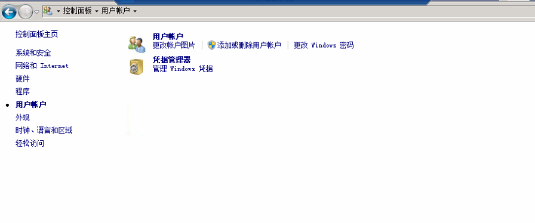
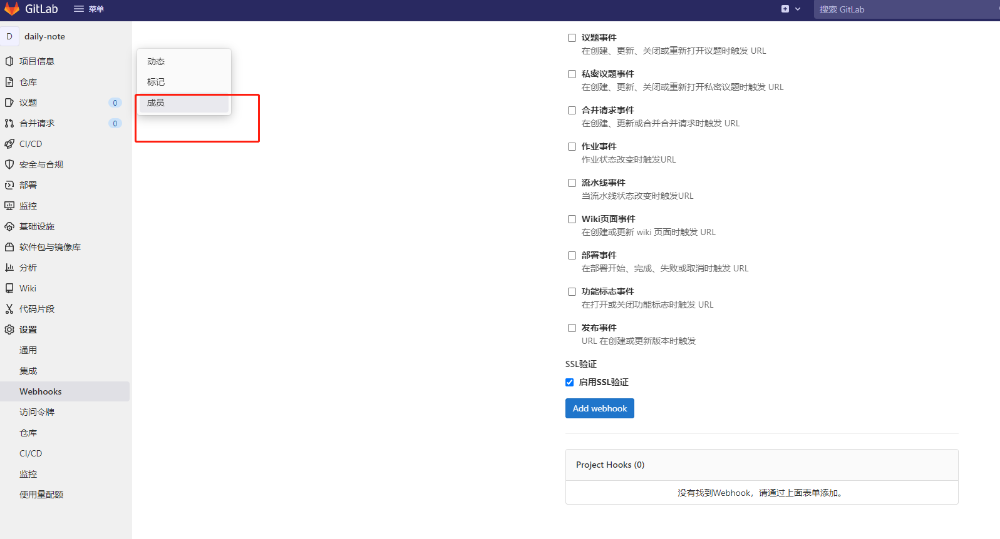
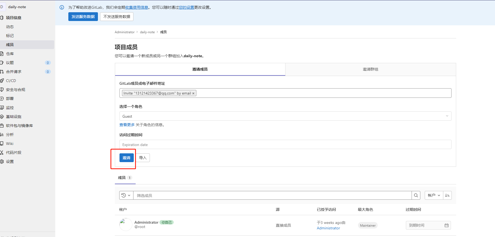
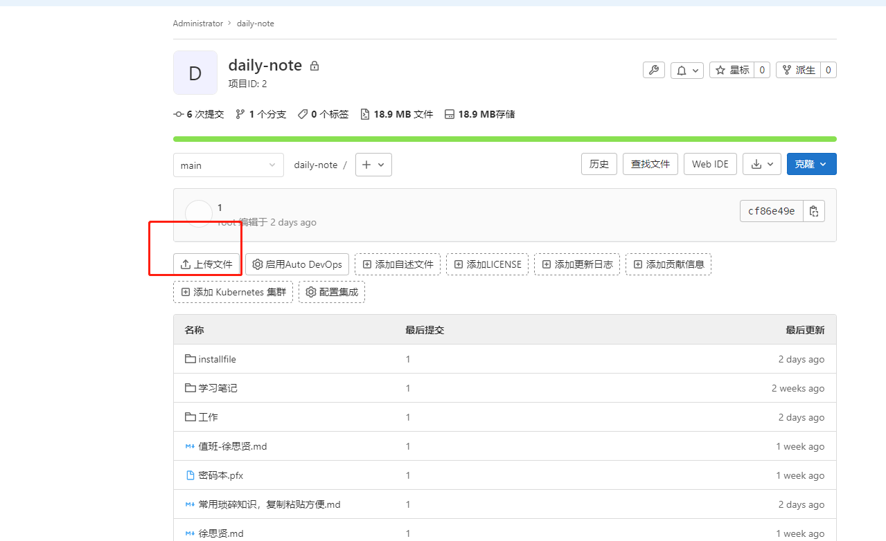
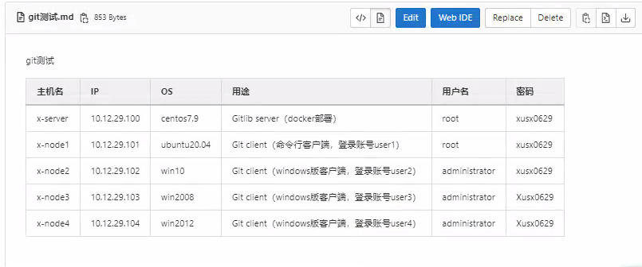

[TOC]

# Git

## 介绍

- **分布式版本控制器**

  **git没有中央版本库，但是为了方便开发小组的成员们进行代码共享，通常会搭建一个远程的git仓库。和svn不同的是开发者本地也包含一个完整的git仓库，从某种程度上来说本地的仓库和远程的仓库在身份上是等价的，没有主从。**

  优点：

  - 比svn方便和快捷的切换分支
  - 书写的代码可以随时提交
  - 丰富的命令行操作和组合
  - 可以一人一个仓库，仓库可以有多个分支

  缺点：

  - 没有一个较好的桌面集成工具
  - 不支持二进制文件
  
  

 **通过vmware esxi搭建虚拟机**

| 主机名   | IP           | OS          | 用途                                         | 用户名 | 密码     |
| -------- | ------------ | ----------- | -------------------------------------------- | ------ | -------- |
| x-server | 10.12.29.100 | centos7.9   | Gitlib server（docker部署）                  | root   | xusx0629 |
| x-node1  | 10.12.29.101 | ubuntu20.04 | Git client（命令行客户端，登录账号user1）    | root   | xusx0629 |
| x-node2  | 10.12.29.102 | win10       | Git client（windows版客户端，登录账号user2） | root   | xusx0629 |
| x-node3  | 10.12.29.103 | win2008     | Git client（windows版客户端，登录账号user3） | root   | Xusx0629 |
| x-node4  | 10.12.29.104 | win2012     | Git client（windows版客户端，登录账号user4） | root   | Xusx0629 |


## 1、GitLab客户端

### 1.1 基础环境

##### 1.1.1 修改网络

```shell
vim /etc/sysconfig/network-scripts/ifcfg-ens192

TYPE="Ethernet"
PROXY_METHOD="none"
BROWSER_ONLY="no"
BOOTPROTO="dhcp"
DEFROUTE="yes"
IPV4_FAILURE_FATAL="no"
IPV6INIT="yes"
IPV6_AUTOCONF="yes"
IPV6_DEFROUTE="yes"
IPV6_FAILURE_FATAL="no"
IPV6_ADDR_GEN_MODE="stable-privacy"
NAME="ens192"
UUID="c76d350d-fb2b-4efc-bd53-91d3db5e62c7"
DEVICE="ens192"
ONBOOT="yes"
IPADDR="10.12.29.100"
PREFIX="22"
GATEWAY="10.12.31.254"
IPV6_PRIVACY="no"

systemctl stop network && systemctl start network
```

##### 1.1.2 修改主机名

```shell
hostname mianshi
echo mianshi > /etc/hostname
```

##### 1.1.3 关闭防火墙、关闭SElinux

```shell
#关闭firewalld并禁止开机自启
systemctl stop firewalld && systemctl disable firewalld  

#关闭selinux
selinuxdefcon 0
sed -i 's/SELINUX=enforcing/SELINUX=disabled/g' /etc/selinux/config
```

##### 1.1.4  安装docker-ce

```shell
#1.安装依赖关系
yum install -y yum-utils device-mapper-persistent-data lvm2

#添加阿里源
yum-config-manager --add-repo https://mirrors.aliyun.com/docker-ce/linux/centos/docker-ce.repo
sed -i 's+download.docker.com+mirrors.aliyun.com/docker-ce+' /etc/yum.repos.d/docker-ce.repo

#更新yum缓存
yum makecache fast

#下载docker-ce
yum -y install docker-ce

#启动docker并设置开机自启
systemctl start docker &&systemctl enable docker

#设置阿里云加速
mkdir -p /etc/docker
tee /etc/docker/daemon.json <<-'EOF'
{
  "registry-mirrors": ["https://zd29wsn0.mirror.aliyuncs.com"]
}
EOF
systemctl daemon-reload
systemctl restart docker
```

### 1.2、安装GitLab

##### 1.2.1 创建挂载点

```shell
#创建gitlab的工作目录挂载点
mkdir -p /opt/GitLab/{data,logs,config}

data: /var/opt/gitlab     用于存储应用程序数据
logs: /var/log/gitlab	  用于存储日志
config:  /etc/gitlab	  用于存储gitlab配置文件

#修改配置文件
external_url 'http://10.12.29.100'
gitlab_rails['gitlab_ssh_host'] = '10.12.29.100'
gitlab_rails['gitlab_shell_ssh_port'] = 22
Git  定义IP地址 端口
```

##### 1.2.2 下载镜像运行容器

```shell
docker pull gitlab/gitlab-ce:latest

docker run -it \
-d \
-p 8080:80 \
-p 443:433 \
-p 8022:22 \
--name gitlab \
-v /opt/GitLab/config:/etc/gitlab \
-v /opt/GitLab/logs:/var/log/gitlab \
-v /opt/GitLab/data:/var/opt/gitlab \
--restart=always \
gitlab/gitlab-ce
```

##### 1.2.3 访问web页面登录

```shell
http：//10.12.29.100:8080

root
uShctuGcxzGaSopvI/q4jeDUfJ6AeqSfzjM0HH7ZFi8=

#获取密码
docker exec -it gitlab grep 'Password:' /etc/gitlab/initial_root_password

创建项目：dev-demo
http://10.12.29.100/root/ops_test.git

#保存记录密码
git config --global credential.helper store
```

##### 1.2.4 上传初始文件

git-test.md

| 主机名   | IP           | OS        | 用途                        | 用户名 | 密码     |
| -------- | ------------ | --------- | --------------------------- | ------ | -------- |
| x-server | 10.12.29.100 | centos7.9 | Gitlib server（docker部署） | root   | xusx0629 |
|          |              |           |                             |        |          |
|          |              |           |                             |        |          |
|          |              |           |                             |        |          |
|          |              |           |                             |        |          |

##### 1.2.5 修改密码

```shell
#获取密码
docker exec -it gitlab grep 'Password:' /etc/gitlab/initial_root_password

docker exec -it gitlab bash

#进入控制台
gitlab-rails console -e production

#修改root账号
user = User.where(id: 1).first

#修改密码
user.password = 'XU!@sx0629'
#再次输入密码
user.password_confirmation = 'XU!@sx0629'

#保存密码
user.save!

#退出
ctrl + d   or   exit

#重启服务，使其生效
docker exec -it gitlab gitlab-ctl restart
```

##### 1.2.6 Git 基础命令

```shell
#查看配置文件
git config --list

#声明你的用户名
git config --global user.name "Your Name"

#声明你的邮箱
git config --global user.email "email@exmple.com"

#用于查看配置的姓名
git config user.name

# 用于查看配置的邮箱
git config user.email

#在所在目录生成 git初始化 仓库
git init 

#将工作区的文件添加到暂存区单独提交某一个文件
git add xxx(文件名称)      

#将工作区的文件全部添加到暂存区
git add .

#将暂存区的文件提交到仓库版本区
git commit -m 'this is NO.1 commit1（注释）'

#查看状态
git status

# 显示从最近到最远的所有提交日志
git log

#显示每次提交（commit）的commit id
git reflog

#版本回退（回退一次提交）
git reset --hard HEAD^  

#（回退二次提交）
git reset --hard HEAD^^

#回退到指定Obfada的commit id版本
git reset --hard 版本号 

#用版本库中的文件去替换暂存区的全部文件。
git reset HEAD

#从暂存区删除文件
git rm --cached x.txt

#创建dev分支，并切换到dev分支
git checkout -b dev

#查看当前分支
git branch

#切换分支
git checkout master

#合并dev分支到当前分支
git merge dev

#删除指定分支
git branch -d dev

#显示出两个分支之间所有有差异的文件的详细差异
git diff branch1 branch2

#显示出两个分支之间所有有差异的文件列表
git diff branch1 branch2 --stat

#显示指定文件的详细差异
git diff branch1 branch2 xxx

#添加一个新的远程仓库 和git远程地址建立连接
git remote add user2 http://10.12.29.100/root/ops_test.git

#查看当前配置的有哪些远程仓库
git remote -v

#克隆项目仓库到本地
git clone http://10.12.29.100/root/ops_test.git

#拉取远程仓库内容以同步本地仓库状态
git pull origin

#将你的分支推送到仓库中,如果远端仓库没有此分支则创建一个此分支
git push origin master：master

#删除远程仓库
git remote rm 别名

#保存记录密码
git config --global credential.helper store
```

##### 1.2.7  记录凭据和删除

```bash
#保存记录密码
git config --global credential.helper store

#默认15分钟内不用再次输入密码
git config --global credential.helper cache

#查看目前 Git 使用的策略所在目录
git config --show-origin --get credential.helper

可以通过直接修改配置文件方式去更改变动
```


首先,打开控制面板 ===> 用户账户 ==> 凭据管理器 ==> Windows凭据



### 1.3 一般的git提交分支流程

- **拉取master**
- **以master为基创建dev开发分支**
- **开发…开发完成，有多个dev本地commit**
- **将多个dev本地commit合并为一个**
- **pull master获取master最新内容**
- **将master rebase到 dev，在dev中解决冲突问题**
- **将dev merge到master，让本地master处于在服务端的最新版本基础上又添加了自己的改动的最新状态**
- **提交master到远程仓库**

具体如下

- **拉取远端master分支**

  `git pull http://10.12.29.100/root/ops_test.git ` 

- **建立master为基的分支dev**
  在master中使用 `git branch dev` 创建，就是以master为基创建dev分支
  如果用 `git checkout -b dev` 则新创建的分支和master没有关系，也没有任何内容

- **在dev中进行修改工作，该提交本地仓库就提交**

- **修改工作完成后，先回到master，pull最新master**
  此处是master有可能在远端被其他开发者更改了，所以需要先把master最新信息同步到本地master

- **回到dev**
  `git rebase -i HEAD~number`
  将dev分支中的number个提交化为一个提交
  可以修改弹出来的内容为除了第一项之外前面都改成s,表示合并提交到一次中（本来一个commit就是一次提交）

- **git rebase master**
  由于dev是基于master产生的，所以这一步的意思是将master内容合并到自己修改之处。此处合并若有冲突产生，则rebase过程会停止，在自己开发仓库中处理冲突。

- **git status**
  使用此命令**查看冲突文件**
  使用vim打开冲突文件进行**修改**，**删除git给你添加的冲突标志线和其他提示信息**。然后保存退出编辑器。但是我们需要将rebase过程走完。

- **git rebase --continue**
  这一步是继续进行将master合并到自己的dev开发分支，也就是将rebase或称走完。合并完毕后，自己的dev开发分支就处于最新远端仓库的版本上又添加了自己内容的状态

- **回到master，将dev分支合并到master**
  因为我们dev分支中除了有当前master的内容，又加上了我们自己的内容。
  `git checkout master`
  `git merge dev`
  合并完毕之后提交
  `git push origin master`

- 追加：回退历史版本
  1、使用git log命令查看所有的历史版本，获取某个历史版本的id 比如：42294a2adc041c6b37d99fd776dac00a425e4b96

- 2.恢复到历史版本

  `git reset --hard 42294a2adc041c6b37d99fd776dac00a425e4b96`

  

- 3、 把修改推到远程服务器( 注意：reset之后push到远程上会删除这个历史版本之后的所有版本 )。

  `git push -f -u origin master`

  ***-f 强制push到远程 master分支***

备注：

穿梭前，用git log可以查看提交历史，以便确定要回退到哪个版本。
要重返未来，用git reflog查看命令历史，以便确定要回到未来的哪个版本。


### 1.4 创建项目

##### 1.4.1 创建新的项目操作


##### 1.4.2 创建用户





##### 1.4.5 上传测试文件git-test.md



## 2、ubuntu20.04 9安装

#### 2.1 配置远程登录

```shell
#安装sshd
sudo apt update
apt-get install ssh
sudo service ssh start

#关闭防火墙
sudo ufw deny
sudo ufw disable

#默认情况下，ubuntu20.04是没有安装selLinux的
```

#### 2.2 安装git客户端

```shell
#安装git
sudo apt install git

#查看git版本
sudo git --version
git version 2.25.1
```

#### 2.3 克隆远程仓库到本地

```shell
#克隆远程仓库到本地
git clone http://10.12.29.100:8080/root/ops_test.git

#设置用户名和邮箱
git config --global username "user1"
git config --global user.email "user1@qq.com"

#查看验证
git config --list
git config user.name
git config user.email
```

#### 2.4 创建dev分支

```bash
#建立master为基的分支dev
git branch dev

#切换到dev分支
git checkout dev

#编辑文件
vim git-test.md

#将写好的文件提交到暂存区
git add .

#提交到版本区
git commit -m "commit dev v1"
```

#### 2.5 合并分支推送到远程仓库

```bash
#切换到master分支
git checkout master 

#将dev分支的文件合并到master分支
git merge dev

#查看
cat git-test.md 

#将远程代码仓库定义一个别名
git remote add origin http://10.12.29.100:8080/root/ops_test.git

#提交到远程仓库
git push origin
```

## 3、windows10 安装git客户端

#### 3.1 修改IP地址

```shell
#通过CMD修改IP地址
netsh interface ipv4 set address name = "网卡名称" source = static address = 10.12.29.102 mask = 255.255.252.0 gateway=10.12.31.254


#通过CMD修改DNS
set dnsservers name="网卡名称"source=static address=10.12.29.102 register=primary

```

#### 3.2 下载git客户端

https://git-scm.com/download/win

#### 3.3 克隆远程仓库到本地

```shell
#设置用户名和邮箱
git config --global username "user2"
git config --global user.email "user2@qq.com"

#查看验证
git config --list
git config user.name
git config user.email

#连接gitlab远程仓库
git remote add origin http://10.12.29.100:8080/root/ops_test.git

#拷贝git仓库内容到本地
git clone http://10.12.29.100:8080/root/ops_test.git

#或者使用
git pull origin master
```

#### 3.4 创建dev分支

```bash
#建立master为基的分支dev
git branch dev

#切换到dev分支
git checkout dev

#编辑文件
vim git-test.md

#将写好的文件提交到暂存区
git add .

#提交到版本区
git commit -m "添加了本机密码"
```

#### 3.5 合并分支推送到远程仓库

```bash
#切换到master分支
git checkout master 

#master有可能在远端被其他开发者更改了，所以需要先把master最新信息同步到本地master
git pull origin

#切换到dev分支
git checkout dev

#将dev分支的文件合并到master分支
git rebase master

#查看状态异常
git status

#手工修改冲突
cat git-test.md 

#将远程代码仓库定义一个别名
git remote add origin http://10.12.29.100:8080/root/ops_test.git

#提交到远程仓库
git push origin
```

## 4、Win Server 2008安装git客户端

#### 4.1 基础环境

```shell
#通过CMD修改IP地址
netsh interface ipv4 set address name = "本地连接" source = static address = 10.12.29.103 mask = 255.255.252.0 gateway=10.12.31.254

本地连接=网卡名称

#通过CMD修改DNS
set dnsservers name="本地连接"source=static address=10.12.29.102 register=primary

#修改能够远程登录
1.右键点击“计算机”,菜单栏选择“属性”。
2.进入系统属性界面后,点击“远程设置”,将弹出的小窗口切换到“远程”选项,勾选上“允许任意版本远程桌面的计算机连接”点击“确定”。

#或者
```

#### 4.2 下载git客户端

`https://git-scm.com/download/win`

#### 4.3 克隆远程仓库到本地

```shell
#设置用户名和邮箱
git config --global username "user2"
git config --global user.email "user2@qq.com"

#查看验证
git config --list
git config user.name
git config user.email

#连接gitlab远程仓库
git remote add origin http://10.12.29.100:8080/root/ops_test.git

#拷贝git仓库内容到本地
git clone http://10.12.29.100:8080/root/ops_test.git

#或者使用
git pull origin master
```

#### 4.4 创建dev分支

```bash
#建立master为基的分支dev
git branch dev

#切换到dev分支
git checkout dev

#编辑文件
vim git-test.md

#将写好的文件提交到暂存区
git add .

#提交到版本区
git commit -m "添加了本机密码"
```

#### 4.5 合并分支推送到远程仓库

```bash
#切换到master分支
git checkout master 

#master有可能在远端被其他开发者更改了，所以需要先把master最新信息同步到本地master
git pull origin

#切换到dev分支
git checkout dev

#将dev分支的文件合并到master分支
git rebase master

#查看状态异常
git status

#手工修改冲突
vim git-test.md 

#将远程代码仓库定义一个别名
git remote add origin http://10.12.29.100:8080/root/ops_test.git

#master合并到自己的dev开发分支，也就是将rebase或称走完。合并完毕后，自己的dev开发分支就处于最新远端仓库的版本上又添加了自己内容的状态
git rebase --continue

#切换到master将dev分支合并到master
git checkout master
git merge dev

#提交到远程仓库
git push origin master
```

## 5、 Win Server 2012 安装git客户端

- **今天开机后发现只显示一个cmd命令行，没有图形界面全是黑屏，搜了一下2012资料**

  ```shell
  - windows server 2012 R2开机进入cmd，关闭后黑屏
  
  出现此问题，一般只有两种情况，操作系统装置前和操作系统装置后出现：
  
  第一种：
  
  装置操作系统的时候没有选择“Windows Server 2012 R2 Strandard( 带有GUI的服务器)”
  
  第二种：
  
  卸载了.Net Framework 4.5，然后重启服务器
  
  这里解释一下何为GUI，图形化界面;而.Net Framework 4.5是Windows Server 2012 中图形化界面(GUI) 的基础，所以，只需是缺少GUI或或缺少GUI所必需的.Net Framework 4.5都会造成操作系统黑屏，只有一个cmd操作窗口。
  
  一般的措施就是重装操作系统，但其实有个简单的措施，已经在cmd窗口了，只需要执行
  
  dism /online /enable-feature /all /featurename:servercore-fullserver /featurename:server-gui-shell /featurename:server-gui-mgmt
  ```


#### 5.1 基础环境

```shell
#通过CMD修改IP地址
netsh interface ipv4 set address name = "Ethernet0" source = static address = 10.12.29.104 mask = 255.255.252.0 gateway=10.12.31.254

Ethernet0=网卡名称


#通过CMD修改DNS
set dnsservers name="Ethernet0"source=static address=10.12.29.102 register=primary

#修改能够远程登录
1.右键点击“计算机”,菜单栏选择“属性”。
2.进入系统属性界面后,点击“远程设置”,将弹出的小窗口切换到“远程”选项,勾选上“允许任意版本远程桌面的计算机连接”点击“确定”。

#或者
```

#### 5.2 下载git客户端

`https://git-scm.com/download/win`

安装git的话一直默认下一步就可以啦！

#### 5.3 克隆远程仓库到本地

```shell
#设置用户名和邮箱
git config --global username "user2"
git config --global user.email "user2@qq.com"

#查看验证
git config --list
git config user.name
git config user.email

#连接gitlab远程仓库
git remote add origin http://10.12.29.100:8080/root/ops_test.git

#拷贝git仓库内容到本地
git clone http://10.12.29.100:8080/root/ops_test.git

#或者使用
git pull origin master

```

#### 5.4 创建dev分支

```bash
#建立master为基的分支dev
git branch dev

#切换到dev分支
git checkout dev

#编辑文件
vim git-test.md

#将写好的文件提交到暂存区
git add .

#提交到版本区
git commit -m "user4 添加了本机密码"
```

#### 5.5 合并分支推送到远程仓库

```bash
#切换到master分支
git checkout master 

#master有可能在远端被其他开发者更改了，所以需要先把master最新信息同步到本地master
git pull origin

#切换到dev分支
git checkout dev

#将dev分支的文件合并到master分支
git rebase master

#查看状态异常
git status

#手工修改冲突
vim git-test.md 

#master合并到自己的dev开发分支，也就是将rebase或称走完。合并完毕后，自己的dev开发分支就处于最新远端仓库的版本上又添加了自己内容的状态
git rebase --continue

#切换到master将dev分支合并到master
git checkout master
git merge dev

#提交到远程仓库
git push origin master
```


## 6、浏览器访问服务端验证




#### git --help

```shell
git --help

git [--version] [--help] [-C <path>] [-c <name>=<value>]
           [--exec-path[=<path>]] [--html-path] [--man-path] [--info-path]
           [-p | --paginate | -P | --no-pager] [--no-replace-objects] [--bare]
           [--git-dir=<path>] [--work-tree=<path>] [--namespace=<name>]
           [--super-prefix=<path>] [--config-env=<name>=<envvar>]
           <command> [<args>]

These are common Git commands used in various situations:

start a working area (see also: git help tutorial)
   clone     Clone a repository into a new directory
   init      Create an empty Git repository or reinitialize an existing one

work on the current change (see also: git help everyday)
   add       Add file contents to the index
   mv        Move or rename a file, a directory, or a symlink
   restore   Restore working tree files
   rm        Remove files from the working tree and from the index

examine the history and state (see also: git help revisions)
   bisect    Use binary search to find the commit that introduced a bug
   diff      Show changes between commits, commit and working tree, etc
   grep      Print lines matching a pattern
   log       Show commit logs
   show      Show various types of objects
   status    Show the working tree status

grow, mark and tweak your common history
   branch    List, create, or delete branches
   commit    Record changes to the repository
   merge     Join two or more development histories together
   rebase    Reapply commits on top of another base tip
   reset     Reset current HEAD to the specified state
   switch    Switch branches
   tag       Create, list, delete or verify a tag object signed with GPG

collaborate (see also: git help workflows)
   fetch     Download objects and refs from another repository
   pull      Fetch from and integrate with another repository or a local branch
   push      Update remote refs along with associated objects
```


#### **Git新建项目 三种模式场景区别**

- > >新建空白项目：适用于新创代码仓库开发环境，完完全全的空白仓库，没有分支
  >
  > ```
  > 创建一个新仓库
  > git clone http://122.14.194.189/root/test.git
  > cd test
  > git switch -c main
  > touch README.md
  > git add README.md
  > git commit -m "add README"
  > git push -u origin main
  > ```
  >
  > >从模板创建：使用已经构建好的模板创建仓库，推送自己的文件夹
  > >
  > >```
  > >使用别人已经做好的仓库模板，将自己本地的内容推送到远程代码仓库
  > >cd existing_folder
  > >git init --initial-branch=main
  > >git remote add origin http://122.14.194.189/root/test.git
  > >git add .
  > >git commit -m "Initial commit"
  > >git push -u origin main
  > >```
  
  > >导入项目：	推送自己的代码仓库到这里
  > >
  > >```
  > >cd existing_repo
  > >git remote rename origin old-origin
  > >git remote add origin http://122.14.194.189/root/test.git
  > >git push -u origin --all
  > >git push -u origin --tags
  > >
  > >
  > >适用于代码仓库转移，正在开发或已完成的项目更换远程代码仓库，也可以是第一次使用git之前使用的本地开发，要将本地代码库上传到一个新的远程干净仓库
  > >```
