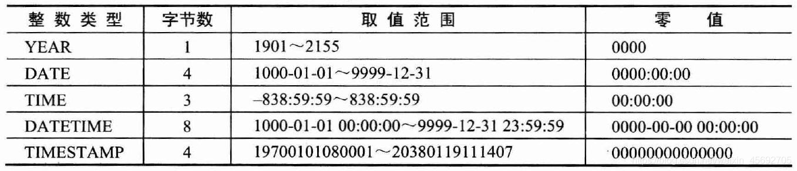

## 数据类型

MySQL提供的数据类型包括**数值类型（整数类型和小数类型）、字符串类型、日期类型、复合类型（复合类型包括enum类型和set类型）以及二进制类型** 。

#### 一. 整数类型

- 整数类型的数，默认情况下既可以表示正整数又可以表示负整数（此时称为有符号数）。如果只希望表示零和正整数，可以使用无符号关键字“unsigned”对整数类型进行修饰。
- 各个类别存储空间及取值范围。

#### 二. 小数类型

- 
  decimal(length, precision)用于表示精度确定（小数点后数字的位数确定）的小数类型，length决定了该小数的最大位数，precision用于设置精度（小数点后数字的位数）。

- 例如： decimal (5,2)表示小数取值范围：999.99～999.99 decimal (5,0)表示： -99999～99999的整数。

- 各个类别存储空间及取值范围。

#### 三. 字符串

- char()与varchar(): 例如对于简体中文字符集gbk的字符串而言，varchar(255)表示可以存储255个汉字，而每个汉字占用两个字节的存储空间。假如这个字符串没有那么多汉字，例如仅仅包含一个‘中’字，那么varchar(255)仅仅占用1个字符（两个字节）的储存空间；而char(255)则必须占用255个字符长度的存储空间，哪怕里面只存储一个汉字。

- 各个类别存储空间及取值范围。

#### 四. 日期类型

- date表示日期，默认格式为‘YYYY-MM-DD’； time表示时间，格式为‘HH:ii:ss’； year表示年份； datetime与timestamp是日期和时间的混合类型，格式为’YYYY-MM-DD HH:ii:ss’。

- datetime与timestamp都是日期和时间的混合类型，区别在于： 表示的取值范围不同，datetime的取值范围远远大于timestamp的取值范围。 将NULL插入timestamp字段后，该字段的值实际上是MySQL服务器当前的日期和时间。 同一个timestamp类型的日期或时间，不同的时区，显示结果不同。

- 各个类别存储空间及取值范围

#### 五. 复合类型

MySQL 支持两种复合数据类型：enum枚举类型和set集合类型。 enum类型的字段类似于单选按钮的功能，一个enum类型的数据最多可以包含65535个元素。 set 类型的字段类似于复选框的功能，一个set类型的数据最多可以包含64个元素。

#### 六. 二进制类型

- 二进制类型的字段主要用于存储由‘0’和‘1’组成的字符串，因此从某种意义上将，二进制类型的数据是一种特殊格式的字符串。
- 二进制类型与字符串类型的区别在于：字符串类型的数据按字符为单位进行存储，因此存在多种字符集、多种字符序；而二进制类型的数据按字节为单位进行存储，仅存在二进制字符集binary。

## 【约束】

约束是一种限制，**它通过对表的行或列的数据做出限制，来确保表的数据的完整性、唯一性。**下面文章就来给大家介绍一下6种mysql常见的约束，希望对大家有所帮助。

#### 一. 非空约束(not null)

- 非空约束用于确保当前列的值不为空值，非空约束只能出现在表对象的列上。
- Null类型特征：所有的类型的值都可以是null，包括int、float 等数据类型

#### 二. 唯一性约束(unique)

- 唯一约束是指定table的列或列组合不能重复，保证数据的唯一性。
- 唯一约束不允许出现重复的值，但是可以为多个null。
- 同一个表可以有多个唯一约束，多个列组合的约束。
- 在创建唯一约束时，如果不给唯一约束名称，就默认和列名相同。
- 唯一约束不仅可以在一个表内创建，而且可以同时多表创建组合唯一约束。

#### 三. 主键约束(primary key) PK

- 主键约束相当于 唯一约束 + 非空约束 的组合，主键约束列不允许重复，也不允许出现空值。
- 每个表最多只允许一个主键，建立主键约束可以在列级别创建，也可以在表级别创建。

- 当创建主键的约束时，系统默认会在所在的列和列组合上建立对应的唯一索引。

#### 四. 外键约束(foreign key) FK

- 外键约束是用来加强两个表（主表和从表）的一列或多列数据之间的连接的，可以保证一个或两个表之间的参照完整性，外键是构建于一个表的两个字段或是两个表的两个字段之间的参照关系。
- 创建外键约束的顺序是先定义主表的主键，然后定义从表的外键。也就是说只有主表的主键才能被从表用来作为外键使用，被约束的从表中的列可以不是主键，主表限制了从表更新和插入的操作。

#### 五. 默认值约束 (Default)

若在表中定义了默认值约束，用户在插入新的数据行时，如果该行没有指定数据，那么系统将默认值赋给该列，如果我们不设置默认值，系统默认为NULL。

#### 六. 自增约束(AUTO_INCREMENT)

- 自增约束(AUTO_INCREMENT)可以约束任何一个字段，该字段不一定是PRIMARY KEY字段，也就是说自增的字段并不等于主键字段。
- 但是PRIMARY_KEY约束的主键字段，一定是自增字段，即PRIMARY_KEY 要与AUTO_INCREMENT一起作用于同一个字段。

当插入第一条记录时，自增字段没有给定一个具体值，可以写成DEFAULT/NULL，那么以后插入字段的时候，该自增字段就是从1开始，没插入一条记录，该自增字段的值增加1。当插入第一条记录时，给自增字段一个具体值，那么以后插入的记录在此自增字段上的值，就在第一条记录该自增字段的值的基础上每次增加1。也可以在插入记录的时候，不指定自增字段，而是指定其余字段进行插入记录的操作。
