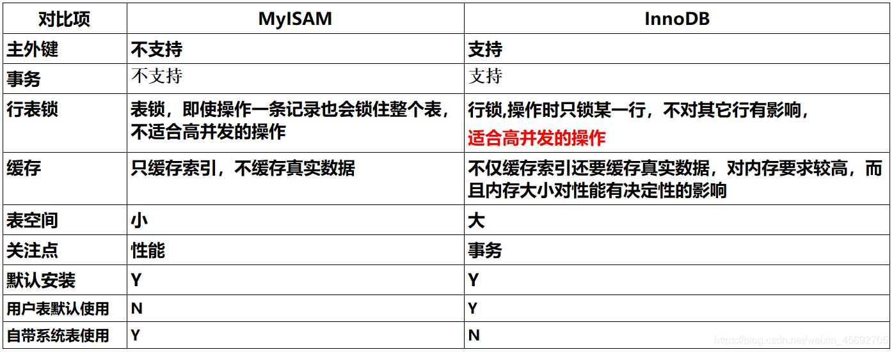
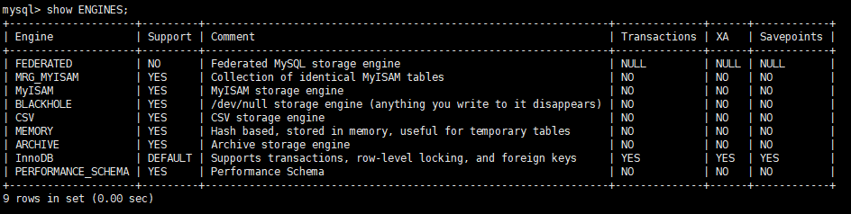

## DDL（Data Definition Languages）语句：即数据库定义语句

对于数据库而言实际上每一张表都表示是一个数据库的对象，而数据库对象指的就是DDL定义的所有操作，例如：表，视图，索引，序列，约束等等，都属于对象的操作，所以表的建立就是对象的建立，而对象的操作主要分为以下三类语法

> 创建对象：CREATE 对象名称;
> 删除对象：DROP 对象名称;
> 修改对象：ALTER 对象名称;

## 数据库相关操作

#### 一. 创建数据库

- 语法：`create database 数据库名字`;

```sql
CREATE DATABASE demo;
```

#### 二. 查看已经存在的数据库

- 语法：`show databases`;

```sql
show databases;
+--------------------+
| Database           |
+--------------------+
| information_schema |
| demo               |
| mysql              |
| performance_schema |
| test               |
+--------------------+
5 rows in set (0.00 sec)
```

可以发现，在上面的列表中除了刚刚创建的 demo外，还有另外 4 个数据库，它们都是安装MySQL 时系统自动创建的，其各自功能如下。

information_schema：主要存储了系统中的一些数据库对象信息。比如用户表信息、列信息、权限信息、字符集信息、分区信息等。
performance_schema：存储了系统的集群信息。
mysql：存储了系统的用户权限信息。
test：系统自动创建的测试数据库，任何用户都可以使用。

#### 三. 选择数据库

语法：use 数据库名;
```sql
mysql> use demo;
```


返回Database changed代表我们已经选择 sqltest 数据库，后续所有操作将在 sqltest 数据库上执行。

有些人可能会问到，连接以后怎么退出。其实，不用退出来，use 数据库后，使用show databases就能查询所有数据库，如果想跳到其他数据库，用use 其他数据库名字。

#### 四. 查看数据库中的表

语法：show tables;
```sql
mysql> use mysql
Database changed
mysql> show tables;
+---------------------------+
| Tables_in_mysql           |
+---------------------------+
| columns_priv              |
| db                        |
| event                     |
| func                      |
| general_log               |
| help_category             |
| help_keyword              |
| help_relation             |
| help_topic                |
| innodb_index_stats        |
| innodb_table_stats        |
| ndb_binlog_index          |
| plugin                    |
| proc                      |
| procs_priv                |
| proxies_priv              |
| servers                   |
| slave_master_info         |
| slave_relay_log_info      |
| slave_worker_info         |
| slow_log                  |
| tables_priv               |
| time_zone                 |
| time_zone_leap_second     |
| time_zone_name            |
| time_zone_transition      |
| time_zone_transition_type |
| user                      |
+---------------------------+
28 rows in set (0.01 sec)
```

#### 五. 删除数据库

语法：drop database 数据库名称;
```sql
mysql> show databases;
+--------------------+
| Database           |
+--------------------+
| information_schema |
| demo               |
| mysql              |
| performance_schema |
| test               |
+--------------------+
5 rows in set (0.00 sec)

mysql> drop database `demo`;
Query OK, 0 rows affected (0.00 sec)

mysql> show databases;
+--------------------+
| Database           |
+--------------------+
| information_schema |
| mysql              |
| performance_schema |
| test               |
+--------------------+
4 rows in set (0.00 sec)
```

注意：删除时，最好用 `` 符号把 名称 括起来


#### 六. 设置表的类型

- MySQL的数据表类型：`MyISAM`、`InnoDB`、HEAP、 BOB、CSV等



语法：

```sql
CREATE TABLE 表名(
	#省略代码
）ENGINE= InnoDB;
```

适用场景：

```
1. 使用MyISAM：节约空间及响应速度快；不需事务，空间小，以查询访问为主
2. 使用InnoDB：安全性，事务处理及多用户操作数据表；多删除、更新操作，安全性高，事务处理及并发控制
```

##### 1. 查看mysql所支持的引擎类型

语法：

```sql
mysql> show ENGINES;
```



##### 2. 查看默认引擎

语法：

```sql
SHOW VARIABLES LIKE 'storage_engine';
+----------------+--------+
| Variable_name  | Value  |
+----------------+--------+
| storage_engine | InnoDB |
+----------------+--------+
1 row in set (0.00 sec)
```

### 库表相关操作

#### 一. 创建表

语法：`create table 表名 {列名,数据类型,约束条件};`

```sql
CREATE TABLE `Student`(
	`s_id` VARCHAR(20),
	`s_name` VARCHAR(20) NOT NULL DEFAULT '',
	`s_birth` VARCHAR(20) NOT NULL DEFAULT '',
	`s_sex` VARCHAR(10) NOT NULL DEFAULT '',
	PRIMARY KEY(`s_id`)
);
```

注意：表名还请遵守数据库的命名规则，这条数据后面要进行删除，所以首字母为大写。


#### 二. 查看表定义

语法：`desc 表名`
```sql
mysql> desc Student;
+---------+-------------+------+-----+---------+-------+
| Field   | Type        | Null | Key | Default | Extra |
+---------+-------------+------+-----+---------+-------+
| s_id    | varchar(20) | NO   | PRI |         |       |
| s_name  | varchar(20) | NO   |     |         |       |
| s_birth | varchar(20) | NO   |     |         |       |
| s_sex   | varchar(10) | NO   |     |         |       |
+---------+-------------+------+-----+---------+-------+
4 rows in set (0.00 sec)
结果：
```

- 虽然 desc 命令可以查看表定义，但是其输出的信息还是不够全面，为了查看更全面的表定义信息，有时就需要通过查看创建表的 SQL 语句来得到，可以使用如下命令实现

- 语法：`show create table 表名 \G;`

```sql
mysql> show create table Student \G;
*************************** 1. row ***************************
       Table: Student
Create Table: CREATE TABLE `Student` (
  `s_id` varchar(20) NOT NULL DEFAULT '',
  `s_name` varchar(20) NOT NULL DEFAULT '',
  `s_birth` varchar(20) NOT NULL DEFAULT '',
  `s_sex` varchar(10) NOT NULL DEFAULT '',
  PRIMARY KEY (`s_id`)
) ENGINE=InnoDB DEFAULT CHARSET=latin1
1 row in set (0.00 sec)

ERROR: 
No query specified结果：
```

从上面表的创建 SQL 语句中，除了可以看到表定义以外，还可以看到表的engine（存储引擎）和charset（字符集）等信息。\G选项的含义是使得记录能够按照字段竖着排列，对于内容比较长的记录更易于显示。

**注意：**

 如果数据库字符集不一致情况那么就会无法写入数据，报错

#### 三. 删除表

语法：`drop table 表名`
```sql
mysql> drop table Student;
Query OK, 0 rows affected (0.01 sec)
```

#### 四. 查看修改库表的字符集

语法：`show create database 库名`;

```sql
mysql> show create database demo;
```

##### 修改数据库的字符集：

   ```sql
   mysql> alter database demo character set utf8;
   ```

##### 修改数据的字符集：

   ```sql
   mysql> alter table student character set utf8;
   ```

##### 修改数据表字段的字符集：

   ```sql
   mysql> alter table student change Sname Sname varchar(10) character set utf8;
   ```


#### 四. 修改表 (重要)

- 对于已经创建好的表，尤其是已经有大量数据的表，如果需要对表做一些结构上的改变，我们可以先将表删除（drop），然后再按照新的表定义重建表。这样做没有问题，但是必然要做一些额外的工作，比如数据的重新加载。而且，如果有服务在访问表，也会对服务产生影响。因此，在大多数情况下，表结构的更改一般都使用 alter table语句，以下是一些常用的命令。

##### 1.修改表类型

- 语法：`ALTER TABLE 表名 MODIFY [COLUMN] column_definition [FIRST | AFTER col_name]`
- 例如，修改表 student 的 s_name 字段定义，将 varchar(20)改为 varchar(30)

```sql
mysql> desc Student;
+---------+-------------+------+-----+---------+-------+
| Field   | Type        | Null | Key | Default | Extra |
+---------+-------------+------+-----+---------+-------+
| s_id    | varchar(20) | NO   | PRI |         |       |
| s_name  | varchar(20) | NO   |     |         |       |
| s_birth | varchar(20) | NO   |     |         |       |
| s_sex   | varchar(10) | NO   |     |         |       |
+---------+-------------+------+-----+---------+-------+
4 rows in set (0.00 sec)

mysql> alter table Student modify s_name varchar(30);
Query OK, 0 rows affected (0.02 sec)
Records: 0  Duplicates: 0  Warnings: 0

mysql> desc Student;
+---------+-------------+------+-----+---------+-------+
| Field   | Type        | Null | Key | Default | Extra |
+---------+-------------+------+-----+---------+-------+
| s_id    | varchar(20) | NO   | PRI |         |       |
| s_name  | varchar(30) | YES  |     | NULL    |       |
| s_birth | varchar(20) | NO   |     |         |       |
| s_sex   | varchar(10) | NO   |     |         |       |
+---------+-------------+------+-----+---------+-------+
4 rows in set (0.00 sec)
```

##### 2.增加表字段

- 语法：`ALTER TABLE 表名 ADD [COLUMN] [FIRST | AFTER col_name];`
- 例如，表 student 上新增加字段 s_test，类型为 int(3)

```sql
mysql> desc Student;
+---------+-------------+------+-----+---------+-------+
| Field   | Type        | Null | Key | Default | Extra |
+---------+-------------+------+-----+---------+-------+
| s_id    | varchar(20) | NO   | PRI |         |       |
| s_name  | varchar(30) | YES  |     | NULL    |       |
| s_birth | varchar(20) | NO   |     |         |       |
| s_sex   | varchar(10) | NO   |     |         |       |
+---------+-------------+------+-----+---------+-------+
4 rows in set (0.00 sec)

mysql>  alter table Student add column s_test int(3);
Query OK, 0 rows affected (0.03 sec)
Records: 0  Duplicates: 0  Warnings: 0

mysql> desc Student;
+---------+-------------+------+-----+---------+-------+
| Field   | Type        | Null | Key | Default | Extra |
+---------+-------------+------+-----+---------+-------+
| s_id    | varchar(20) | NO   | PRI |         |       |
| s_name  | varchar(30) | YES  |     | NULL    |       |
| s_birth | varchar(20) | NO   |     |         |       |
| s_sex   | varchar(10) | NO   |     |         |       |
| s_test  | int(3)      | YES  |     | NULL    |       |
+---------+-------------+------+-----+---------+-------+
5 rows in set (0.00 sec)
```

##### 3.删除表字段

- 语法：`ALTER TABLE 表名 DROP [COLUMN] col_name`
- 例如，将字段 s_test 删除掉

```sql
mysql> alter table Student drop column s_test;
Query OK, 0 rows affected (0.02 sec)
Records: 0  Duplicates: 0  Warnings: 0

mysql> desc Student;
+---------+-------------+------+-----+---------+-------+
| Field   | Type        | Null | Key | Default | Extra |
+---------+-------------+------+-----+---------+-------+
| s_id    | varchar(20) | NO   | PRI |         |       |
| s_name  | varchar(30) | YES  |     | NULL    |       |
| s_birth | varchar(20) | NO   |     |         |       |
| s_sex   | varchar(10) | NO   |     |         |       |
+---------+-------------+------+-----+---------+-------+
4 rows in set (0.00 sec)
```

##### 4.字段改名

- 语法：`ALTER TABLE 表名 CHANGE [COLUMN] old_col_name column_definition [FIRST|AFTER col_name]`
- 例如，将 s_sex 改名为 s_sex1，同时修改字段类型为 int(4)

```sql
mysql> alter table Student change s_sex s_sex1 int(4);
Query OK, 0 rows affected (0.02 sec)
Records: 0  Duplicates: 0  Warnings: 0

mysql> desc Student;
+---------+-------------+------+-----+---------+-------+
| Field   | Type        | Null | Key | Default | Extra |
+---------+-------------+------+-----+---------+-------+
| s_id    | varchar(20) | NO   | PRI |         |       |
| s_name  | varchar(30) | YES  |     | NULL    |       |
| s_birth | varchar(20) | NO   |     |         |       |
| s_sex1  | int(4)      | YES  |     | NULL    |       |
+---------+-------------+------+-----+---------+-------+
4 rows in set (0.01 sec)
```

注意：change 和 modify 都可以修改表的定义，不同的是 change 后面需要写两次列名，不方便。但是 change 的优点是可以修改列名称，modify 则不能。

##### 5.修改字段排列顺序

- 前面介绍的的字段增加和修改语法（ADD/CNAHGE/MODIFY）中，都有一个可选项first|after column_name，这个选项可以用来修改字段在表中的位置，默认 ADD 增加的新字段是加在表的最后位置，而 CHANGE/MODIFY 默认都不会改变字段的位置。
- 例如，将新增的字段 s_test 加在 s_id 之后

- 语法：`alter table 表名 add 列名 数据类型 after 列名`;


```sql
mysql> alter table Student add s_test date after s_id;
```

- 修改已有字段 s_name，将它放在最前面

```sql
mysql> alter table Student modify s_name varchar(30) default '' first;
```

**注意：CHANGE/FIRST|AFTER COLUMN 这些关键字都属于 MySQL 在标准 SQL 上的扩展，在其他数据库上不一定适用。**

##### 6.表名修改

- 语法：`ALTER TABLE 表名 RENAME [TO] new_tablename`
- 例如，将表 Student 改名为 student

```sql
mysql> alter table Student rename student;
```

