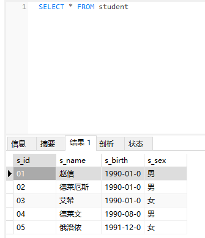
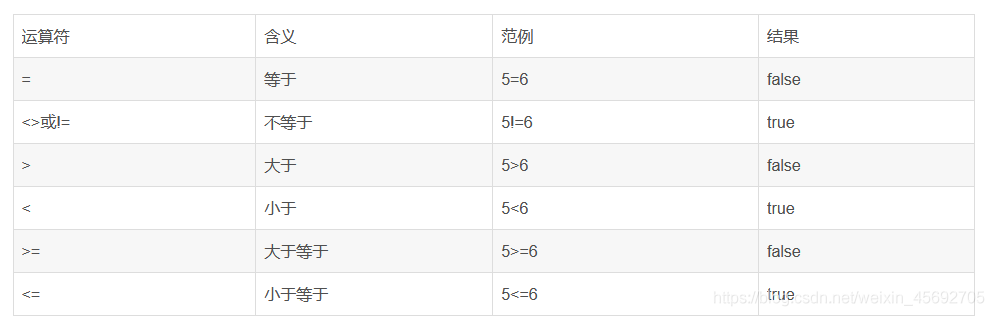
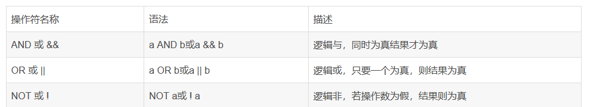
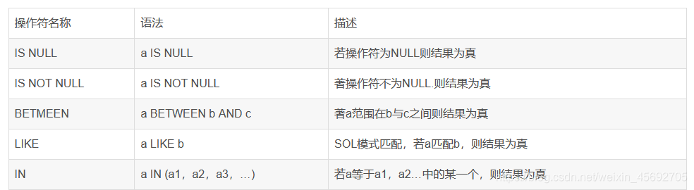

## DML语句：

**（Data Manipulation Language） 即数据操纵语句用于操作数据库对象中所包含的数据**

#### 一. 添加数据：INSERT

**Insert 语句用于向数据库中插入数据**

###### 1.插入单条数据（常用）

- 语法：`insert into 表名(列名1,列名2,...) values(值1,值2,...)`

特点：

- 插入值的类型要与列的类型一致或兼容。插入NULL可实现为列插入NULL值。列的顺序可以调换。列数和值的个数必须一致。可省略列名，默认所有列，并且列的顺序和表中列的顺序一致。

-- 插入学生表测试数据

```sql
insert into student(s_id,s_name,s_birth,s_sex) values('01' , '赵信' , '1990-01-01' , '男');
```

###### 2.插入单条数据

- 语法：`INSERT INTO 表名 SET 列名 = 值，列名 = 值`

这种方式每次只能插入一行数据，每列的值通过赋值列表制定。

```sql
mysql> INSERT INTO student SET s_id='02',s_name='德莱厄斯',s_birth='1990-01-01',s_sex='男';
Query OK, 1 row affected (0.00 sec)
```

###### 3.插入多条数据

语法：`insert into 表名 values(值1,值2,值3),(值4,值5,值6),(值7,值8,值9);`

```sql
mysql> INSERT INTO student VALUES('03','艾希','1990-01-01','女'),('04','德莱文','1990-08-06','男'),('05','俄洛依','1991-12-01','女');
Query OK, 3 rows affected (0.00 sec)
Records: 3  Duplicates: 0  Warnings: 0

mysql> select * from student;
+------+--------------+------------+-------+
| s_id | s_name       | s_birth    | s_sex |
+------+--------------+------------+-------+
| 01   | 赵信         | 1990-01-01 | 男    |
| 02   | 德莱厄斯     | 1990-01-01 | 男    |
| 03   | 艾希         | 1990-01-01 | 女    |
| 04   | 德莱文       | 1990-08-06 | 男    |
| 05   | 俄洛依       | 1991-12-01 | 女    |
+------+--------------+------------+-------+
5 rows in set (0.00 sec)

```


上面的例子中，值1,值2,值3),(值4,值5,值6),(值7,值8,值9) 即为 Value List，其中每个括号内部的数据表示一行数据，这个例子中插入了三行数据。Insert 语句也可以只给部分列插入数据，这种情况下，需要在 Value List 之前加上 ColumnName List，

例如：

```sql
INSERT INTO student(s_name,s_sex) VALUES('艾希','女'),('德莱文','男');
每行数据只指定了 s_name 和 s_sex 这两列的值，其他列的值会设为 Null。
```

###### 4. 表数据复制

语法：`INSERT INTO 表名 SELECT * from 表名;`

案例：

```sql
INSERT INTO student SELECT * from student_2;注意：
```

两个表的字段需要一直，并尽量保证要新增的表中没有数据

#### 二. 更新数据：UPDATE

Update 语句一共有两种语法，分别用于更新单表数据和多表数据。



- *******注意：没有 WHERE 条件的 UPDATE 会更新所有值！**

###### 1. 修改一条数据的某个字段

- 语法：`UPDATE 表名 SET 字段名 =值 where 字段名=值`

```sql
UPDATE student SET s_name ='张三' WHERE s_id ='01'
```

###### 2. 修改多个字段为同一的值

- 语法：`UPDATE 表名 SET 字段名= 值 WHERE 字段名 in ('值1','值2','值3');


```sql
UPDATE student SET s_name = '李四' WHERE s_id in ('01','02','03');
```

###### 3. 使用case when实现批量更新

- 语法：`update 表名 set 字段名 = case 字段名 when 值1 then '值' when 值2 then '值' when 值3 then '值' end where s_id in (值1,值2,值3)`

```sql
update student set s_name = case s_id when 01 then '小王' when 02 then '小周' when 03 then '老周' end where s_id in (01,02,03)
```

- 
  这句sql的意思是，更新 s_name 字段，如果 s_id 的值为 01 则 s_name 的值为 小王，s_id = 02 则 s_name = 小周，如果s_id =03 则 s_name 的值为 老周。

- 这里的where部分不影响代码的执行，但是会提高sql执行的效率。确保sql语句仅执行需要修改的行数，这里只有3条数据进行更新，而where子句确保只有3行数据执行。

案例 2：

```sql
UPDATE student SET s_birth = CASE s_name
	WHEN '小王' THEN
		'2019-01-20'
	WHEN '小周' THEN
		'2019-01-22'
END WHERE s_name IN ('小王','小周');
```


### 三. 删除数据：DELETE

数据库一旦删除数据，它就会永远消失。 因此，在执行DELETE语句之前，应该先备份数据库，以防万一要找回删除过的数据。

###### 1. 删除指定数据

语法：`DELETE FROM 表名 WHERE 列名=值`

- 注意：删除的时候如果不指定where条件，则保留数据表结构，删除全部数据行，有主外键关系的都删不了


```sql
DELETE FROM student WHERE s_id='09'
```

- 与 SELECT 语句不同的是，DELETE 语句中不能使用 GROUP BY、 HAVING 和 ORDER BY 三类子句，而只能使用WHERE 子句。原因很简单， GROUP BY 和 HAVING 是从表中选取数据时用来改变抽取数据形式的， 而 ORDER BY 是用来指定取得结果显示顺序的。因此，在删除表中数据 时它们都起不到什么作用。`

###### 2. 删除表中全部数据

语法：`TRUNCATE 表名;`

- 注意：全部删除，内存无痕迹，如果有自增会重新开始编号。


- 与 DELETE 不同的是，TRUNCATE 只能删除表中的全部数据，而不能通过 WHERE 子句指定条件来删除部分数据。也正是因为它不能具体地控制删除对象， 所以其处理速度比 DELETE 要快得多。实际上，DELETE 语句在 DML 语句中也 属于处理时间比较长的，因此需要删除全部数据行时，使用 TRUNCATE 可以缩短 执行时间。


```sql
TRUNCATE student1;
```


## DQL语句:

（Data Query Language）：即数据查询语句

- 查询数据库中的记录，关键字 SELECT，这块内容非常重要！


### 一. wherer 条件语句

语法：`select 列名 from 表名 where 列名 =值`

where的作用：

​	**1.用于检索数据表中符合条件的记录**
​	**2.搜索条件可由一个或多个逻辑表达式组成，结果一般为真或假**
搜索条件的组成：

##### 算数运算符



##### 逻辑操作符

（操作符有两种写法）



##### 比较运算符



**注意：数值数据类型的记录之间才能进行算术运算，相同数据类型的数据之间才能进行比较。**


###### 案例 1（AND）：

```sql
SELECT  * FROM student WHERE s_name ='小王' AND s_sex='男'
```

###### 案例 2（OR）:


```sql
SELECT  * FROM student WHERE s_name ='崔丝塔娜' OR s_sex='男'
```

###### 案例 3（NOT）：

```sql
SELECT  * FROM student WHERE NOT s_name ='崔丝塔娜' 
```

###### 案例 4（IS NULL）：

```sql
SELECT * FROM student WHERE s_name IS NULL;
```

###### 案例 5（IS NOT NULL）：

```sql
SELECT * FROM student WHERE s_name IS NOT NULL;
```

###### 案例 6（BETWEEN）：

```sql
SELECT * FROM student WHERE s_birth BETWEEN '2019-01-20' AND '2019-01-22'
```

###### 案例 7（LINK）：

```sql
SELECT * FROM student WHERE s_name LIKE '小%'
```

###### 案例 8（IN）：

```sql
SELECT * FROM student WHERE s_name IN ('小王','小周')
```


### 二. as 取别名

表里的名字没有变，只影响了查询出来的结果

```sql
SELECT s_name as `name` FROM student 
```

- 使用as也可以为表取别名 （作用：单表查询意义不大，但是当多个表的时候取别名就好操作，当不同的表里有相同名字的列的时候区分就会好区分）


### 三. distinct 去除重复记录

注意：当查询结果中所有字段全都相同时 才算重复的记录

```sql
SELECT DISTINCT * FROM student
```

**指定字段**

- 星号表示所有字段

- 手动指定需要查询的字段

```sql
SELECT DISTINCT s_name,s_birth FROM student
```

- 
  还可也是四则运算

- 聚合函数

### 四. group by 分组

- group by的意思是根据by对数据按照哪个字段进行分组，或者是哪几个字段进行分组。

`select 字段名 from 表名 group by 字段名称;`

###### 1. 单个字段分组

```sql
SELECT COUNT(*)FROM student GROUP BY s_sex;
```

###### 2.  多个字段分组

```sql
SELECT s_name,s_sex,COUNT(*) FROM student GROUP BY s_name,s_sex;
```

- 注意：多个字段进行分组时，需要将s_name和s_sex看成一个整体，只要是s_name和s_sex相同的可以分成一组；如果只是s_sex相同，s_sex不同就不是一组。


### 五. having 过滤

- HAVING 子句对 GROUP BY 子句设置条件的方式与 WHERE 和 SELECT 的交互方式类似。WHERE 搜索条件在进行分组操作之前应用；而 HAVING 搜索条件在进行分组操作之后应用。HAVING 语法与 WHERE 语法类似，但 HAVING 可以包含聚合函数。HAVING 子句可以引用选择列表中显示的任意项。

我们如果要查询男生或者女生，人数大于4的性别

```sql
SELECT s_sex as 性别,count(s_id) AS 人数 FROM student GROUP BY s_sex HAVING COUNT(s_id)>4
```

### 六. order by 排序

根据某个字段排序，默认升序(从小到大)
语法：

```sql
select * from 表名 order by 字段名;
```

###### 1. 一个字段，降序（从大到小）

```sql
SELECT * FROM student ORDER BY s_id DESC;
```

###### 2. 多个字段

```sql
SELECT * FROM student ORDER BY s_id DESC, s_birth ASC;
```

- 多个字段 第一个相同在按照第二个 asc 表示升序

### limit 分页

- 用于限制要显示的记录数量

```sql
select * from table_name limit 个数;
```


语法2:

```sql
select * from table_name limit 起始位置,个数;
```


案例：

**查询前三条数据**

```sql
SELECT * FROM student LIMIT 3;
```

**从第三条开始 查询3条**

```sql
SELECT * FROM student LIMIT 2,3;
```


注意：起始位置 从0开始

1. 每一页显示的条数 a = 3
2. 明确当前页数 b = 2
3. 计算起始位置 c = (b-1) * a

### 子查询

将一个查询语句的结果作为另一个查询语句的条件或是数据来源， 当我们一次性查不到想要数据时就需要使用子查询。
```sql
SELECT * FROM  score WHERE s_id =(SELECT s_id  FROM student WHERE s_name = '赵信')
```


#### 1.in 关键字子查询

- 当内层查询 (括号内的) 结果会有多个结果时, 不能使用 = 必须是in ,另外子查询必须只能包含一列数据
- 子查询的思路:

要分析 查到最终的数据 到底有哪些步骤
根据步骤写出对应的sql语句
把上一个步骤的sql语句丢到下一个sql语句中作为条件

```sql
SELECT * FROM score WHERE s_id IN ( SELECT s_id FROM student WHERE s_sex = '男')
```


#### 2.多表查询

1. 笛卡尔积查询
笛卡尔积查询的结果会出现大量的错误数据即,数据关联关系错误,并且会产生重复的字段信息 !
2. 内连接查询
本质上就是笛卡尔积查询，inner可以省略。


语法:

```sql
select * from  表1 inner join 表2;
```


查看用户权限
当成功创建用户账户后，还不能执行任何操作，需要为该用户分配适当的访问权限。可以使用SHOW GRANTS FOR语句来查询用户的权限。

例如：

```sql
mysql> SHOW GRANTS FOR test;
+-------------------------------------------+
| Grants for test@%                         |
+-------------------------------------------+
| GRANT ALL PRIVILEGES ON *.* TO 'test'@'%' |
+-------------------------------------------+
1 row in set (0.00 sec)
```


