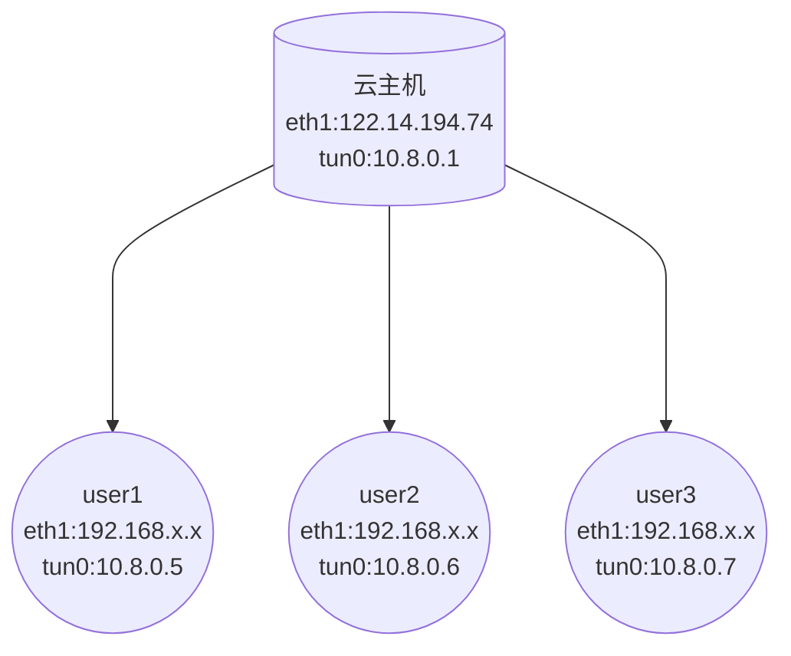

# open vpn


##### 网络环境

| 角色    | 系统      | IP地址                          |
| ------- | --------- | ------------------------------- |
| 云主机  | centos7-9 | 122.14.194.74     \|\| 10.8.0.x |
| client1 | win10     | 172.22.139.119  \|\| 10.8.0.x   |
| client2 | win10     | 172.22.139.120  \|\| 10.8.0.x   |
| client2 | win10     | 172.22.139.121  \|\| 10.8.0.x   |




IP地址分类

**A类地址**   

- 1.0.0.1-126.155.255.254   

  其中10.x.x.x 是私有地址，127.x.x.x 是保留地址，用作循环测试

**B类IP地址**  

- 范围从128.0.0.0 到 191.255.255.255 可用的B类网络有16382个
  172.16.0.0 ~ 172.31.255.255 是私有地址

**C类IP地址** 

- 范围从192.0.0.0 到 223.225.255.254
  192.168.x.x 是私有地址

------

###### 简介

VPN直译就是虚拟专用通道，是提供给企业之间或者个人与公司之间安全数据传输的隧道，OpenVPN无疑是Linux下开源VPN的先锋，提供了良好的性能和友好的用户GUI。

OpenVPN大量使用了OpenSSL加密库中的SSLv3/TLSv1协议函数库。

OpenVPN 是一个基于 OpenSSL 库的应用层 VPN 实现。和传统 VPN 相比，它的优点是简单易用。


###### 基础环境

**1、更换默认yum源**

```bash
[root@5gfy8 ~]# hostnamectl set-hostname  openvpn
[root@openvpn ~]# wget -O /etc/yum.repos.d/CentOS-Base.repo https://mirrors.aliyun.com/repo/Centos-7.repo
[root@openvpn ~]# wget -O /etc/yum.repos.d/epel.repo http://mirrors.aliyun.com/repo/epel-7.repo
[root@openvpn ~]# yum clean all
[root@openvpn ~]# yum makecache fast
```

**2、更换firewalld为iptables**

```bash
[root@openvpn ~]# yum install -y iptables-services
[root@openvpn ~]# systemctl disable firewalld.service && systemctl stop firewalld.service
[root@openvpn ~]# systemctl enable iptables.service && systemctl start iptables.service 
```

**3、关闭SElinux、开启路由转发**

```bash
[root@openvpn ~]# cat /etc/sysconfig/selinux |grep '^SELINUX='
SELINUX=disabled

[root@openvpn ~]# cat >> /etc/sysctl.conf << EOF
net.ipv4.ip_forward = 1
EOF
```


## OpenVPN 服务端部署和证书生成

#### server端

```bash
#yum 安装openvpn客服端
yum install -y openvpn easy-rsa

#将easy-rsa、vars 移动到/etc/openvpn下
[root@openvpn ~]#cp -r /usr/share/easy-rsa/ /etc/openvpn/
[root@openvpn ~]#cp /usr/share/doc/easy-rsa-3.0.8/vars.example /etc/openvpn/easy-rsa/3.0.8/vars

#修改server端配置文件
cat > /etc/openvpn/server.conf <<EOF

local 122.14.194.74
port 16030
proto udp
dev tun
ca      /etc/openvpn/server/ca.crt
cert    /etc/openvpn/server/server.crt
key     /etc/openvpn/server/server.key
dh      /etc/openvpn/server/dh.pem
server 10.8.0.0 255.255.255.0
ifconfig-pool-persist ipp.txt
keepalive 10 120
max-clients 100
persist-key
persist-tun
status openvpn-status.log
verb 3
client-to-client
log /var/log/openvpn.log
persist-key
persist-tun
duplicate-cn
crl-verify /etc/openvpn/easy-rsa/3.0.8/pki/crl.pem
EOF

#################################################
# Sample OpenVPN 2.0 config file for            #
# multi-client server.                          #
#                                               #
# This file is for the server side              #
# of a many-clients <-> one-server              #
# OpenVPN configuration.                        #
#                                               #
# OpenVPN also supports                         #
# single-machine <-> single-machine             #
# configurations (See the Examples page         #
# on the web site for more info).               #
#                                               #
# This config should work on Windows            #
# or Linux/BSD systems.  Remember on            #
# Windows to quote pathnames and use            #
# double backslashes, e.g.:                     #
# "C:\\Program Files\\OpenVPN\\config\\foo.key" #
#                                               #
# Comments are preceded with '#' or ';'         #
#################################################
#本机监听IP
local 122.14.194.189
# 端口
port 1194
# TCP or UDP server?
# 协议
proto udp
#采用路由隧道模式tun
dev tun
#ca证书文件位置
ca /etc/openvpn/certs/ca.crt
#服务端公钥名称
cert /etc/openvpn/certs/server.crt
#服务端私钥名称
key /etc/openvpn/certs/server.key
#交换证书秘钥交换时的Diffie-Hellman算法 
dh /etc/openvpn/certs/dh.pem 
##给客户端分配地址池，注意：不能和VPN服务器内网网段有相同
server 10.8.0.0 255.255.250.0
#优先分配上次连接分配到的IP
ifconfig-pool-persist /etc/openvpn/ipp.txt
#允许客户端访问内网网段
push "route 10.0.8.0 255.255.250.0"
#加密算法
cipher AES-256-CBC
#存活时间，10秒ping一次,120 如未收到响应则视为断线
keepalive 10 120
# 最多允许30个客户端链接
max-clients 30
#通过keepalive检测超时后，重新启动vpn，补充下读取keys，保留第一次使用的keys
persist-key
#检测超时后，重新启动vpn，一直保持tun是linkup的。否则网络会先linkdown然后再linkup
persist-tun
#状态日志记录，每分钟更新一次
status openvpn-status.log
#openvpn 日志记录位置
log /var/log/openvpn.log
#openvpn日志级别
verb 3
#客户端与客户端之间支持通信
client-to-client
#开启一个证书或账户多人同时登陆
duplicate-cn
```

###### 创建PKI和CA签发机构

```bash
[root@openvpn ~]# cd /etc/openvpn/easy-rsa/3.0.8/
[root@openvpn 3.0.8]# ./easyrsa init-pki

Note: using Easy-RSA configuration from: /etc/openvpn/easy-rsa/3.0.8/vars
init-pki complete; you may now create a CA or requests.
Your newly created PKI dir is: /etc/openvpn/easy-rsa/3.0.8/pki

[root@openvpn 3.0.8]# ll pki/
total 104
-rwxr-xr-x 1 root root 76946 Jun 22 22:57 easyrsa
-rw-r--r-- 1 root root  4616 Jun 22 22:57 openssl-easyrsa.cnf
drwx------ 4 root root  4096 Jun 22 23:02 pki
-rw-r--r-- 1 root root  8925 Jun 22 22:58 vars
drwxr-xr-x 2 root root  4096 Jun 22 22:57 x509-types

```

###### 创建CA机构

```bash
[root@openvpn 3.0.8]# ./easyrsa build-ca nopass

Note: using Easy-RSA configuration from: /etc/openvpn/easy-rsa/3.0.8/vars
Using SSL: openssl OpenSSL 1.0.2k-fips  26 Jan 2017
Generating RSA private key, 2048 bit long modulus
...+++
............................................+++
e is 65537 (0x10001)
You are about to be asked to enter information that will be incorporated
into your certificate request.
What you are about to enter is what is called a Distinguished Name or a DN.
There are quite a few fields but you can leave some blank
For some fields there will be a default value,
If you enter '.', the field will be left blank.
-----
Common Name (eg: your user, host, or server name) [Easy-RSA CA]:

CA creation complete and you may now import and sign cert requests.
Your new CA certificate file for publishing is at:
/etc/openvpn/easy-rsa/3.0.8/pki/ca.crt
```

###### 创建服务端证书（私钥）

```bash
[root@openvpn 3.0.8]# ./easyrsa gen-req server nopass

Note: using Easy-RSA configuration from: /etc/openvpn/easy-rsa/3.0.8/vars
Using SSL: openssl OpenSSL 1.0.2k-fips  26 Jan 2017
Generating a 2048 bit RSA private key
.........................+++
................................................+++
writing new private key to '/etc/openvpn/easy-rsa/3.0.8/pki/easy-rsa-3705.aj1f8v/tmp.izGsYX'
-----
You are about to be asked to enter information that will be incorporated
into your certificate request.
What you are about to enter is what is called a Distinguished Name or a DN.
There are quite a few fields but you can leave some blank
For some fields there will be a default value,
If you enter '.', the field will be left blank.
-----
Common Name (eg: your user, host, or server name) [server]:

Keypair and certificate request completed. Your files are:
req: /etc/openvpn/easy-rsa/3.0.8/pki/reqs/server.req
key: /etc/openvpn/easy-rsa/3.0.8/pki/private/server.key
```

###### 签发服务端证书

```bash
#生成服务端crt公钥
[root@openvpn 3.0.8]# ./easyrsa sign server server

Note: using Easy-RSA configuration from: /etc/openvpn/easy-rsa/3.0.8/vars
Using SSL: openssl OpenSSL 1.0.2k-fips  26 Jan 2017


You are about to sign the following certificate.
Please check over the details shown below for accuracy. Note that this request
has not been cryptographically verified. Please be sure it came from a trusted
source or that you have verified the request checksum with the sender.

Request subject, to be signed as a server certificate for 825 days:

subject=
    commonName                = server


Type the word 'yes' to continue, or any other input to abort.
  Confirm request details: yes
Using configuration from /etc/openvpn/easy-rsa/3.0.8/pki/easy-rsa-3732.Fqvgln/tmp.zfZihb
Check that the request matches the signature
Signature ok
The Subject's Distinguished Name is as follows
commonName            :ASN.1 12:'server'
Certificate is to be certified until Sep 24 15:06:54 2024 GMT (825 days)

Write out database with 1 new entries
Data Base Updated

Certificate created at: /etc/openvpn/easy-rsa/3.0.8/pki/issued/server.crt


[root@openvpn 3.0.8]# ll /etc/openvpn/easy-rsa/3.0.8/pki/issued/
total 8
-rw------- 1 root root 4547 Jun 22 23:06 server.crt
```

###### 创建 Diffiffiffie-Hellman

```bash
#密钥交换方法，由惠特菲尔德·迪菲（Bailey Whitfifield Diffiffiffie）、马丁·赫尔曼（Martin Edward Hellman）于1976年发表。它是一种安全协议，让双方在完全没有对方任何预先信息的条件下通过不安全信道建立起一个密钥，这个密钥一般作为“对称加密”的密钥而被双方在后续数据传输中使用。DH数学原理是base离散对数问题。做类似事情的还有非对称加密类算法，如：RSA。其应用非常广泛，在SSH、VPN、Https...都有应用，勘称现代密码基石。


[root@openvpn 3.0.8]# ./easyrsa gen-dh

Note: using Easy-RSA configuration from: /etc/openvpn/easy-rsa/3.0.8/vars
Using SSL: openssl OpenSSL 1.0.2k-fips  26 Jan 2017
Generating DH parameters, 2048 bit long safe prime, generator 2
This is going to take a long time
.....................................................................................................................................................................................................................................................................................................+......................................+.....................................................................................................................................................................................................................................................................+............................................................................................................................+..........................................................................................................................................................................................................................+..................+..........+........................................................................+...................+........................................................................................................................................................+..........+.........++*++*

DH parameters of size 2048 created at /etc/openvpn/easy-rsa/3.0.8/pki/dh.pem

[root@openvpn 3.0.8]# ll /etc/openvpn/easy-rsa/3.0.8/pki/dh.pem
-rw------- 1 root root 424 Jun 22 23:10 /etc/openvpn/easy-rsa/3.0.8/pki/dh.pem
```

###### 准备证书吊销列表文件

```bash
[root@openvpn 3.0.8]# ./easyrsa gen-crl
```

###### 复制证书到server目录

```bash
[root@openvpn openvpn]# mkdir /etc/openvpn/certs
[root@openvpn openvpn]# cd /etc/openvpn/certs

[root@openvpn certs]# cp /etc/openvpn/easy-rsa/3.0.8/pki/dh.pem .
[root@openvpn certs]# cp /etc/openvpn/easy-rsa/3.0.8/pki/ca.crt .
[root@openvpn certs]# cp /etc/openvpn/easy-rsa/3.0.8/pki/issued/server.crt .
[root@openvpn certs]# cp /etc/openvpn/easy-rsa/3.0.8/pki/private/server.key .
[root@openvpn certs]# ll
total 20
-rw------- 1 root root 1172 Jun 22 23:54 ca.crt
-rw------- 1 root root  424 Jun 22 23:54 dh.pem
-rw------- 1 root root 4547 Jun 22 23:54 server.crt
-rw------- 1 root root 1708 Jun 22 23:54 server.key

```

------


#### 客户端

```bash
#复制客户端easy-rsa配置文件
[root@openvpn 3.0.8]# cp -r /usr/share/easy-rsa/ /etc/openvpn/client/easy-rsa
[root@openvpn 3.0.8]# cp /usr/share/doc/easy-rsa-3.0.8/vars.example /etc/openvpn/client/easy-rsa/vars

#生成pki目录
[root@openvpn 3.0.8]# cd /etc/openvpn/client/easy-rsa/3.0.8/
[root@openvpn 3.0.8]# ./easyrsa init-pki

init-pki complete; you may now create a CA or requests.
Your newly created PKI dir is: /etc/openvpn/client/easy-rsa/3.0.8/pki

[root@openvpn 3.0.8]# ll /etc/openvpn/client/easy-rsa/3.0.8/pki
total 24
-rw------- 1 root root 4616 Jun 22 23:30 openssl-easyrsa.cnf
drwx------ 2 root root 4096 Jun 22 23:30 private
drwx------ 2 root root 4096 Jun 22 23:30 reqs
-rw------- 1 root root 4770 Jun 22 23:30 safessl-easyrsa.cnf
```

###### 证书创建                         

```bash
[root@openvpn 3.0.8]# cd /etc/openvpn/client/easy-rsa/3.0.8


#生成客户端证书
[root@openvpn 3.0.8]# ./easyrsa gen-req xusixian nopass     #nopass 不设置密码

Using SSL: openssl OpenSSL 1.0.2k-fips  26 Jan 2017
Generating a 2048 bit RSA private key
........................+++
..........................................+++
writing new private key to '/etc/openvpn/client/easy-rsa/3.0.8/pki/easy-rsa-3015.YNwlM3/tmp.tTaLDZ'
-----
You are about to be asked to enter information that will be incorporated
into your certificate request.
What you are about to enter is what is called a Distinguished Name or a DN.
There are quite a few fields but you can leave some blank
For some fields there will be a default value,
If you enter '.', the field will be left blank.
-----
Common Name (eg: your user, host, or server name) [xusixian]:

Keypair and certificate request completed. Your files are:
req: /etc/openvpn/client/easy-rsa/3.0.8/pki/reqs/xusixian.req
key: /etc/openvpn/client/easy-rsa/3.0.8/pki/private/xusixian.key


签发客户端证书
[root@openvpn 3.0.8]# cd /etc/openvpn/easy-rsa/3.0.8/

#导入req文件
[root@openvpn 3.0.8]# ./easyrsa import-req /etc/openvpn/client/easy-rsa/3.0.8/pki/reqs/xusixian.req xusixian

Note: using Easy-RSA configuration from: /etc/openvpn/easy-rsa/3.0.8/vars
Using SSL: openssl OpenSSL 1.0.2k-fips  26 Jan 2017

The request has been successfully imported with a short name of: xusixian
You may now use this name to perform signing operations on this request.


#签发客户端证书
[root@openvpn 3.0.8]# ./easyrsa sign client xusixian

Note: using Easy-RSA configuration from: /etc/openvpn/easy-rsa/3.0.8/vars
Using SSL: openssl OpenSSL 1.0.2k-fips  26 Jan 2017

You are about to sign the following certificate.
Please check over the details shown below for accuracy. Note that this request
has not been cryptographically verified. Please be sure it came from a trusted
source or that you have verified the request checksum with the sender.

Request subject, to be signed as a client certificate for 825 days:

subject=
    commonName                = xusixian


Type the word 'yes' to continue, or any other input to abort.
  Confirm request details: yes
Using configuration from /etc/openvpn/easy-rsa/3.0.8/pki/easy-rsa-3816.4dDbsD/tmp.pu8fJ9
Check that the request matches the signature
Signature ok
The Subject's Distinguished Name is as follows
commonName            :ASN.1 12:'xusixian'
Certificate is to be certified until Sep 24 15:50:50 2024 GMT (825 days)

Write out database with 1 new entries
Data Base Updated

Certificate created at: /etc/openvpn/easy-rsa/3.0.8/pki/issued/xusixian.crt
```

###### 复制客户端公钥与私钥

```bash
[root@openvpn certs]# mkdir /etc/openvpn/client/xusixian

[root@openvpn certs]# cp /etc/openvpn/easy-rsa/3.0.8/pki/ca.crt /etc/openvpn/client/xusixian
[root@openvpn certs]# cp /etc/openvpn/easy-rsa/3.0.8/pki/issued/xusixian.crt /etc/openvpn/client/xusixian/
[root@openvpn certs]# cp /etc/openvpn/client/easy-rsa/3.0.8/pki/private/xusixian.key /etc/openvpn/client/xusixian/

[root@openvpn certs]# tree /etc/openvpn/client/xusixian/
/etc/openvpn/client/xusixian/
├── ca.crt
├── xusixian.crt
└── xusixian.key
```

###### 客户端配置文件

```bash
[root@openvpn xusixian]# cat /etc/openvpn/client/xusixian/client.ovpn
client
dev tun
proto udp
remote 122.14.194.74 16030
resolv-retry infinite
nobind
persist-key
persist-tun
ca ca.crt
cert xusixian.crt
key xusixian.key
remote-cert-tls server
verb 3


client #声明自己是个客户端 
dev tun #接口类型，必须和服务端保持一致 
proto udp #使用的协议，必须和服务端保持一致 
remote 122.14.194.74 16030 #server端的ip和端口，可以写域名但是需要可以解析成IP 
resolv-retry infinite #如果是写的server端的域名，那么就始终解析，如果域名发生变化，会重新连接到 新的域名对应的IP 
nobind #本机不绑定监听端口，客户端是随机打开端口连接到服务端的1194 
persist-key 
persist-tun
ca ca.crt
cert xusixian.crt
key xusixian.key
remote-cert-tls server #指定采用服务器校验方式
cipher AES-256-CBC    #必须要和server端一致
verb 3				#日志级别

#验证当前目录：
[root@openvpn xusixian]#  tree /etc/openvpn/client/xusixian/
/etc/openvpn/client/xusixian/
├── ca.crt
├── client.ovpn
├── xusixian.crt
└── xusixian.key
```

###### 启动OPENVPN服务，并配置防火墙

```bash
#开启路由转发功能
[root@openvpn xusixian]# cat /etc/sysctl.conf 
net.ipv4.ip_forward = 1

[root@openvpn xusixian]#sysctl -p

#配置iptables 规则： 
[root@openvpn openvpn]# vim /etc/sysconfig/iptables
# Generated by iptables-save v1.4.21 on Thu Jun 23 01:31:13 2022
*nat
:PREROUTING ACCEPT [282:14956]
:INPUT ACCEPT [1:42]
:OUTPUT ACCEPT [0:0]
:POSTROUTING ACCEPT [0:0]
-A POSTROUTING -s 10.0.8.0/24 -j MASQUERADE
COMMIT
# Completed on Thu Jun 23 01:31:13 2022
# Generated by iptables-save v1.4.21 on Thu Jun 23 01:31:13 2022
*filter
:INPUT ACCEPT [0:0]
:FORWARD ACCEPT [0:0]
:OUTPUT ACCEPT [43:5837]
-A INPUT -m state --state RELATED,ESTABLISHED -j ACCEPT
-A INPUT -i lo -j ACCEPT
-A INPUT -p tcp -m state --state NEW -m tcp --dport 6029 -j ACCEPT
-A INPUT -p udp -m state --state NEW,ESTABLISHED -m udp --dport 11194 -j ACCEPT
-A INPUT -j DROP
-A FORWARD -m state --state RELATED,ESTABLISHED -j ACCEPT
-A FORWARD -i tun0 -j ACCEPT
-A FORWARD -j DROP
COMMIT
# Completed on Thu Jun 23 01:31:13 2022

#验证tun0网卡
[root@openvpn openvpn]# ifconfig tun0
tun0: flags=4305<UP,POINTOPOINT,RUNNING,NOARP,MULTICAST>  mtu 1500
        inet 10.0.8.1  netmask 255.255.255.255  destination 10.8.0.2
        inet6 fe80::1bdd:3703:f46d:28e  prefixlen 64  scopeid 0x20<link>
        unspec 00-00-00-00-00-00-00-00-00-00-00-00-00-00-00-00  txqueuelen 100  (UNSPEC)
        RX packets 0  bytes 0 (0.0 B)
        RX errors 0  dropped 0  overruns 0  frame 0
        TX packets 3  bytes 144 (144.0 B)
        TX errors 0  dropped 0 overruns 0  carrier 0  collisions 0
```


### OpenVPN客户端部署

------

###### 安装OpenVPN客户端软件

这里是在windows环境下部署OpenVPN的客户端的，首先需要下载安装OpenVPN客户端软件

######  配置客户端

拷贝服务端生成的证书到OpenVPN安装目录的`config`目录下

分别拷贝以下几个文件

```bas
/opt/easy-rsa/pki/ca.crt 
/opt/easy-rsa/pki/issued/xusixian.crt
/opt/easy-rsa/pki/private/xusixian.key


[root@5eb1r xusixian]#  vim /etc/openvpn/client/xusixian/client.ovpn
client
dev tun
proto udp
remote 122.14.194.74 16030
resolv-retry infinite
nobind
persist-key
persist-tun
ca ca.crt
cert xusixian.crt
key xusixian.key
remote-cert-tls server
verb 3

```

###### 批量新增用户设置密码连接

```bash
[root@openvpn openvpn]# cat creat_use.sh 
#!/bin/bash
#
#批量创建用户

for use in sunjianxing anzhipeng caojianping chenyukun guojing leijianteng lijufa liyuanjun lvqian quliwei shenaohui tianyuanming wanghe wangshiyao xusixian zhangxiang zhaoruxia
do
	cd /etc/openvpn/easy-rsa/3.0.8 && sh easyrsa build-client-full ${use} nopass 2>&1 1>/dev/null
        mkdir /etc/openvpn/client/${use}
	cd /etc/openvpn/client/
        cp /etc/openvpn/easy-rsa/3.0.8/pki/ca.crt ${use}/
        cp /etc/openvpn/easy-rsa/3.0.8/pki/issued/${use}.crt ${use}/
        cp /etc/openvpn/easy-rsa/3.0.8/pki/private/${use}.key ${use}/
        cp /etc/openvpn/client/demo/demo.ovpn ${use}/${use}.ovpn
        sed -i 's+demo+'$use'+g' ${use}/${use}.ovpn
        cd /etc/openvpn/client/ && zip ${use}.zip ${use}/* 2>&1 1>/dev/null
done	

echo '创建完成'
```


### 脚本安装openvpn

```bash
[root@openvpn openvpn]# cat install_ovpn.sh 
#!/bin/bash

hostnamectl set-hostname openvpn
wget -O /etc/yum.repos.d/CentOS-Base.repo https://mirrors.aliyun.com/repo/Centos-7.repo
wget -O /etc/yum.repos.d/epel.repo http://mirrors.aliyun.com/repo/epel-7.repo
yum clean all
yum makecache fast

sed -i 's/^#Port 22/Port 16029/g' /etc/ssh/sshd_config
systemctl restart sshd.service

systemctl disable firewalld.service && systemctl stop firewalld.service
yum install -y iptables-services
cat > /etc/sysconfig/iptables <<EOF
*filter
:INPUT ACCEPT [0:0]
:FORWARD ACCEPT [0:0]
:OUTPUT ACCEPT [43:5837]
-A INPUT -m state --state RELATED,ESTABLISHED -j ACCEPT
-A INPUT -i lo -j ACCEPT
-A INPUT -p tcp -m state --state NEW -m tcp --dport 16029 -j ACCEPT
-A INPUT -i tun0 -p tcp -m state --state NEW -m tcp --dport 80 -j ACCEPT
-A INPUT -p udp -m state --state NEW,ESTABLISHED -m udp --dport 16030 -j ACCEPT
-A INPUT -j DROP
-A FORWARD -j DROP
COMMIT
EOF

systemctl restart iptables.service

yum -y install openvpn easy-rsa
cp -r /usr/share/easy-rsa/ /etc/openvpn/
cp /usr/share/doc/easy-rsa-3.0.8/vars.example /etc/openvpn/easy-rsa/3.0.8/vars

cat > /etc/openvpn/server.conf <<EOF
local 122.14.194.74
port 16030
proto udp
dev tun
ca      /etc/openvpn/server/ca.crt
cert    /etc/openvpn/server/server.crt
key     /etc/openvpn/server/server.key
dh      /etc/openvpn/server/dh.pem
server 10.8.0.0 255.255.255.0
ifconfig-pool-persist ipp.txt
keepalive 10 120
max-clients 100
persist-key
persist-tun
status openvpn-status.log
verb 3
client-to-client
log /var/log/openvpn.log
persist-key
persist-tun
duplicate-cn
EOF

cd /etc/openvpn/easy-rsa/3.0.8/
./easyrsa init-pki
./easyrsa build-ca nopass
./easyrsa gen-req server nopass
./easyrsa sign server server
./easyrsa gen-dh

cp /etc/openvpn/easy-rsa/3.0.8/pki/dh.pem /etc/openvpn/server
cp /etc/openvpn/easy-rsa/3.0.8/pki/ca.crt /etc/openvpn/server
cp /etc/openvpn/easy-rsa/3.0.8/pki/issued/server.crt /etc/openvpn/server
cp /etc/openvpn/easy-rsa/3.0.8/pki/private/server.key /etc/openvpn/server

./easyrsa gen-req demo nopass
./easyrsa import-req /etc/openvpn/client/easy-rsa/3.0.8/pki/reqs/demo.req demo
./easyrsa sign client demo

mkdir /etc/openvpn/client/demo
cp /etc/openvpn/easy-rsa/3.0.8/pki/ca.crt /etc/openvpn/client/demo
cp /etc/openvpn/easy-rsa/3.0.8/pki/issued/demo.crt /etc/openvpn/client/demo/
cp /etc/openvpn/easy-rsa/3.0.8/pki/private/demo.key /etc/openvpn/client/demo/

cat > /etc/openvpn/client/demo/demo.ovpn <<EOF
client
dev tun
proto udp
remote 122.14.194.74 16030
resolv-retry infinite
nobind
persist-key
persist-tun
ca ca.crt
cert demo.crt
key demo.key
remote-cert-tls server
verb 3
EOF

cd /etc/openvpn/client/
zip demo.zip demo/* 2>&1 1>/dev/null
systemctl restart openvpn@server.service

yum install httpd -y
sed -i 's/^Listen 80/Listen 10.8.0.1:80/g' /etc/httpd/conf/httpd.conf
sed -i 's+DirectoryIndex index.html+DirectoryIndex IP.txt+g' /etc/httpd/conf/httpd.conf
systemctl start httpd.service && systemctl enable httpd.service
```


## 注：

**如果想要同时连接两个网段，则可以使用默认路径下 addtap.bat 文件新增网卡参数 以管理员身份运行**

C:\Program Files\TAP-Windows\bin


#### 吊销已颁发的用户证书

```bash
[root@openvpn 3.0.8]# cd /etc/openvpn/easy-rsa/3.0.8/ && ./easyrsa revoke xusixian

[root@openvpn 3.0.8]# ./easyrsa revoke xusixian

Note: using Easy-RSA configuration from: /etc/openvpn/easy-rsa/3.0.8/vars
Using SSL: openssl OpenSSL 1.0.2k-fips  26 Jan 2017

Please confirm you wish to revoke the certificate with the following subject:
subject= 
    commonName                = xusixian

Type the word 'yes' to continue, or any other input to abort.
  Continue with revocation: yes
Using configuration from /etc/openvpn/easy-rsa/3.0.8/pki/easy-rsa-27988.F1Tzh4/tmp.o4urOk
Revoking Certificate A1B6D7A5EB6E2A28DE1C15AB3FE056E9.
Data Base Updated

IMPORTANT!!!

Revocation was successful. You must run gen-crl and upload a CRL to your
infrastructure in order to prevent the revoked cert from being accepted.

#证书吊销文件
[root@openvpn 3.0.8]# ./easyrsa gen-crl

#编辑配置文件调用吊销证书的文件
[root@openvpn 3.0.8]# vim /etc/openvpn/server.conf
crl-verify /etc/openvpn/easy-rsa/3.0.8/pki/crl.pem

[root@openvpn 3.0.8]#systemctl restart openvpn@server.service
[root@openvpn 3.0.8]#cat pki/index.txt 
V	241001113631Z		B5F7A02CF9B262DFD215ADBB67857EA0	unknown	/CN=12345qaz
V	241001114109Z		A2395CDB652A37837F62FBDA5E40C593	unknown	/CN=demo
V	241001121314Z		FF74730C614DE070D511F1558B8E87ED	unknown	/CN=wangshiyao
R	241001121314Z	220629125104Z	A1B6D7A5EB6E2A28DE1C15AB3FE056E9	unknown	/CN=xusixian
```

###### 删除脚本

```bash
#!/bin/bash
#吊销证书

cd /etc/openvpn/easy-rsa/3.0.8/
./easyrsa revoke $1
./easyrsa gen-crl
echo 'crl-verify crl.pem' >>/etc/openvpn/server.conf
systemctl restart openvpn@server.service
```

