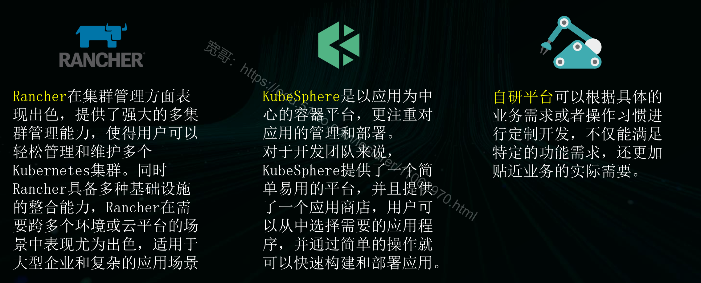
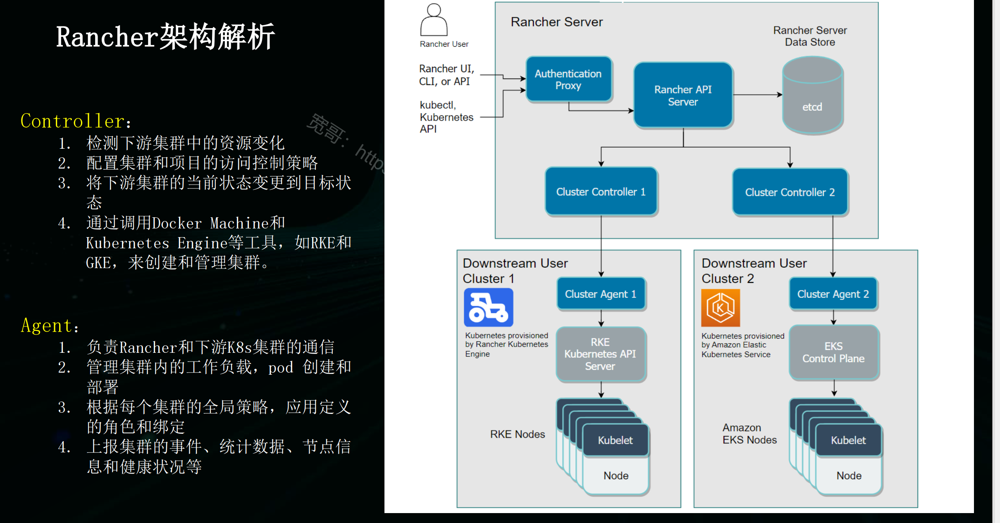
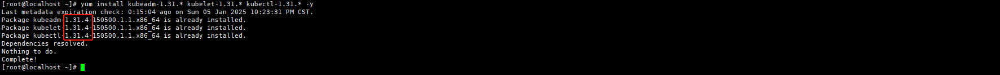
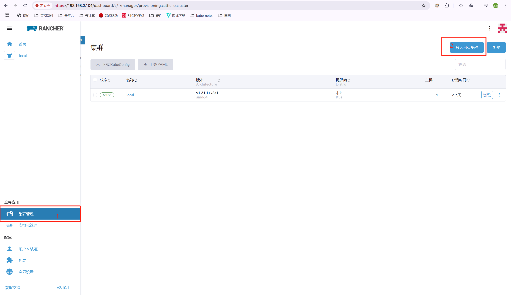
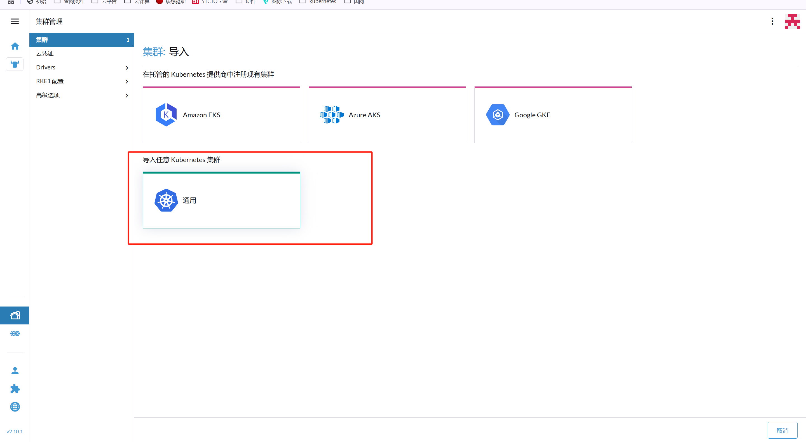
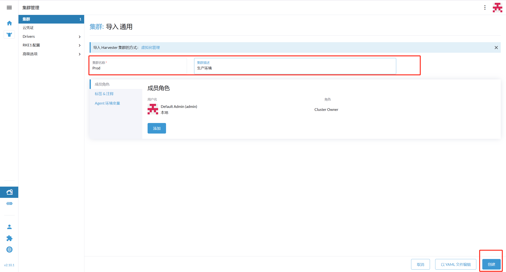
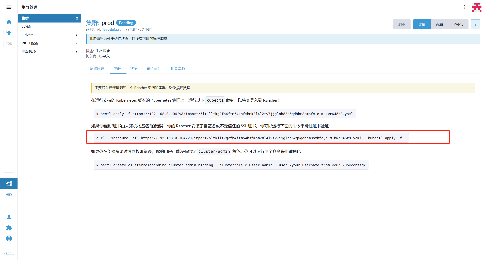
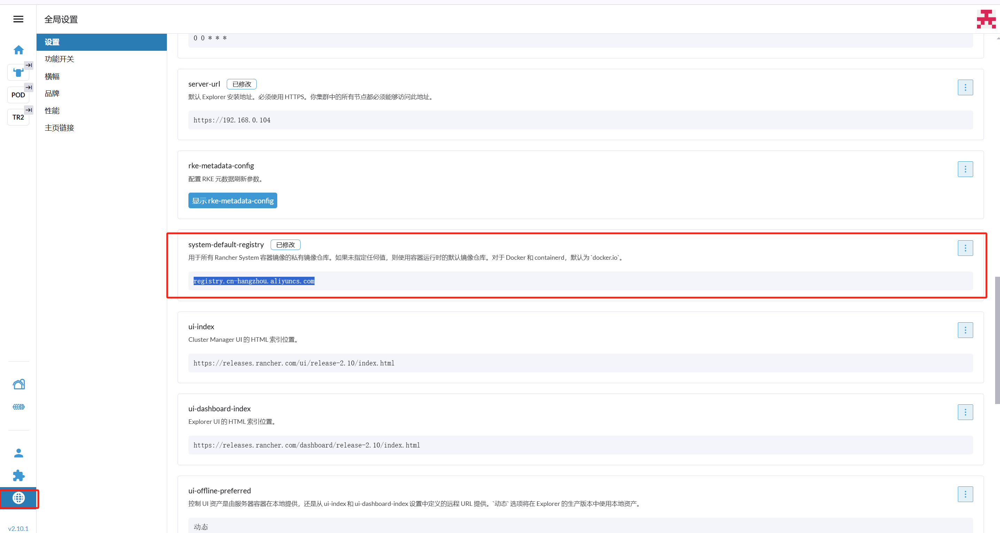
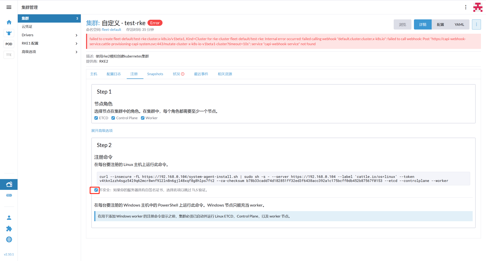
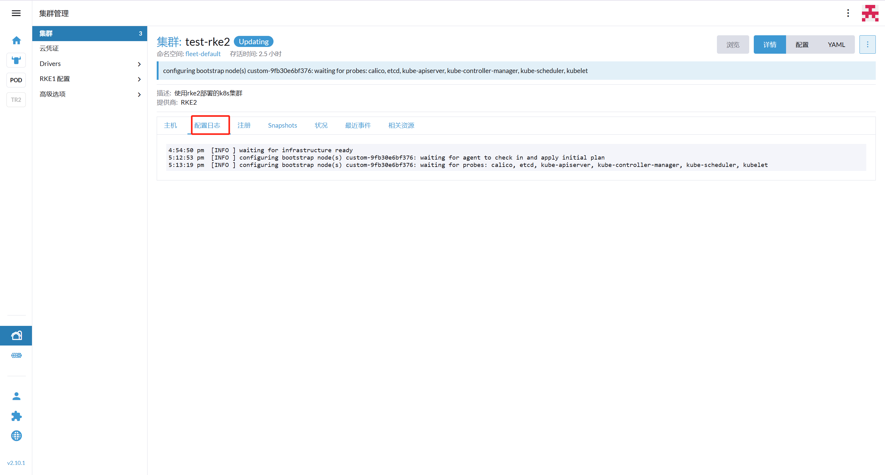

# Rancher

[TOC]

## 前言

#### 1.Rancher是什么

Rancher是一个Kubernetes管理工具，可以在任何地方部署、运行和管理K8s集群。

Rancher可以为集群提供更精细的监控和告警，并且可以将告警信息发送到外部提供商。同时Rancher可以对接已有的CI/CD系统，也可以使用Rancher提供的Fleet工具，自动部署和升级工作负载。


#### 2.Rancher可以做什么

支持部署集群和管理现有集群

支持K8s多集群进行集中认证、访问控制和监控

支持对接AD（Active Directory）等域认证

支持一站式查看所有集群的运行状态和容量

支持Helm仓库

支持日志、监控、告警、服务网格管理


#### 3.Rancher和Kubernetes的关系？

Kubernetes是一个开源的容器编排系统，用于管理多个主机上的容器化应用。

Rancher是一个企业级多集群Kubernetes管理平台，可以对存在于本地、私有云、公有云上的Kubernetes做统一管理。

Rancher是建于Kubernetes之上的，并且提供了一个友好的管理页面，帮助技术人员轻松部署、管理和监控K8s集群。同时Rancher还提供了很多附加的功能和工具，让技术人员更简单的管理和维护Kubernetes集群


#### 4.Rancher类似平台对比  



## 架构图



## Rancher 部署指南

### ※ 软硬件要求

| VMWare   | 17 PRO      |                                                              |
| -------- | ----------- | ------------------------------------------------------------ |
| 机器配置 | 4C/4G/100G+ | 生产环境8C/16G                                               |
| 操作系统 | Rocky8.10   | `https://download.rockylinux.org/pub/rocky/8/isos/x86_64/Rocky-8.10-x86_64-dvd1.iso` |
| 基础环境 | Docker/K8s  |                                                              |
| rancher  | v2.10.1     | `docker pull registry.cn-hangzhou.aliyuncs.com/rancher/rancher:v2.10.1` |


### 1.基础环境搭建

```bash
systemctl disable --now firewalld
setenforce 0

sed -i 's#SELINUX=enforcing#SELINUX=disabled#g' /etc/sysconfig/selinux
sed -i 's#SELINUX=enforcing#SELINUX=disabled#g' /etc/selinux/config

swapoff -a && sysctl -w vm.swappiness=0
sed -ri '/^[^#]*swap/s@^@#@' /etc/fstab

yum install wget jq psmisc vim net-tools telnet yum-utils device-mapper-persistent-data lvm2 git -y
yum-config-manager --add-repo https://mirrors.aliyun.com/docker-ce/linux/centos/docker-ce.repo

sudo modprobe overlay
sudo modprobe br_netfilter

cat > /etc/modules-load.d/rancher-modules.conf <<EOF
overlay
br_netfilter
EOF

cat > /etc/sysctl.d/99-kubernetes-cri.conf <<EOF
net.bridge.bridge-nf-call-iptables = 1
net.ipv4.ip_forward = 1
net.bridge.bridge-nf-call-ip6tables = 1
EOF
sudo sysctl --system

yum install docker-ce -y
systemctl enable docker --now 

cat > /etc/docker/daemon.json <<EOF
{
  "registry-mirrors": [
    "https://docker.nastool.de",
    "https://docker.1ms.run",
    "https://docker.1panel.live",
    "https://hub1.nat.tf",
    "https://docker.1panel.top",
    "https://dockerpull.org",
    "https://docker.13140521.xyz"
  ]
}
EOF
systemctl daemon-reload
systemctl restart docker
```

### 2.Rancher安装

```bash
mkdir -p /data/rancher
docker pull registry.cn-hangzhou.aliyuncs.com/rancher/rancher:v2.10.1
docker run -d \
  --name rancher \
  --restart=unless-stopped \
  --privileged \
  -v /data/rancher:/var/lib/rancher \
  -p 443:443 \
  -p 80:80 \
  registry.cn-beijing.aliyuncs.com/dotbalo/rancher:v2.10.1
```

> [!CAUTION]
>
> 注意 rancher 容器的状态为运行并不代表他现在就可以 WEB 访问,需要等待 集群状态初始化完成
>
> 使用  `docker logs -f rancher`  可以进行查看，这个时间可能会持续10~20分钟


### 3.WEB访问

浏览器访问 `https://192.168.0.104:443`

```bash
# 查看密码
[root@Rancher data]# docker logs rancher 2>&1 | grep "Bootstrap Password:"
2025/01/03 10:56:13 [INFO] Bootstrap Password: 7z7k6dcdctz7s99dqw6gpf9kpr42htqd42wlvhk2nvkwmfncld5x2q
```


## kubeadm 部署 kubernetes

### ※ 软硬件要求

| Rocky8.10  | `https://download.rockylinux.org/pub/rocky/8/isos/x86_64/Rocky-8.10-x86_64-dvd1.iso` |      |
| ---------- | ------------------------------------------------------------ | ---- |
| K8S-Master | 192.168.0.105                                                |      |
| K8S-Works  | 192.168.0.106                                                |      |
| kubeadm    | vsersion--1.31.4                                             |      |
| kubelet    | vsersion--1.31.4                                             |      |
| kubectl    | vsersion--1.31.4                                             |      |

**修改主机名称**

```bash
hostnamectl set-hostname K8S-Master
hostnamectl set-hostname K8S-Works
```

### 1.基础环境搭建

```bash
systemctl disable --now firewalld
systemctl disable --now dnsmasq

setenforce 0
sed -i 's#SELINUX=enforcing#SELINUX=disabled#g' /etc/sysconfig/selinux
sed -i 's#SELINUX=enforcing#SELINUX=disabled#g' /etc/selinux/config

swapoff -a && sysctl -w vm.swappiness=0
sed -ri '/^[^#]*swap/s@^@#@' /etc/fstab

sed -e 's|^mirrorlist=|#mirrorlist=|g' \
    -e 's|^#baseurl=http://dl.rockylinux.org/$contentdir|baseurl=https://mirrors.aliyun.com/rockylinux|g' \
    -i.bak \
    /etc/yum.repos.d/Rocky-*.repo
dnf makecache

# -e 's|^mirrorlist=|#mirrorlist=|g'：注释掉所有 mirrorlist 行。
# -e 's|^#baseurl=http://dl.rockylinux.org/$contentdir|baseurl=https://mirrors.aliyun.com/rockylinux|g'：取消注释并替换 baseurl 地址为阿里云镜像源地址。
# -i.bak：对文件进行原地修改，同时备份 .bak 文件。

yum install wget jq psmisc vim net-tools telnet yum-utils device-mapper-persistent-data lvm2 git -y

#注意版本号的更换，需要安装什么版本的k8s，按照实际情况进行修改即可
cat > /etc/yum.repos.d/kubernetes.repo <<EOF
[kubernetes]
name=Kubernetes
baseurl=https://mirrors.aliyun.com/kubernetes-new/core/stable/v1.31/rpm/
enabled=1
gpgcheck=1
gpgkey=https://mirrors.aliyun.com/kubernetes-new/core/stable/v1.31/rpm/repodata/repomd.xml.key
EOF

yum-config-manager --add-repo https://mirrors.aliyun.com/docker-ce/linux/centos/docker-ce.repo
```

### 2.安装containerd

```bash
yum install containerd.io -y
cat > /etc/modules-load.d/containerd.conf <<EOF
overlay
br_netfilter
EOF

sudo modprobe overlay
sudo modprobe br_netfilter

cat > /etc/sysctl.d/99-kubernetes-cri.conf <<EOF
net.bridge.bridge-nf-call-iptables = 1
net.ipv4.ip_forward = 1
net.bridge.bridge-nf-call-ip6tables = 1
EOF
sudo sysctl --system

sudo mkdir -p /etc/containerd
containerd config default | sudo cat > /etc/containerd/config.toml

sed -i 's#SystemdCgroup = false#SystemdCgroup =true#g' /etc/containerd/config.toml
sed -i 's#k8s.gcr.io/pause#registry.cn-hangzhou.aliyuncs.com/google_containers/pause#g' /etc/containerd/config.toml
sed -i 's#registry.gcr.io/pause#registry.cn-hangzhou.aliyuncs.com/google_containers/pause#g' /etc/containerd/config.toml
sed -i 's#registry.k8s.io/pause#registry.cn-hangzhou.aliyuncs.com/google_containers/pause#g' /etc/containerd/config.toml

# 启动Containerd
systemctl daemon-reload
systemctl enable --now containerd
```

### 3.安装kubeadm

```bash
yum install kubeadm-1.31.* kubelet-1.31.* kubectl-1.31.* -y
systemctl enable --now kubelet

# 下载镜像
kubeadm config images pull --image-repository registry.cn-hangzhou.aliyuncs.com/google_containers --kubernetes-version 1.31.4

[root@localhost ~]# kubeadm config images pull \
> --image-repository registry.cn-hangzhou.aliyuncs.com/google_containers --kubernetes-version 1.31.4
[config/images] Pulled registry.cn-hangzhou.aliyuncs.com/google_containers/kube-apiserver:v1.31.4
[config/images] Pulled registry.cn-hangzhou.aliyuncs.com/google_containers/kube-controller-manager:v1.31.4
[config/images] Pulled registry.cn-hangzhou.aliyuncs.com/google_containers/kube-scheduler:v1.31.4
[config/images] Pulled registry.cn-hangzhou.aliyuncs.com/google_containers/kube-proxy:v1.31.4
[config/images] Pulled registry.cn-hangzhou.aliyuncs.com/google_containers/coredns:v1.11.3
[config/images] Pulled registry.cn-hangzhou.aliyuncs.com/google_containers/pause:3.10
[config/images] Pulled registry.cn-hangzhou.aliyuncs.com/google_containers/etcd:3.5.15-0
```



#### 3.1 Master节点初始化

```bash
kubeadm init --apiserver-advertise-address 192.168.0.105 --image-repository registry.cn-hangzhou.aliyuncs.com/google_containers --cri-socket "unix:///var/run/containerd/containerd.sock" --kubernetes-version 1.31.4 
# 版本需要替换为实际版本号


Your Kubernetes control-plane has initialized successfully!

To start using your cluster, you need to run the following as a regular user:

  mkdir -p $HOME/.kube
  sudo cp -i /etc/kubernetes/admin.conf $HOME/.kube/config
  sudo chown $(id -u):$(id -g) $HOME/.kube/config

Alternatively, if you are the root user, you can run:

  export KUBECONFIG=/etc/kubernetes/admin.conf

You should now deploy a pod network to the cluster.
Run "kubectl apply -f [podnetwork].yaml" with one of the options listed at:
  https://kubernetes.io/docs/concepts/cluster-administration/addons/

Then you can join any number of worker nodes by running the following on each as root:

kubeadm join 192.168.0.105:6443 --token su6wcn.5qw19ib5lc9vb3xm \
	--discovery-token-ca-cert-hash sha256:c7d4d20d51f4cc24d8745c3561f40d060ba31d1bb205c9b4f02923b7457aadde 

```

#### 3.2 Work节点加入集群

```bash
kubeadm join 192.168.0.105:6443 --token su6wcn.5qw19ib5lc9vb3xm \
	--discovery-token-ca-cert-hash sha256:c7d4d20d51f4cc24d8745c3561f40d060ba31d1bb205c9b4f02923b7457aadde
```

#### 3.3 为Master节点配置kubectl

```bash
mkdir -p $HOME/.kube
sudo cp -i /etc/kubernetes/admin.conf $HOME/.kube/config
sudo chown $(id -u):$(id -g) $HOME/.kube/config
```

#### 3.4 安装Addons 安装

```bash
git clone https://gitee.com/dukuan/k8s-ha-install.git
cd k8s-ha-install
kubectl create -f calico.yaml
kubectl create -f krm.yaml
```

#### 3.5 查看集群

```bash
[root@K8S-Master k8s-ha-install]# kubectl get node -owide
NAME         STATUS   ROLES           AGE   VERSION   INTERNAL-IP     EXTERNAL-IP   OS-IMAGE                            KERNEL-VERSION             CONTAINER-RUNTIME
k8s-master   Ready    control-plane   32h   v1.31.4   192.168.0.105   <none>        Rocky Linux 8.10 (Green Obsidian)   4.18.0-553.el8_10.x86_64   containerd://1.6.32
k8s-works    Ready    <none>          32h   v1.31.4   192.168.0.106   <none>        Rocky Linux 8.10 (Green Obsidian)   4.18.0-553.el8_10.x86_64   containerd://1.6.32
```


### 4.将K8S 集群导入到Rancher中









#### 4.1 在Master拥有kubectl节点执行

```bash
#将K8S集群导入到rancher中
curl --insecure -sfL https://192.168.0.104/v3/import/5ltklltkg2fb4ftm54ksfmhmk8l4l2tv7jjglnb52q5qdhbm8smhfc_c-m-kwr645z9.yaml | kubectl apply -f -

#查看所有cattle-system资源
kubectl get all -n cattle-system

#可能会存在下载失败情况，因为这个rancher-agent镜像需要连接外网才可以下载,可以修工修改deploy-image，替换为以下镜像 registry.cn-beijing.aliyuncs.com/dotbalo/rancher-agent:v2.10.1
kubectl edit deploy cattle-cluster-agent -n cattle-system

%s/rancher\/rancher-agent:v2.10.1/registry.cn-beijing.aliyuncs.com\/dotbalo\/rancher-agent:v2.10.1/g
```

#### 4.2如果下载镜像失败，可以修改镜像仓库

```bash
registry.cn-hangzhou.aliyuncs.com
```




## Rancher 部署 kubernetes

### ※ 软硬件要求

| Rocky8.10            | `https://download.rockylinux.org/pub/rocky/8/isos/x86_64/Rocky-8.10-x86_64-dvd1.iso` |      |
| -------------------- | ------------------------------------------------------------ | ---- |
| Rke2-k8s-Master      | 192.168.0.107                                                |      |
| 基础环境             | docker-ce                                                    |      |
| Rancher-server-agent | rancher-system-agent version v0.3.11                         |      |
| rke2                 | containerd                                                   |      |

**修改主机名称**

```bash
hostnamectl set-hostname Rke2-K8s-Master
```

### 1.基础环境搭建

```bash
systemctl disable --now firewalld
setenforce 0

sed -i 's#SELINUX=enforcing#SELINUX=disabled#g' /etc/sysconfig/selinux
sed -i 's#SELINUX=enforcing#SELINUX=disabled#g' /etc/selinux/config

swapoff -a && sysctl -w vm.swappiness=0
sed -ri '/^[^#]*swap/s@^@#@' /etc/fstab

yum install wget jq psmisc vim net-tools telnet yum-utils device-mapper-persistent-data lvm2 git -y
yum-config-manager --add-repo https://mirrors.aliyun.com/docker-ce/linux/centos/docker-ce.repo

sudo modprobe overlay
sudo modprobe br_netfilter

cat > /etc/modules-load.d/rancher-modules.conf <<EOF
overlay
br_netfilter
EOF

cat > /etc/sysctl.d/99-kubernetes-cri.conf <<EOF
net.bridge.bridge-nf-call-iptables = 1
net.ipv4.ip_forward = 1
net.bridge.bridge-nf-call-ip6tables = 1
EOF
sudo sysctl --system

yum install docker-ce -y
systemctl enable docker --now 
```

### 2.WEB 界面创建集群



### 3.Master注册到集群中

如果是添加worker节点，需要把ETCD和ControlPlance去掉勾选，如果是高可用需要至少两台master

```bash
curl --insecure -fL https://192.168.0.104/system-agent-install.sh | sudo sh -s - --server https://192.168.0.104 --label 'cattle.io/os=linux' --token v4tknlzzh4sgz54l9q62mcr8wnf9l2ln8n6gjl48xqf8g8hlps7ft2 --ca-checksum b78b33cadd74d182851ff32ed3f6438acc392a1c175bcff0db452b87567f0153 --etcd --controlplane --worker 
```

#### 3.1 查看服务状态

```bash
systemctl status rancher-system-agent
```

#### 3.2 查看日志

```bash
tail -f /var/log/message
```

**WEB可以在这里看到部署日志**



### 4.二进制ctl命令

#### 4.1 临时生效

```bash
export CRI_CONFIG_FILE=/var/lib/rancher/rke2/agent/etc/crictl.yaml
ln -s /var/lib/rancher/rke2/bin/crictl /usr/local/bin
crictl ps

export KUBECONFIG=/etc/rancher/rke2/rke2.yaml
ln -s /var/lib/rancher/rke2/bin/kubectl /usr/local/bin
kubectl get nodes
```

#### 4.2 当前用户永久生效

```bash
cat >> ~/.bashrc <<EOF
export CRI_CONFIG_FILE=/var/lib/rancher/rke2/agent/etc/crictl.yaml
export KUBECONFIG=/etc/rancher/rke2/rke2.yaml
EOF
source ~/.bashrc

ln -s /var/lib/rancher/rke2/bin/crictl /usr/local/bin
ln -s /var/lib/rancher/rke2/bin/kubectl /usr/local/bin
```

#### 4.3 所有用户生效

```bash
cat >> /etc/profile <<EOF
export CRI_CONFIG_FILE=/var/lib/rancher/rke2/agent/etc/crictl.yaml
export KUBECONFIG=/etc/rancher/rke2/rke2.yaml
EOF
source /etc/profile

ln -s /var/lib/rancher/rke2/bin/crictl /usr/local/bin
ln -s /var/lib/rancher/rke2/bin/kubectl /usr/local/bin
```


## FAQ

**如果集群时间中提示pause镜像问题，请进入rancher容器里面下载一下pause镜像**

```bash
ctr --address /run/k3s/containerd/containerd.sock -n k8s.io i pull registry.cn-hangzhou.aliyuncs.com/rancher/mirrored-pause:3.6 ; ctr --address /run/k3s/containerd/containerd.sock -n k8s.io i tag registry.cn-hangzhou.aliyuncs.com/rancher/mirrored-pause:3.6 docker.io/rancher/mirrored-pause:3.6
```


**charts 仓库地址**

```url
https://charts.bitnami.com/bitnami
```


