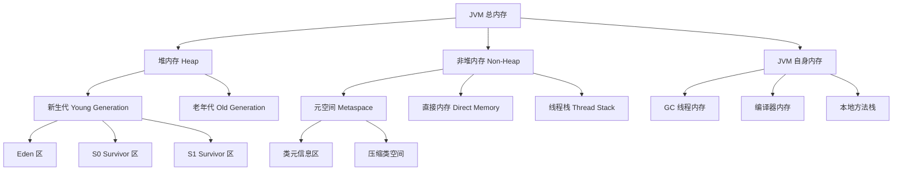

# JVM 配置与内存故障排查

## 前言

本文适用于 Java 应用（尤其是容器化部署场景）的 JVM 配置优化、启动参数验证及内存相关故障（OOM、内存泄漏、高内存占用）排查。文档整合**理论解析 + 实战命令 + 案例落地 + 可视化图表**，提供可直接复制的配置模板和命令集，帮助运维 / 开发人员快速解决 JVM 相关问题，覆盖从基础配置到故障定位的全流程。


***

## 一、JVM 内存结构与核心配置参数

### 1.1 内存结构总览（mermaid 可视化）




### 1.2 堆内存（Heap）：应用数据核心区

#### 核心特性

* 存储对象实例、数组，是 GC 主要作用区域

* 分为新生代（Young Generation）和老年代（Old Generation）

* 新生代默认占堆内存 1/3，老年代占 2/3

* 新生代采用 Minor GC，老年代采用 Major GC/Full GC

#### 关键配置参数表

| 参数                       | 含义                          | 默认值（JDK8）        | 取值范围          | 生产配置建议                                                 |
| -------------------------- | ----------------------------- | --------------------- | ----------------- | ------------------------------------------------------------ |
| `-Xms`                     | 初始堆内存（最小堆）          | 物理内存 1/64         | 1M\~ 物理内存 1/2 | 与 `-Xmx` 保持一致（避免频繁扩容），容器环境设为 limit 的 50%\~60% |
| `-Xmx`                     | 最大堆内存（堆上限）          | 物理内存 1/4          | 1M\~ 物理内存 1/2 | 容器环境不超过 limit 的 70%，如 8G 容器设为 5G               |
| `-XX:NewSize`              | 新生代初始大小                | 堆内存 1/3            | 1M\~`-Xmx` 的 80% | 无需手动设置，由 JVM 自动优化                                |
| `-XX:MaxNewSize`           | 新生代最大大小                | 堆内存 1/3            | 1M\~`-Xmx` 的 80% | 同上                                                         |
| `-XX:SurvivorRatio`        | Eden 区与单个 Survivor 区比例 | 8（Eden:S0:S1=8:1:1） | 3\~100            | 高并发场景设为 4（4:1:1），减少 Minor GC 次数；普通场景保持默认 |
| `-XX:NewRatio`             | 老年代与新生代比例            | 2（老：新 = 2:1）     | 1\~100            | 大数据场景设为 3（3:1），增大老年代；微服务场景保持默认      |
| `-XX:MaxTenuringThreshold` | 对象晋升老年代的年龄阈值      | 15                    | 0\~15             | 高频创建销毁对象设为 3\~5，长生命周期对象设为 10\~15         |

#### 配置示例（容器 limit=8G 高并发场景）

```bash
-Xms5G -Xmx5G -XX:SurvivorRatio=4 -XX:MaxTenuringThreshold=5
```

### 1.3 非堆内存：应用运行支撑区

#### 1.3.1 元空间（Metaspace）

* **核心特性**：存储类信息、方法元数据、常量池，替代 JDK7 永久代，不占用堆内存，默认无上限（依赖系统内存）

* **常见问题**：类加载泄漏（频繁动态生成类）导致元空间溢出

* **关键配置参数表**

| 参数                             | 含义                | 默认值（JDK8） | 取值范围    | 生产配置建议                |
| ------------------------------ | ----------------- | --------- | ------- | --------------------- |
| `-XX:MetaspaceSize`            | 元空间初始大小（触发 GC 阈值） | 约 21MB    | 1M\~10G | 128M\~256M（根据依赖包数量调整） |
| `-XX:MaxMetaspaceSize`         | 元空间最大上限           | 无上限       | 1M\~10G | 512M\~1G（避免占用过多系统内存）  |
| `-XX:CompressedClassSpaceSize` | 压缩类空间大小           | 1G        | 0\~10G  | 512M（关闭压缩类空间设为 0）     |

#### 1.3.2 直接内存（Direct Memory）

* **核心特性**：堆外内存，由 NIO/Netty 等组件使用，读写性能高于堆内存，需手动释放

* **常见问题**：未限制上限导致容器内存溢出（OOMKilled）

* **关键配置参数表**

| 参数                        | 含义       | 默认值（JDK8）   | 取值范围    | 生产配置建议                   |
| ------------------------- | -------- | ----------- | ------- | ------------------------ |
| `-XX:MaxDirectMemorySize` | 直接内存最大上限 | 与 `-Xmx` 一致 | 1M\~10G | 1G\~2G（IO 密集场景设为 2G\~4G） |

#### 1.3.3 线程栈（Thread Stack）

* **核心特性**：存储线程执行上下文（局部变量、方法调用栈），每个线程独立占用

* **常见问题**：线程数过多导致总线程栈内存超限

* **关键配置参数表**

| 参数     | 含义      | 默认值（JDK8） | 取值范围    | 生产配置建议                  |
| ------ | ------- | --------- | ------- | ----------------------- |
| `-Xss` | 单个线程栈大小 | 1M        | 64K\~8M | 高线程数场景设为 512K，普通场景设为 1M |

#### 1.3.4 非堆内存配置示例（容器 limit=8G）

```bash
-XX:MetaspaceSize=256M -XX:MaxMetaspaceSize=1G -XX:CompressedClassSpaceSize=512M -XX:MaxDirectMemorySize=2G -Xss512K
```

### 1.4 JVM 自身内存

* **核心特性**：存储 GC 线程、编译器、本地方法栈等 JVM 运行必需内存，无专用配置参数

* **预留建议**：容器环境需预留 10%\~20% 内存，如 8G 容器预留 1G\~1.6G

* **影响因素**：GC 线程数、编译器优化级别（如 `-XX:+TieredCompilation`）

### ❇1.5 容器环境（K8S）专属优化配置

JDK8u191+/JDK11+ 支持容器内存感知，避免 JVM 误判物理机内存：

| **参数**                             | **用户说法** | **实际情况**                                             | **修正建议**                                      |
| :----------------------------------- | :----------- | :------------------------------------------------------- | :------------------------------------------------ |
| `-XX:+UseContainerSupport`           | 默认开启     | **JDK8u191+需显式开启**（JDK10+默认开启）                | 生产环境显式添加该参数，确保跨版本兼容            |
| `-XX:MaxRAMPercentage`               | 默认25.0%    | **JDK8u191+默认25%** ，JDK11+默认50%                     | 根据JDK版本调整，8G容器建议设为50~70%             |
| `-XX:MinRAMPercentage`               | 默认50.0%    | **JDK8u191+默认50%** ，JDK11+默认50%                     | 与MaxRAMPercentage设为一致值（如60%）避免内存波动 |
| 同时设置`-Xms/-Xmx`和`RAMPercentage` | 允许         | **参数冲突**，显式设置`-Xms/-Xmx`会使`RAMPercentage`失效 | 容器环境建议仅用`RAMPercentage`动态调整           |

| 参数                         | 含义            | 默认值   | 生产配置建议                          |
| -------------------------- | ------------- | ----- | ------------------------------- |
| `-XX:+UseContainerSupport` | 启用容器内存感知      | 开启    | 必选参数                            |
| `-XX:MaxRAMPercentage`     | 堆内存占容器总内存最大比例 | 25.0% | 50.0%\~70.0%（如 8G 容器设为 60.0%）   |
| `-XX:MinRAMPercentage`     | 堆内存占容器总内存最小比例 | 50.0% | 与 `MaxRAMPercentage` 一致（避免内存波动） |
| `-XX:InitialRAMPercentage` | 堆内存占容器总内存初始比例 | 50.0% | 与 `MaxRAMPercentage` 一致         |

#### 容器环境完整配置示例（K8S limit=8G 高并发场景）

```bash
-Xms5G -Xmx5G -XX:SurvivorRatio=4 -XX:MaxTenuringThreshold=5 \\

-XX:MetaspaceSize=256M -XX:MaxMetaspaceSize=1G -XX:CompressedClassSpaceSize=512M \\

-XX:MaxDirectMemorySize=2G -Xss512K \\

-XX:+UseContainerSupport -XX:MaxRAMPercentage=60.0 -XX:MinRAMPercentage=60.0 \\

-XX:+UseG1GC -XX:MaxGCPauseMillis=200 -XX:ParallelGCThreads=4 -XX:ConcGCThreads=2
```

***

## 二、JVM 启动命令与优化验证

### 2.1 场景化启动命令模板（含详细注解）

#### 模板 1：高并发微服务（Spring Boot）

```bash
java -jar \\

\# 堆内存配置（容器 limit=8G，占比 60%）

-Xms5G -Xmx5G -XX:SurvivorRatio=4 -XX:MaxTenuringThreshold=5 \\

\# 非堆内存配置

-XX:MetaspaceSize=256M -XX:MaxMetaspaceSize=1G -XX:MaxDirectMemorySize=2G -Xss512K \\

\# 容器环境适配

-XX:+UseContainerSupport -XX:MaxRAMPercentage=60.0 -XX:MinRAMPercentage=60.0 \\

\# GC 算法优化（G1GC 适合高并发）

-XX:+UseG1GC -XX:MaxGCPauseMillis=200 -XX:ParallelGCThreads=4 -XX:ConcGCThreads=2 \\

\# 日志配置（GC 日志+应用日志）

-XX:+PrintGCDetails -XX:+PrintGCTimeStamps -XX:+PrintGCDateStamps -Xloggc:/var/log/app/gc-%t.log \\

-XX:+HeapDumpOnOutOfMemoryError -XX:HeapDumpPath=/var/log/app/heap.dump \\

\# 应用配置

-Dfile.encoding=UTF-8 -Dspring.profiles.active=prod -Dserver.port=8080 \\

\# 性能优化参数

-XX:+TieredCompilation -XX:+AggressiveOpts -XX:+UseFastAccessorMethods \\

your-app.jar
```

#### 模板 2：大数据处理应用（IO 密集型）

```bash
java -jar \\

\# 堆内存配置（容器 limit=16G，占比 65%）

-Xms10G -Xmx10G -XX:NewRatio=3 -XX:MaxTenuringThreshold=10 \\

\# 非堆内存配置（直接内存加大）

-XX:MetaspaceSize=512M -XX:MaxMetaspaceSize=2G -XX:MaxDirectMemorySize=4G -Xss1M \\

\# 容器环境适配

-XX:+UseContainerSupport -XX:MaxRAMPercentage=65.0 -XX:MinRAMPercentage=65.0 \\

\# GC 算法优化（G1GC 大堆内存适配）

-XX:+UseG1GC -XX:MaxGCPauseMillis=300 -XX:G1HeapRegionSize=32M -XX:G1ReservePercent=15 \\

\# 日志配置

-XX:+PrintGCDetails -XX:+PrintGCTimeStamps -Xloggc:/var/log/app/gc.log \\

-XX:+HeapDumpOnOutOfMemoryError -XX:HeapDumpPath=/var/log/app/heap.dump \\

\# 应用配置

-Dfile.encoding=UTF-8 -Dspring.profiles.active=prod -Djava.io.tmpdir=/data/tmp \\

your-app.jar
```

#### 模板 3：轻量微服务（资源受限场景，容器 limit=4G）

```bash
java -jar \\

\# 堆内存配置（占比 50%）

-Xms2G -Xmx2G -XX:SurvivorRatio=6 -XX:MaxTenuringThreshold=8 \\

\# 非堆内存配置（精简）

-XX:MetaspaceSize=128M -XX:MaxMetaspaceSize=512M -XX:MaxDirectMemorySize=1G -Xss512K \\

\# 容器环境适配

-XX:+UseContainerSupport -XX:MaxRAMPercentage=50.0 -XX:MinRAMPercentage=50.0 \\

\# GC 算法优化（SerialGC 轻量场景）

-XX:+UseSerialGC -XX:SoftRefLRUPolicyMSPerMB=0 \\

\# 日志配置

-XX:+PrintGCDetails -Xloggc:/var/log/app/gc.log \\

-XX:+HeapDumpOnOutOfMemoryError -XX:HeapDumpPath=/var/log/app/heap.dump \\

\# 应用配置

-Dfile.encoding=UTF-8 -Dspring.profiles.active=prod \\

your-app.jar
```

### 2.2 Jar包性能最佳实践

除JVM参数外，jar包本身的构建和部署方式也会影响性能，需遵循以下最佳实践：

#### 1. Jar包优化构建

- **启用类压缩**：Maven配置<archive><compress>true</compress></archive>减小jar包体积
- **排除无用依赖**：使用mvn dependency:analyze检测未使用依赖，通过<exclusion>排除
- **合并重复依赖**：通过mvn dependency:tree检查版本冲突，统一依赖版本

#### 2. 运行时优化

- **使用最新JDK版本**：JDK 17比JDK 8性能提升约30%，且长期支持（LTS）
- **启用分层编译**：-XX:+TieredCompilation（JDK 8默认开启），提升热点代码编译效率
- **使用AOT编译**：JDK 9+支持jaotc工具预编译热点类，减少运行时JIT编译开销

#### 3. 容器化部署优化

- **设置合理的CPU限制**：避免CPU过度共享导致GC停顿延长

- **使用内存限制匹配JVM配置**：Docker内存限制应大于JVM总内存需求（预留非堆和直接内存空间）

- **启用容器感知**：JDK 10+默认开启-XX:+UseContainerSupport


## 三、JVM内存故障排查命令集

  ### 堆内存占用分析工具

  堆内存问题是最常见的JVM故障，主要表现为OOM错误或GC频繁，需通过专业命令精准定位问题根源。

  #### jmap：堆内存快照分析

  **生成堆转储文件**：

  ```bash
  # 生成堆快照（不会暂停应用）
  jmap -dump:format=b,file=heap_dump_20251214.hprof <pid>
  
  # 示例输出：
  # Dumping heap to /opt/app/heap_dump_20251214.hprof ...
  # Heap dump file created
  ```

  **查看堆内存统计**：

  ```bash
  # 查看堆内存使用概况
  jmap -heap <pid>
  
  # 示例输出（关键部分）：
  # Heap Configuration:
  #   MaxHeapSize              = 4294967296 (4096.0MB)
  # Heap Usage:
  # PS Young Generation
  # Eden Space:
  #   capacity = 1509949440 (1440.0MB)
  #   used     = 858993459 (820.0MB)
  #   free     = 650955981 (620.0MB)
  #   56.89% used
  ```

  **统计对象实例数量**：

  ```bash
  # 按类统计实例数量和内存占用
  jmap -histo:live <pid> | head -20  # live参数只统计存活对象
  
  # 示例输出（关键部分）：
  #  num     #instances         #bytes  class name
  # ----------------------------------------------
  #   1:         895632      143301120  java.lang.String
  #   2:         765210      122433600  java.util.HashMap$Node
  #   3:         235680       56563200  java.util.ArrayList
  ```

  #### jstat：JVM统计信息监控

  **GC统计实时监控**：

  ```bash
  # 每1秒输出一次GC统计，共输出10次
  jstat -gcutil <pid> 1000 10
  
  # 输出字段说明：
  # S0: Survivor0区使用率 S1: Survivor1区使用率 E: Eden区使用率
  # O: 老年代使用率 M: 元空间使用率 CCS: 压缩类空间使用率
  # YGC: 新生代GC次数 YGCT: 新生代GC耗时 FGC: Full GC次数 FGCT: Full GC耗时
  # GCT: 总GC耗时
  
  # 示例输出：
  #  S0     S1     E      O      M     CCS    YGC     YGCT    FGC    FGCT     GCT
  #  0.00  50.00  85.32  72.15  90.23  85.67   1256    8.234    45    6.782   15.016
  ```

  **监控新生代内存变化**：

  ```bash
  jstat -gccapacity <pid>  # 查看各代内存容量
  jstat -gcnew <pid>       # 查看新生代GC情况
  jstat -gcold <pid>       # 查看老年代GC情况
  ```

  #### 堆内存问题案例分析

  **问题现象**：某订单系统每小时出现一次GC停顿（约3秒），影响交易成功率
  **排查步骤**：

  1. 使用jstat -gcutil <pid> 1000监控发现FGC频繁（每小时12次），FGCT累计达36秒
  2. 执行jmap -histo:live <pid>发现com.example.Order对象达50万个，怀疑订单对象未及时释放
  3. 生成堆快照jmap -dump:format=b,file=order_heap.hprof <pid>，使用MAT工具分析
  4. 发现订单缓存使用HashMap未设置过期策略，导致历史订单对象常驻老年代

  **解决方案**：将订单缓存替换为Guava Cache并设置过期时间，优化后FGC降至每8小时1次，停顿时间缩短至200ms。

  ### 非堆内存问题定位流程

  非堆内存溢出（如Metaspace OOM）虽不如堆内存问题常见，但排查难度更大，需遵循系统化流程：

  #### 非堆内存排查命令集

  ```bash
  # 1. 查看元空间使用情况
  jstat -gcmetacapacity <pid>
  
  # 输出示例：
  #  MCMN       MCMX        MC       CCSMN      CCSMX       CCSC     YGC   FGC    FGCT     GCT
  #  0.0       268435456  201326592.0  0.0      1073741824.0  150994944.0  1256    45    6.782   15.016
  # MC: 当前元空间大小 MCMX: 最大元空间大小 CCSC: 当前压缩类空间大小
  
  # 2. 跟踪类加载情况（需启动时添加-XX:+TraceClassLoading参数）
  jstack <pid> | grep "ClassLoad"  # 查看类加载线程状态
  
  # 3. 查看类加载统计
  jcmd <pid> VM.class_stats | head -30  # JDK 10+支持，输出类加载详细统计
  
  # 4. 检测元空间泄漏
  jmap -clstats <pid>  # 输出类加载器统计信息，重点关注"loaded classes"和"unloaded classes"是否平衡
  ```

  #### 非堆内存泄漏排查流程

  ```mermaid
  graph LR
      A[发现Metaspace OOM] --> B[检查MaxMetaspaceSize设置]
      B -->|未设置| C[添加-XX:MaxMetaspaceSize=256M]
      B -->|已设置| D[执行jmap -clstats <pid>]
      D --> E[分析类加载器是否泄漏]
      E -->|是| F[查找重复加载的类/自定义类加载器未释放]
      E -->|否| G[检查第三方库是否存在类元数据膨胀]
      F --> H[修复类加载器泄漏代码]
      G --> I[升级依赖库/排除冲突依赖]
  ```

  **案例**：某应用使用自定义类加载器加载插件，出现Metaspace持续增长。通过jmap -clstats <pid>发现PluginClassLoader实例达1000+，且每个加载器都加载了相同的200个类。原因是插件卸载后未释放类加载器引用，导致类元数据无法回收。修复方案：使用弱引用存储类加载器，在插件卸载时显式将引用置为null。

  ### 线程相关bug检测

  线程问题主要表现为CPU使用率高、死锁、线程阻塞等，jstack命令是定位线程问题的核心工具，能生成线程快照并帮助识别异常线程。

  #### jstack命令

  **生成线程快照**：

  ```bash
  # 生成完整线程快照
  jstack -l <pid> > thread_dump_20251214.txt
  
  # 带锁信息的线程快照（JDK 8+）
  jstack -F <pid>  # 强制生成快照（适用于进程挂起情况）
  ```

  **线程状态解读**：线程快照中线程状态字段是关键，常见状态及含义：

  - **RUNNABLE**：运行中或就绪状态，可能占用CPU
  - **BLOCKED**：等待获取监视器锁，通常是死锁前兆
  - **WAITING**：无限期等待某个条件，需其他线程唤醒
  - **TIMED_WAITING**：有限期等待，无需手动唤醒

  #### 异常线程识别方法

  **1. 死锁检测**：

  ```bash
  # jstack输出中搜索"deadlock"关键字
  grep -A 50 "deadlock" thread_dump_20251214.txt
  
  # 死锁示例输出：
  # Found one Java-level deadlock:
  # =============================
  # "Thread-1":
  #   waiting to lock monitor 0x00007f8a6c003000 (object 0x000000076b6a5f60, a java.lang.Object),
  #   which is held by "Thread-0"
  # "Thread-0":
  #   waiting to lock monitor 0x00007f8a6c005000 (object 0x000000076b6a5f70, a java.lang.Object),
  #   which is held by "Thread-1"
  ```

  **2. 高CPU线程定位**：

  ```bash
  # 1. 查找高CPU线程ID（十进制）
  top -Hp <pid>  # 显示进程内线程CPU占用，找到%CPU最高的线程ID（如12345）
  
  # 2. 转换为十六进制（jstack中线程ID为十六进制）
  printf "%x\n" 12345  # 输出：3039
  
  # 3. 在jstack输出中查找对应线程
  grep -A 20 "nid=0x3039" thread_dump_20251214.txt
  ```

  **3. 阻塞线程分析**：

  重点关注状态为BLOCKED的线程，查看其"waiting to lock"信息，定位被阻塞的锁对象和持有锁的线程。例如：

  ```
  "http-nio-8080-exec-5" #26 daemon prio=5 os_prio=0 tid=0x00007f8a6c123000 nid=0x62 waiting for monitor entry [0x00007f8a5c0f8000]
     java.lang.Thread.State: BLOCKED (on object monitor)
      at com.example.OrderService.createOrder(OrderService.java:45)
      - waiting to lock <0x000000076b6a5f60> (a java.lang.Object)
      at sun.reflect.GeneratedMethodAccessor123.invoke(Unknown Source)
  ```

  #### 线程问题案例分析

  **问题现象**：应用CPU使用率持续100%，响应时间延长
  **排查步骤**：

  1. 执行top -Hp <pid>发现3个线程CPU使用率达30%+，线程ID为1234、1235、1236
  2. 转换为十六进制：0x4d2、0x4d3、0x4d4
  3. jstack <pid> | grep -A 30 "nid=0x4d2"查看线程栈，发现三个线程都在执行com.example.Utils.calculateHash()方法
  4. 检查代码发现该方法使用了synchronized关键字，且存在复杂循环计算，导致线程争用和CPU密集计算

  **解决方案**：

  - 将同步锁粒度从方法级改为对象级
  - 使用java.util.concurrent.locks.ReentrantLock替代synchronized，并设置公平锁
  - 优化哈希计算算法，减少CPU密集操作

  优化后CPU使用率降至20%，响应时间恢复正常。

  ## 总结与最佳实践

  JVM配置与故障排查是Java应用稳定性保障的核心技能，需建立"预防为主，排查为辅"的体系化思维。**最佳实践总结**：

  1. **内存配置三原则**：
     - 堆内存：-Xms与-Xmx设为相同值，新生代占比30%~40%
     - 非堆内存：必须设置MaxMetaspaceSize，建议128M~256M
     - 线程栈：高并发应用设为256k~512k，避免栈溢出同时增加线程数
  2. **故障排查四步法**：
     - 观察：通过jstat、jconsole监控GC和内存趋势
     - 捕获：使用jmap生成堆快照，jstack获取线程快照
     - 分析：用MAT分析堆快照，查找内存泄漏点；用jstack分析线程状态
     - 验证：修改配置后通过jinfo验证参数生效，通过监控确认问题解决
  3. **生产环境必备配置**：

  ```bash
     # 基础配置
      -Xss512k -XX:MetaspaceSize=128M -XX:MaxMetaspaceSize=256M \
      -XX:MaxRAMPercentage=75.0 -XX:MinRAMPercentage=50.0 -XX:+UseContainerSupport
      # GC配置
      -XX:+UseG1GC -XX:MaxGCPauseMillis=200 -XX:+HeapDumpOnOutOfMemoryError
      # 监控与日志
      -XX:+PrintGCDetails -Xloggc:/var/log/app/gc.log -XX:+UseGCLogFileRotation
      
  ```

  通过本文档的配置模板、排查命令和案例分析，可系统化解决JVM内存问题，为Java应用提供稳定可靠的运行环境。实际应用中需结合具体业务场景持续优化，建立适合自身应用的JVM调优体系。