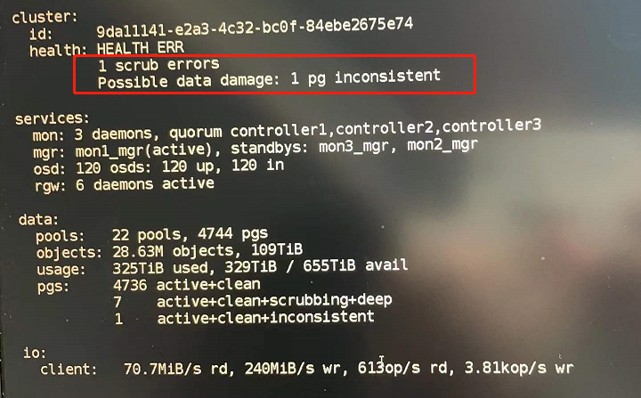
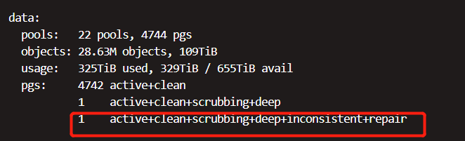
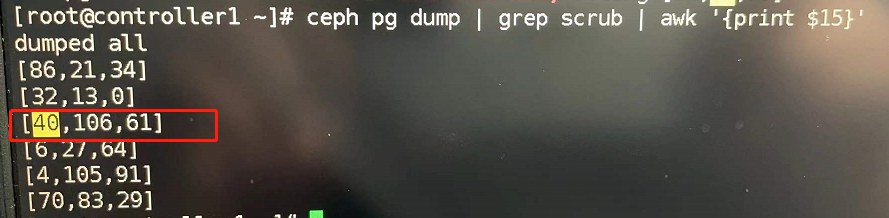

# pg scrub校验不一致处理方法

### 一、现象



### 二、处理方法

#### 2.1 确定不一致的pg 

```bash
ceph health detail | grep inconsistent
```


如图所示，**pg 8.335**校验不一致，其分布在 osd.84、40、79上

#### 2.2 pg修复

 **注意：** **若有多个不一致pg，需逐个进行修复，一个完成后，才能进行下一个！！！**

```bash
ceph pg repair 8.335
```

**命令执行后，等待 1分钟左右，待修复pg会增加 repair 状态，个别特殊情况不会出现，详见 三、注意事项**



#### 2.3 检查修复进展

```bash
#开一个窗口定时查看ceph集群状态
watch -n 1 'ceph -s'
```

**如果所有出现不一致的pg都repair正常完成，集群状态可以正常回归HEALTH_OK，则可以不再进行操作**

**否则请立即通知研发查找失败原因，然后再行处理**

### 三、注意事项

- **当不一致的pg所在的osd中一个或多个正在进行scrub时，执行repair后不会马上进行修复**

  

  如图，osd.40上某个pg正在scrub，等待该osd scrub结束后，会正常进行不一致pg的修复

- 修复时，集群常有以下表现，属于正常现象，等待即可

  - **slow数值大幅增多，集中于不一致pg所在的主osd**
  - **集群读写io、吞吐量明显下降，做好应对客户反馈的准备**
  - **修复时间较长，一般在 2~5小时之间**

