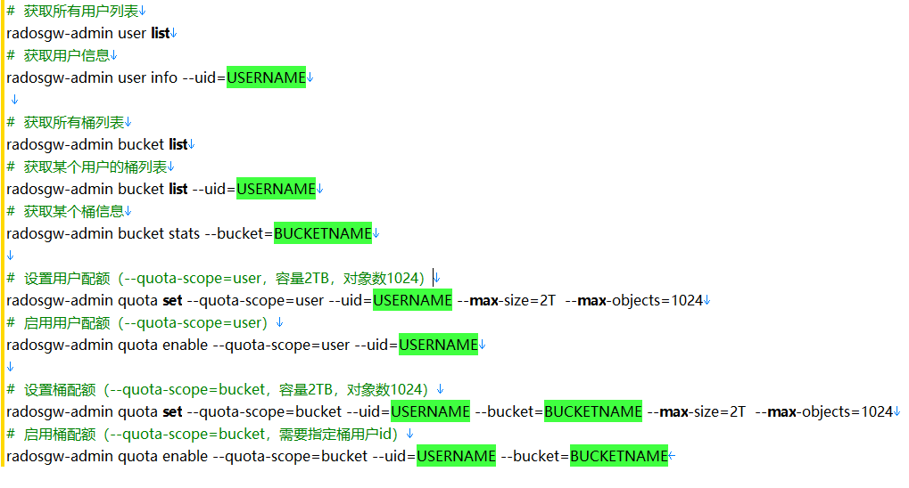

```bash
#  获取所有用户列表
radosgw-admin user list
#  获取用户信息
radosgw-admin user info --uid=USERNAME
 
#  获取所有桶列表
radosgw-admin bucket list
#  获取某个用户的桶列表
radosgw-admin bucket list --uid=USERNAME
#  获取某个桶信息
radosgw-admin bucket stats --bucket=BUCKETNAME

#  设置用户配额（--quota-scope=user，容量2TB，对象数1024）
radosgw-admin quota set --quota-scope=user --uid=USERNAME --max-size=2T  --max-objects=1024
#  启用用户配额（--quota-scope=user）
radosgw-admin quota enable --quota-scope=user --uid=USERNAME

#  设置桶配额（--quota-scope=bucket，容量2TB，对象数1024）
radosgw-admin quota set --quota-scope=bucket --uid=USERNAME --bucket=BUCKETNAME --max-size=2T  --max-objects=1024
#  启用桶配额（--quota-scope=bucket，需要指定桶用户id）
radosgw-admin quota enable --quota-scope=bucket --uid=USERNAME --bucket=BUCKETNAME
```

	