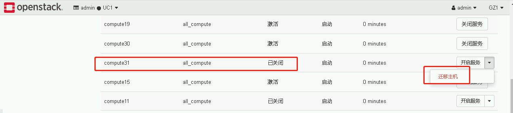
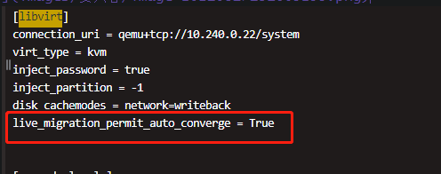

# 主机迁移与疏散

### 一、需求场景及操作

#### 1.1 热迁移

##### 1.1.1 单个主机热迁

​    客户主机所在的物理节点负载高或有潜在故障风险，此时需将主机迁移到其他物理节点

​    **客户主机需为开机状态**

 ```bash
#查询高负载节点上的所有主机
openstack server list --all-project --host 节点主机名

#选择一台主机进行迁移
openstack server show 主机id -c project_id  #查询该主机的所属租户
openstack porject show 租户id -c name    #查询租户名称

#告知租户，协助迁移时间
#监控到您xx账号下的云主机（name、IP）所在的物理机负载较高，为了给您带来更好的使用体验，现在为您更换一台性能更高的物理机。

#从openstack页面找一个资源较空闲的节点进行热迁
openstack server migrate --live 新节点主机名 主机id

#查看进度，主机名、progress
openstack server show 主机id -c 'OS-EXT-SRV-ATTR:host' -c progress
 ```

##### 1.1.2 整个节点热迁

- 适用于节点需进行维护的情况

- 先将节点上的高配置主机单个热迁，关机主机进行冷迁

- 在openstack页面关闭节点的计算服务，并选择整机迁移

  

#### 1.2 冷迁移

​    物理节点正常，但**客户主机为关机状态**

​    不用通知客户，一般优先选择热迁移

   ```bash
#操作步骤与热迁基本一致，迁移命令有所变化
openstack server migrate 主机id
   ```

#### 1.3 主机疏散

​    **物理节点宕机**且不能马上恢复

```bash
nova host-evacuate 故障节点主机名   #疏散故障节点上的所有主机
```

### 二、迁移问题处理

#### 2.1 大内存主机一直处于迁移中

- 解决办法：开启nova配置中的自动收敛功能，通过降低主机cpu使用减少内存脏数据

- 配置文件路径：/etc/kolla/nova-compute/nova.conf

- 添加项：live_migration_permit_auto_converge = True




- 添加之后，重启nova_compute容器

  `docker restart nova_compute`

#### 2.2 迁移失败

 找研发处理，联系人 ----------  王贺