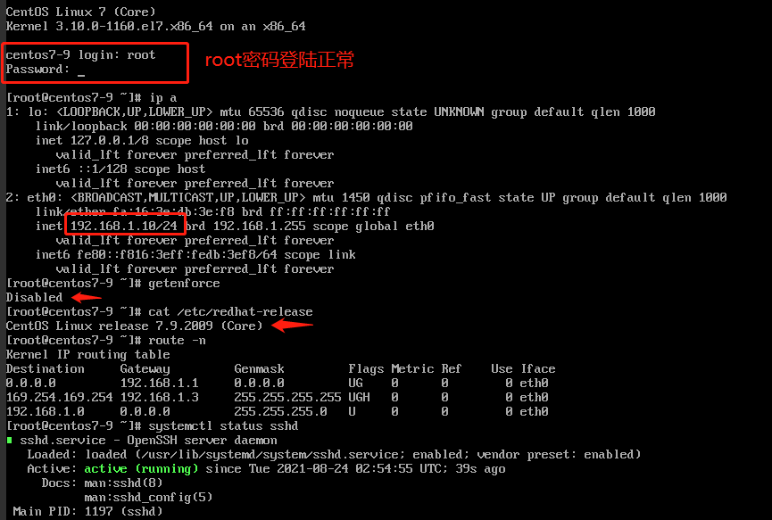

# 镜像制作

### 一、镜像说明

- 镜像指创建云主机时选用的操作系统模板
- 镜像一般有以下需求
  - linux
    - 上海时区
    - 关闭防火墙、selinux
    - 网卡自动发现
    - 开启内网网卡默认路由
  - windows


### 二、制作方法

#### 2.1 云镜像资源

 openstack官方及其他linux发行厂商均提供了常用的linux云镜像，可以对其-个性化定制，满足个性化需求

 云镜像资源地址如下：

- [centos7系列云镜像](http://cloud.centos.org/centos/7/images/)
- [ubuntu云镜像](http://cloud-images.ubuntu.com/releases/)

#### 2.2 linux镜像制作

  以制作 **centos7.9**镜像为例

##### 2.2.1 下载所需版本的qcow格式镜像

找一台能上外网的虚机

下载地址从上一步的云镜像网站中获取

```bash
[root@img images]# curl -o centos7_9.qcow2 http://cloud.centos.org/centos/7/images/CentOS-7-x86_64-GenericCloud-2009.qcow2
  % Total    % Received % Xferd  Average Speed   Time    Time     Time  Current
                                 Dload  Upload   Total   Spent    Left  Speed
 12  847M   12  109M    0     0  9285k      0  0:01:33  0:00:12  0:01:21 12.4M
 
[root@img images]# ll -h
total 848M
-rw-r--r-- 1 root root 848M Aug 23 09:59 centos7_9.qcow2
```

##### 2.2.2 镜像定制

- 环境准备

  ```bash
  #安装kvm工具
  [root@img images] yum install -y qemu-kvm libvirt virt-install bridge-utils
  
  #安装文件系统修改工具
  [root@img images] yum install -y libguestfs-tools
  
  #修改qemu配置，启动libvirt
  [root@img images]# vi /etc/libvirt/qemu.conf  #将以下配置打开
  user = "root"
  group = "root"
  
  #启动libvirt
  [root@img images]# systemctl enable libvirtd
  [root@img images]# systemctl start libvirtd
  
  #将镜像挂载到 /mnt
  [root@img images]# guestmount -a ./centos7_9.qcow2 -m /dev/sda1 --rw /mnt
  
  #挂载成功，可如正常系统一样对配置文件进行修改
  [root@img images]# ls /mnt
  bin  boot  dev  etc  home  lib  lib64  media  mnt  opt  proc  root  run  sbin  srv  sys  tmp  usr  var
  ```

- 更改项

  ```bash
  #ssh设置允许密码登陆
  [root@img ~]# vi /mnt/etc/ssh/sshd_config 
  PasswordAuthentication yes
  
  #cloud-init允许root登陆，允许使用密码
  [root@img ~]# vi /mnt/etc/cloud/cloud.cfg
  disable_root: 0  #1为禁用，0为允许
  ssh_pwauth:   1  #1为启用
      
  #给root用户设置密码,密码为XINnet1_Img2 通过openssl passwd -1 XINnet1_Img2 加密得到 $1$NmAFhC4w$Iu52j/ZTjOhkvdPGUimdb.
  [root@img ~]# vi /mnt/etc/shadow
  root:$1$NmAFhC4w$Iu52j/ZTjOhkvdPGUimdb.:18565:0:99999:7::: 
  
  #禁用selinux
  [root@img ~]# vi /mnt/etc/selinux/config
  SELINUX=disabled
  
  #设置为上海时区
  [root@img ~]# cp /mnt/usr/share/zoneinfo/Asia/Shanghai /mnt/etc/localtime
  
  #防火墙默认关闭
  ```

  **配置完成后，umount /mnt 将镜像卸载**

##### 2.2.3 上传到glance，设为私有

先将配置后的 xx.qcow2格式镜像上传到controller1节点

```bash
[root@controller1 images]# source ~/admin-openrc.sh
[root@controller1 images]# glance image-create --file centos7_9.qcow2 --container-format bare --disk-format qcow2 --visibility private --progress --name Centos-7.9
[=============================>] 100%
+------------------+----------------------------------------------------------------------------------+
| Property         | Value                                                                            |
+------------------+----------------------------------------------------------------------------------+
| checksum         | 8db820bf9114ff17e41aaef63f7da4ac                                                 |
| container_format | bare                                                                             |
| created_at       | 2021-08-24T02:46:53Z                                                             |
| disk_format      | qcow2                                                                            |
| id               | c7ed82bb-d734-4d3a-9a75-ece6d154dbc4                                             |
| min_disk         | 0                                                                                |
| min_ram          | 0                                                                                |
| name             | Centos-7.9                                                                       |
| os_hash_algo     | sha512                                                                           |
| os_hash_value    | 03b7e1de978004e7da871b76c8adf76df04270d47763a85833c54ef5b2de46245021a18f9ea8cad4 |
|                  | ce3ba15aa8d26827cbd29c2287a0e222a195f7ef44e93575                                 |
| os_hidden        | False                                                                            |
| owner            | 2374946a235642878c94d9a19d537692                                                 |
| protected        | False                                                                            |
| size             | 888995840                                                                        |
| status           | active                                                                           |
| tags             | []                                                                               |
| updated_at       | 2021-08-24T02:47:14Z                                                             |
| virtual_size     | Not available                                                                    |
| visibility       | private                                                                          |
+------------------+----------------------------------------------------------------------------------+
```

##### 2.2.4 新镜像测试

  因为预设置为私有镜像，因此需在admin账号下创建主机进行测试，**测试通过后可更改为公有供客户使用**

  测试项：

- ip能否正常获取
- 默认路由是否正常
- 版本是否正确
- 时区是否正确
- 更改的配置是否生效



#### 2.3 windows镜像制作

  