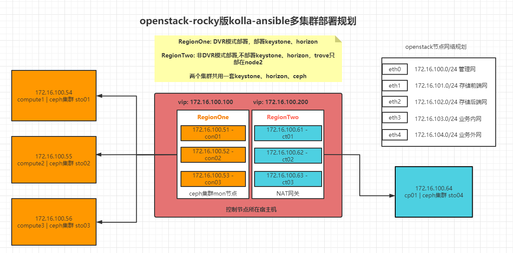

# openstack多集群kolla-ansible部署实践

## 一、目标架构



## 二、基础环境准备

**本次实验均在一台物理机上进行，openstack所有节点均为kvm虚拟机**

### 2.1 物理机配置

```bash
#系统
[root@compute75 ~]# cat /etc/redhat-release
CentOS Linux release 7.5.1804 (Core)

#网络
[root@compute75 ~]# ip a s em1
175: em1: <BROADCAST,MULTICAST,MASTER,UP,LOWER_UP> mtu 1500 qdisc noqueue state UP group default qlen 1000
    link/ether b4:05:5d:ce:bc:9d brd ff:ff:ff:ff:ff:ff
    inet 10.248.11.25/24 brd 10.248.11.255 scope global noprefixroute bond1
       valid_lft forever preferred_lft forever
    inet 10.248.11.26/24 scope global secondary bond1
       valid_lft forever preferred_lft forever
    inet6 fe80::b605:5dff:fece:bc9d/64 scope link
       valid_lft forever preferred_lft forever
```

### 2.2 kvm环境

```bash
#安装依赖包
yum  -y install qemu-kvm qemu-img libvirt libvirt-python libvirt-client virt-install  bridge-utils

#启动libvirt服务
systemctl start libvirtd && systemctl enable libvirtd
```

### 2.3 虚拟网络

如架构图所示，共需要5种网络，本次实验分别创建了5个NAT模式的虚拟网络

```bash
#管理网络
[root@compute75 networks]# cat manage.xml
<network>
  <name>manage</name>
  <uuid>204c3dac-02ae-4844-b3e0-9c4a066ee571</uuid>
  <forward mode='nat'/>
  <bridge name='virbr0' stp='on' delay='0'/>
  <mac address='52:54:00:04:2c:ae'/>
  <ip address='172.16.100.254' netmask='255.255.255.0'>
    <dhcp>
      <range start='172.16.100.2' end='172.16.100.200'/>
    </dhcp>
  </ip>
</network>

#存储前端网
[root@compute75 networks]# cat ceph-front.xml
<network>
  <name>ceph-front</name>
  <uuid>205c3dac-02ae-4834-b3e0-9c4a066ee571</uuid>
  <forward mode='nat'/>
  <bridge name='virbr1' stp='on' delay='0'/>
  <mac address='52:54:00:04:7c:ae'/>
  <ip address='172.16.101.254' netmask='255.255.255.0'>
    <dhcp>
      <range start='172.16.101.2' end='172.16.101.200'/>
    </dhcp>
  </ip>
</network>

#存储后端网
[root@compute75 networks]# cat ceph-backend.xml
<network>
  <name>ceph-backend</name>
  <uuid>204c3dac-02ae-4844-b3e1-9c4a066ee571</uuid>
  <forward mode='nat'/>
  <bridge name='virbr2' stp='on' delay='0'/>
  <mac address='52:54:00:04:4c:ae'/>
  <ip address='172.16.102.254' netmask='255.255.255.0'>
    <dhcp>
      <range start='172.16.102.2' end='172.16.102.200'/>
    </dhcp>
  </ip>

#业务内网
[root@compute75 networks]# cat internal.xml
<network>
  <name>internal</name>
  <uuid>204c3dac-02ae-4854-b3e0-9c4a066ee571</uuid>
  <forward mode='nat'/>
  <bridge name='virbr3' stp='on' delay='0'/>
  <mac address='52:54:00:04:5c:ae'/>
  <ip address='172.16.103.254' netmask='255.255.255.0'>
    <dhcp>
      <range start='172.16.103.2' end='172.16.103.200'/>
    </dhcp>
  </ip>
</network>

#业务外网
[root@compute75 networks]# cat external.xml
</network>
 <name>external</name>
  <uuid>204c3dac-02ae-4843-b3e1-9c4a066ee571</uuid>
  <forward mode='nat'/>
  <bridge name='virbr4' stp='on' delay='0'/>
  <mac address='52:54:00:04:4c:ae'/>
  <ip address='172.16.104.254' netmask='255.255.255.0'>
    <dhcp>
      <range start='172.16.104.2' end='172.16.104.200'/>
    </dhcp>
  </ip>
</network>

#从xml文件创建网络
[root@compute75 networks]# for net in manage ceph-front ceph-backend internal external;do virsh net-create $net.xml;done

#设为自启动
[root@compute75 networks]# for net in manage ceph-front ceph-backend internal external;do virsh net-autostart $net;done

#查看
[root@compute75 networks]# virsh net-list
 Name                 State      Autostart     Persistent
----------------------------------------------------------
 ceph-front           active     yes           yes
 ceph-backend         active     yes           yes
 manage               active     yes           yes
 external             active     yes           yes
 internal             active     yes           yes

```

### 2.4 openstack节点虚拟机

#### 2.4.1 节点规划

| 节点名称 |    节点ip     | 所属集群  |            用途            |
| :------: | :-----------: | :-------: | :------------------------: |
|  con01   | 172.16.100.51 | RegionOne |     控制节点+ceph-mon      |
|  con02   | 172.16.100.52 | RegionOne | 控制节点+ceph-mon+ceph-mgr |
|  con03   | 172.16.100.53 | RegionOne | 控制节点+ceph-mon+ceph-mgr |
| compute1 | 172.16.100.54 | RegionOne |         计算+存储          |
| compute2 | 172.16.100.55 | RegionOne |         计算+存储          |
| compute3 | 172.16.100.56 | RegionOne |         计算+存储          |
|   ct01   | 172.16.100.61 | RegionTwo |          控制节点          |
|   ct02   | 172.16.100.62 | RegionTwo |          控制节点          |
|   ct03   | 172.16.100.63 | RegionTwo |          控制节点          |
|   cp01   | 172.16.100.64 | RegionTwo |         计算+存储          |

#### 2.4.2 创建规划

- 节点系统盘存放路径：/home/disk/
- 节点数据盘存储路径：/home/disk/data
- 节点备份路径：/home/bak

```bash
##基础镜像
[root@compute75 ~]# ll centos7_5.qcow2 && chown qemu:qemu centos7_5.qcow2
-rw-r--r--. 1 qemu qemu 1068236800 Sep  6 16:19 centos7_5.qcow2
#创建存放、备份目录
mkdir /home/disk && chown qemu:qemu /home/disk
mkdir /home/disk/data && chown qemu:qemu /home/disk/data
mkdir /home/bak
```

#### 2.4.3 创建控制节点

以创建RegionOne的con01为例

```bash
#复制镜像，得到系统盘并扩容到100G
cp centos7_5.qcow2 /home/disk/con01.qcow2
qemu-img resize /home/disk/con01.qcow2 100

#创建虚拟机con01,内存、cpu根据实际情况调节
virt-install --name con01 --memory 30720 --vcpus 16 --cpu host-passthrough \
  --virt-type kvm --import --disk /home/disk/con01.qcow2,cache=none --os-variant=rhel7 --network bridge=virbr0 \
  --graphics=none --console=pty,target_type=serial --autostart

virsh edit con01  #网络区域加入以下配置
    <interface type='bridge'>
      <source bridge='virbr1'/>
      <model type='virtio'/>
      <address type='pci' domain='0x0000' bus='0x00' slot='0x09' function='0x0'/>
    </interface>
    <interface type='bridge'>
      <source bridge='virbr2'/>
      <model type='virtio'/>
      <address type='pci' domain='0x0000' bus='0x00' slot='0x10' function='0x0'/>
    </interface>
    <interface type='bridge'>
      <source bridge='virbr3'/>
      <model type='virtio'/>
      <address type='pci' domain='0x0000' bus='0x00' slot='0x11' function='0x0'/>
    </interface>
	 <interface type='bridge'>
      <source bridge='virbr4'/>
      <model type='virtio'/>
      <address type='pci' domain='0x0000' bus='0x00' slot='0x12' function='0x0'/>
    </interface>

#关机、开机使更改生效
virsh shutdown con01 #等待几秒
virsh start con01

#验证
[root@compute75 ~]# virsh console con01
Connected to domain con01
Escape character is ^]

CentOS Linux 7 (Core)
Kernel 3.10.0-1062.18.1.el7.x86_64 on an x86_64

con01 login:xxx
Password: xxx

[root@localhost ~] hostnamectl set-hostname con01 && bash
[root@con01 ~] ip a
1: lo: <LOOPBACK,UP,LOWER_UP> mtu 65536 qdisc noqueue state UNKNOWN group default qlen 1000
2: eth0: <BROADCAST,MULTICAST,UP,LOWER_UP> mtu 1500 qdisc pfifo_fast state UP group default qlen 1000
3: eth1: <BROADCAST,MULTICAST,UP,LOWER_UP> mtu 1500 qdisc pfifo_fast state UP group default qlen 1000
4: eth2: <BROADCAST,MULTICAST,UP,LOWER_UP> mtu 1500 qdisc pfifo_fast state UP group default qlen 1000
5: eth3: <BROADCAST,MULTICAST,UP,LOWER_UP> mtu 1500 qdisc pfifo_fast state UP group default qlen 1000
6: eth4: <BROADCAST,MULTICAST,PROMISC,UP,LOWER_UP> mtu 1500 qdisc pfifo_fast master ovs-system state UP group default qlen 1000

#设置临时ip
[root@con01 ~] ip addr a 172.16.100.51/24 dev eth0
```

#### 2.4.4 创建计算+存储节点

该类型节点既作为计算节点，又作为存储节点

以创建RegionOne的compute1为例

- 添加一块ssd加速盘和5块sata数据盘
- 盘的编号根据节点变化
- **网络配置与控制节点一致**

```bash
#复制镜像，得到系统盘,并扩容到100G
cp centos7_5.qcow2 /home/disk/compute1.qcow2
qemu-img resize /home/disk/compute1.qcow2 100

#创建虚拟机compute1,内存、cpu根据实际情况调节
virt-install --name compute1 --memory 30720 --vcpus 16 --cpu host-passthrough \
  --virt-type kvm --import --disk /home/disk/compute1.qcow2,cache=none --os-variant=rhel7 --network bridge=virbr0 \
  --graphics=none --console=pty,target_type=serial --autostart

#创建硬盘
qemu-img create -f qcow2 /home/disk/ssd1.qcow2 100G
for i in {1..5};do qemu-img create -f qcow2 /home/disk/sata$i.qcow2 500G;done

virsh edit compute1  #磁盘区域添加以下配置
<disk type='file' device='disk'>
      <driver name='qemu' type='qcow2' cache='none'/>
      <source file='/home/disk/data/ssd1.qcow2'/>
      <target dev='vdb' bus='virtio'/>
      <address type='pci' domain='0x0000' bus='0x00' slot='0x13' function='0x0'/>
    </disk>
    <disk type='file' device='disk'>
      <driver name='qemu' type='qcow2' cache='none'/>
      <source file='/home/disk/data/sata1.qcow2'/>
      <target dev='vdc' bus='virtio'/>
      <address type='pci' domain='0x0000' bus='0x00' slot='0x14' function='0x0'/>
    </disk>
    <disk type='file' device='disk'>
      <driver name='qemu' type='qcow2' cache='none'/>
      <source file='/home/disk/data/sata2.qcow2'/>
      <target dev='vdd' bus='virtio'/>
      <address type='pci' domain='0x0000' bus='0x00' slot='0x15' function='0x0'/>
    </disk>
    <disk type='file' device='disk'>
      <driver name='qemu' type='qcow2' cache='none'/>
      <source file='/home/disk/data/sata3.qcow2'/>
      <target dev='vde' bus='virtio'/>
      <address type='pci' domain='0x0000' bus='0x00' slot='0x16' function='0x0'/>
    </disk>
    <disk type='file' device='disk'>
      <driver name='qemu' type='qcow2' cache='none'/>
      <source file='/home/disk/data/sata4.qcow2'/>
      <target dev='vdf' bus='virtio'/>
      <address type='pci' domain='0x0000' bus='0x00' slot='0x17' function='0x0'/>
    </disk>
	<disk type='file' device='disk'>
      <driver name='qemu' type='qcow2' cache='none'/>
      <source file='/home/disk/data/sata5.qcow2'/>
      <target dev='vdg' bus='virtio'/>
      <address type='pci' domain='0x0000' bus='0x00' slot='0x18' function='0x0'/>
    </disk>
    
 #网络配置参考控制节点
 
 #配置验证、临时ip设置参考控制节点
 
 #磁盘配置期望结果
[root@compute1 ~]# lsblk
NAME   MAJ:MIN RM  SIZE RO TYPE MOUNTPOINT
vda    253:0    0  100G  0 disk
└─vda1 253:1    0  100G  0 part /
vdb    253:16   0  100G  0 disk
vdc    253:32   0  500G  0 disk
vdd    253:48   0  500G  0 disk
vde    253:64   0  500G  0 disk
vdf    253:80   0  500G  0 disk
vdg    253:96   0  500G  0 disk
```

#### 2.4.5 创建结果

```bash
[root@compute75 ~]# virsh list --all
 Id    Name                           State
----------------------------------------------------
 44    con01                          running
 50    con02                          running
 51    con03                          running
 55    compute2                       running
 58    compute1                       running
 62    compute3                       running
 65    ct03                           running
 67    ct02                           running
 77    cp01                           running
 79    ct01                           running
```

#### 2.4.6 免密与hosts文件配置

 在RegionOne的con01上操作即可

```bash
#hosts文件
[root@con01 deploy]# cat /etc/hosts
127.0.0.1   localhost localhost.localdomain localhost4 localhost4.localdomain4
::1         localhost localhost.localdomain localhost6 localhost6.localdomain6

#cluster1
172.16.100.51 con01
172.16.100.52 con02
172.16.100.53 con03
172.16.100.54 compute1
172.16.100.55 compute2
172.16.100.56 compute3

#cluster2
172.16.100.61 ct01
172.16.100.62 ct02
172.16.100.63 ct03
172.16.100.64 cp01

#免密配置
[root@con01 ~]# ssh-keygen -t rsa -b 1024
[root@con01 ~]# ssh-copy-id con01
[root@con01 ~]# for host in `/etc/hots | grep '172' | awk '{print $NF}'`;do scp .ssh/authorized_keys $host:~/.ssh/;done
[root@con01 ~]# scp .ssh/id_rsa con02:~/.ssh/
[root@con01 ~]# scp .ssh/id_rsa con03:~/.ssh/
```

#### 2.4.7 节点备份

```bash
#所有节点准备完成后，将系统盘、虚机xml文件、网络xml文件都做下备份
cp /home/disk/* /home/bak
cp /home/disk/data/* /home/bak/data
cp -r /etc/libvirt/qemu/* /home/bak/xml
```


## 三、本地仓库配置

### 3.1 配置说明

- 配置本地软件仓库，可大幅减少部署时间，同时将内网外进行隔离，提高集群安全性和维护性
- 在RegionOne的con01操作即可

### 3.2  nexus统一仓库部署

将pip包都上传到nexus中

### 3.3 访问接口

```bash
#pip.conf
[global]
index-url = http://172.16.100.51:8081/repository/group-pypi/simple
[install]
trusted-host = 172.16.100.51

#nexus.repo
[nexus]
name=nexus
baseurl=http://172.16.100.51:8081/repository/yum-group/
enabled=1
gpgcheck=0
```


## 四、Ceph集群部署  

### 4.1 部署说明

- openstack的部署中需要与ceph对接，因此需先部署ceph集群
- 本次ceph集群未采用容器化部署，使用ceph-deploy进行安装包部署
- 两个openstack集群共用一套ceph

### 4.2  集群初始化

#### 4.2.1 部署准备

```bash
#配置本地yum源
cd /etc/yum.repos.d/ && mkdir bak && mv *.repo bak/
cat << EOF > /etc/yum.repos.d/nexus.repo
[nexus]
name=nexus
baseurl=http://172.16.100.51:8081/repository/yum-group/
enabled=1
gpgcheck=0
EOF
#创建部署目录，用于存放集群配置文件、客户端访问认证
[root@con01 ~]# mkdir /etc/ceph && cd /etc/ceph

#安装ceph-deploy
[root@con01 ceph]# yum -y install ceph-deploy python-setuptools python2-subprocess32
```

#### 4.2.2 集群初始化

```bash
#--fsid 指定集群id,也可以不指定
[root@con01 ceph]# ceph-deploy new --fsid 1775af6d-0a91-49b5-ab9a-1411e508c0ba --public-network 172.16.101.0/24 \
   --cluster-network 172.16.102.0/24 con01 con02 con03

#节点安装ceph依赖
[root@con01 ceph]# ceph-deploy install  --no-adjust-repos con01 con02 con03

#初始化监视器
[root@con01 ceph]# ceph-deploy mon create-initial

#更新ceph.conf
[root@con01 ceph]# cat ceph.conf
[global]
fsid = 1775af6d-0a91-49b5-ab9a-1411e508c0ba
public_network = 172.16.101.0/24
cluster_network = 172.16.102.0/24
mon_initial_members = con01,con02,con03
mon_host = 172.16.101.51,172.16.101.52,172.16.101.53
auth_cluster_required = cephx
auth_service_required = cephx
auth_client_required = cephx
mon_pg_warn_max_per_osd = 600
mon_clock_drift_allowed = 2
mon_clock_drift_warn_backoff = 30
rbd_default_features = 61
client_quota = true

[mon]
mon_allow_pool_delete = true
mon_max_pg_per_osd = 320
mon_osd_report_timeout = 9000

[client]
rbd_cache = true
rbd_cache_size = 268435456
rbd_cache_max_dirty = 134217728
rbd_cache_max_dirty_age = 5

[osd]
osd_op_thread_timeout = 100
osd_op_thread_suicide_timeout = 300
osd_recovery_thread_timeout = 100
osd_recovery_thread_suicide_timeout = 300
osd_heartbeat_grace = 100
osd_heartbeat_use_min_delay_socket = True
osd_max_backfills = 2
osd_recovery_max_chunk = 32M
osd_backfill_scan_min = 16
osd_backfill_scan_max = 256
osd_recovery_max_active = 1
osd_pool_default_size = 2
osd_pool_default_min_size = 1
osd_pg_object_context_cache_count= 1024
osd_client_message_size_cap = 2147483648
osd_client_message_cap = 5000
osd_crush_update_on_start = true

#查看集群状态
[root@con01 ceph]# ceph -s
cluster:
    id:     1775af6d-0a91-49b5-ab9a-1411e508c0ba
    health: HEALTH_OK

  services:
    mon: 3 daemons, quorum con01,con02,con03
    osd: 0 osds: 0 up, 0 in
  data:
    pools:   0 pools, 0 pgs
    objects: 0 objects, 0 B
    usage:   0 B used, 0 B / 0 B avail
    pgs:    
```

#### 4.2.3 添加mgr、rgw

```bash
#添加mgr
[root@con01 ceph]# ceph-deploy mgr create con02 con03

#添加rgw
[root@con01 ceph]# ceph-deploy rgw create con02 con03
```

#### 4.2.4 创建pool(存储池)

##### 4.2.4.1 pg数的设置参考

```bash
#pg数计算与设置
#总的pg数和单个存储池的pg数最好都等于2的次方幂
#解释：https://blog.didiyun.com/index.php/2020/01/19/ceph-pg%E5%93%88%E5%B8%8C%E5%88%86%E6%9E%90/

#示例
预备4台存储，每台5个osd，每个osd 6T空间，即现共20个osd,最大120T左右空间，之后不考虑扩容。
以每个osd 100个pg、每个pg两副本计算
总pg数：(100*20)/2 = 1000 ---> 取最近的2的次方幂1024  #即pg总数为1024
```

##### 4.2.4.2 创建池

```bash
#cinder-sas池
ceph osd pool create cinder-sas 128 128 #存放实例数据盘及从卷创建的系统盘
#设置pool应用
ceph osd pool application enable cinder-sas rbd  #设置该池提供块存储服务
ceph osd pool set cinder-sas size 2       #设置总副本数
ceph osd pool set cinder-sas min_size 1   #设置最小副本数

ceph osd pool create glance 64 64   #存放实例镜像
ceph osd pool application enable glance rbd
ceph osd pool set glance size 2
ceph osd pool set glance min_size 1

ceph osd pool create nova 128 128    #存放实例从镜像创建的系统盘
ceph osd pool application enable nova rbd
ceph osd pool set nova size 2
ceph osd pool set nova min_size 1

#查看集群状态
[root@con01 ~]# ceph -s
  cluster:
    id:     0319cdf5-18df-44df-a0e4-60289532b379
    health: HEALTH_WARN
            Reduced data availability: 328 pgs inactive

  services:
    mon: 3 daemons, quorum qy-ct01,qy-ct02,qy-ct03
    mgr: qy-ct02(active), standbys: qy-ct03
    osd: 0 osds: 0 up, 0 in

  data:
    pools:   4 pools, 328 pgs
    objects: 0 objects, 0B
    usage:   0B used, 0B / 0B avail
    pgs:     100.000% pgs unknown
             328 unknown
```

#### 4.2.5 创建与opensatck对接账号

```bash
#对接openstack,为nova、cinder、glance用户创建认证key
#ceph auth get-or-create key名称 权限设置

#cinder用户
ceph auth get-or-create client.cinder mon 'allow *' osd 'allow class-read object_prefix rbd_children, allow rwx pool=cinder-sas' -o /etc/ceph/ceph.client.cinder.keyring

#glance用户
ceph auth get-or-create client.glance mon 'allow *' mds 'allow *' osd 'allow class-read object_prefix rbd_children, allow rwx pool=glance' -o /etc/ceph/ceph.client.glance.keyring

#nova用户
ceph auth get-or-create client.nova mon 'allow *' mds 'allow *' osd 'allow class-read object_prefix rbd_children, allow rwx pool=nova' -o /etc/ceph/ceph.client.nova.keyring
```

### 4.3 添加存储节点

以compute1为例

#### 4.3.1 存储节点ssd加速盘分区

```bash
cat >> parted.sh << EOF
mklabel gpt
mkpart wal-log1 0% 6%
mkpart rockdb1 6% 20%
mkpart wal-log2 20% 26%
mkpart rockdb2 26% 40%
mkpart wal-log3 40% 46%
mkpart rockdb3 46% 60%
mkpart wal-log4 60% 66%
mkpart rockdb4 66% 80%
mkpart wal-log5 80% 86%
mkpart rockdb5 86% 100%
quit
EOF
parted /dev/vdb < parted.sh

#期望结果
[root@compute1 ~]# lsblk
NAME    MAJ:MIN RM  SIZE RO TYPE MOUNTPOINT
vda     253:0    0  100G  0 disk
└─vda1  253:1    0  100G  0 part /
vdb     253:16   0  100G  0 disk
├─vdb1  253:17   0    6G  0 part
├─vdb2  253:18   0   14G  0 part
├─vdb3  253:19   0    6G  0 part
├─vdb4  253:20   0   14G  0 part
├─vdb5  253:21   0    6G  0 part
├─vdb6  253:22   0   14G  0 part
├─vdb7  253:23   0    6G  0 part
├─vdb8  253:24   0   14G  0 part
├─vdb9  253:25   0    6G  0 part
└─vdb10 253:26   0   14G  0 part
vdc     253:32   0  200G  0 disk
vdd     253:48   0  200G  0 disk
vde     253:64   0  200G  0 disk
vdf     253:80   0  200G  0 disk
vdg     253:96   0  200G  0 disk
```

#### 4.3.2 控制节点添加osd

```bash
#控制节点1上/etc/ceph目录下执行
cd /etc/ceph
#安装ceph组件
ceph-deploy --overwrite-conf install --no-adjust-repos compute1
#授予admin权限
ceph-deploy --overwrite-conf admin compute1
#添加osd,逐个添加，另开一个窗口执行 watch -n 1 'ceph -s' 实时查看集群状态
ceph-deploy --overwrite-conf osd create compute1 --data /dev/vdc --block-db /dev/vdb2 --block-wal /dev/vdb1

ceph-deploy --overwrite-conf osd create compute1 --data /dev/vdd --block-db /dev/vdb4 --block-wal /dev/vdb3

ceph-deploy --overwrite-conf osd create compute1 --data /dev/vde --block-db /dev/vdb6 --block-wal /dev/vdb5

ceph-deploy --overwrite-conf osd create compute1 --data /dev/vdf --block-db /dev/vdb8 --block-wal /dev/vdb7

ceph-deploy --overwrite-conf osd create compute1 --data /dev/vdg --block-db /dev/vdb10 --block-wal /dev/vdb9

#期望结果
ceph osd tree
ID CLASS WEIGHT  TYPE NAME        STATUS REWEIGHT PRI-AFF
-1       0.97649 root default
-3       0.97649     host compute1
 0   hdd 0.48830         osd.0         up  1.00000 1.00000
 1   hdd 0.48830         osd.1         up  1.00000 1.00000
 2   hdd 0.48830         osd.2         up  1.00000 1.00000
 3   hdd 0.48830         osd.3         up  1.00000 1.00000
 4   hdd 0.48830         osd.4         up  1.00000 1.00000

```


## 五、RegionOne集群部署

### 5.1 部署说明

- 部署节点：con01
- 部署目录：/home/deploy
- 节点网络配置文件存放：/home/deploy/netconfig/
- admin账号密码：PhsB6zp3 （默认为123456）

- 踩坑指南：
  - 实验环境为flat网络，因此ml2_conf.ini中ovs部分应改为flat模式，需要更改其模板文件
  - nova_libvirt、nova-compute服务需要先部署，再与ceph对接，因此kolla-ansible部署过程中将对应服务状态检测禁用
  - 业务内网为eth3网卡，而默认是与管理网共用，因此需要更改global.yml文件
  - 因openstack节点都是虚拟内部网络，所以nova.conf中的base_url地址应配置为物理机的ip地址，充当外部网络使用
  - 节点系统为centos7.5,默认内核为3.10.0-862.el7.x86_64，需要升级内核，否则会出现DVR 模式下的floating IP无法DNAT
- 额外配置：kolla-ansible支持在/etc/kolla/config目录下加入自定义配置，可覆盖掉默认配置

### 5.2 部署准备

#### 5.2.1 目录创建

```bash
#部署及网络配置文件存放目录
[root@con01 ~]# mkdir -p /home/deploy/netconfig

#计算节点配置目录
[root@con01 ~]# mkdir /home/deploy/compute
[root@con01 compute]# ll
total 36
-rw-r--r-- 1 root root  64 Sep 17 17:46 ceph.client.cinder.keyring
-rw-r--r-- 1 root root  62 Sep 22 21:23 ceph.client.nova.keyring
lrwxrwxrwx 1 root root  19 Sep 16 00:00 ceph.conf -> /etc/ceph/ceph.conf
-rw-r--r-- 1 root root 992 Sep 21 14:23 chrony_client.conf
-rw-r--r-- 1 root root 153 Sep 15 23:58 cinder.xml
-rw-r--r-- 1 root root 105 Sep 21 14:50 kolla.conf
-rw-r--r-- 1 root root 123 Sep 17 14:55 kvm-nested.conf
-rwxr-x--- 1 root root 688 Sep 15 23:54 nova-compute_config.json
-rwxr-x--- 1 root root 640 Sep 15 23:58 nova-libvirt_config.json
-rw-r--r-- 1 root root 151 Sep 17 17:16 nova.xml

#kolla及组件额外配置目录
[root@con01 ~]# mkdir -p /etc/kolla/config

```

#### 5.2.2 软件安装

控制节点1执行即可

```bash
yum install -y python-devel libffi-devel gcc openssl-devel libselinux-python python2-pip

cd /home/deploy && pip install -r requirements.txt

#安装kolla-ansible
pip install kolla-ansible

#复制默认配置，包含global.yml、password.yml、组件配置
cp -r kolla-ansible/etc/kolla/* /etc/kolla
#生成密码文件
kolla-genpwd
#更改admin账号密码
sed -i 's/keystone_admin_password: 123456/keystone_admin_password: PhsB6zp3' /etc/kolla/passwords.yml
#复制multinode到部署目录
cp kolla-ansible/ansible/inventory/* /home/deploy/multinode


#安装ansible并优化
pip install ansible --index-url=本地pip仓库访问地址
#开启长连接
sed -i "s/\#pipelining = False/pipelining = True/g" /etc/ansible/ansible.cfg
#增加同步处理数
sed -i "/\#forks/a forks=100" /etc/ansible/ansible.cfg
#取消host key检查
sed -i '/\#host_key_checking/a host_key_checking = False' /etc/ansible/ansible.cfg


#安装openstack客户端
pip install --ignore-installed python-openstackclient

```


### 5.3 更改配置

#### 5.3.1 global.yml更改

```bash
[root@con01 deploy]# grep '^[^#]' /etc/kolla/globals.yml
---
kolla_base_distro: "centos"
kolla_install_type: "source"
openstack_release: "rocky"
kolla_internal_vip_address: "172.16.100.100"
kolla_external_vip_address: "{{ kolla_internal_vip_address }}"
openstack_region_name: "RegionOne"
#多集群配置
multiple_regions_names:
        - "{{ openstack_region_name }}"
        - "RegionTwo"
docker_registry: "172.16.100.51:6000"
network_interface: "eth0"
#更改vxlan网络使用eth3进行通信
tunnel_interface: "eth3"
octavia_network_interface: "{{ api_interface }}"
neutron_external_interface: "eth4"
neutron_plugin_agent: "openvswitch"
keepalived_virtual_router_id: "23"
enable_barbican: "no"
enable_central_logging: "yes"
enable_ceph: "no"
enable_cinder: "yes"
enable_cinder_backup: "no"
enable_cinder_backend_lvm: "yes"
enable_cloudkitty: "no"
enable_congress: "no"
enable_elasticsearch: "no"
enable_fluentd: "no"
enable_gnocchi: "no"
enable_haproxy: "yes"
enable_heat: "no"
enable_horizon: "yes"
enable_horizon_fwaas: "{{ enable_neutron_fwaas | bool }}"
enable_horizon_ironic: "{{ enable_ironic | bool }}"
enable_horizon_neutron_vpnaas: "{{ enable_neutron_vpnaas | bool }}"
enable_horizon_octavia: "{{ enable_octavia | bool }}"
enable_horizon_trove: "{{ enable_trove | bool }}"
enable_kibana: "no"
enable_mongodb: "no"
enable_neutron_dvr: "yes"
enable_neutron_fwaas: "yes"
enable_neutron_qos: "yes"
enable_neutron_agent_ha: "yes"
enable_neutron_vpnaas: "yes"
enable_octavia: "no"
enable_openvswitch: "{{ neutron_plugin_agent != 'linuxbridge' }}"
enable_redis: "no"
enable_swift: "no"
enable_trove: "no"
keystone_admin_user: "admin"
keystone_admin_project: "admin"
glance_backend_file: "yes"
glance_enable_rolling_upgrade: "no"
barbican_crypto_plugin: "simple_crypto"
barbican_library_path: "/usr/lib/libCryptoki2_64.so"
cinder_backend_ceph: "{{ enable_ceph }}"
cinder_backup_driver: "ceph"
nova_backend_ceph: "{{ enable_ceph }}"
nova_compute_virt_type: "kvm"
ironic_dnsmasq_dhcp_range:
tempest_image_id:
tempest_flavor_ref_id:
tempest_public_network_id:
tempest_floating_network_name:
```

#### 5.3.2 multinode更改

```bash
[root@ct01 deploy]# grep '^[^#]' multinode #主要配置如下
[control]
con01
con02
con03

[network]

[compute]
compute1
compute2
compute3

[monitoring]
con01
con02
con03

[storage]
con01
con02
con03

[external-compute]
compute1
compute2
compute3

[inner-compute]

[compute:children]
external-compute
inner-compute

[deployment]

[deployment:children]
control
compute
```

#### 5.3.3 ml2_conf.ini更改

```bash
[root@con01 deploy]# vi /usr/share/kolla-ansible/ansible/roles/neutron/templates/ml2_conf.ini.j2
#增大vlan网络数，本次实验未使用vlan，仅做个调节记录
[ml2_type_vlan]
network_vlan_ranges = vlan:2:4090

#增大vxlan网络数
[ml2_type_vxlan]
vni_ranges = 100:200000
```

#### 5.3.4 nova-compute服务检测临时禁用

```bash
[root@con01 deploy]# vi /usr/share/kolla-ansible/ansible/roles/nova/tasks/simple_cell_setup.yml
...
#- name: Waiting for nova-compute service up
#  command: >
#    docker exec kolla_toolbox openstack
#    --os-interface internal
#    --os-auth-url {{ keystone_admin_url }}
#    --os-identity-api-version 3
#    --os-project-domain-name {{ openstack_auth.domain_name }}
#    --os-tenant-name {{ openstack_auth.project_name }}
#    --os-username {{ openstack_auth.username }}
#    --os-password {{ keystone_admin_password }}
#    --os-user-domain-name {{ openstack_auth.domain_name }}
#    compute service list -f json --service nova-compute
#  register: nova_compute_services
#  changed_when: false
#  run_once: True
#  delegate_to: "{{ groups['nova-api'][0] }}"
#  retries: 20
#  delay: 10
#  until:
#    - nova_compute_services is success
#    - nova_compute_services.stdout | from_json | length != 0
```

### 5.4 额外配置

#### 5.4.1 ceph对接配置

- rbd_secret_id

```bash
#创建cinder、nova与ceph对接的secret_id,生成后做好记录
uuidgen              #cinder volume 使用  
db8de0e4-104e-4676-a70f-a1450aad6524
uuidgen              #nova compute使用
a2cb8ebf-447b-4386-a366-70871cbea1d6
```

- libvirt对接 - 计算节点使用

```bash
[root@con01 deploy]# cat cinder.xml
<secret ephemeral='no' private='no'>
<uuid>db8de0e4-104e-4676-a70f-a1450aad6524</uuid>
<usage type='ceph'>
<name>cinder_secret</name>
</usage>
</secret>

[root@con01 deploy]# cat nova.xml
<secret ephemeral='no' private='no'>
<uuid>a2cb8ebf-447b-4386-a366-70871cbea1d6</uuid>
<usage type='ceph'>
<name>nova_secret</name>
</usage>
</secret>

[root@con01 deploy]# cat nova-libvirt_config.json
{
    "command": "/usr/sbin/libvirtd --listen",
    "config_files": [
        {
            "source": "/var/lib/kolla/config_files/libvirtd.conf",
            "dest": "/etc/libvirt/libvirtd.conf",
            "owner": "root",
            "perm": "0600"
        },
        {
            "source": "/var/lib/kolla/config_files/qemu.conf",
            "dest": "/etc/libvirt/qemu.conf",
            "owner": "root",
            "perm": "0600"
        },
        {
            "source": "/var/lib/kolla/config_files/ceph.conf",
            "dest": "/etc/ceph/ceph.conf",
            "owner": "root",
            "perm": "0600"
        }     ]
}
```

- nova对接 - 计算节点使用

```bash
[root@con01 deploy]# cat nova-compute_config.json
{
    "command": "nova-compute",
    "config_files": [
        {
            "source": "/var/lib/kolla/config_files/nova.conf",
            "dest": "/etc/nova/nova.conf",
            "owner": "nova",
            "perm": "0600"
        },
        {
            "source": "/var/lib/kolla/config_files/ceph.*",
            "dest": "/etc/ceph/",
            "owner": "nova",
            "perm": "0700"
        }    ],
    "permissions": [
        {
            "path": "/var/log/kolla/nova",
            "owner": "nova:nova",
            "recurse": true
        },
        {
            "path": "/var/lib/nova",
            "owner": "nova:nova",
            "recurse": true
        }
    ]
}
```

- glance对接 -- 在控制节点1配置即可

```bash
[root@con01 deploy]# vi /etc/kolla/glance-api/config.json
{
    "command": "glance-api",
    "config_files": [
        {
            "source": "/var/lib/kolla/config_files/glance-api.conf",
            "dest": "/etc/glance/glance-api.conf",
            "owner": "glance",
            "perm": "0600"
        },
        {
            "source": "/var/lib/kolla/config_files/ceph.*",
            "dest": "/etc/ceph/",
            "owner": "glance",
            "perm": "0700"
        }    ],
    "permissions": [
        {
            "path": "/var/lib/glance",
            "owner": "glance:glance",
            "recurse": true
        },
        {
            "path": "/var/log/kolla/glance",
            "owner": "glance:glance",
            "recurse": true
        }
    ]
}
```

- ceph.conf配置

```bash
#复制到以下目录
\cp /etc/ceph/ceph.conf /etc/kolla/cinder-volume/
\cp /etc/ceph/ceph.conf /etc/kolla/cinder-volume_org/
\cp /etc/ceph/ceph.conf /etc/kolla/glance-api/
\cp /etc/ceph/ceph.client.glance.keyring /etc/kolla/glance-api/
\cp /etc/ceph/ceph.client.cinder.keyring /etc/kolla/cinder-volume/
```

#### 5.4.2 组件配置

- 配置参考
  - [Openstack的cpu和内存超算比例配置](https://www.jianshu.com/p/4faaa01620cd)
  - [如何选取CPU mode](http://www.likuli.com/archives/698/)
  - [openstack调整虚拟机规格和热迁移自动确认](https://blog.csdn.net/wylfengyujiancheng/article/details/68946700)
  - [openstack虚拟机在宿主机开机后自启动](https://www.ywnz.com/linuxjc/5885.html)
- 配置

 ```bash
#keystone认证
[root@con01 deploy]# cat > /etc/kolla/config/global.conf << EOF
[keystone_authtoken]
www_authenticate_uri = {{ keystone_internal_url }}
auth_url = {{ keystone_admin_url }}
EOF

#libvirtd配置，设置keepalive为无限期，防止主机疏散时时间过长导致socket关闭、进而导致疏散失败
[root@con01 deploy]# cat > /etc/kolla/config/libvirtd.conf << EOF
keepalive_interval = -1
EOF

#glance配置，更改为rbd存储
[root@con01 deploy]# cat > /etc/kolla/config/glance-api.conf <<EOF
[glance_store]
#filesystem_store_datadir = /var/lib/glance/images/
stores = file,http,cinder,rbd
default_store = rbd
rbd_store_user = glance
rbd_store_pool = glance
EOF

#cinder配置，更改为rbd存储,cinder_internal_tenant_project_id这个配置之后验证是否必须
[root@con01 deploy]# cat > /etc/kolla/config/cinder.conf << EOF
[DEFAULT]
enabled_backends = ceph
verify_glance_signatures = disabled

[ceph]
image_volume_cache_enabled = True
image_volume_cache_max_size_gb = 1024
image_volume_cache_max_count = 100
rbd_pool = cinder-sas
volume_backend_name = ceph
rbd_ceph_conf = /etc/ceph/ceph.conf
rbd_flatten_volume_from_snapshot = true
rbd_user = cinder
rbd_max_clone_depth = 5
rbd_store_chunk_size = 4
rados_connect_timeout = -1
rbd_secret_uuid = db8de0e4-104e-4676-a70f-a1450aad6524
volume_driver = cinder.volume.drivers.rbd.RBDDriver
EOF
#nova配置，更改vnc的base_url、rbd存储
[root@con01 deploy]# cat > /etc/kolla/config/nova.conf << EOF
[DEFAULT]
#虚拟机在宿主机开机后自启动
resume_guests_state_on_host_boot = True
#云盘分配超时和重试设置
block_device_allocate_retries = 1800
block_device_allocate_retries_interval= 3
#端口挂载超时设置
vif_plugging_timeout = 10
vif_plugging_is_fatal = False
cpu_mode = host-model
#内存超分
ram_allocation_ratio=1.0
#预留内存（不参与主机创建，根据宿主机内存大小设置）
reserved_host_memory_mb = 1024
config_drive_format=vfat
#resize自动确认时间，单位秒
resize_confirm_window = 1
live_migration_flag=VIR_MIGRATE_UNDEFINE_SOURCE, VIR_MIGRATE_PEER2PEER,VIR_MIGRATE_LIVE,VIR_MIGRATE_UNSAFE
cpu_allocation_ratio =16
[vnc]
novncproxy_base_url = http://10.248.11.25:6080/vnc_auto.html

[placement]
auth_url = {{ keystone_admin_url }}

[libvirt]
images_type = rbd
images_rbd_pool = nova
images_rbd_ceph_conf = /etc/ceph/ceph.conf
rbd_user = nova
rbd_secret_uuid = a2cb8ebf-447b-4386-a366-70871cbea1d6
inject_password=true
inject_partition=-1
#指定磁盘缓存模式，ceph使用network=writeback
disk_cachemodes = network=writeback
live_migration_permit_auto_converge=True
[neutron]
region_name= {{ openstack_region_name }}
EOF

#neutron配置，更改dhcp租赁时间为无限期、dhcp-agent数量为1、安全组不限制使用
[root@con01 deploy]# cat > /etc/kolla/config/neutron.conf << EOF
[DEFAULT]
dhcp_lease_duration = -1
l3_ha = False
dhcp_agents_per_network = 1
[quotas]
quota_security_group = -1
quota_security_group_rule = -1
EOF
 ```

#### 5.4.3 cinder-volumes 逻辑卷创建

 在控制节点上执行

```bash
cd ~;dd if=/dev/zero of=cinder.img count=1 bs=1024M;losetup /dev/loop3 cinder.img;pvcreate /dev/loop3;vgcreate cinder-volumes /dev/loop3
```

#### 5.4.4 其他

```bash
#kolla.conf,指定docker本地仓库地址
cat /etc/systemd/system/docker.service.d/kolla.conf
[Service]
MountFlags=shared
ExecStart=
ExecStart=/usr/bin/dockerd --insecure-registry 172.16.100.51:6000

#kvm模块设置
cat /etc/modprobe.d/kvm-nested.conf
options kvm-intel nested=1
options kvm-intel enable_shadow_vmcs=1
options kvm-intel enable_apicv=1
options kvm-intel ept=1
```


### 5.5 开始部署

#### 5.5.1 节点网络配置文件准备

```bash
#节点网络配置文件准备，以con01为例
[root@con01 deploy]# ll netconfig/network-con01/ifcfg-eth*
total 20
-rw-r--r-- 1 root root 179 Sep 14 18:39 ifcfg-eth0
-rw-r--r-- 1 root root 179 Sep 14 18:39 ifcfg-eth1
-rw-r--r-- 1 root root 179 Sep 14 18:39 ifcfg-eth2
-rw-r--r-- 1 root root 179 Sep 14 18:39 ifcfg-eth3
-rw-r--r-- 1 root root 134 Sep 14 18:39 ifcfg-eth4 
```

#### 5.5.2 节点环境准备

```bash
#节点环境准备，先使用自动化脚本准备好节点环境，可同时开多个窗口执行，选择1，输入主机名即可
[root@con01 deploy]# sh deploy_compute_node.sh

*********欢迎使用计算节点自动部署工具,可选操作如下**********

         1.部署环境初始化(如网络配置、时间同步等)

         2.业务容器部署(kolla-ansible部署)

         3.容器配置更改(添加ceph对接、更改vnc监听等)

         4.完整操作，从初始化到容器更改


请选择对应操作序号:1
请输入需要部署的节点主机名:con01
```

#### 5.5.3 kolla-ansible部署

```bash
#kolla-ansible预部署
[root@con01 deploy]# kolla-ansible prechecks -i multinode deployment

#解决掉预部署中的所有报错后，进行正式部署
[root@con01 deploy]# kolla-ansible deploy -i multinode deployment


#扩展
#部署单个组件,如nova
[root@con01 deploy]# kolla-ansible deploy -i multinode -t nova deployment

#部署单个节点，如compute1
[root@con01 deploy]# kolla-ansible deploy -i multinode deployment --limit compute1

#部署失败后，清除已部署组件和配置
[root@con01 deploy]# kolla-ansible destroy -i multinode deployment
```

#### 5.5.4 计算节点配置更改

```bash
#计算节点更改配置，以compute1为例 , 选择3，再输入主机名即可
[root@con01 deploy]# sh deploy_compute_node.sh

*********欢迎使用计算节点自动部署工具,可选操作如下**********

         1.部署环境初始化(如网络配置、时间同步等)

         2.业务容器部署(kolla-ansible部署)

         3.容器配置更改(添加ceph对接、更改vnc监听等)

         4.完整操作，从初始化到容器更改


请选择对应操作序号:3
请输入需要部署的节点主机名:compute1
```

### 5.6  集群验证

```bash
#生成admin账号认证文件
[root@con01 ~]# kolla-ansible post-deploy
[root@con01 ~]# cp /etc/kolla/admin-openrc.sh .
[root@con01 ~]# source admin-openrc.sh
```

#### 5.6.1 服务验证

```bash
#以compute服务为例
[root@con01 ~]# openstack hypervisor list
+----+---------------------+-----------------+---------------+-------+
| ID | Hypervisor Hostname | Hypervisor Type | Host IP       | State |
+----+---------------------+-----------------+---------------+-------+
|  3 | compute1            | QEMU            | 172.16.100.54 | up    |
|  9 | compute2            | QEMU            | 172.16.100.55 | up    |
| 18 | compute3            | QEMU            | 172.16.100.56 | up    |
+----+---------------------+-----------------+---------------+-------+

#其他
openstack image
openstack network agent list
openstack compute service list
openstack volume service list

```

#### 5.6.2 主机创建测试

- 创建实例类型

- 上传测试镜像，验证是否为rbd存储

- 创建外部网络

- 创建租户网络

- 创建外部路由，连接租户网络、外部网络

- 创建浮动ip

- 创建数据盘，验证是否为rbd存储

- 创建主机，验证以下内容

  - 创建是否正常
  - 租户网络ip获取是否正常、ping租户网络网关
  - ping外部网络是否正常
  - 绑定浮动ip，从外部直接ping是否正常
  - 挂载数据盘，验证读写是否正常

  - 其他：开关机、重启、暂停、释放、搁置、快照、迁移、疏散、拯救、重建、resize、删除

## 六、RegionTwo集群部署

### 6.1 部署说明

- 非DVR模式部署
- 与RegionOne共用一套ceph、horizon、keystone
- 启用swift、trove
 - trove只部署在ct02

### 6.2 部署准备

软件安装参考RegionOne

  ```bash
#从RegionOne复制部署目录、配置目录
[root@ct01 ~]# scp -r con01:/home/deploy /home/
[root@ct01 ~]# scp -r con01:/etc/kolla /etc/
[root@ct01 ~]# scp -r con01:/usr/share/kolla-ansible /usr/share/
  ```

### 6.3 配置更改

与RegionOne不同之处如下

#### 6.3.1 global.yml多集群配置

```bash
 enable_horizon: "no"
 enable_keystone: "no"
 enable_trove: "yes"
 enable_swift: "yes"
 enable_neutron_dvr: "no"
 keepalived_virtual_router_id: "25"  #与RegionOne不一致
 kolla_internal_fqdn_r1: 172.16.100.100 #为RegionOne的vip
 keystone_admin_url: "{{ admin_protocol }}://{{ kolla_internal_fqdn_r1 }}:{{ keystone_admin_port }}"
 keystone_internal_url: "{{ internal_protocol }}://{{ kolla_internal_fqdn_r1 }}:{{ keystone_public_port }}"
 openstack_auth:
        auth_url: "{{ admin_protocol }}://{{ kolla_internal_fqdn_r1 }}:{{ keystone_admin_port }}"
        username: "admin"
        password: "{{ keystone_admin_password }}"
        project_name: "admin"
        domain_name: "default"
```

#### 6.3.2 multinode限制

```bash
[trove:children]
ct02
```

#### 6.3.3 vnc base_url更改

```bash
#nova.conf中
vi /etc/kolla/config/nova.conf
[vnc]
novncproxy_base_url = http://10.248.11.26:6080/vnc_auto.html

#计算节点自动化部署脚本中
vnc_address=10.248.11.26                                                            #vnc控制台地址
```

### 6.4 开始部署

 参考RegionOne

### 6.5 注意事项

- global.yml中keepalived_virtual_router_id 数值，不同集群数值不同
- 多个集群共用一套keystone，passwords.yml必须一致
- 外部网络的类型根据具体实验环境而定,ml2_conf.ini中做对应更改


##  七、扩展

### 7.1 现有集群基础上新加集群

  适用于共用一套keystone的情况

 ```bash
#在有keystone服务的集群执行
openstack endpoint create --region 新集群名称 --enable identity admin http://172.16.100.100:35357
openstack endpoint create --region 新集群名称 --enable identity internal http://172.16.100.100:5000
openstack endpoint create --region 新集群名称 --enable identity public http://172.16.100.100:5000
 ```

 之后操作参考 RegionTwo集群部署

### 7.2 计算节点自动化部署脚本

```bash
# system_env: centos7.x
# deploy_tool: kolla-ansible 7.0

#变量设置
netfile_dir=netconfig                                                               #节点网络配置文件存放目录
extra_config_dir=compute                                                            #额外配置文件目录
dest_config_dir=/root                                                               #目标节点上临时配置存放路径
ceph_config=$extra_config_dir/ceph.conf                                             #ceph集群配置文件

nova_keyring_file=$extra_config_dir/ceph.client.nova.keyring                        #nova-compute连接ceph的认证凭据
nova_compute_json=$extra_config_dir/nova-compute_config.json                        #nova-compute内部目录映射配置
nova_libvirt_json=$extra_config_dir/nova-libvirt_config.json                        #nova-libvirt内部目录映射配置
libvirtd_extra_conf=$extra_config_dir/libvirtd.conf
nova_xml=$extra_config_dir/nova.xml                                                 #nova连接ceph的加密配置，由libvirt统一管理
nova_secret_id=`cat $nova_xml  | grep uuid | cut -d '>' -f2 | cut -d '<' -f1`       #nova连接ceph的加密uuid
nova_ceph_key=`cat $nova_keyring_file | grep key | cut -d ' ' -f3`                  #nova连接ceph的认证key

cinder_xml=$extra_config_dir/cinder.xml                                             #cinder连接ceph的加密字符串
cinder_secret_id=`cat $cinder_xml  | grep uuid | cut -d '>' -f2 | cut -d '<' -f1`   #cinder连接ceph的加密uuid
cinder_keyring_file=$extra_config_dir/ceph.client.cinder.keyring                    #cinder连接ceph的认证凭据
cinder_ceph_key=`cat $cinder_keyring_file | grep key | cut -d ' ' -f3`              #cinder连接ceph的认证key

kvm_config=$extra_config_dir/kvm-nested.conf                                        #内核模块kvm_intel配置文件
chronyd_config=$extra_config_dir/chrony_client.conf                                 #chronyd客户端配置
kernel_update=1062                                                                  #更新内核版本号
reboot_wait=60                                                                      #重启机器等待时间

deploy_host=172.16.100.51                                                           #部署节点主机
cluster_vip=10.102.3.100                                                          #访问vip
vnc_address=10.248.11.27                                                            #vnc控制台地址
repo_port=8090                                                                      #本地仓库监听端口
yum_repo=http://$deploy_host:$repo_port/local.repo                                 #本地yum仓库访问配置
pip_repo=http://$deploy_host:$repo_port/pip.conf                                   #本地pip仓库访问配置
docker_repo=$extra_config_dir/kolla.conf                                            #本地docker仓库访问配置
deploy_dir=`pwd`                                                                    #kolla-ansible部署目录,默认为当前目录
deploy_node_file=multinode                                                          #kolla-ansible部署节点文件


#节点免密检测
check_node_nopasswd(){
  echo 'Task1:节点免密检测......'
  if ssh $1 'ls -l';then echo '免密验证通过......';else echo '请先配置免密登陆.......';exit;fi
  echo
}

#网络配置
config_network(){
  echo 'Task2:节点网络配置......'
  scp $netfile_dir/network-$1/ifcfg-* $1:/etc/sysconfig/network-scripts/
  ssh $1 "systemctl restart network && hostnamectl set-hostname $1"
  sleep 5
  if ssh $1 'ls -l';then echo '网络配置成功';else echo '网络配置失败';exit;fi
  echo
}

#ssh禁用DNS、hosts文件同步
config_ssh_and_hosts(){
 echo 'Task3:ssh禁用DNS、hosts文件同步......'
 scp /etc/hosts $1:/etc/hosts
 ssh $1 'sed -ri "/#UseDNS yes/cUseDNS no" /etc/ssh/sshd_config && systemctl restart sshd'
 if [ $? -eq 0 ];then echo '操作成功';else echo '操作失败';exit;fi
 echo
}

#禁用selinux、firewall、NetworkManager
config_sfn(){
  echo 'Task4:禁用selinux、firewall、NetworkManager......'
  ssh $1 'sed -i  "s/^SELINUX=.*\$/SELINUX=disabled/g" /etc/selinux/config && setenforce 0 && \
    systemctl stop firewalld NetworkManager;systemctl disable firewalld NetworkManager;getenforce'
  if [ $? -eq 0 ];then echo '操作成功';else echo '操作失败';exit;fi
  echo
}

#时间同步、时区设置
config_time(){
  echo 'Task5:时间同步、时区配置......'
  scp $chronyd_confg $ops_root@$1:/etc/chronyd.conf
  ssh $1 'timedatectl set-timezone Asia/Shanghai && systemctl restart chronyd && chronyc sources -v'
  if [ $? -eq 0 ];then echo '操作成功';else echo '操作失败';exit;fi
  echo
}

#配置kvm_intel
config_kvm_intel(){
  echo 'Task6:kvm_intel模块设置......'
  scp $kvm_config $1:/etc/modprobe.d/kvm-nested.conf
  ssh $1 'modprobe -r kvm_intel && modprobe -a kvm_intel && cat /sys/module/kvm_intel/parameters/nested'
  if [ $? -eq 0 ];then echo '操作成功';else echo '操作失败';exit;fi
  echo
}

#安装环境依赖、docker
config_software_env(){
  echo 'Task7:安装环境依赖、docker......'
  ssh $1 "cd /etc/yum.repos.d/ && mkdir bak ; mv *.repo bak/ ; curl -o local.repo $yum_repo && mkdir ~/.pip ; curl -o ~/.pip/pip.conf $pip_repo ; mkdir -p /etc/systemd/system/docker.service.d"
  ssh $1 "yum install -y python-devel libffi-devel gcc openssl-devel libselinux-python python2-pip docker-ce && pip install docker"
  scp $docker_repo $1:/etc/systemd/system/docker.service.d/
  ssh $1 'systemctl daemon-reload && systemctl enable docker && systemctl restart docker && docker info'
  if [ $? -eq 0 ];then echo '操作成功';else echo '操作失败';exit;fi
  echo
}

#更新内核
config_kernel(){
 echo 'Task8:更新内核、重启机器'
 ssh $1 "yum -y install kernel && reboot"
 sleep $reboot_wait
 if [ `ssh $1 "uname -r | grep "$kernel_update" | wc -l"` -eq 1 ];then echo '操作成功';else echo '操作失败';fi
 echo
}

#配置内核调优参数
config_sys_args(){
  echo 'Task9:内核参数设置......'
  ssh $1 "cat  >> /etc/sysctl.conf << EOF
net.ipv4.neigh.default.gc_thresh1 = 1024
net.ipv4.neigh.default.gc_thresh2 = 4096
net.ipv4.neigh.default.gc_thresh3 = 8192
fs.inotify.max_user_instances = 256
net.netfilter.nf_conntrack_max=2097152
net.nf_conntrack_max=2097152
EOF"
  ssh $1 'sysctl -p'
  if [ $? -eq 0 ];then echo '操作成功';else echo '操作失败';exit;fi
  echo
}

#kolla-ansible部署
deploy_service(){
 echo 'Task10:kolla-ansile部署业务容器......'
 cd $deploy_dir && kolla-ansible -i $deploy_node_file --limit $1 deploy
 if [ $? -eq 0 ];then echo '操作成功';else echo '操作失败';exit;fi
 echo
}

#容器配置更改
config_service(){
  echo 'Task11:业务容器配置更改......'
  #libvirt添加与ceph对接认证
  scp $ceph_config  $1:/etc/kolla/nova-compute/
  scp $nova_compute_json  $1:/etc/kolla/nova-compute/config.json
  scp $ceph_config  $1:/etc/kolla/nova-libvirt/
  scp $nova_libvirt_json  $1:/etc/kolla/nova-libvirt/config.json
  scp $cinder_xml $nova_xml $1:$dest_config_dir/
  scp $nova_keyring_file $1:/etc/kolla/nova-compute/
  ssh $1 "docker cp $dest_config_dir/cinder.xml nova_libvirt:/root && docker cp $dest_config_dir/nova.xml nova_libvirt:/root"
  ssh $1 "docker exec nova_libvirt  virsh secret-define --file /root/cinder.xml && docker exec nova_libvirt  virsh secret-define --file /root/nova.xml"
  ssh $1 "docker exec nova_libvirt  virsh secret-set-value --secret $cinder_secret_id --base64 $cinder_ceph_key && docker exec nova_libvirt  virsh secret-set-value --secret $nova_secret_id --base64 $nova_ceph_key"
  ssh $1 "echo 'keepalive_interval = -1' >> /etc/kolla/nova-libvirt/libvirtd.conf && docker restart nova_libvirt && docker restart nova_compute"

  #vnc监听地址更改
  ssh $1 "sed -i 's/$cluster_vip:6080/$vnc_address:6080/g' /etc/kolla/nova-compute/nova.conf && docker restart nova_compute"
  if [ $? -eq 0 ];then echo '操作成功';else echo '操作失败';exit;fi
  echo
}

#操作整合
init_env(){
  check_node_nopasswd $1
  config_network $1
  config_ssh_and_hosts $1
  config_sfn $1
  config_time $1
  config_kvm_intel $1
  config_software_env $1
  config_kernel $1
  config_sys_args $1
}

main(){
 case $1 in
 1)
  init_env $2
 ;;
 2)
  deploy_service $2
 ;;
 3)
  config_service $2
 ;;
 4)
  init_env $2
  deploy_service $2
  config_service $2
 ;;
 *)
  echo "输入无效"
 esac
}
echo -e "\n*********欢迎使用计算节点自动部署工具,可选操作如下**********\n
         1.部署环境初始化(如网络配置、时间同步等)\n
         2.业务容器部署(kolla-ansible部署)\n
         3.容器配置更改(添加ceph对接、更改vnc监听等)\n
         4.完整操作，从初始化到容器更改\n
      "
read -t 10 -p '请选择对应操作序号:' act_num
read -t 10 -p '请输入需要部署的节点主机名:' node_name
main $act_num $node_name
```


