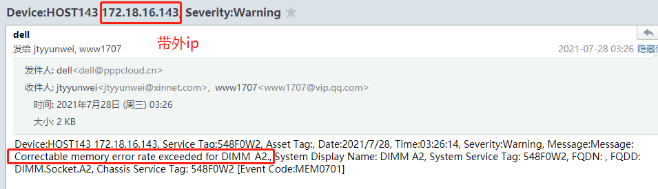
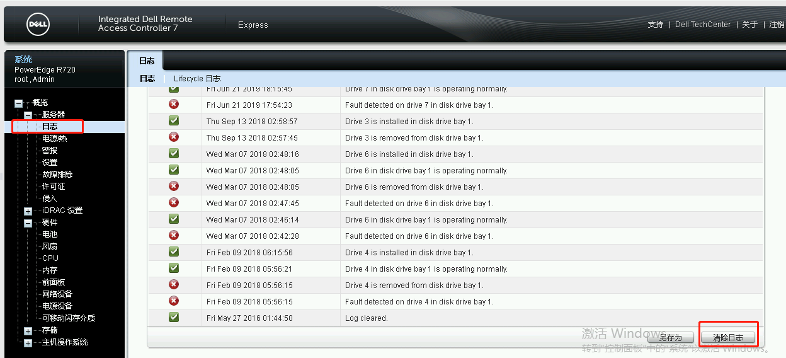
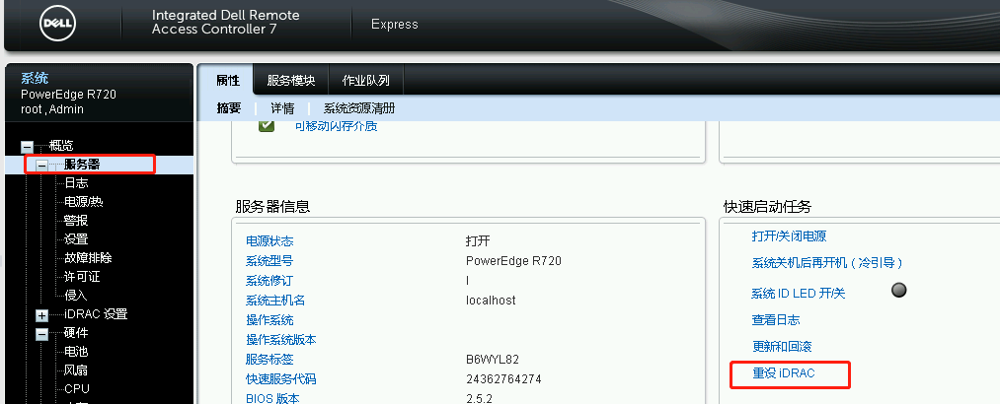
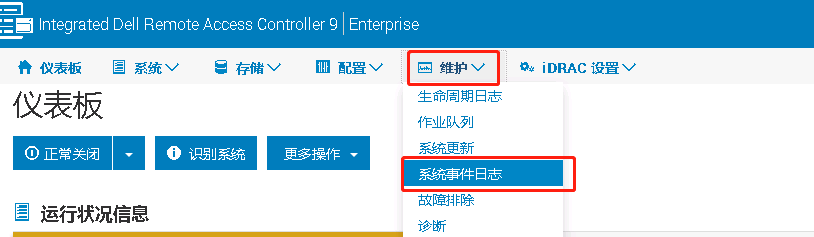
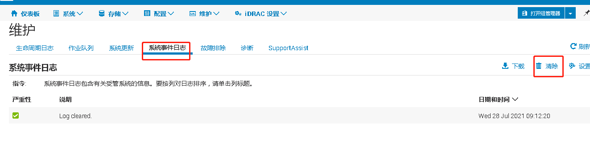
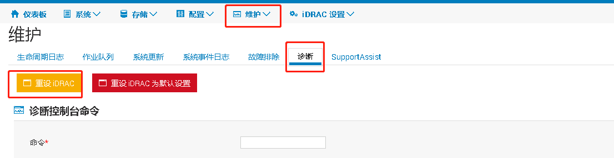
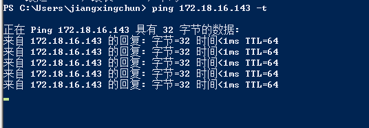

# 重设idrac办法

### 一、问题场景

如图，报警邮件中显示 内存**DIMM_A2**上**纠错异常超过限制值**

### 二、处理办法
**注：本方法仅适用 R730、R740** 
根据邮件中或资产表中记录的带外ip地址，登陆到服务器，不同机型操作略有区别，具体步骤如下

带外登陆信息：

- 用户名：root
- 密码：xinnnet123 或 calvin

#### 2.1 R730

##### 2.1.1 清除系统日志

  依次选择 概览 ---> 服务器 ---> 日志，拉到最底部，选择 **清除日志**

##### 2.1.2 重设idrac

   依次选择 概览 ---> 服务器 ，选择 **重设IDRAC**即可

重设时，带外网络会暂时中断，可在本地 cmd开一个长 ping验证恢复时间

#### 2.2 R740

#####  2.2.1 清除系统日志

  

##### 2.2.2 重设idrac

重设时，带外网络会暂时中断，可在本地 cmd开一个长 ping验证恢复时间

